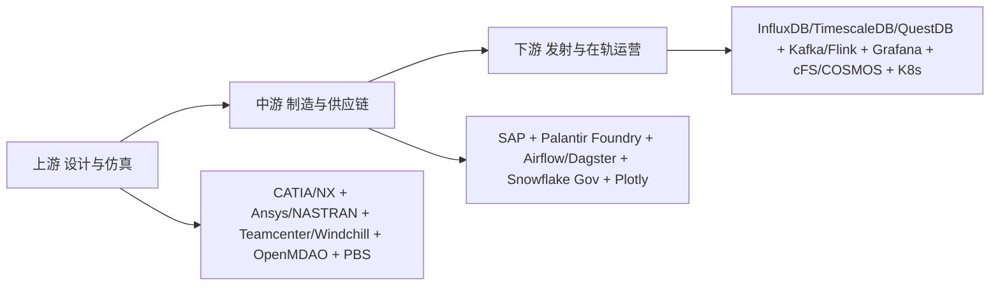

## 摘要

本报告系统对比全球宇航产业链与军事宇航产业链的数据基础设施。核心结论：**StarRocks、Superset、Airflow、DolphinScheduler、Echarts在通用商业航天地面数仓中有应用，但在星载高频遥测、飞控、军事指挥等核心层，存在维度更高的专用平台**。

## 一、核心结论：五个工具在航天/军事的采用

| 工具 | 航天/军事采用情况 | 关键判断 |
| :--- | :--- | :--- |
| Apache Airflow | ✅ 通用标配 | 地面遥感ETL、NASA VEDA有公开生产案例 |
| Apache Superset | ⚠ 间接存在 | 作为非密级资产大屏，非核心飞控 |
| Apache ECharts | ⚠ 间接存在 | 作为Superset引擎或科普大屏 |
| StarRocks | ❌ 不适合核心场景 | OLAP仓库，非时序设计，写入吞吐不足 |
| DolphinScheduler | ❌ 无公开证据 | 主要在中国互联网生态，未进国际航天白名单 |

> 一句话总结：航天核心数据形态是**高频时序遥测（每秒百万点）**，上述五工具中只有Airflow渗透较深，其余非主流。

## 二、全球宇航产业链三段论 - 教科书划分

### 2.1 上游：设计与仿真 - 不可能用StarRocks

* **民企**：SpaceX, Blue Origin, Rocket Lab, Airbus, Boeing
* **软件**：CATIA / Siemens NX，Ansys / NASTRAN，Teamcenter / Windchill。开源用 **NASA OpenMDAO** 做多学科优化。
* **调度**：Altair PBS 这类HPC调度器，非Airflow。

### 2.2 中游：制造与供应链 - 你们那套能进去的地方

* **民企**：上千家二级供应商
* **软件**：`SAP + Palantir Foundry` 管供应链，`Airflow/Dagster` 做ETL标配。NASA VEDA用Airflow做卫星数据入湖。
* **合规**：因ITAR/CMMC，中国起源的StarRocks/Dolphin/Echarts进不去白名单，用Snowflake GovCloud + Databricks + PowerBI/Tableau + Plotly。

### 2.3 下游：发射与在轨运营 - 毫秒级时序

* **软件**：`InfluxDB / TimescaleDB / QuestDB` 存遥测，`Grafana` 看大屏，`NASA cFS / COSMOS` 做飞控，`Kafka + Flink` 实时流。StarRocks秒级OLAP太慢。
* **SpaceX Starlink案例**：`.NET 5 + Kafka + HBase + HDFS + Docker + K8s`，招聘要求Kafka/Spark/Flink。

## 三、军事航天：专有平台与Palantir生态

### 3.1 美国太空军 - Warp Core

* **核心**：**Palantir Warp Core** 作为ATLAS系统数据管理层，替代SPADOC。
* **合同**：2023年太空军18家供应商9亿美元IDIQ合同，包括Palantir, C3 AI, Oracle, BAE Systems等，无Airflow/Superset/StarRocks/Dolphin。
* **UDL统一数据图书馆**：2000+政府账户，1700+商业账户，125个盟国，每天2亿条记录被70个应用拉取。

### 3.2 时序数据库 - 航天第一公民

| 案例 | 数据库 | 场景 |
| :--- | :--- | :--- |
| Thales Space | InfluxDB | 卫星传感器故障检测 |
| Eutelsat 600+卫星 | InfluxDB | 每秒百万点，从ES迁移 |
| 朱雀二号火箭 / 北邮卫星 | IoTDB (清华) | 星上CPU/温度，双活星间同步，TsFile压缩 |
| 中国月球行星系统CLPDS | Oracle/MySQL | 深空数据 |

## 四、更优平台 - 按场景的降维打击

| 业务层级 | 电商/博彩最优 | 宇航最优 | 原因 |
| :--- | :--- | :--- | :--- |
| 实时遥测 | StarRocks | **QuestDB / InfluxDB / TimescaleDB / TDengine / IoTDB** | 1ms 10万点，StarRocks为1秒聚合设计 |
| 任务调度 | Airflow/Dolphin | **Airflow + Argo + PBS** | 同时调度HPC仿真和K8s |
| 数字孪生 | Superset | **Ansys Twin Builder / MindSphere / STK / MATLAB Simulink** | 需和物理方程联动 |
| 供应链/情报融合 | StarRocks | **Palantir Gotham/Foundry** | 毫秒级多源融合+ITAR审计 |
| 可视化 | Echarts | **Grafana + Sift (SpaceX自研流式波形)** | Echarts上万通道会卡死，需WebGL硬件加速 |

### 4.1 军事决策霸主 - Palantir

* **Gotham国防版**：数字战场操作系统，融合间谍卫星、无人机、雷达，毫秒级三维数字孪生。
* **Foundry工业版**：Airbus Skywise，全球几千架飞机发动机震动数据实时预测。

### 4.2 商业航天霸主 - SpaceX

* **WARPDRIVE**：自研ERP神经系统，从CAD到发射到财务闭环，拒绝SAP。
* **遥测**：自研超高吞吐时序存储 + 流式绘图引擎，毫秒级刷新。
* **底层**：Bazel编译链 + 极纯K8s + C/C++实时Linux内核。

## 五、全球10地宇航国防生态链对比

| 国家/地区 | 体制 | 龙头 | 民营代表 | 数据栈 |
| :--- | :--- | :--- | :--- | :--- |
| 美国 | 民企主导 | SpaceX/Lockheed/Anduril | SpaceX, Anduril | Airflow+Databricks+Snowflake+Palantir+Grafana |
| 中国大陆 | 国家主导 | 航天科技/8大军工央企 | 星河动力/蓝箭 | StarRocks+Dolphin+Echarts+Superset (信创) |
| 台湾地区 | 军民合作 | 汉翔+中科院 | 经纬航太/创未来 | Airflow+Grafana+Plotly |
| 法国/德国/英国 | 欧盟合作 | Airbus/Thales/BAE/OHB/Isar | Isar Aerospace/Orbex | Snowflake+Databricks+Airflow+Teamcenter |
| 俄罗斯 | 国家100% | Roscosmos+Rostec | 无 | 全自研闭源 |
| 新加坡/马来西亚 | MRO模式 | ST Engineering | 无火箭 | SAP+Airflow+Tableau |

## 六、最终结论与OGDIL建议

> **直接回答**：StarRocks、Superset、Dolphin、Echarts在全球宇航产业链中非主流。Airflow是唯一重度重叠工具。航天核心是时序库(InfluxDB/IoTDB)+流处理(Kafka/Flink)+专有平台(Palantir/STK/MATLAB)+自研系统。

**对OGDIL的论文建议：**

1.  若投欧美期刊 `Acta Astronautica`：将 `StarRocks -> QuestDB/TimescaleDB, Superset -> Grafana, Dolphin -> Airflow/Argo`，方法论(Bayesian/Survival/Causal)通用。
2.  若对接中国商业航天：现有 `StarRocks+Superset+Airflow+Echarts` 即标准答案，可直接与星河动力等合作。

---

*Source: OGDIL Lab整理，基于NASA VEDA, Thales, Eutelsat, US Space Force UDL, SpaceX公开资料，符合学术探讨规范。*
