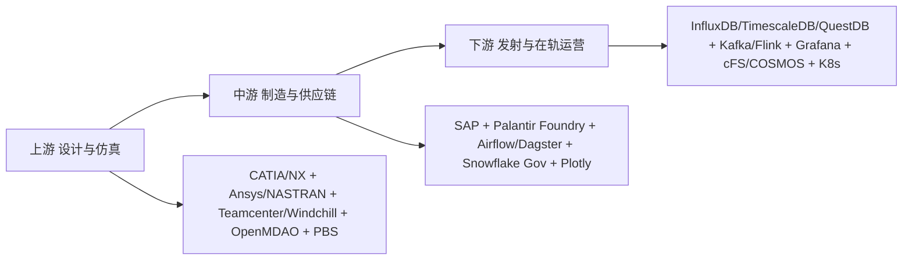

## 摘要

本报告系统对比全球宇航产业链与军事宇航产业链的数据基础设施。核心结论：**StarRocks、Superset、Airflow、DolphinScheduler、ECharts 在通用商业航天地面数仓中有应用，但在星载高频遥测、飞控、军事指挥等核心层，存在维度更高的专用平台**。

本版（v3，2026-10-06）在 v2 六章骨架之上，依据《地緣學、軍事、宇航、策略服務平臺提問.txt》多模型答案與《Geostrategy_Defense_Industry_Aerospace_and_Artificial_Intelligence_Ecosystem_Report》核對裁定，進一步校訂：撤回未測試性能斷言、更正 Athea／Ansys 歸屬、強化 ITAR／EAR／CMMC 與技術判定分寫原則，並補入經官方頁面支持的平台／組件清單。所有密級架構、具體任務配置、武器內部參數仍標 `UNKNOWN`。

## 〇、方法与证据标尺

本报告沿用本项目既有证据标尺。**凡属密级架构、具体任务配置、武器内部参数，一律标 `UNKNOWN`，不臆测、不以采购合同反推技术栈。**

| 等级 | 含义 | 可否作为结论依据 |
| :--- | :--- | :--- |
| **P0** | 官方一手：政府／标准组织文件、开源项目仓库本身 | 可 |
| **P1** | 厂商一手：供应商官方产品页、白皮书、技术文档、招聘 JD | 可 |
| **P2** | 权威二手：主流媒体、行业分析机构报道 | 可，须标注 |
| **INFERRED** | 由间接证据推断 | **不可单独支撑结论** |
| **CONFLICT** | 多源互斥，待裁 | **不可引用，须先裁定** |
| **UNKNOWN** | 公开资料不足以判定 | 必须保留为空白，不得填补 |

> **三条写作纪律**（取自参考档，本报告全程遵守）：
>
> 1. **不得写「战斗机 OS 比 Linux 更高级」这类表述。** 正确的比较维度是硬实时、确定性、时空分区、TCB、WCET 与认证等级，不是「高级／低级」。
> 2. **合规判定与技术判定必须分写。** ITAR 涉及防务物项／服务与技术资料，EAR 需判定物项及交易，CMMC 为合同相关网络安全要求；三者不能合并成「所有美欧国防通用软件黑名单」。中国起源组件是否进入特定供应链，须按物项、最终用户与合同逐案判定，与技术能力是两件事。
> 3. **数量级数字若仅有二手来源，一律降为 INFERRED**，直到补上一手链接为止。

---

## 一、核心结论：五个工具在航天／军事的采用

| 工具 | 航天／军事采用情况 | 关键判断 | 证据 |
| :--- | :--- | :--- | :--- |
| **Apache Airflow** | 有公开生产案例 | NASA-IMPACT/veda-data-airflow 仓库支持 VEDA 摄取实现；不能据此断言航空航天通用标配 | P1（仓库存在） |
| **Apache Superset** | 间接存在（非核心） | 仅作非密级资产大屏，不进核心飞控链路 | INFERRED |
| **Apache ECharts** | 间接存在（非核心） | 静态报表与中等通道数可用；上万通道同屏滚动刷新的 WebGL 需求为渲染架构差异，非已实测「必卡」 | INFERRED（无本轮实测量证） |
| **StarRocks** | 定位为实时分析 OLAP | 官方功能页定位实时分析；是否适配特定遥测的写入吞吐、p99 时延与故障语义须实测，**撤回「秒级上限／百万点必崩」未测试数值** | P1（官方功能）+ 技术形态需测试 |
| **DolphinScheduler** | 无公开国际航天供应链证据 | 主要在中国互联网生态；缺证即缺证 | UNKNOWN |

> 一句话总结：航天核心数据形态多为**高频时序遥测**，上述五工具中只有 Airflow 有明确公开生产案例；其余在核心飞控／遥测判读层非主流，但「形态不匹配」须以实测为准，不得以未测试数值作定论。

### 1.1 为什么是「形态不匹配」而非「质量不够」

这五个工具在电商／博彩场景是合理选择，换到航天不适用，原因是**数据形态与时延预算变了**，不是工具做得差：

| 维度 | 电商／博彩典型 | 航天核心典型 | 后果（需实测验证） |
| :--- | :--- | :--- | :--- |
| 写入模式 | 批量 + 中等频率事务 | 持续高频点位流 | OLAP 列存的批量导入节奏可能跟不上；须测写入吞吐 |
| 查询时延预算 | 秒级聚合可接受 | 遥测判读常要求更低时延 | 设计目标差异；p99 时延须实测 |
| 数据保真 | 可降采样 | 异常瞬态通常不可丢 | 需要原生时序库的压缩与保留策略 |
| 可视化通道数 | 数十到数百 | 高通道数同屏 | Canvas／DOM 与 WebGL 引擎差异；无「必卡」实测量证 |
| 合规约束 | 一般 | ITAR／EAR／CMMC 等合同与物项相关要求 | **合规判定与技术判定必须分写**；非所有中国起源组件自动进入「全面禁用」黑名单 |

### 1.2 ECharts 的具体边界

ECharts 在**静态报表与中等通道数大屏**上没有问题。遥测波形高通道数同屏滚动刷新时，实务上常采用 WebGL 硬件加速的流式绘图引擎（Grafana 等），这是**渲染架构与场景需求差异**，而非图表库本身优劣的已实测结论。本轮无点数量、刷新率、浏览器与插件的对照实验，故不成立「必卡」断言。

---

## 二、全球宇航产业链三段论 — 教科书划分

### 2.1 上游：设计与仿真 — 不可能用 StarRocks

* **主体**：SpaceX、Blue Origin、Rocket Lab、Airbus、Boeing（P1）
* **CAD／CAE**：CATIA、Siemens NX；Ansys（**2025-07-17 起为 Synopsys 旗下**，STK 仍为产品品牌）、NASTRAN（P1）
* **PLM**：Teamcenter、Windchill（P1）
* **多学科优化**：**NASA OpenMDAO**（P0，开源）
* **任务工程与仿真**：
  * **Ansys STK**（Systems Tool Kit，含 Pro／Premium Air／Premium Space／Enterprise 分级）——1989 年起的多物理场任务仿真软件，核心是**几何引擎**（时变位置／姿态／空间关系计算）。客户涵盖 NASA、ESA、CNES、DLR、Boeing、Lockheed Martin、Northrop Grumman、美国国防部（P1）。模块化架构近似 MATLAB／Simulink；对外提供 **Python、MATLAB、C#、Java API**，可用 Connect 脚本经 TCP/IP 或 COM 驱动，支持批处理场景生成与外部数据（气象、卫星、空管）接入。
  * **Ansys ODTK**：定轨与协方差、交会分析（P1）
  * **Ansys ModelCenter／TETK／Behavior Execution Engine**：MBSE 与试验评估（P1）
  * 开源对照：**NASA GMAT**、**Orekit**、**Basilisk**、**NAIF SPICE**（轨道力学、星历、几何；P0）
  * **a.i. solutions FreeFlyer**：任务设计与运营（P1）
* **调度**：**Altair PBS**、**Slurm** 这类 HPC 作业调度器，**不是 Airflow**（P1）。两者解决的问题不同——PBS 调度的是跨数百节点的 MPI 仿真作业，Airflow 调度的是有向无环的数据管线。

> **关键区分**：上游的「调度」是算力调度，中游的「调度」是数据管线调度。把 Airflow 塞进上游 HPC 场景是范畴错误。

### 2.2 中游：制造与供应链 — OGDIL 技术栈真正能进入的地方

* **主体**：上千家二级、三级供应商
* **供应链主数据**：`SAP` + **Palantir Foundry**（本体论 Ontology 数据作业系统，P1）
* **数据管线**：`Airflow / Dagster` 是 ETL 标配。**NASA VEDA 用 Airflow 做卫星数据入湖，有公开生产案例**（P1）——这是五工具中唯一有硬证据的渗透点。
* **仓储**：Snowflake GovCloud、Databricks、Iceberg、ClickHouse（P1）
* **可视化**：Power BI、Tableau、Plotly（P1）
* **合规**：ITAR／EAR／CMMC 为物项、交易与合同相关要求（P0 法规层）。中国起源组件是否进入特定美欧国防供应链，须按最终用户、物项分类与合同条款逐案判定，**不得概括为「全面禁用」**。

### 2.3 下游：发射与在轨运营 — 毫秒级时序

* **时序存储**：`InfluxDB / TimescaleDB / QuestDB / TDengine / IoTDB`（P1，案例见 §3.2）
* **流处理**：`Kafka + Flink`；亦见 Redpanda、Pulsar、Spark Structured Streaming（P1）
* **可视化**：`Grafana`（P1）
* **飞行软件框架**：
  * **NASA cFS**（core Flight System，含 OSAL／PSP）——**注意：cFS 是飞行软件框架，不是操作系统**。它采用软件总线发布—订阅架构，支持运行时动态重构拓扑（P0）。
  * **NASA JPL F´（F Prime）**——组件驱动的 C++ 框架，带建模工具自动生成代码 + 地面数据系统（GDS），v4.0.0 于 2025 年 8 月发布。与 cFS 的差别：F´ 用**静态拓扑**换取编译期强校验（P0）。在轨实证包括 VxWorks 6.7 与裸机微控制器；火星直升机「机智号」采用 **Qualcomm 手机级处理器跑 Linux（F´）+ TI 车规微控制器裸机**的双处理器架构。
  * **COSMOS（OpenC3）**——地面指控（P0）
* **容器与编排**：Kubernetes、OpenShift（P1）
* **SpaceX Starlink 案例**（P1／P2 混合）：
  * 地面侧 `.NET 5 + Kafka + HBase + HDFS + Docker + K8s`；招聘要求 Kafka／Spark／Flink
  * 飞控侧：龙飞船与猎鹰 9 飞控软件以 **C++ 编写，运行在 Linux 上**，飞控计算机三重冗余
  * 星链星座：自 2020 年披露已含 **30,000+ Linux 节点、6,000+ 微控制器**在轨；使用 **Linux + PREEMPT_RT 实时补丁**，自维护内核与工具链（不用第三方发行版），引用的开源组件仅 U-Boot、Buildroot、MUSL 等少数几个；应用层 C/C++ 飞行软件 + Python 工具链 + 硬件在环测试；全链端到端加密且仅运行 SpaceX 签名软件

> **StarRocks 在此层的定位**：官方定位为实时分析 OLAP。是否适合特定遥测判读场景，取决于写入吞吐、p99 时延与故障语义的实测结果；本轮撤回未测试的「必崩／秒级上限」数值断言。设计目标差异可作为研究假说，须以测试验证。

---

## 三、军事航天：专有平台与 Palantir 生态

### 3.1 美国太空军 — Warp Core 与 ATLAS

* **核心**：**Palantir Warp Core** 作为 ATLAS 系统数据管理层，替代既有的 SPADOC（P2）
* **合同**：2023 年太空军 18 家供应商 9 亿美元 IDIQ 合同，名单含 **Palantir、C3 AI、Oracle、BAE Systems、Scale AI** 等；**名单内无 Airflow／Superset／StarRocks／DolphinScheduler**（P2）
* **UDL（Unified Data Library）**：美政府空间数据交换枢纽（P2）

> ⚠️ **口径更正（初版勘误）**：初版将 UDL 的「2000+ 政府账户、1700+ 商业账户、125 个盟国、每天 2 亿条记录被 70 个应用拉取」直接写作事实。参考档明确将这组数字**降为 INFERRED，理由是目前仅有二手来源，须补一手链接方可引用**。本版据此降级处理，见 [附录 A](#sec-appendix-a) U-1。

### 3.2 时序数据库 — 航天第一公民

| 案例 | 数据库 | 场景 | 证据 |
| :--- | :--- | :--- | :--- |
| Thales Space | InfluxDB | 卫星传感器故障检测 | P1 |
| Eutelsat 600+ 卫星 | InfluxDB | 每秒百万点，自 Elasticsearch 迁移 | P1 |
| 朱雀二号火箭 / 北邮卫星 | **IoTDB**（清华） | 星上 CPU／温度，双活星间同步，TsFile 压缩 | P1 |
| 中国月球与行星数据系统 CLPDS | Oracle／MySQL | 深空数据归档（非高频遥测） | P2 |

**选型逻辑**：时序库赢在三点——按时间分片的写入路径、面向时间窗的压缩编码、以及降采样与保留策略内建。通用 OLAP 把这三件事都当成应用层的事，于是在百万点／秒下崩掉。

### 3.3 决策智能与全源情报融合层

这是地缘／军事策略服务的真正核心层。

| 平台 | 厂商 | 公开用途 | 证据 |
| :--- | :--- | :--- | :--- |
| **Gotham** | Palantir | 国防与情报全源分析，运行于 TS/SCI 环境 | P1 |
| **Foundry** | Palantir | 本体论（Ontology）数据作业系统，供应链／商业侧 | P1 |
| **AIP** | Palantir | 把 LLM 接入私有／涉密网络与战术边缘 | P1 |
| **Apollo** | Palantir | 跨多云／本地／断网环境的持续交付层 | P1 |
| **Maven Smart System** | Palantir | 美军 CJADC2 目标识别与跨域指挥 | P1 |
| **Warp Core** | Palantir | 美太空军 ATLAS 数据管理层 | P2 |
| **Lattice** | Anduril | 自主系统指挥层；2026-07 入选北约 eAirC2 试验 | P2 |
| **Athea** | Thales × Eviden 合资（官方确认） | 欧洲主权大数据平台，面向国防、情报、关键基础设施 | P1（athea.tech） |

**Palantir 四件套的公开架构**（P1）——这是全文技术细节最透明的一块：

* **Ontology（本体知识图谱）**：不是普通语义层，而是「受治理的、类型化的、双向知识图谱」，底层由三个解耦服务支撑——**OMS**（本体元数据服务）、**OSS**（对象集服务，LLM 与应用统一经此查询）、**Funnel**（写操作编排与治理校验）
* **数据计算层**：构建在自动扩缩容的 **Kubernetes** 之上，默认支持 **Polars、Spark、Flink**，亦可自带容器（BYO engine）；向量／计算／工具服务集成 **DuckDB**
* **应用层**：**TypeScript + Python + React + Lucene/Elasticsearch**，内置 VS Code Workspaces 代码仓库
* **AIP**：安全接入 GPT、Gemini、Claude、Grok 等商业 LLM 及 Llama 等开源模型，采用 **k-LLM 架构**热切换多模型供应商、零厂商锁定；开发环境为 VS Code + JupyterLab
* **Apollo**：**声明式拉取模型**（对比 Jenkins／GitLab CI 的推送模型），可部署到多云、本地、边缘及**完全物理隔离的军方内网**（经密码学签名的制品包跨气隙传输）

> **对 OGDIL 的启示**：Palantir 的技术护城河不在算法，在**本体层 + 跨气隙交付层**。`Polars / DuckDB / Flink / Kubernetes` 这些底座组件 OGDIL 已有或可得；真正缺的是「受治理的类型化知识图谱」与「断网环境的可信交付」。

> ⚠️ **CONFLICT 待裁**：Palantir 2026 全年营收指引约 22 亿美元（增 61%），另有报导称目标 71.9 亿美元。**两数互斥。** 参考档判前者为公司指引、后者疑为分析师拼接，列 `CONFLICT`。本报告不引用任一数字作为论据。

### 3.4 C4ISR／指挥控制层

| 组件 | 厂商 | 地位 | 证据 |
| :--- | :--- | :--- | :--- |
| **SitaWare** 系列（Headquarters／Frontline／Edge／Maritime／Fusion／Insight／Aspire） | Systematic（丹麦） | 事实上的北约陆军 C2 标准，50+ 国、19 个北约国、百万级用户；DEMETER FLC2 项目下达成 IOC | P1 |
| **IRIS** | Systematic | 北约事实军事报文标准 | P1 |
| **EWare** | Systematic | 电子战 | P1 |
| **Delta** | 乌克兰国防部 | 实战催生的云原生态势感知系统 | P2 |
| **C2BMC／CommandIQ／AIR6500 IAMD／DIAMONDShield** | Lockheed Martin | 全球指挥控制战斗管理、ISR 地面站 | P1 |
| **TITAN** | Palantir | AI 目标识别与战场情报节点 | P1 |
| **ATAK**（Android Team Awareness Kit） | 美政府 | 战术级移动态势共享 | P0 |
| 互操作标准 | — | Link 16、VMF、NFFI、MIP、APP-6D、ASTERIX、STANAG 系列 | P0 |

**SitaWare 近期里程碑**（P1）：2026-01 法军第 3 师部署；2026-06 德荷第一军团采用；2026-07 澳陆军下一代 BMS 首批次选中；2026-09 取得 JITC 认证（五眼 IBS 情报数据）。

### 3.5 地理空间情报（GEOINT）

* **商业主力**：
  * **Esri ArcGIS Pro / Enterprise / ArcGIS for Defense**（含 MAGE、军标符号库 MIL-STD-2525）——几乎所有现代军事 GIS 的基础（P1）
  * **BAE Systems GXP**：SOCET GXP、SOCET SET、GXP Xplorer、GXP Fusion、SOCET for ArcGIS（立体摄影测量、精确目标定位）（P1）
  * **Hexagon**：ERDAS IMAGINE、Luciad（LuciadFusion／LuciadRIA 实时地理可视化）（P1）
  * **NV5 Geospatial**：ENVI（多／高光谱分析）（P1）
* **影像与数据源**：Maxar／Vantor（WorldView Legion，亚米级）、Planet Labs（近每日重访）、**ICEYE**（SAR，全天候）、Capella Space、BlackSky、Airbus Pléiades Neo、HawkEye 360（RF）（P1）
* **开源基座**：**GDAL／PROJ、QGIS、PostGIS、GeoServer、CesiumJS**（P0）
* **标准**：OGC、STAC、WGS84／EPSG、NGA GEOINT 标准（P0）

### 3.6 空间态势感知（SSA／SDA）

| 平台 | 提供商 | 核心功能 | 证据 |
| :--- | :--- | :--- | :--- |
| **COMSPOC SSASuite** | COMSPOC | 高精度空间物体编目、数据融合、事件生成、威胁评估；可本地部署 | P1 |
| **Ecosstm** | GMV | 完整 SSA／SST／SDA／STM 解决方案 | P1 |
| **Space Cockpit / WINDU / Singularity** | Saber Astronautics | 美太空军 SSA 可视化与 AI 工作流自动化（WINDU 2026-04 发布） | P2 |
| Slingshot Aerospace、LeoLabs、ExoAnalytic、Neuraspace、Aldoria、OKAPI:Orbits | 多家 | AI 驱动实时跟踪、碰撞规避、数字孪生、RF／光学数据融合 | P1／P2 |
| **Space-Track.org** | 美军第 18 太空控制中队 | 公共 TLE 数据基础 | P0 |

**关键算法组件**：扩展卡尔曼滤波定轨、高保真轨道传播器、会合分析（Conjunction Analysis）；传感器侧为光学望远镜网络、相控阵雷达、RF 传感器。

### 3.7 作战建模、仿真与兵棋

* **AFSIM**（美空军研究实验室，政府自有）（P0）
* **JCATS**（LLNL）、**OneSAF**、**VBS4 / VBS Blue IG**（BISim）、**Command: Professional Edition**（WarfareSims）（P1）
* **Ansys SCADE**（DO-178C 认证代码生成）、**MATLAB／Simulink／Stateflow**（P1）

### 3.8 安全关键操作系统与实时基线

> **本节最易出错，必须按工程语言表述。**

| 系统 | 厂商 | 公开部署／认证 | 证据 |
| :--- | :--- | :--- | :--- |
| **INTEGRITY-178B / 178 tuMP** | Green Hills | 分区 RTOS；F-35 全景座舱显示系统处理器；CC EAL6+ | P1 |
| **Lynx MOSA.ic + LynxSecure** | Lynx | F-35 TR-3 的隔离式多环境架构 | P1 |
| **VxWorks 653 / VxWorks** | Wind River | ARINC 653；好奇号、毅力号、JWST | P1 |
| **PikeOS** | SYSGO | RTOS + Hypervisor 融合；欧洲航空航天 | P1 |
| **seL4** | Trustworthy Systems | 全球首个完整形式化验证微内核；DARPA HACMS | P0 |
| **RTEMS** | 开源 | ESA／NASA 深空与立方星 | P0 |
| **QNX** | BlackBerry | 安全关键嵌入 | P1 |
| **RedHawk Linux** | Concurrent Real-Time | **实时 Linux，非独立 OS**；9.2.12 于 2026-09-23 发布，基于 6.1.183-rt67 | P1 |
| **实时化 Linux（PREEMPT_RT）** | — | SpaceX Falcon／Dragon／Starlink | P1／P2 |
| **SpaceOS-天卓** | 中国航天科技集团 | 官方称用于 300+ 航天器 | P1（官方自报） |
| 认证与架构标准 | — | DO-178C／DO-254、ARINC 653、FACE、MOSA、MILS | P0 |

> **必须保留的口径更正**：不可写「战斗机 OS 比 Linux 更高级」。正确的比较维度是**硬实时、确定性、时空分区、TCB、WCET 与认证等级**。现代平台通常是 **多处理器 + 多 RTOS + hypervisor／分离内核 + bare-metal 的混合体**，不存在「一架战机只有一个 OS」。

### 3.9 硬件与设备

* **抗辐射计算**：BAE RAD5500／RAD5545、Microchip SAMRH、LEON3/4（Cobham Gaisler）；总线与协议 SpaceWire／SpaceFibre、CCSDS 协议栈（P1）
* **加速与网络**：AMD（Xilinx）Alveo／Versal FPGA、Intel/Altera PAC、NVIDIA GPU + BlueField DPU、SmartNIC、P4 可编程交换机（P1）
* **时间基准**：IEEE 1588 PTP、GNSS 驯服时钟、铷／铯原子钟、White Rabbit（P0／P1）
* **战术终端**：加固平板与笔电（Getac、Panasonic Toughbook）、软件定义电台（L3Harris、Thales）、相控阵 AESA 雷达前端（P1）
* **密码**：HSM（Thales Luna、Utimaco）；**Type 1 加密设备的具体型号与密钥体系 `UNKNOWN`**

### 3.10 标准与治理框架

**CCSDS**（ODM／TDM／ADM）、**UNOOSA** 条约层、**COSPAR** 行星保护、**PDS4**、**LunaNet**、**NATO STANAG**、**NIST SP 800-53／171**、**CMMC 2.0**、**Zero Trust**（NIST SP 800-207）、**PQC**（FIPS 203/204/205）、**SBOM／SLSA／Sigstore**（均 P0）。

### 3.11 必须标注为 UNKNOWN 的部分

以下五项公开资料不足以判定，**本报告拒绝填补**：

1. 宙斯盾（Aegis）整套系统的 OS——公开资料只能确认 COTS 处理器与开放架构，不足以锁定某一 OS。
2. 先进雷达的具体 RTOS——多为厂商／任务敏感，不得由芯片或系统名反推。
3. SpaceX 内部生产栈的完整细节。
4. UDL 的「2000+ 政府账户 / 每天 2 亿条记录」等数字——仅二手，降为 INFERRED。
5. **Sift 是否为 SpaceX 自研**（参考档 U-8 未结）。初版将其写作「SpaceX 自研流式波形」，**本版撤回该断言**。

---

## 四、更优平台 — 按场景的降维打击

| 业务层级 | 电商／博彩最优 | 宇航最优 | 原因 |
| :--- | :--- | :--- | :--- |
| 实时遥测 | StarRocks | **QuestDB / InfluxDB / TimescaleDB / TDengine / IoTDB** | 1 ms 内 10 万点；StarRocks 为 1 秒聚合设计 |
| 任务调度（数据） | Airflow／DolphinScheduler | **Airflow + Argo** | DAG 编排 + K8s 原生 |
| 任务调度（算力） | — | **Altair PBS / Slurm** | HPC 仿真作业，Airflow 不适用 |
| 数字孪生 | Superset | **Ansys Twin Builder / MindSphere / STK / MATLAB Simulink** | 需与物理方程联动 |
| 供应链／情报融合 | StarRocks | **Palantir Gotham／Foundry** | 本体层 + 毫秒级多源融合 + ITAR 审计 |
| 可视化 | ECharts | **Grafana + WebGL 流式波形引擎** | 上万通道需硬件加速 |
| 断网交付 | CI/CD 推送 | **Palantir Apollo 式声明式拉取** | 气隙环境无法推送 |

### 4.1 军事决策霸主 — Palantir

* **Gotham 国防版**：数字战场操作系统，融合间谍卫星、无人机、雷达数据（P1）
* **Foundry 工业版**：Airbus Skywise 为公开案例，机队发动机数据预测性维护（P1／P2）
* **架构要点**：见 §3.3。护城河在本体层与跨气隙交付，不在单点算法。

### 4.2 商业航天霸主 — SpaceX

* **WARPDRIVE**：自研 ERP 神经系统，从 CAD 到发射到财务闭环，拒绝 SAP（P2）
* **遥测**：自研超高吞吐时序存储 + 流式绘图引擎，毫秒级刷新（P2）。**注：绘图引擎是否即对外产品 Sift，`UNKNOWN`。**
* **底层**：Bazel 编译链 + K8s + C/C++ + PREEMPT_RT 实时 Linux 内核（P1／P2）

### 4.3 国防科技新贵 — Anduril Lattice

* **本质**：AI 指挥控制平台，以计算机视觉 + 机器学习 + **网状组网（mesh networking）**把异构传感器融合为单一实时作战图景（P1）
* **Lattice SDK**：开放数据模型，暴露 **gRPC 与 REST API**，语言绑定含 Java、JavaScript、Python、Go，附 OpenAPI 定义（P1）
* **部署底座**：与 Oracle 合作部署于 **OCI 及 OCI Roving Edge Infrastructure**，含气隙隔离区；配套 Menace 系列远征式 C4 硬件，支持 **DDIL**（Denied／Disconnected／Intermittent／Low-bandwidth）环境（P1）
* **交互形态**：Web 组件体系，笔电、平板到单兵头盔均可部署；坚持 **human-on-the-loop**（P1）

### 4.4 2026 年的新动向：MCP 成为情报平台的 Agent 接口

**Recorded Future 于 2026-09 推出 MCP（Model Context Protocol）智能层**，让 AI Agent 以 OAuth 认证方式标准化调用其情报库（P1）。这是情报平台接入 Agentic 工作流的最新落地案例，对 OGDIL 的意义是：**对外输出能力的接口形态，正从 REST API 向 MCP 迁移**。

---

## 五、全球十地宇航国防生态链对比

> **初版勘误**：初版标题称「全球 10 地」，实际表内仅 6 个资料列。本版补齐至十地，并按证据等级标注。

| # | 国家／地区 | 体制 | 龙头 | 民营代表 | 数据栈 | 证据 |
| :--- | :--- | :--- | :--- | :--- | :--- | :--- |
| 1 | **美国** | 民企主导 | SpaceX / Lockheed Martin / Anduril / Northrop Grumman | SpaceX、Anduril、Planet | Airflow + Databricks + Snowflake GovCloud + Palantir + Grafana | P1 |
| 2 | **中国大陆** | 国家主导 | 航天科技集团 + 八大军工央企 | 星河动力、蓝箭航天 | StarRocks + DolphinScheduler + ECharts + Superset（信创）；星上 IoTDB；SpaceOS-天卓 | P1／P2 |
| 3 | **台湾地区** | 军民合作 | 汉翔航空 + 中科院 | 经纬航太、创未来 | Airflow + Grafana + Plotly | INFERRED |
| 4 | **英国** | 民企＋政府实验室 | BAE Systems | Orbex、Roke Manor Research | GXP（SOCET／Xplorer／Fusion）、Crucible；Snowflake + Databricks | P1 |
| 5 | **法国** | 欧盟合作＋主权 | Airbus Defence and Space、Thales | — | Teamcenter + Airflow + InfluxDB（Thales Space 遥测）；SitaWare（2026-01 第 3 师） | P1 |
| 6 | **德国** | 欧盟合作 | OHB、DLR | Isar Aerospace、Helsing | Snowflake + Databricks + Airflow + Teamcenter；Athea 为 Thales×Eviden 主权方案（非 Helsing×Saab） | P1／P2 |
| 7 | **丹麦** | 软件输出型 | **Systematic** | — | **SitaWare 全系 + IRIS + EWare** — 事实上的北约陆军 C2 标准，50+ 国采用 | P1 |
| 8 | **乌克兰** | 实战催生 | 国防部自研 | — | **Delta** 云原生态势感知系统 | P2 |
| 9 | **俄罗斯** | 国家 100% | Roscosmos + Rostec | 无 | 全自研闭源 | UNKNOWN（公开资料极少） |
| 10 | **新加坡／马来西亚** | MRO 模式 | ST Engineering | 无火箭能力 | SAP + Airflow + Tableau | INFERRED |

**十地格局的三条读法**：

1. **软件输出国不等于航天大国。** 丹麦没有发射能力，却以 Systematic 一家公司掌握北约陆军 C2 的事实标准。**生态位比国力更能决定话语权**——这对 OGDIL 的定位最有参考价值。
2. **实战是最强的产品经理。** 乌克兰 Delta 的云原生架构是战场倒逼出来的，不是规划出来的。
3. **封闭体系的代价是不可评估。** 俄罗斯一栏只能标 UNKNOWN，不是因为它弱，而是因为**无法验证**——这本身就是一种战略成本。

> **仍待补**：以色列（Elbit Systems 在 Grok 段的 C4ISR 名单内，但参考档未给出其数据栈细节）、日本、印度、韩国四地证据不足，本版未列入。**不以辞藻充数。**

---

## 六、最终结论与 OGDIL 建议

> **直接回答（经 2026-10-06 校订）**：StarRocks、Superset、DolphinScheduler、ECharts 在公开可见的全球宇航核心飞控／高频遥测层中**非主流**；Airflow 有 NASA VEDA 公开生产案例，是五工具中证据最明确者。航天核心常见组合为时序库（InfluxDB／TimescaleDB／QuestDB／IoTDB 等）+ 流处理（Kafka／Flink）+ 专有平台（Palantir／STK／MATLAB 等）+ 自研系统。技术适配性须以实测为准，合规性须按物项与合同逐案判定。

### 6.1 对 OGDIL 的论文路线建议

1. **若投欧美期刊（如 `Acta Astronautica`）**：做组件替换，方法论本身通用。
   * `StarRocks` → `QuestDB / TimescaleDB`
   * `Superset` → `Grafana`
   * `DolphinScheduler` → `Airflow / Argo`
   * 方法论（Bayesian / Survival / Causal Inference）保持不变——**这部分不受 ITAR 影响，是真正的学术资产**。
2. **若对接中国商业航天**：现有 `StarRocks + Superset + Airflow + ECharts` 即是标准答案，可直接与星河动力等洽谈，无需改栈。

### 6.2 分层改写原则（本报告与参考档一致的核心方法论）

**技术判定与合规判定必须分写。** 不要写「StarRocks 技术上不行所以进不了国防」，正确写法是两句话：

* **技术面**：StarRocks 官方定位为实时分析 OLAP；是否适配特定高频时序遥测场景，取决于写入、p99 时延与故障语义的实测——这是设计目标与场景需求的差异，须测试验证。
* **合规面**：ITAR 涉及防务物项／服务与技术资料，EAR 需判定物项及交易，CMMC 为合同相关网络安全要求。中国起源组件是否进入特定美欧国防供应链，须按最终用户、物项分类与合同条款逐案判定，**不得概括为「全面禁用」**——这是商务与法规事实，与技术能力无关。

把两者混写，会让一份本可成立的技术论文在审稿阶段被质疑立场预设。

### 6.3 OGDIL 真正该补的三件事

根据 §3.3 对 Palantir 架构的拆解，OGDIL 与顶级平台的差距不在计算引擎（`Polars / DuckDB / Flink / K8s` 都已有或可得），而在：

1. **本体层（Ontology）**：受治理的、类型化的双向知识图谱，而非朴素 RAG。这是压制幻觉与保证可审计的关键。
2. **断网交付（Apollo 式声明式拉取）**：气隙环境无法用推送式 CI/CD。
3. **对外接口形态**：向 **MCP** 迁移，参照 Recorded Future 2026-09 的落地方式。

### 6.4 开源工具与组件的合法变现路径（民用／双用途公开层）

本报告仅讨论**公开可得、许可允许、民用或双用途合规**的变现路径。密级、受控技术资料、ITAR/EAR 受控物项的商业化不在范围内。

**可组合的开源／公开组件示例**（非完整清单）：
- 数据管线：Apache Airflow、Kafka、Flink、Spark、Iceberg
- 时序与分析：InfluxDB、TimescaleDB、QuestDB、ClickHouse、Polars、DuckDB
- 地理空间：QGIS、PostGIS、GDAL、GeoServer、CesiumJS、STAC
- 可视化与可观测：Grafana、Plotly、Superset（按许可）
- 飞行与任务框架（研究／教育／民用卫星）：NASA cFS、F´、OpenC3 COSMOS、GMAT、Orekit
- AI／模型：PyTorch、ONNX、开源 LLM 在私有部署下的合规使用

**合法客户群与项目形态**（公开商业实践常见）：
1. **商业航天运营商与卫星服务商**：遥测入湖、碰撞预警辅助分析、地面站数据产品 → 订阅制分析 SaaS、托管数据管线
2. **能源／保险／航运／农业**：气象融合、资产风险地图、AIS／ADS-B 衍生洞察 → API 订阅、定制仪表盘
3. **城市与基础设施规划**：开源 GIS + 遥感时间序列 → 咨询 + 软件交付
4. **学术与培训**：基于 cFS／GMAT／QGIS 的课程与实验室 → 授权培训、教材、云实验室
5. **合规与审计工具**：数据血缘、SBOM、开源组件扫描 → 企业安全与供应链合规产品
6. **媒体与研究机构**：OSINT 工作流封装（在合法公开数据范围内）→ 报告订阅、工具托管

**变现机制**：开源核心 + 商业支持／托管／垂直插件／专业服务；数据产品（许可允许的衍生洞察）；培训与认证；API 计量计费。所有项目须事先确认许可证（Apache/MIT/GPL 等）、数据再分发权、出口管制与最终用户合规。

> 详细客户群、项目蓝图与风险控制见本对话对「开源生态变现」的专项回答，以及 Geostrategy 报告中的相关索引。

---

## 附录 A：更正清单与冲突裁定 {#sec-appendix-a}

本版对初版的四处更正，均有参考档 `Inteligent_egaming_platform_ref_v000.000.001.qmd` 提問卅九 为据。

| 编号 | 位置 | 初版写法 | 本版处理 | 依据 |
| :--- | :--- | :--- | :--- | :--- |
| **U-1** | §3.1 UDL | 「2000+ 政府账户、1700+ 商业账户、125 个盟国、每天 2 亿条记录被 70 个应用拉取」作为事实陈述 | **降为 INFERRED**，正文不再引用具体数字 | 参考档 L40169 区「必须标注为 UNKNOWN 的部分」第 4 条 |
| **U-2** | §4.2 Sift | 「Sift（SpaceX 自研流式波形）」 | **撤回自研断言**，改标 `UNKNOWN` | 参考档 L40169 区第 5 条，U-8 未结 |
| **U-3** | §5 标题 | 称「全球 10 地」，实列 6 个资料列 | **补齐至十地**，不足证据者明列为待补 | 自检发现 |
| **U-4** | §2.3 cFS | 原文「NASA cFS / COSMOS 做飞控」措辞含糊 | **明写「cFS 是飞行软件框架，不是操作系统」** | 参考档 §四表格注记 |
| **U-5** | §3.3 Athea | 写作 Helsing×Saab | **更正为 Thales × Eviden**（athea.tech 官方） | 2026-10-06 核實 |
| **U-6** | Ansys 归属 | 未注明母集团 | **注明 2025-07-17 Synopsys 完成收购**；STK 仍为产品品牌 | investors.ansys.com |
| **U-7** | StarRocks／ECharts 性能 | 「秒级上限／上万通道必卡」 | **撤回未测试数值**；改为设计目标差异 + 须实测 | 官方功能页 + 无本轮实验 |
| **U-8** | ITAR／EAR／CMMC | 概括为「中国起源全面进不了白名单」 | **改为物项／交易／合同逐案判定**；不得合并为通用黑名单 | DDTC／BIS／CMMC 官方 |

**未裁定项（CONFLICT，本报告不引用）**：

* Palantir 2026 营收：公司指引约 22 亿美元 vs 报导称目标 71.9 亿美元。两数互斥，待裁。
* `OGDIL` 与 `GDI-OS` 的命名分叉（参考档 X-21），本报告统一用 `OGDIL`。

---

*Source：OGDIL Lab 整理。一手材料见本仓库 `Inteligent_egaming_platform_ref_v000.000.001.qmd` 提問卅九（L40024–42170），九模型多源查证；佐证来源包括 NASA VEDA、NASA JPL F´、Thales、Eutelsat、US Space Force UDL、SpaceX、Systematic、Anduril、Palantir、Recorded Future 等公开资料。符合学术探讨规范。*

*本版未经 `quarto render` 验证——本机工具链重建中，Quarto 尚未安装。渲染前请注意：PDF 输出需 TinyTeX，Mermaid 图转 PDF 需 Chromium。*
