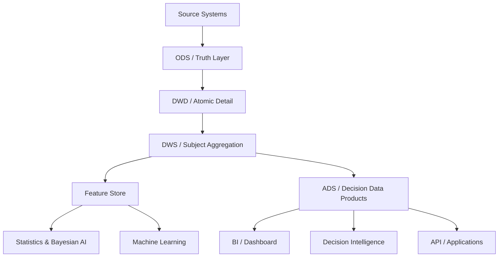

# OGDIL ODS → ADS Architecture

## Architecture

## Layer Responsibilities

### ODS

Source-aligned, traceable, minimally transformed. Preserve source semantics and synchronization metadata.

### DWD

Atomic business detail with validated types, normalized timestamps, controlled identifiers and quality metadata.

### DWS

Subject-level aggregates and reusable analytical entities.

### Feature Store

Point-in-time correct features for model training and inference. Features must carry definition, owner, source lineage and validity window.

### ADS

Decision-ready data products. All downstream analytics and applications should consume ADS rather than querying raw source tables.

## Priority Data Products

| Product | Purpose | Candidate Domains |
|---|---|---|
| `ads_customer360` | Unified player/customer view | identity, game, wallet, risk |
| `ads_player_lifecycle` | Lifecycle and retention | activity, betting, time |
| `ads_betting_behavior` | Behavioral analytics | real-time betting, game/table |
| `ads_wallet_risk` | Financial risk monitoring | wallet, feedback, status |
| `ads_real_time_risk` | Near-real-time risk signals | realtime bet/lobby/log |
| `ads_game_table_operations` | Operational intelligence | table, shuffle, limits |
| `ads_vendor_operations` | Third-party operations | vendor, third-party table |
| `ads_data_quality_monitoring` | Pipeline observability | sync metadata, quality rules |

## Design Constraints

1. Every ADS dataset must have a Data Contract.
2. Every analytical metric must be traceable to ODS source columns.
3. No credentials or secrets may enter analytical features.
4. Financial amounts use exact numeric types in DWD/DWS/ADS.
5. Model labels must have explicit definitions and observation windows.
6. Time-dependent models must enforce point-in-time correctness.
7. Research datasets must be de-identified before external sharing.
