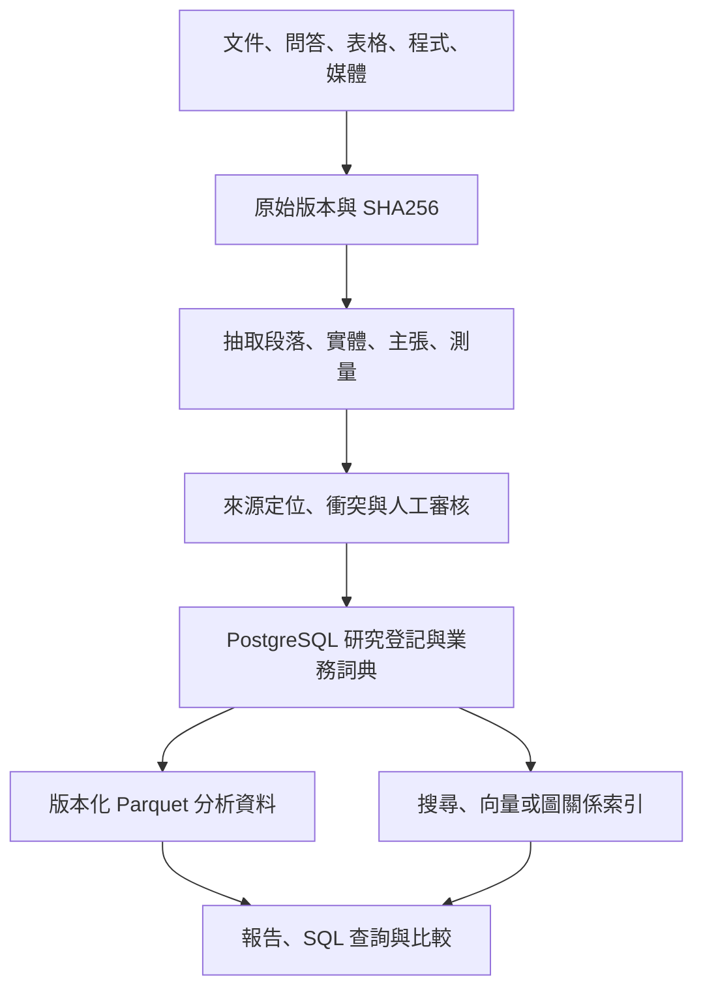

## 建議與現況

此項目最先需要的是可追溯資料模型、來源保留及可驗證查詢，再按實際負載擴展計算。建議以 PostgreSQL 管理實體、主張、證據、版本與審核狀態；原始文件與媒體存於具版本與雜湊的檔案／物件儲存；分析資料以 Parquet 保存，由分析引擎讀取。只有當資料量、多人併發寫入、跨引擎一致性或更新需求實際成立，再引入 Iceberg、分散式運算及串流服務。這是依目前研究型檔案項目的設計建議，尚非負載實測後的最優解。

本輪已建立可直接查詢的本地 SQLite 目錄，保存資產、來源版本、段落覆蓋與欄位清單。它尚未把所有正文轉成經審核的機構／主張資料，也未部署 PostgreSQL、Iceberg 或生產服務。[本地目錄](../reports/2026-10-07/project_information_integration/project_information_catalog.sqlite)、[資產清單](../reports/2026-10-07/project_information_integration/asset_catalog.csv)、[欄位清單](../reports/2026-10-07/project_information_integration/column_catalog.csv)。

## 資料分層與流向



原始層不可被清洗結果覆蓋。標準化層保留每次轉換版本與異常資料；審核層提供經明確定義的當期視圖；檢索索引可重建，答案必須回指原始證據。無法解析的檔案、空欄、失效連結、未知授權、相互矛盾說法也須登記，不能悄悄捨棄。

## 所有資料類別的業務定義與價值

以下是業務定義提案，尚需資料負責人認領；本輪欄位清單的 REVIEW_REQUIRED 不代表每欄已完成語義核實。價值不能由文件大小、重複次數或模型答覆篇幅推定。

| 類別 | 業務粒度與必要欄位 | 可支持的決策／价值 | 品質與限制 |
|---|---|---|---|
| 國家／地區 | ISO 代碼、正式名稱、版次、有效期 | 國別覆蓋、司法區及母表連結 | 249 條目不等於 249 主權國家；代碼版本化 |
| 公司／組織／科研／政府／軍方公開項目 | 一個法律或行政實體；別名、母子關係、所在地、時間 | 生態搜尋、合作與供應鏈追溯 | 集團、子公司、研究所、產品分開；未知不補猜 |
| 軟體／應用／組件／工具／平臺 | 一個產品與版本；類型、接口、授權、維護與依賴 | 技術選型、可移植性及總成本 | 產品存在不證明部署、性能或合規 |
| 能力／主張／否定結果 | 一個可檢驗命題；主體、謂詞、場景、時間、狀態 | 比較能力、排除不成立方案 | UNKNOWN、爭議、撤回、反證與已核實分開 |
| 論文／專利／監管／試驗／部署 | 一個來源記錄與可定位證據 | 科研成熟度、臨床與採用路徑 | 論文不等於商用；專利不等於實作；廠商宣稱保留來源類型 |
| 測量／性能／臨床／帶寬 | 一次測試或估計；值、單位、協議、樣本、誤差與條件 | 可比較性能、風險与成熟度 | 空值不填零；不同測試條件不直接排名 |
| 地理／軌道／遙測／影像 | 時空觀測；座標參考、時間基準、解析度、來源與授權 | 時空分析與任務態勢 | 地面分析不等於飛行控制；座標／時區轉換須留痕 |
| 原始問答／模型輸出／提示 | 一次互動；來源、模型標識、時間、完整正文與引用 | 保留研究推理、候選線索及審核記錄 | 生成内容不是一手證據；假引用單獨標記 |
| 策略／商業化／成本／收益 | 一個假設、方案或測算版本；客戶、成本與依據 | 決策評估与方案取捨 | 推估與已實現收入分開；缺失成本不當零 |
| 遊戲／博彩／金融／客戶資料 | 事件、交易、實驗或個體；用途、保留期与權限 | 實驗、風險監控及服務品質 | 數學期望、模擬、實盤與營收分開；適用規則另核實 |
| 程式／設定／資料字典／模型權重 | 一個版本與執行環境；輸入輸出、依賴與授權 | 重現計算、維運與交付 | 程式存在不代表已成功執行；權重另查授權 |
| 歷史版本／刪除／回執／渲染／媒體 | 一次版本事件或資產；內容雜湊與來源 | 防止錯覆寫、審計与交付追溯 | 舊 PASS 不能沿用到新內容；HTML 不是權威來源 |
| 執行環境／鎖檔／其他未分類資產 | 一件環境或未知資產；分類原因与例外 | 重現環境、排除誤判遗漏 | 鎖檔未讀須列例外；不當科研實體計數 |

每個欄位補齊：業務名称／定義、資料粒度、型別、單位、可選值、空值原因、主外鍵、來源定位、時間語義、負責人、更新週期、品質規則、授權／使用限制、用途與下游依賴。未知項保留待辦與責任人，不用自動生成的通用文字冒充完成。

## 核心實體與時間模型

使用穩定內部 ID；國家代碼與正式識別號是外部鍵，名稱是可變別名。保留「現實有效時間」與「系統記錄時間」，以便回答當時發生什麼，以及當時我們知道什麼。母子公司、政府改組、收購與產品版本不得直接覆蓋舊記錄。

| 表 | 一筆資料的含義 | 關鍵關係 |
|---|---|---|
| asset / asset_version | 一件資產及其內容版本 | SHA256、來源路徑、時間、媒體類型 |
| document_section | 某版本的一个可定位段落 | asset_version、行號／頁碼／偏移、雜湊 |
| country / entity / entity_alias | 國別與實體及別名 | ISO、法律身分、有效期間 |
| product / product_version | 產品與版次 | 所屬實體、技術類別、授權 |
| assertion / evidence / assertion_evidence | 主張、證據及其支持／反對關係 | 證據定位、審核者、有效期、衝突 |
| measurement / deployment / trial / regulatory_record | 測量、部署、試驗及監管事件 | 主張、版本、國別、協議、狀態 |
| relation / taxonomy / business_definition | 關係、分類與業務詞典 | 帶時間的邊、分類版次、負責人 |
| transformation_run / quality_issue / review_event | 加工、品質異常與審核 | 輸入輸出雜湊、程式版本、結果 |

VERIFIED 必須限定到具體主張、來源、條件、日期與審核事件。若某公司一項能力已核實，不代表公司所有能力已核實。UNKNOWN 不納入「已做到」的國別能力分子；排名先定義比較樣本、指標與缺失規則。神經技術 N0～N7 定義未簽發前保留 UNKNOWN。

## 技術選擇與擴展條件

PostgreSQL 用於一致性登記、約束與權限。行級安全可限制普通查詢，但擁有者、superuser 與 BYPASSRLS 存在繞過條件；仍需角色分離、授權測試及審計設計。[PostgreSQL 官方說明](https://www.postgresql.org/docs/current/ddl-rowsecurity.html)。

本地批量研究先評估單機列式分析與分區 Parquet；資料更新及跨引擎管理變複雜時，再評估 Iceberg 的 schema／partition evolution，並測試目錄服務、並發提交、舊快照與保留政策。[Iceberg 官方說明](https://iceberg.apache.org/docs/latest/evolution/)。採用該格式不是性能或成本最優的保證。

加工血緣以資料集、工作與執行記錄連結輸入輸出，與 OpenLineage 的 dataset／job／run 模型對照；本輪段落覆蓋台帳只是文件來源追蹤，並非完整流水線血緣服務。[OpenLineage 官方模型](https://openlineage.io/docs/spec/object-model/)。

全文搜尋服務用於詞項檢索；向量用於候選召回，須記模型、分塊與索引版本；圖索引用於多跳關係查詢。這些均從主資料產生，不能以向量相似度判定事實。CDC／訊息系統只有在明確即時更新需求與失敗重播設計後引入。

## 價值與最高效率的驗證方式

每項資料／資料產品建立價值卡：使用者與決策、業務定義、現有基準、可驗證收益假設、證據、使用頻率、時效要求、品質門檻、取得／儲存／計算／授權／人力成本、失敗後果與負責人。未有量測前不填虛構 ROI 或總價值分數。

測試代表性任務：按國家查詢已核實能力、追溯某個數值到原文、重建歷史報告、比較產品版本、查反證與重複機構。記錄資料規模、硬體、併發、冷／熱快取、p50／p95 延遲、成本、品質錯誤及重現率；依相同條件比較單機、資料庫與分散式方案。

完整性分母採本輪基線資產數、來源版本數、段落數、表格欄位數及不能讀取項目。內容保存率、可解析率、業務定義完成率、外部證據審核率是不同指標；段落覆蓋完成不意味語義與外部事實核实完成。

## 執行順序與當期查詢

先保留與編目，接著補業務詞典及實體別名，再逐條抽取與審核主張，最後按量測擴展分析平台。本輪做到前兩步的可追溯基礎，欄位語義認領與主張審核仍有待完成。

下列是已交付 SQLite 目錄的查詢示例，不是未部署 PostgreSQL 表的假查詢：

```sql
SELECT family, role, COUNT(*) AS assets
FROM assets GROUP BY family, role ORDER BY family, role;

SELECT source, state, COUNT(*) AS blocks
FROM block_coverage GROUP BY source, state;

SELECT path, column_name, row_count, blank_count
FROM columns WHERE business_definition_status = 'REVIEW_REQUIRED';
```

資料刪除依法定保留、授權與使用者指示執行，保留必要的刪除事件；「不遺漏資訊」是有邊界的可驗證保存與管理要求，不能推論應永久公開保存憑證、個人資料或無權持有的內容。

## 本輪已核對的既有底座

DGEF/artifacts/dgef.sqlite 已有 44 張表，本輪唯讀完整性與外鍵檢查通過。它承接實體、主張、證據、觀測、授權與時間；本文件的 PostgreSQL 等是擴展方案，不能理解為項目尚無資料底座。新文件目錄與語義目錄均為旁側目錄，未替換或改寫 DGEF。[核查與對接方案](Project_Semantics_Evidence_Review_20261007.qmd)。


<!-- DGEF_GATE_REVIEW_20261007 -->

## DGEF 模型資料准入核查增補（2026-10-07）

[本批核查報告](DGEF_Model_Gate_Review_20261007.qmd)：現行 45 筆觀測、0 筆獲准訓練；記憶體副本 12 項反例測試揭示原視圖 7 項未攔截情況。候選 SQL 僅供待審篩選，未授權訓練；原 DGEF 庫保持不變。欄位未決數仍為 424，本批不宣稱已完成全部語義校訂。


<!-- DGEF_FIELD_CONTRACTS_20261007 -->

## DGEF 欄位合同增補（2026-10-07）

[欄位合同審閱稿](DGEF_Field_Contracts_20261007.qmd)整理 44 表、411 個欄位；148 筆通用定義細化為待審提案，並保留原定義對照。其餘 1,841 筆語義記錄逐欄不變；全項目仍有 424 筆 UNRESOLVED。原 DGEF 庫、CSV 與字典保持不變，業務負責人及審批仍待確認。
