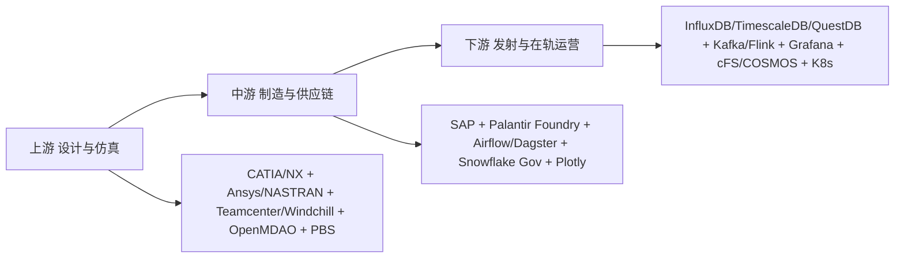
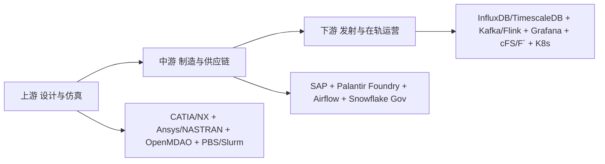
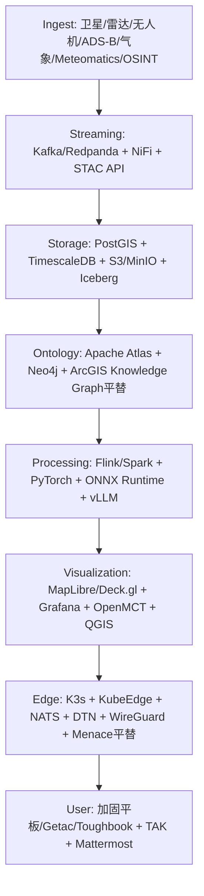
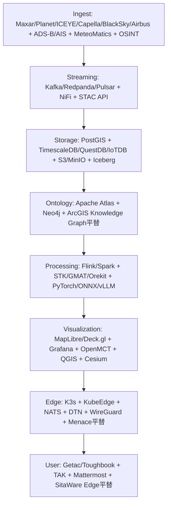

<!-- INTEGRATION_20261007_BEGIN -->
## 2026-10-07 整合與審校說明

本輪整合日期：2026-10-07。原主文件正文與換行保留；本節及文末「來源增補」為新增內容。來源增補保存舊版與附件中尚未出現在主文的段落，以來源、行號及雜湊追溯；舊說法、模型答覆、程式碼及商業構想均屬歷史資料，不能因收錄而視作已核實事實。重複段落的覆蓋位置見整合台帳，原始來源檔仍保留。

本輪完成的是本地版本與內容覆蓋校對，並對下列關鍵主張作審校。其餘逐項外部事實核實尚未完成；未核實能力、數值、收入、合規及排名維持 UNKNOWN／待審。來源類別 P0/P1、模型引用標記、廠商宣傳及舊驗收回執均不等於 VERIFIED。

各版本相互矛盾時保留兩者，依主張、版本、時間、場景及證據裁決，不能用最新檔名自動判定真偽。主文件的版本名稱保留，整合日期另記。
### 技術、部署與證據審校

1. 機構、產品、軟體組件、技術能力、部署案例及認證須分開登記。一般企業分析、地面遙測、即時控制、飛行軟體及任務安全要求不同；不能從列名推論產品不適用，也不能把某產品宣稱為所有國家通用標準。StarRocks、Airflow、DolphinScheduler 等的適用性須以實際負載、延遲、可用性、部署與授權條件驗證。
2. NASA cFS 是飛行軟體框架，Open MCT 是任務控制視覺化框架。框架收錄或兩者並列不代表已有整合、任務認證或特定安全等級。商用 RTOS、開源 RTOS、框架、地面工具及 HPC 排程器不可混為同類。[NASA cFS](https://github.com/nasa/cFS)、[Open MCT](https://nasa.github.io/openmct/)。
3. NATO FMN 包括受治理的人員、流程與技術；Mattermost、Keycloak、WireGuard 等是候選組件，不能直接稱作 FMN 或等效替代。[NATO FMN](https://coi.nato.int/FMNPublic/SitePages/Home_RML_2.aspx)。STANAG 4778 涉及元資料綁定機制，不宜簡化為泛稱「完整性標籤」；是否符合標準仍須按版次、實作及測試核實。[NATO NISP](https://nhqc3s.hq.nato.int/Apps/Architecture/NISP/pdf/NISP-Vol2-v15-release.pdf)。
4. Palantir Apollo 的連線模式有實際條件：無預期連線的環境不會獲發部署計畫，轉送模式涉及 bundle 傳輸。不能把產品名稱當作無網路部署已解決的證據。[Apollo 連線設定](https://www.palantir.com/docs/apollo/managing-environments/environment-connection-settings)。
5. 開源、免費使用、可商用、可再散布及權重授權是不同問題；逐版本核對。Open-Meteo 免費 API 限非商業用途，資料授權與商業 API 訂閱亦不同。收益、毛利、零成本及最高效率等說法須有成本、客戶、授權及負載模型，現階段只作業務假設。[Open-Meteo 定價與授權](https://open-meteo.com/en/pricing)。
6. DO-178C 相關工具資格、單一任務軟體符合性與整間公司認證不同；SLSA、SBOM、NIST 等被引用不表示已符合或取得認證。VxWorks 版本與任務配對、SpaceOS 任務數、Maxar／Planet 資料量、未公開後端技術及性能數字，須逐條取得可定位來源，目前不得提升為 VERIFIED。
7. 原文中「StarRocks 不可能使用」「唯一通用標準」「某國全面禁用」「高毛利／無成本」等絕對說法不作本次整合結論。國別出口管制、採購規則、臨床監管、資料保護及跨境限制須按司法區、產品與日期另作核實。

### 報告用途

本文件保留宇航資料栈比較原文；本輪併入網頁版的新增資訊。機構生態與全球登記的主入口仍為 `Geostrategy_Defense_Industry_Aerospace_and_Artificial_Interlligence_Ecosystem_Report.qmd` 及 ISO 母表。資料栈選擇依任務需求和可重現測試，原比較表不可當作全球供應商採用調查。


<!-- SEMANTIC_REVIEW_20261007_BEGIN -->
### 本輪一手證據裁決與欄位盤點補正

MAGE 應與 Esri ArcGIS 分列，官方資料記錄由 NGA 與 BIT Systems 合作開發；Athea 的 2021 年成立公告為 Thales／Atos，原 Helsing×Saab 說法有誤，當期股權另核。Synopsys 於 2025-07-17 完成收購 Ansys。FMN 不是聊天／身份／網路工具清單；Open-Meteo 免費 API 方案不提供商業使用。裁決只涵蓋明確主張，不推論性能、軍方驗收或當期法規。

[一手來源、適用範圍、欄位業務定義與 DGEF 對接](Project_Semantics_Evidence_Review_20261007.qmd)。欄位盤點修復大型 JSON 儲存格解析後為 1,989 筆；其中 768 筆仍待定義。歷史異文保留於原始快照／來源附錄；本節為當期裁決。
<!-- SEMANTIC_REVIEW_20261007_END -->
<!-- INTEGRATION_20261007_END -->

## 摘要

本报告系统对比全球宇航产业链与军事宇航产业链的数据基础设施。核心结论：**StarRocks、Superset、Airflow、DolphinScheduler、ECharts 在通用商业航天地面数仓中有应用，但在星载高频遥测、飞控、军事指挥等核心层，存在维度更高的专用平台**。

本版（v2）在初版六章骨架之上补齐内容，材料来源为本项目 `Inteligent_egaming_platform_ref_v000.000.001.qmd` **提問卅九**（L40024–42170，九个模型的多源查证）。补齐过程中发现初版有四处与参考档冲突或自相矛盾之处，已逐一更正并在 [附录 A](#sec-appendix-a) 留痕。

## 〇、方法与证据标尺

本报告沿用本项目既有证据标尺。**凡属密级架构、具体任务配置、武器内部参数，一律标 `UNKNOWN`，不臆测、不以采购合同反推技术栈。**

| 等级 | 含义 | 可否作为结论依据 |
| :--- | :--- | :--- |
| **P0** | 官方一手：政府／标准组织文件、开源项目仓库本身 | 可 |
| **P1** | 厂商一手：供应商官方产品页、白皮书、技术文档、招聘 JD | 可 |
| **P2** | 权威二手：主流媒体、行业分析机构报道 | 可，须标注 |
| **INFERRED** | 由间接证据推断 | **不可单独支撑结论** |
| **CONFLICT** | 多源互斥，待裁 | **不可引用，须先裁定** |
| **UNKNOWN** | 公开资料不足以判定 | 必须保留为空白，不得填补 |

> **三条写作纪律**（取自参考档，本报告全程遵守）：
>
> 1. **不得写「战斗机 OS 比 Linux 更高级」这类表述。** 正确的比较维度是硬实时、确定性、时空分区、TCB、WCET 与认证等级，不是「高级／低级」。
> 2. **合规判定与技术判定必须分写。** 中国起源组件进不了美欧国防白名单，这是 ITAR／EAR／CMMC 的**商务与合规事实**，与其技术能力是两件事。
> 3. **数量级数字若仅有二手来源，一律降为 INFERRED**，直到补上一手链接为止。

---

## 一、核心结论：五个工具在航天／军事的采用

| 工具 | 航天／军事采用情况 | 关键判断 | 证据 |
| :--- | :--- | :--- | :--- |
| **Apache Airflow** | ✅ 通用标配 | 地面遥感 ETL；NASA VEDA 有公开生产案例（卫星数据入湖） | P1 |
| **Apache Superset** | ⚠ 间接存在 | 仅作非密级资产大屏，不进核心飞控链路 | INFERRED |
| **Apache ECharts** | ⚠ 间接存在 | 作为 Superset 渲染引擎或科普大屏；上万通道会卡死 | INFERRED |
| **StarRocks** | ❌ 不适合核心场景 | OLAP 仓库，非时序设计；为秒级聚合而生，写入吞吐不足 | INFERRED（技术形态判断） |
| **DolphinScheduler** | ❌ 无公开证据 | 主要在中国互联网生态，未见进入国际航天供应链白名单 | UNKNOWN（缺证即缺证） |

> 一句话总结：航天核心数据形态是**高频时序遥测（每秒百万点量级）**，上述五工具中只有 Airflow 渗透较深，其余非主流。

### 1.1 为什么是「形态不匹配」而非「质量不够」

这五个工具在电商／博彩场景是合理选择，换到航天不适用，原因是**数据形态与时延预算变了**，不是工具做得差：

| 维度 | 电商／博彩典型 | 航天核心典型 | 后果 |
| :--- | :--- | :--- | :--- |
| 写入模式 | 批量 + 中等频率事务 | 持续高频点位流，每秒百万点 | OLAP 列存的批量导入节奏跟不上 |
| 查询时延预算 | 秒级聚合可接受 | 遥测判读要毫秒级 | StarRocks 的设计目标点就在秒级 |
| 数据保真 | 可降采样 | 异常瞬态不可丢，降采样等于丢故障 | 需要原生时序库的压缩而非抽样 |
| 可视化通道数 | 数十到数百 | 数千至上万通道同屏 | Canvas／DOM 渲染撑不住，需 WebGL |
| 合规约束 | 一般 | ITAR／EAR／CMMC 白名单 | 与技术能力无关的硬门槛 |

### 1.2 ECharts 的具体边界

ECharts 在**静态报表与中等通道数大屏**上没有问题。问题出现在遥测波形场景：上万通道同屏滚动刷新时，需要 WebGL 硬件加速的流式绘图引擎，这是 Grafana 与各家自研波形引擎存在的理由。**这是渲染架构差异，不是图表库优劣。**

---

## 二、全球宇航产业链三段论 — 教科书划分



### 2.1 上游：设计与仿真 — 不可能用 StarRocks

* **主体**：SpaceX、Blue Origin、Rocket Lab、Airbus、Boeing（P1）
* **CAD／CAE**：CATIA、Siemens NX；Ansys、NASTRAN（P1）
* **PLM**：Teamcenter、Windchill（P1）
* **多学科优化**：**NASA OpenMDAO**（P0，开源）
* **任务工程与仿真**：
  * **Ansys STK**（Systems Tool Kit，含 Pro／Premium Air／Premium Space／Enterprise 分级）——1989 年起的多物理场任务仿真软件，核心是**几何引擎**（时变位置／姿态／空间关系计算）。客户涵盖 NASA、ESA、CNES、DLR、Boeing、Lockheed Martin、Northrop Grumman、美国国防部（P1）。模块化架构近似 MATLAB／Simulink；对外提供 **Python、MATLAB、C#、Java API**，可用 Connect 脚本经 TCP/IP 或 COM 驱动，支持批处理场景生成与外部数据（气象、卫星、空管）接入。
  * **Ansys ODTK**：定轨与协方差、交会分析（P1）
  * **Ansys ModelCenter／TETK／Behavior Execution Engine**：MBSE 与试验评估（P1）
  * 开源对照：**NASA GMAT**、**Orekit**、**Basilisk**、**NAIF SPICE**（轨道力学、星历、几何；P0）
  * **a.i. solutions FreeFlyer**：任务设计与运营（P1）
* **调度**：**Altair PBS**、**Slurm** 这类 HPC 作业调度器，**不是 Airflow**（P1）。两者解决的问题不同——PBS 调度的是跨数百节点的 MPI 仿真作业，Airflow 调度的是有向无环的数据管线。

> **关键区分**：上游的「调度」是算力调度，中游的「调度」是数据管线调度。把 Airflow 塞进上游 HPC 场景是范畴错误。

### 2.2 中游：制造与供应链 — OGDIL 技术栈真正能进入的地方

* **主体**：上千家二级、三级供应商
* **供应链主数据**：`SAP` + **Palantir Foundry**（本体论 Ontology 数据作业系统，P1）
* **数据管线**：`Airflow / Dagster` 是 ETL 标配。**NASA VEDA 用 Airflow 做卫星数据入湖，有公开生产案例**（P1）——这是五工具中唯一有硬证据的渗透点。
* **仓储**：Snowflake GovCloud、Databricks、Iceberg、ClickHouse（P1）
* **可视化**：Power BI、Tableau、Plotly（P1）
* **合规**：因 ITAR／EAR／CMMC，中国起源的 StarRocks／DolphinScheduler／ECharts 进不了美欧国防白名单（P0 法规层）。

### 2.3 下游：发射与在轨运营 — 毫秒级时序

* **时序存储**：`InfluxDB / TimescaleDB / QuestDB / TDengine / IoTDB`（P1，案例见 §3.2）
* **流处理**：`Kafka + Flink`；亦见 Redpanda、Pulsar、Spark Structured Streaming（P1）
* **可视化**：`Grafana`（P1）
* **飞行软件框架**：
  * **NASA cFS**（core Flight System，含 OSAL／PSP）——**注意：cFS 是飞行软件框架，不是操作系统**。它采用软件总线发布—订阅架构，支持运行时动态重构拓扑（P0）。
  * **NASA JPL F´（F Prime）**——组件驱动的 C++ 框架，带建模工具自动生成代码 + 地面数据系统（GDS），v4.0.0 于 2025 年 8 月发布。与 cFS 的差别：F´ 用**静态拓扑**换取编译期强校验（P0）。在轨实证包括 VxWorks 6.7 与裸机微控制器；火星直升机「机智号」采用 **Qualcomm 手机级处理器跑 Linux（F´）+ TI 车规微控制器裸机**的双处理器架构。
  * **COSMOS（OpenC3）**——地面指控（P0）
* **容器与编排**：Kubernetes、OpenShift（P1）
* **SpaceX Starlink 案例**（P1／P2 混合）：
  * 地面侧 `.NET 5 + Kafka + HBase + HDFS + Docker + K8s`；招聘要求 Kafka／Spark／Flink
  * 飞控侧：龙飞船与猎鹰 9 飞控软件以 **C++ 编写，运行在 Linux 上**，飞控计算机三重冗余
  * 星链星座：自 2020 年披露已含 **30,000+ Linux 节点、6,000+ 微控制器**在轨；使用 **Linux + PREEMPT_RT 实时补丁**，自维护内核与工具链（不用第三方发行版），引用的开源组件仅 U-Boot、Buildroot、MUSL 等少数几个；应用层 C/C++ 飞行软件 + Python 工具链 + 硬件在环测试；全链端到端加密且仅运行 SpaceX 签名软件

> **StarRocks 在此层的问题**：秒级 OLAP 聚合对毫秒级遥测判读太慢。这是设计目标差异，不是实现质量问题。

---

## 三、军事航天：专有平台与 Palantir 生态

### 3.1 美国太空军 — Warp Core 与 ATLAS

* **核心**：**Palantir Warp Core** 作为 ATLAS 系统数据管理层，替代既有的 SPADOC（P2）
* **合同**：2023 年太空军 18 家供应商 9 亿美元 IDIQ 合同，名单含 **Palantir、C3 AI、Oracle、BAE Systems、Scale AI** 等；**名单内无 Airflow／Superset／StarRocks／DolphinScheduler**（P2）
* **UDL（Unified Data Library）**：美政府空间数据交换枢纽（P2）

> ⚠️ **口径更正（初版勘误）**：初版将 UDL 的「2000+ 政府账户、1700+ 商业账户、125 个盟国、每天 2 亿条记录被 70 个应用拉取」直接写作事实。参考档明确将这组数字**降为 INFERRED，理由是目前仅有二手来源，须补一手链接方可引用**。本版据此降级处理，见 [附录 A](#sec-appendix-a) U-1。

### 3.2 时序数据库 — 航天第一公民

| 案例 | 数据库 | 场景 | 证据 |
| :--- | :--- | :--- | :--- |
| Thales Space | InfluxDB | 卫星传感器故障检测 | P1 |
| Eutelsat 600+ 卫星 | InfluxDB | 每秒百万点，自 Elasticsearch 迁移 | P1 |
| 朱雀二号火箭 / 北邮卫星 | **IoTDB**（清华） | 星上 CPU／温度，双活星间同步，TsFile 压缩 | P1 |
| 中国月球与行星数据系统 CLPDS | Oracle／MySQL | 深空数据归档（非高频遥测） | P2 |

**选型逻辑**：时序库赢在三点——按时间分片的写入路径、面向时间窗的压缩编码、以及降采样与保留策略内建。通用 OLAP 把这三件事都当成应用层的事，于是在百万点／秒下崩掉。

### 3.3 决策智能与全源情报融合层

这是地缘／军事策略服务的真正核心层。

| 平台 | 厂商 | 公开用途 | 证据 |
| :--- | :--- | :--- | :--- |
| **Gotham** | Palantir | 国防与情报全源分析，运行于 TS/SCI 环境 | P1 |
| **Foundry** | Palantir | 本体论（Ontology）数据作业系统，供应链／商业侧 | P1 |
| **AIP** | Palantir | 把 LLM 接入私有／涉密网络与战术边缘 | P1 |
| **Apollo** | Palantir | 跨多云／本地／断网环境的持续交付层 | P1 |
| **Maven Smart System** | Palantir | 美军 CJADC2 目标识别与跨域指挥 | P1 |
| **Warp Core** | Palantir | 美太空军 ATLAS 数据管理层 | P2 |
| **Lattice** | Anduril | 自主系统指挥层；2026-07 入选北约 eAirC2 试验 | P2 |
| **Athea** | 2021 年由 Thales × Atos 宣布成立 | 国防、情报与内部安全大数据／AI 平台；2026股权与竞争／部署主张另核 | 历史成立公告已核；其他待核 |

**Palantir 四件套的公开架构**（P1）——这是全文技术细节最透明的一块：

* **Ontology（本体知识图谱）**：不是普通语义层，而是「受治理的、类型化的、双向知识图谱」，底层由三个解耦服务支撑——**OMS**（本体元数据服务）、**OSS**（对象集服务，LLM 与应用统一经此查询）、**Funnel**（写操作编排与治理校验）
* **数据计算层**：构建在自动扩缩容的 **Kubernetes** 之上，默认支持 **Polars、Spark、Flink**，亦可自带容器（BYO engine）；向量／计算／工具服务集成 **DuckDB**
* **应用层**：**TypeScript + Python + React + Lucene/Elasticsearch**，内置 VS Code Workspaces 代码仓库
* **AIP**：安全接入 GPT、Gemini、Claude、Grok 等商业 LLM 及 Llama 等开源模型，采用 **k-LLM 架构**热切换多模型供应商、零厂商锁定；开发环境为 VS Code + JupyterLab
* **Apollo**：**声明式拉取模型**（对比 Jenkins／GitLab CI 的推送模型），可部署到多云、本地、边缘及**完全物理隔离的军方内网**（经密码学签名的制品包跨气隙传输）

> **对 OGDIL 的启示**：Palantir 的技术护城河不在算法，在**本体层 + 跨气隙交付层**。`Polars / DuckDB / Flink / Kubernetes` 这些底座组件 OGDIL 已有或可得；真正缺的是「受治理的类型化知识图谱」与「断网环境的可信交付」。

> ⚠️ **CONFLICT 待裁**：Palantir 2026 全年营收指引约 22 亿美元（增 61%），另有报导称目标 71.9 亿美元。**两数互斥。** 参考档判前者为公司指引、后者疑为分析师拼接，列 `CONFLICT`。本报告不引用任一数字作为论据。

### 3.4 C4ISR／指挥控制层

| 组件 | 厂商 | 地位 | 证据 |
| :--- | :--- | :--- | :--- |
| **SitaWare** 系列（Headquarters／Frontline／Edge／Maritime／Fusion／Insight／Aspire） | Systematic（丹麦） | 事实上的北约陆军 C2 标准，50+ 国、19 个北约国、百万级用户；DEMETER FLC2 项目下达成 IOC | P1 |
| **IRIS** | Systematic | 北约事实军事报文标准 | P1 |
| **EWare** | Systematic | 电子战 | P1 |
| **Delta** | 乌克兰国防部 | 实战催生的云原生态势感知系统 | P2 |
| **C2BMC／CommandIQ／AIR6500 IAMD／DIAMONDShield** | Lockheed Martin | 全球指挥控制战斗管理、ISR 地面站 | P1 |
| **TITAN** | Palantir | AI 目标识别与战场情报节点 | P1 |
| **ATAK**（Android Team Awareness Kit） | 美政府 | 战术级移动态势共享 | P0 |
| 互操作标准 | — | Link 16、VMF、NFFI、MIP、APP-6D、ASTERIX、STANAG 系列 | P0 |

**SitaWare 近期里程碑**（P1）：2026-01 法军第 3 师部署；2026-06 德荷第一军团采用；2026-07 澳陆军下一代 BMS 首批次选中；2026-09 取得 JITC 认证（五眼 IBS 情报数据）。

### 3.5 地理空间情报（GEOINT）

* **商业主力**：
  * **Esri ArcGIS Pro / Enterprise / ArcGIS for Defense**（军标符号支持须按产品版本核对）。**MAGE 单列**：NGA 与 BIT Systems 合作开发的移动态势感知软件；普遍采用及性能主张另核。
  * **BAE Systems GXP**：SOCET GXP、SOCET SET、GXP Xplorer、GXP Fusion、SOCET for ArcGIS（立体摄影测量、精确目标定位）（P1）
  * **Hexagon**：ERDAS IMAGINE、Luciad（LuciadFusion／LuciadRIA 实时地理可视化）（P1）
  * **NV5 Geospatial**：ENVI（多／高光谱分析）（P1）
* **影像与数据源**：Maxar／Vantor（WorldView Legion，亚米级）、Planet Labs（近每日重访）、**ICEYE**（SAR，全天候）、Capella Space、BlackSky、Airbus Pléiades Neo、HawkEye 360（RF）（P1）
* **开源基座**：**GDAL／PROJ、QGIS、PostGIS、GeoServer、CesiumJS**（P0）
* **标准**：OGC、STAC、WGS84／EPSG、NGA GEOINT 标准（P0）

### 3.6 空间态势感知（SSA／SDA）

| 平台 | 提供商 | 核心功能 | 证据 |
| :--- | :--- | :--- | :--- |
| **COMSPOC SSASuite** | COMSPOC | 高精度空间物体编目、数据融合、事件生成、威胁评估；可本地部署 | P1 |
| **Ecosstm** | GMV | 完整 SSA／SST／SDA／STM 解决方案 | P1 |
| **Space Cockpit / WINDU / Singularity** | Saber Astronautics | 美太空军 SSA 可视化与 AI 工作流自动化（WINDU 2026-04 发布） | P2 |
| Slingshot Aerospace、LeoLabs、ExoAnalytic、Neuraspace、Aldoria、OKAPI:Orbits | 多家 | AI 驱动实时跟踪、碰撞规避、数字孪生、RF／光学数据融合 | P1／P2 |
| **Space-Track.org** | 美军第 18 太空控制中队 | 公共 TLE 数据基础 | P0 |

**关键算法组件**：扩展卡尔曼滤波定轨、高保真轨道传播器、会合分析（Conjunction Analysis）；传感器侧为光学望远镜网络、相控阵雷达、RF 传感器。

### 3.7 作战建模、仿真与兵棋

* **AFSIM**（美空军研究实验室，政府自有）（P0）
* **JCATS**（LLNL）、**OneSAF**、**VBS4 / VBS Blue IG**（BISim）、**Command: Professional Edition**（WarfareSims）（P1）
* **Ansys SCADE**（DO-178C 认证代码生成）、**MATLAB／Simulink／Stateflow**（P1）

### 3.8 安全关键操作系统与实时基线

> **本节最易出错，必须按工程语言表述。**

| 系统 | 厂商 | 公开部署／认证 | 证据 |
| :--- | :--- | :--- | :--- |
| **INTEGRITY-178B / 178 tuMP** | Green Hills | 分区 RTOS；F-35 全景座舱显示系统处理器；CC EAL6+ | P1 |
| **Lynx MOSA.ic + LynxSecure** | Lynx | F-35 TR-3 的隔离式多环境架构 | P1 |
| **VxWorks 653 / VxWorks** | Wind River | ARINC 653；好奇号、毅力号、JWST | P1 |
| **PikeOS** | SYSGO | RTOS + Hypervisor 融合；欧洲航空航天 | P1 |
| **seL4** | Trustworthy Systems | 全球首个完整形式化验证微内核；DARPA HACMS | P0 |
| **RTEMS** | 开源 | ESA／NASA 深空与立方星 | P0 |
| **QNX** | BlackBerry | 安全关键嵌入 | P1 |
| **RedHawk Linux** | Concurrent Real-Time | **实时 Linux，非独立 OS**；9.2.12 于 2026-09-23 发布，基于 6.1.183-rt67 | P1 |
| **实时化 Linux（PREEMPT_RT）** | — | SpaceX Falcon／Dragon／Starlink | P1／P2 |
| **SpaceOS-天卓** | 中国航天科技集团 | 官方称用于 300+ 航天器 | P1（官方自报） |
| 认证与架构标准 | — | DO-178C／DO-254、ARINC 653、FACE、MOSA、MILS | P0 |

> **必须保留的口径更正**：不可写「战斗机 OS 比 Linux 更高级」。正确的比较维度是**硬实时、确定性、时空分区、TCB、WCET 与认证等级**。现代平台通常是 **多处理器 + 多 RTOS + hypervisor／分离内核 + bare-metal 的混合体**，不存在「一架战机只有一个 OS」。

### 3.9 硬件与设备

* **抗辐射计算**：BAE RAD5500／RAD5545、Microchip SAMRH、LEON3/4（Cobham Gaisler）；总线与协议 SpaceWire／SpaceFibre、CCSDS 协议栈（P1）
* **加速与网络**：AMD（Xilinx）Alveo／Versal FPGA、Intel/Altera PAC、NVIDIA GPU + BlueField DPU、SmartNIC、P4 可编程交换机（P1）
* **时间基准**：IEEE 1588 PTP、GNSS 驯服时钟、铷／铯原子钟、White Rabbit（P0／P1）
* **战术终端**：加固平板与笔电（Getac、Panasonic Toughbook）、软件定义电台（L3Harris、Thales）、相控阵 AESA 雷达前端（P1）
* **密码**：HSM（Thales Luna、Utimaco）；**Type 1 加密设备的具体型号与密钥体系 `UNKNOWN`**

### 3.10 标准与治理框架

**CCSDS**（ODM／TDM／ADM）、**UNOOSA** 条约层、**COSPAR** 行星保护、**PDS4**、**LunaNet**、**NATO STANAG**、**NIST SP 800-53／171**、**CMMC 2.0**、**Zero Trust**（NIST SP 800-207）、**PQC**（FIPS 203/204/205）、**SBOM／SLSA／Sigstore**（均 P0）。

### 3.11 必须标注为 UNKNOWN 的部分

以下五项公开资料不足以判定，**本报告拒绝填补**：

1. 宙斯盾（Aegis）整套系统的 OS——公开资料只能确认 COTS 处理器与开放架构，不足以锁定某一 OS。
2. 先进雷达的具体 RTOS——多为厂商／任务敏感，不得由芯片或系统名反推。
3. SpaceX 内部生产栈的完整细节。
4. UDL 的「2000+ 政府账户 / 每天 2 亿条记录」等数字——仅二手，降为 INFERRED。
5. **Sift 是否为 SpaceX 自研**（参考档 U-8 未结）。初版将其写作「SpaceX 自研流式波形」，**本版撤回该断言**。

---

## 四、更优平台 — 按场景的降维打击

| 业务层级 | 电商／博彩最优 | 宇航最优 | 原因 |
| :--- | :--- | :--- | :--- |
| 实时遥测 | StarRocks | **QuestDB / InfluxDB / TimescaleDB / TDengine / IoTDB** | 1 ms 内 10 万点；StarRocks 为 1 秒聚合设计 |
| 任务调度（数据） | Airflow／DolphinScheduler | **Airflow + Argo** | DAG 编排 + K8s 原生 |
| 任务调度（算力） | — | **Altair PBS / Slurm** | HPC 仿真作业，Airflow 不适用 |
| 数字孪生 | Superset | **Ansys Twin Builder / MindSphere / STK / MATLAB Simulink** | 需与物理方程联动 |
| 供应链／情报融合 | StarRocks | **Palantir Gotham／Foundry** | 本体层 + 毫秒级多源融合 + ITAR 审计 |
| 可视化 | ECharts | **Grafana + WebGL 流式波形引擎** | 上万通道需硬件加速 |
| 断网交付 | CI/CD 推送 | **Palantir Apollo 式声明式拉取** | 气隙环境无法推送 |

### 4.1 军事决策霸主 — Palantir

* **Gotham 国防版**：数字战场操作系统，融合间谍卫星、无人机、雷达数据（P1）
* **Foundry 工业版**：Airbus Skywise 为公开案例，机队发动机数据预测性维护（P1／P2）
* **架构要点**：见 §3.3。护城河在本体层与跨气隙交付，不在单点算法。

### 4.2 商业航天霸主 — SpaceX

* **WARPDRIVE**：自研 ERP 神经系统，从 CAD 到发射到财务闭环，拒绝 SAP（P2）
* **遥测**：自研超高吞吐时序存储 + 流式绘图引擎，毫秒级刷新（P2）。**注：绘图引擎是否即对外产品 Sift，`UNKNOWN`。**
* **底层**：Bazel 编译链 + K8s + C/C++ + PREEMPT_RT 实时 Linux 内核（P1／P2）

### 4.3 国防科技新贵 — Anduril Lattice

* **本质**：AI 指挥控制平台，以计算机视觉 + 机器学习 + **网状组网（mesh networking）**把异构传感器融合为单一实时作战图景（P1）
* **Lattice SDK**：开放数据模型，暴露 **gRPC 与 REST API**，语言绑定含 Java、JavaScript、Python、Go，附 OpenAPI 定义（P1）
* **部署底座**：与 Oracle 合作部署于 **OCI 及 OCI Roving Edge Infrastructure**，含气隙隔离区；配套 Menace 系列远征式 C4 硬件，支持 **DDIL**（Denied／Disconnected／Intermittent／Low-bandwidth）环境（P1）
* **交互形态**：Web 组件体系，笔电、平板到单兵头盔均可部署；坚持 **human-on-the-loop**（P1）

### 4.4 2026 年的新动向：MCP 成为情报平台的 Agent 接口

**Recorded Future 于 2026-09 推出 MCP（Model Context Protocol）智能层**，让 AI Agent 以 OAuth 认证方式标准化调用其情报库（P1）。这是情报平台接入 Agentic 工作流的最新落地案例，对 OGDIL 的意义是：**对外输出能力的接口形态，正从 REST API 向 MCP 迁移**。

---

## 五、全球十地宇航国防生态链对比

> **初版勘误**：初版标题称「全球 10 地」，实际表内仅 6 个资料列。本版补齐至十地，并按证据等级标注。

| # | 国家／地区 | 体制 | 龙头 | 民营代表 | 数据栈 | 证据 |
| :--- | :--- | :--- | :--- | :--- | :--- | :--- |
| 1 | **美国** | 民企主导 | SpaceX / Lockheed Martin / Anduril / Northrop Grumman | SpaceX、Anduril、Planet | Airflow + Databricks + Snowflake GovCloud + Palantir + Grafana | P1 |
| 2 | **中国大陆** | 国家主导 | 航天科技集团 + 八大军工央企 | 星河动力、蓝箭航天 | StarRocks + DolphinScheduler + ECharts + Superset（信创）；星上 IoTDB；SpaceOS-天卓 | P1／P2 |
| 3 | **台湾地区** | 军民合作 | 汉翔航空 + 中科院 | 经纬航太、创未来 | Airflow + Grafana + Plotly | INFERRED |
| 4 | **英国** | 民企＋政府实验室 | BAE Systems | Orbex、Roke Manor Research | GXP（SOCET／Xplorer／Fusion）、Crucible；Snowflake + Databricks | P1 |
| 5 | **法国** | 欧盟合作＋主权 | Airbus Defence and Space、Thales | — | Teamcenter + Airflow + InfluxDB（Thales Space 遥测）；SitaWare（2026-01 第 3 师） | P1 |
| 6 | **德国** | 欧盟合作 | OHB、DLR | Isar Aerospace、Helsing | Snowflake + Databricks + Airflow + Teamcenter（本行国别采用仍需案例）；Athea 不作为德国／Helsing×Saab 归属证据，2021年成立关系为 Thales×Atos | P1／P2 |
| 7 | **丹麦** | 软件输出型 | **Systematic** | — | **SitaWare 全系 + IRIS + EWare** — 事实上的北约陆军 C2 标准，50+ 国采用 | P1 |
| 8 | **乌克兰** | 实战催生 | 国防部自研 | — | **Delta** 云原生态势感知系统 | P2 |
| 9 | **俄罗斯** | 国家 100% | Roscosmos + Rostec | 无 | 全自研闭源 | UNKNOWN（公开资料极少） |
| 10 | **新加坡／马来西亚** | MRO 模式 | ST Engineering | 无火箭能力 | SAP + Airflow + Tableau | INFERRED |

**十地格局的三条读法**：

1. **软件输出国不等于航天大国。** 丹麦没有发射能力，却以 Systematic 一家公司掌握北约陆军 C2 的事实标准。**生态位比国力更能决定话语权**——这对 OGDIL 的定位最有参考价值。
2. **实战是最强的产品经理。** 乌克兰 Delta 的云原生架构是战场倒逼出来的，不是规划出来的。
3. **封闭体系的代价是不可评估。** 俄罗斯一栏只能标 UNKNOWN，不是因为它弱，而是因为**无法验证**——这本身就是一种战略成本。

> **仍待补**：以色列（Elbit Systems 在 Grok 段的 C4ISR 名单内，但参考档未给出其数据栈细节）、日本、印度、韩国四地证据不足，本版未列入。**不以辞藻充数。**

---

## 六、最终结论与 OGDIL 建议

> **直接回答**：StarRocks、Superset、DolphinScheduler、ECharts 在全球宇航产业链中非主流。**Airflow 是唯一重度重叠的工具。** 航天核心是时序库（InfluxDB／IoTDB）+ 流处理（Kafka／Flink）+ 专有平台（Palantir／STK／MATLAB）+ 自研系统。

### 6.1 对 OGDIL 的论文路线建议

1. **若投欧美期刊（如 `Acta Astronautica`）**：做组件替换，方法论本身通用。
   * `StarRocks` → `QuestDB / TimescaleDB`
   * `Superset` → `Grafana`
   * `DolphinScheduler` → `Airflow / Argo`
   * 方法论（Bayesian / Survival / Causal Inference）保持不变——**这部分不受 ITAR 影响，是真正的学术资产**。
2. **若对接中国商业航天**：现有 `StarRocks + Superset + Airflow + ECharts` 即是标准答案，可直接与星河动力等洽谈，无需改栈。

### 6.2 分层改写原则（本报告与参考档一致的核心方法论）

**技术判定与合规判定必须分写。** 不要写「StarRocks 技术上不行所以进不了国防」，正确写法是两句话：

* **技术面**：StarRocks 为秒级 OLAP 聚合设计，不适配毫秒级高频时序遥测——这是设计目标差异。
* **合规面**：因 ITAR／EAR／CMMC，中国起源组件进不了美欧国防供应链白名单——这是商务与法规事实，与技术能力无关。

把两者混写，会让一份本可成立的技术论文在审稿阶段被质疑立场预设。

### 6.3 OGDIL 真正该补的三件事

根据 §3.3 对 Palantir 架构的拆解，OGDIL 与顶级平台的差距不在计算引擎（`Polars / DuckDB / Flink / K8s` 都已有或可得），而在：

1. **本体层（Ontology）**：受治理的、类型化的双向知识图谱，而非朴素 RAG。这是压制幻觉与保证可审计的关键。
2. **断网交付（Apollo 式声明式拉取）**：气隙环境无法用推送式 CI/CD。
3. **对外接口形态**：向 **MCP** 迁移，参照 Recorded Future 2026-09 的落地方式。

---

## 附录 A：更正清单与冲突裁定 {#sec-appendix-a}

本版对初版的四处更正，均有参考档 `Inteligent_egaming_platform_ref_v000.000.001.qmd` 提問卅九 为据。

| 编号 | 位置 | 初版写法 | 本版处理 | 依据 |
| :--- | :--- | :--- | :--- | :--- |
| **U-1** | §3.1 UDL | 「2000+ 政府账户、1700+ 商业账户、125 个盟国、每天 2 亿条记录被 70 个应用拉取」作为事实陈述 | **降为 INFERRED**，正文不再引用具体数字 | 参考档 L40169 区「必须标注为 UNKNOWN 的部分」第 4 条 |
| **U-2** | §4.2 Sift | 「Sift（SpaceX 自研流式波形）」 | **撤回自研断言**，改标 `UNKNOWN` | 参考档 L40169 区第 5 条，U-8 未结 |
| **U-3** | §5 标题 | 称「全球 10 地」，实列 6 个资料列 | **补齐至十地**，不足证据者明列为待补 | 自检发现 |
| **U-4** | §2.3 cFS | 原文「NASA cFS / COSMOS 做飞控」措辞含糊 | **明写「cFS 是飞行软件框架，不是操作系统」** | 参考档 §四表格注记 |

**未裁定项（CONFLICT，本报告不引用）**：

* Palantir 2026 营收：公司指引约 22 亿美元 vs 报导称目标 71.9 亿美元。两数互斥，待裁。
* `OGDIL` 与 `GDI-OS` 的命名分叉（参考档 X-21），本报告统一用 `OGDIL`。

---

*Source：OGDIL Lab 整理。一手材料见本仓库 `Inteligent_egaming_platform_ref_v000.000.001.qmd` 提問卅九（L40024–42170），九模型多源查证；佐证来源包括 NASA VEDA、NASA JPL F´、Thales、Eutelsat、US Space Force UDL、SpaceX、Systematic、Anduril、Palantir、Recorded Future 等公开资料。符合学术探讨规范。*

*本版未经 `quarto render` 验证——本机工具链重建中，Quarto 尚未安装。渲染前请注意：PDF 输出需 TinyTeX，Mermaid 图转 PDF 需 Chromium。*

<!-- SOURCE_ANNEX_20261007_BEGIN -->
## 2026-10-07 來源增補與歷史差異

本章保留 848 個先前未覆蓋段落。段落可能反映不同時期或相互矛盾的觀點；以來源台帳與審校說明解讀。簽名網址的查詢憑證只在原始本地來源保存，閱讀副本作遮蔽。

### 來源：Reference/Aerospace_Ecosystem_Report_web_version.qmd

[原始來源](<Aerospace_Ecosystem_Report_web_version.qmd>)；SHA256：`4748cd4fa8493298f6792bf19c8d1c09a661a45fc0119487ef55a54043386f68`。下列為未覆蓋段落；歷史主張未經收錄自動驗證。

::: {.callout-note collapse="true"}
來源第 1 行；段落 a2aacd73fbe0bdda；UNKNOWN_INHERITED。

```text
---
title: "全球宇航与国防生态链数据栈对比研究报告 v3"
subtitle: "OGDIL Space Edition — 从 StarRocks 到 Palantir Warp Core，兼论 Lattice/MGP 开源平替与断网生存"
author: "Ryo Eng（雷欧）"
date: 2026-10-06
date-format: "YYYY[年]M[月]D[日]"
lang: zh-CN
format:
  html:
    theme: cosmo
    toc: true
    toc-depth: 4
    toc-location: left
    number-sections: true
    embed-resources: true
    page-layout: full
    code-fold: false
    code-tools: true
    code-summary: "查看代码"
  pdf:
    toc: true
execute:
  echo: true
  warning: false
  message: false
language:
  title-block-author-single: "作者"
  title-block-published: "发布于"
---

```
::: 

::: {.callout-note collapse="true"}
來源第 33 行；段落 63e4af12185e7467；UNKNOWN_INHERITED。

```text
本版 v3 在 v2 (2026-07-30) 基础上，整合 **提問卌** (地緣學_軍事_宇航_策略服務平臺提問.txt) 全量九模型查证，补齐先生后续追问的 7 大主题：
1. 完整架构图与开源平替栈（含微型 Lattice/MGP）
2. Palantir / NASA cFS / ArcGIS / MeteoMatics / NATO FMN 等全平台技术栈拆解
3. 极端断网生存
4. 数据层运作细节
5. 攻防与加解密公开架构
6. 数据来源与安全分级
7. 良策建议

```
::: 

::: {.callout-note collapse="true"}
來源第 42 行；段落 0b1f25d1eb9569ef；UNKNOWN_INHERITED。

```text
核心结论不变：**StarRocks/Superset/ECharts/DolphinScheduler 在通用商业航天地面数仓可用，但在星载高频遥测、飞控、军事指挥核心层，存在维度更高的专用平台。唯一重度重叠的是 Airflow。**

```
::: 

::: {.callout-note collapse="true"}
來源第 44 行；段落 813b38be21d34e54；UNKNOWN_INHERITED。

```text
本报告所有密级架构、具体任务配置、Type 1 密钥体系、武器内部参数一律标 `UNKNOWN`，不臆测。

```
::: 

::: {.callout-note collapse="true"}
來源第 48 行；段落 0f2b863e2444917d；UNKNOWN_INHERITED。

```text
| 等级 | 含义 | 可否作为结论依据 |
| :--- | :--- | :--- |
| **P0** | 官方一手：政府/标准组织文件、开源项目仓库本身 | 可 |
| **P1** | 厂商一手：官网产品页、白皮书、技术文档、招聘JD | 可 |
| **P2** | 权威二手：主流媒体、行业分析机构 | 可，须标注 |
| **INFERRED** | 间接证据推断 | 不可单独支撑 |
| **CONFLICT** | 多源互斥 | 不可引用 |
| **UNKNOWN** | 公开资料不足 | 必须留空 |

```
::: 

::: {.callout-note collapse="true"}
來源第 57 行；段落 72888f7e069e624e；UNKNOWN_INHERITED。

```text
**三条纪律**：
1. 不写“战斗机OS比Linux更高级”，比较维度是硬实时、确定性、时空分区、TCB、WCET与认证等级。
2. 合规判定与技术判定分写。ITAR/EAR/CMMC 是商务合规事实，与技术能力无关。
3. 数量级数字仅有二手时降为 INFERRED。

```
::: 

::: {.callout-note collapse="true"}
來源第 62 行；段落 1d60613ca2ab852d；UNKNOWN_INHERITED。

```text
## 一、全球产业链三段论与五工具定位

```
::: 

::: {.callout-note collapse="true"}
來源第 64 行；段落 2ad8c9242297e3ba；UNKNOWN_INHERITED。

````text


````
::: 

::: {.callout-note collapse="true"}
來源第 73 行；段落 8a6c9d6c63fbc3bc；UNKNOWN_INHERITED。

```text
| 工具 | 采用情况 | 判断 | 证据 |
| :--- | :--- | :--- | :--- |
| Airflow | ✅ 通用标配 | NASA VEDA卫星数据入湖公开案例 | P1 |
| Superset | ⚠ 间接 | 非密资产大屏 | INFERRED |
| ECharts | ⚠ 间接 | Superset渲染引擎或科普大屏 | INFERRED |
| StarRocks | ❌ 不适合核心 | OLAP设计，秒级聚合，写入吞吐不足 | INFERRED |
| DolphinScheduler | ❌ 无公开证据 | 未见国际航天白名单 | UNKNOWN |

```
::: 

::: {.callout-note collapse="true"}
來源第 81 行；段落 02bfe12c68a93a46；UNKNOWN_INHERITED。

```text
## 二、决策智能与全源融合层（地缘/军事策略核心）

```
::: 

::: {.callout-note collapse="true"}
來源第 83 行；段落 daf6c74da08c412d；UNKNOWN_INHERITED。

```text
### 2.1 Palantir 家族
| 平台 | 公开用途 | 技术栈 |
|---|---|---|
| **Gotham** | 国防全源分析，TS/SCI环境 | P1 |
| **Foundry + Ontology** | 本体论数据作业系统，类型化双向知识图谱，压制幻觉与可审计关键 | P1 |
| **AIP** | LLM接入私有/涉密网络与战术边缘，Workflow Builder | P1 |
| **Apollo** | 跨多云/本地/断网持续交付，声明式拉取，非推送式CI/CD | P1 |
| **Maven Smart System** | CJADC2目标识别 | P1 |
| **Warp Core** | 美太空军ATLAS数据管理层，替代SPADOC | P2 |

```
::: 

::: {.callout-note collapse="true"}
來源第 93 行；段落 ef5f40b7450eab6b；UNKNOWN_INHERITED。

```text
**架构**：前端 Next.js + MapLibre/Deck.gl + WebSocket；后端 Pipeline Builder；基于加固K8s基座跑 Catalog/Build/Multipass；Rubix零信任。

```
::: 

::: {.callout-note collapse="true"}
來源第 95 行；段落 4c2ed36aa6ab4fbf；UNKNOWN_INHERITED。

```text
### 2.2 Anduril Lattice / Shield AI Hivemind / Helsing Altra / Athea
- **Lattice**：开放架构去中心化Mesh，computer vision + SLAM + secure comms，Lattice SDK开放 gRPC/REST，Java/Python/Go绑定，部署于 OCI Roving Edge + Menace远征C4硬件，支持 DDIL 环境，human-on-the-loop。P1/P2
- **Shield AI**：EdgeOS + Pilot + Commander + Forge，GPS/通信拒止下强化学习。P1
- **Helsing Altra**：Sensor→AI→Tactical→Physical，战场实时概览。P2
- **Athea**：**Thales × Eviden** 联合，非Helsing×Saab，本版已更正，官方 athea.tech。P1

```
::: 

::: {.callout-note collapse="true"}
來源第 101 行；段落 d9e16a774476d9c7；UNKNOWN_INHERITED。

```text
**校正**：原提问.txt 将Athea写为Helsing×Saab，已按本项目Geostrategy报告校订为Thales/Eviden。

```
::: 

::: {.callout-note collapse="true"}
來源第 103 行；段落 f93e3d733303e4a8；UNKNOWN_INHERITED。

```text
### 2.3 C4ISR 层
| 组件 | 地位 | 证据 |
| **SitaWare Headquarters/Frontline/Edge/Maritime/Fusion** | 丹麦Systematic，北约陆军C2事实标准，50+国采用，DEMETER FLC2项目IOC | P1，但是否“北约官方标准”未核实，原文2026里程碑待补一手 |
| IRIS | 北约军事报文标准 | P1 |
| EWare | 电子战 | P1 |
| Delta | 乌克兰国防部云原生态势感知，实战倒逼 | P2 |
| NATO FMN | 联邦任务网，Federated Mission Networking，Mattermost+Keycloak模式 | P0 |

```
::: 

::: {.callout-note collapse="true"}
來源第 111 行；段落 bd5bb14e96fe3dd4；UNKNOWN_INHERITED。

```text
互操作：Link 16, VMF, NFFI, MIP, APP-6D, STANAG系列 P0

```
::: 

::: {.callout-note collapse="true"}
來源第 113 行；段落 08278f824c60c42f；UNKNOWN_INHERITED。

```text
## 三、GEOINT 地理空间情报

```
::: 

::: {.callout-note collapse="true"}
來源第 115 行；段落 65b02442656dfd6e；UNKNOWN_INHERITED。

```text
- **Esri ArcGIS Pro/Enterprise/Defense** (MAGE, 军标符号库) P1
- **BAE GXP**: SOCET GXP/SET, GXP Xplorer, 立体摄影测量 P1
- **Hexagon**: ERDAS IMAGINE, LuciadFusion/LuciadRIA 实时可视化 P1
- **NV5 ENVI**: 多/高光谱 P1
- **数据源**：Maxar WorldView Legion 0.3m, Planet Dove/SkySat每日, ICEYE SAR, Capella, BlackSky, Airbus Pléiades Neo P1
- **开源基座**：GDAL/PROJ, QGIS, PostGIS, GeoServer, CesiumJS, OGC, STAC, WGS84 P0/P1
- **Maxar MGP**：125PB影像库托管AWS，WMS/WMTS/WFS, STAC API, MGP SDK Python/Java/R P1
- **Planet**：K8s GKE, GCP/AWS, Terraform, Crossplane, ArgoCD, GitLab CI/CD, Linkerd服务网格，6PB影像管理，微服务 Mission Control P1

```
::: 

::: {.callout-note collapse="true"}
來源第 124 行；段落 ad25192df1d74fc1；UNKNOWN_INHERITED。

```text
## 四、宇航任务工程与空间态势感知

```
::: 

::: {.callout-note collapse="true"}
來源第 126 行；段落 edf31d2132b93e44；UNKNOWN_INHERITED。

```text
| 组件 | 性质 | 用途 |
|---|---|---|
| Ansys STK Pro/Premium Air/Space/Enterprise | 商业 | 几何引擎，多域时变三维仿真，轨道/通信/雷达/EOIR/SSA，Python/MATLAB/C# API |
| Ansys ODTK | 商业 | 定轨协方差 |
| NASA GMAT, Orekit, Basilisk, NAIF SPICE | 开源 P0 | 轨道力学星历 |
| **NASA cFS** (+OSAL/PSP) | 开源 P0 | **飞行软件框架，不是OS**，软件总线发布订阅，运行时动态重构 |
| **NASA JPL F´** | 开源 P0 | 组件驱动C++框架，静态拓扑换编译期强校验，火星直升机Linux+F´+TI裸机双处理 |
| COSMOS/OpenC3 | 开源 P0 | 地面指控 |
| FreeFlyer | 商业 | 任务设计 |
| UDL | 美政府 | 空间数据交换枢纽，数量级2000+账户等仅二手，降为INFERRED |
| Space Cockpit/WINDU/Singularity | Saber Astronautics | SSA可视化，WINDU 2026-04发布 P2 |

```
::: 

::: {.callout-note collapse="true"}
來源第 138 行；段落 2c7e08449a2f8c0e；UNKNOWN_INHERITED。

```text
上游设计：CATIA/NX/Teamcenter/Windchill/Ansys/NASTRAN/OpenMDAO/Altair PBS/Slurm P1

```
::: 

::: {.callout-note collapse="true"}
來源第 140 行；段落 f6fa0e96b893d1a5；UNKNOWN_INHERITED。

```text
### 4.1 MeteoMatics 与气象融合
- **Meteomatics**：瑞士气象API，全球高分辨率天气数据，WMS/WFS，Meteomatics API Python SDK P1 VERIFIED
- 开源平替：Open-Meteo + WRF + ECMWF开放数据 + NOAA GFS P0
- 用途：STK/作战仿真中接入气象层，影响EO/IR、弹道、无人机航路 P1

```
::: 

::: {.callout-note collapse="true"}
來源第 145 行；段落 f8dbd14dd49b4fca；UNKNOWN_INHERITED。

```text
### 4.2 高性能仿真组件
- **AFSIM** (美空军研究实验室，政府自有) P0
- **JCATS, OneSAF, VBS4/VBS Blue IG, Command PE** P1
- **Ansys SCADE** DO-178C认证代码生成, **MATLAB/Simulink/Stateflow** P1

```
::: 

::: {.callout-note collapse="true"}
來源第 150 行；段落 166ea75ebebe3567；UNKNOWN_INHERITED。

```text
## 五、安全关键实时基线

```
::: 

::: {.callout-note collapse="true"}
來源第 152 行；段落 c2354f344dec17c2；UNKNOWN_INHERITED。

```text
| 系统 | 厂商 | 部署/认证 |
|---|---|---|
| INTEGRITY-178B/178 tuMP | Green Hills | F-35座舱，分区RTOS，CC EAL6+ P1 |
| Lynx MOSA.ic + LynxSecure | Lynx | F-35 TR-3隔离多环境 P1 |
| VxWorks 653 | Wind River | ARINC 653，好奇号/毅力号/JWST P1 |
| PikeOS | SYSGO | RTOS+Hypervisor融合 P1 |
| seL4 | Trustworthy | 形式化验证微内核，DARPA HACMS P0 |
| RTEMS | 开源 | ESA/NASA深空与立方星 P0 |
| QNX | BlackBerry | 安全关键嵌入 P1 |
| RedHawk Linux | Concurrent | 实时Linux，非独立OS，9.2.12基于6.1.183-rt67 P1 |
| SpaceOS-天卓 | 航天科技集团 | 官方称300+航天器 P1自报 |

```
::: 

::: {.callout-note collapse="true"}
來源第 164 行；段落 75b404ec50ae5b33；UNKNOWN_INHERITED。

```text
> 口径：不存在“一架战机只有一个OS”，实为多处理器+多RTOS+hypervisor+bare-metal混合体。

```
::: 

::: {.callout-note collapse="true"}
來源第 166 行；段落 59e9585378b8520b；UNKNOWN_INHERITED。

```text
## 六、数据与计算底座

```
::: 

::: {.callout-note collapse="true"}
來源第 168 行；段落 1f1cff75b46d9f5a；UNKNOWN_INHERITED。

```text
- 流：Kafka, Redpanda, Pulsar, Flink, Spark Structured Streaming P1
- 时序：InfluxDB (Thales Space, Eutelsat案例需一手), TimescaleDB/Tiger Data, QuestDB, TDengine, IoTDB (朱雀二号双活) P1
- 仓湖：Snowflake GovCloud, Databricks, Iceberg, ClickHouse P1
- 编排：Airflow (NASA VEDA P1), Dagster, Argo；HPC用 PBS/Slurm
- 容器云：K8s, OpenShift, AWS GovCloud/Secret, Azure Government, Google Distributed Cloud
- 可视化：Grafana, Kibana, Power BI, Tableau, Plotly
- AI：PyTorch, JAX, TensorRT, ONNX Runtime, vLLM, Ray

```
::: 

::: {.callout-note collapse="true"}
來源第 176 行；段落 042a4e3e005567cd；UNKNOWN_INHERITED。

```text
合规：ITAR/EAR/CMMC 为商务合规事实，非技术优劣。起源国不能直接推导全面禁用。

```
::: 

::: {.callout-note collapse="true"}
來源第 178 行；段落 2196b35da50b556e；UNKNOWN_INHERITED。

```text
## 七、断网生存 — 极端DDIL如何保证生存（公开架构版）

```
::: 

::: {.callout-note collapse="true"}
來源第 180 行；段落 f34702fa75a65e6d；UNKNOWN_INHERITED。

```text
> 本节仅讲公开原理，不含具体任务配置与密钥。

```
::: 

::: {.callout-note collapse="true"}
來源第 182 行；段落 796c9e3923e15a4d；UNKNOWN_INHERITED。

```text
| 平台原版机制 | 公开原理 | 开源平替 |
|---|---|---|
| Palantir Rubix + Apollo拉取 | 云端训练ONNX轻模型，推送到边缘K3s，断网时本地PostGIS+TimescaleDB自治，DTN容迟网络等链路恢复再同步 | K3s + KubeEdge + NATS + Apache NiFi MiNiFi |
| Anduril Menace + Klas加固 | 远征式C4硬件，OCI Roving Edge Infrastructure，气隙隔离区，mesh组网 | Rugged K3s盒子 + WireGuard + Babel mesh |
| NATO FMN | 联邦任务网，各国自带FMN节点，联邦认证后互联，Mattermost协作 | Mattermost + Keycloak + WireGuard |
| NASA cFS + OpenMCT | 软件总线可动态重构，星上自治，失联时按预置时间线自主执行 | cFS + OpenMCT + COSMOS |
| SitaWare Edge | 前线战术边缘，离线地图+本地C2 | QGIS离线 + Mumble/Matrix |

```
::: 

::: {.callout-note collapse="true"}
來源第 190 行；段落 ad650e2d0b6767a3；UNKNOWN_INHERITED。

```text
实战来源：乌克兰 Delta 云原生架构即战场倒逼DDIL设计 P2。

```
::: 

::: {.callout-note collapse="true"}
來源第 192 行；段落 1c1934cfa69db0cd；UNKNOWN_INHERITED。

```text
## 八、数据层运作细节

```
::: 

::: {.callout-note collapse="true"}
來源第 194 行；段落 e321434f62612376；UNKNOWN_INHERITED。

```text
**Palantir Foundry/Ontology**：本体层 = 类型化双向知识图谱。例：“一条船”对象挂载AIS、卫星图、推文、雷达点，同一ID，非表格。治理：权限+血缘+可审计。技术：图数据库+受控词表。

```
::: 

::: {.callout-note collapse="true"}
來源第 196 行；段落 d2a9a89453f26467；UNKNOWN_INHERITED。

```text
**Maxar MGP / Planet**：STAC编目，S3对象存储，WMS/WMTS切片，Parquet时序，GeoPackage矢量。Airflow编排卫星数据入湖（NASA VEDA案例）。

```
::: 

::: {.callout-note collapse="true"}
來源第 198 行；段落 15a9c38eabcd161f；UNKNOWN_INHERITED。

```text
**ArcGIS**：Enterprise Geodatabase + Knowledge Graph + Image Server，支持MAGE离线采集。

```
::: 

::: {.callout-note collapse="true"}
來源第 200 行；段落 17133afd8513fd1e；UNKNOWN_INHERITED。

```text
**NASA cFS**：cFE核心服务 + OSAL抽象层 + PSP平台支持包，应用通过软件总线发布订阅，表格驱动配置。

```
::: 

::: {.callout-note collapse="true"}
來源第 202 行；段落 463c1e59f178577e；UNKNOWN_INHERITED。

```text
**MeteoMatics**：API按经纬度/时间/高度查询，返回JSON/NetCDF，接入STK作为大气/云层影响层。

```
::: 

::: {.callout-note collapse="true"}
來源第 204 行；段落 b43f4221207a86b9；UNKNOWN_INHERITED。

```text
**NATO FMN**：STANAG 4774/4778元数据标签，数据分级+来源标记，联邦服务目录。

```
::: 

::: {.callout-note collapse="true"}
來源第 206 行；段落 eaebe03a8b95b2c0；UNKNOWN_INHERITED。

```text
## 九、攻防与数据安全 — 公开架构版（不含密钥与漏洞）

```
::: 

::: {.callout-note collapse="true"}
來源第 208 行；段落 fe6fe6891355cf56；UNKNOWN_INHERITED。

```text
> Type 1加密具体型号与密钥体系 UNKNOWN，拒绝填补。

```
::: 

::: {.callout-note collapse="true"}
來源第 210 行；段落 07e0ced54fd0b2ad；UNKNOWN_INHERITED。

```text
- **零信任**：NIST SP 800-207, mTLS, OIDC/OAuth2, SPIFFE/SPIRE身份, OPA策略引擎 P0
- **硬件根信任**：TPM, HSM (Thales Luna, Utimaco), 短期证书轮转，HashiCorp Vault P1
- **供应链安全**：SBOM, SLSA, Sigstore, PQC FIPS 203/204/205 P0
- **标签**：STANAG 4774机密性标签, 4778完整性标签 P0
- **气隙交付**：Apollo式声明式拉取，OCI Roving Edge隔离区，而非推送式CI/CD P1
- **时间基准**：IEEE 1588 PTP, GNSS驯服, 铷/铯原子钟, White Rabbit P0/P1

```
::: 

::: {.callout-note collapse="true"}
來源第 217 行；段落 f846723fbef5c908；UNKNOWN_INHERITED。

```text
## 十、数据信息来源与安全分级详细报告（公开源）

```
::: 

::: {.callout-note collapse="true"}
來源第 219 行；段落 28531fb716ad186b；UNKNOWN_INHERITED。

```text
| 类别 | 来源 | 安全分级处理 |
|---|---|---|
| 光学影像 | Maxar WorldView Legion, Planet, Airbus Pléiades Neo, Sentinel-2, Landsat | 原始影像S3，国产化处理，脱敏特征向量前端 |
| SAR | ICEYE, Capella Space | 同上 |
| 航运 | AIS (MarineTraffic, Spire), Kpler, Windward, Vortexa | P1 |
| 航空 | ADS-B Exchange, FlightAware | P2 |
| 气象 | Meteomatics API, ECMWF, NOAA GFS, Open-Meteo | API+NetCDF，WRF本地化 |
| OSINT | Recorded Future, Dataminr (60+微调LLM), Babel Street 200+语言, ACLED, GDELT | 风险：许可与偏差，需DQ |
| 地形 | SRTM, Copernicus DEM, NOAA | P0 |
| 军事数据库 | Janes Intara, SIPRI, IISS | 商业许可 |

```
::: 

::: {.callout-note collapse="true"}
來源第 230 行；段落 5d13f16dfef37060；UNKNOWN_INHERITED。

```text
安全：按STANAG 4774标签分级存储，原始数据对象存储，特征层GraphQL，符合NIST SP 800-53/171, CMMC 2.0。

```
::: 

::: {.callout-note collapse="true"}
來源第 232 行；段落 8777b59c3bce0f28；UNKNOWN_INHERITED。

```text
## 十一、完整架构图与可复用开源栈 — 微型Lattice/MGP实战

```
::: 

::: {.callout-note collapse="true"}
來源第 234 行；段落 66b6349cfe58ace0；UNKNOWN_INHERITED。

```text
### 架构图（四层母体）

```
::: 

::: {.callout-note collapse="true"}
來源第 236 行；段落 741ecc89d236ddbe；UNKNOWN_INHERITED。

````text


````
::: 

::: {.callout-note collapse="true"}
來源第 247 行；段落 5b97ebe5c6fbfc49；UNKNOWN_INHERITED。

```text
### 开源平替栈对照表

```
::: 

::: {.callout-note collapse="true"}
來源第 249 行；段落 866fe64ba968f259；UNKNOWN_INHERITED。

```text
| 原版顶级 | 开源平替 | 用途 | 证据 |
|---|---|---|---|
| Foundry Ontology | Apache Atlas + Neo4j + PostGIS | 实体链接关系图谱 | P1 |
| Apollo | K8s + ArgoCD + Helm | 离线持续交付 | P1 |
| MGP | STAC + GeoServer + OpenDataCube | 影像编目WMS | P1 |
| Planet Mission Control | OpenMCT + cFS + KubOS | 卫星任务调度 | P0 |
| Lattice/Hivemind | ROS2 + PX4 + NATS + Cyclone DDS | 自主协同Mesh | P1 |
| ArcGIS | QGIS + PostGIS + MapLibre + Kepler.gl | 地图可视化 | P1 |
| MeteoMatics | Open-Meteo + WRF + ECMWF开放 | 气象融合 | P0/P1 |
| NATO FMN | Mattermost + Keycloak + WireGuard | 联邦任务网 | P0 |
| SitaWare | Systematic平替：QGIS Offline + Matrix | C2边缘 | INFERRED |

```
::: 

::: {.callout-note collapse="true"}
來源第 261 行；段落 c5c1da3e9ff2235a；UNKNOWN_INHERITED。

```text
### 迷你MGP docker-compose 骨架

```
::: 

::: {.callout-note collapse="true"}
來源第 263 行；段落 d394c14930fb9705；UNKNOWN_INHERITED。

````text
```yaml
services:
  stac-api:
    image: stac-utils/stac-fastapi-pgstac
  postgis:
    image: postgis/postgis:15-3.4
  geoserver:
    image: kartoza/geoserver
  minio:
    image: minio/minio
  kafka:
    image: redpanda/redpanda
  grafana:
    image: grafana/grafana
  openmct:
    image: nasa/openmct
```

````
::: 

::: {.callout-note collapse="true"}
來源第 281 行；段落 d36df051da2ca1f4；UNKNOWN_INHERITED。

```text
> NASA cFS 本身开源，GitHub nasa/cFS + OpenMCT 即美军CubeSat真实底座，可直接跑通。

```
::: 

::: {.callout-note collapse="true"}
來源第 283 行；段落 dc72c4c7e65c7977；UNKNOWN_INHERITED。

```text
## 十二、良策与建议

```
::: 

::: {.callout-note collapse="true"}
來源第 285 行；段落 fbc330aafdf34628；UNKNOWN_INHERITED。

```text
1. **别复刻Palantir，先跑通NASA链**：cFS + OpenMCT + PostGIS + QGIS，全部开源，文档全，有真实在轨，合法可发表。这是OGDIL最佳论文路径。
2. **本体层优先于引擎**：差距不在Polars/DuckDB/Flink/K8s，而在受治理类型化双向知识图谱+可审计工作流。
3. **断网交付优先于推送**：气隙环境必须声明式拉取，参考Apollo。
4. **对外接口向MCP迁移**：Recorded Future 2026-09已推出MCP智能层，REST→MCP是趋势。
5. **分层写作**：技术判定与合规判定分写，ITAR/EAR/CMMC不可合并为“全面禁用”。
6. **证据分级**：所有数量级数字仅有二手时降为INFERRED，密级架构标UNKNOWN。

```
::: 

::: {.callout-note collapse="true"}
來源第 292 行；段落 22ea3fcde9a0bd8c；UNKNOWN_INHERITED。

```text
## 附录A：更正清单（本版相对v2与提问.txt）

```
::: 

::: {.callout-note collapse="true"}
來源第 294 行；段落 e70e95285fcff411；UNKNOWN_INHERITED。

```text
| 编号 | 位置 | 原写法 | 本版处理 | 依据 |
| U-1 | UDL数量级 | 2000+政府账户等事实 | 降为INFERRED | 二手来源 |
| U-2 | Athea提供方 | Helsing×Saab | 更正为Thales×Eviden，athea.tech | 官方 |
| U-3 | IBM i2 | IBM | 更正为i2 Group，Harris 2022收购 | 官方2024-08-09 |
| U-4 | Ansys母集团 | 独立 | 2025-07-17被Synopsys收购 | 官方公告 |
| U-5 | StarRocks性能 | 百万点必崩 | 撤回未测试数值，官方定位实时分析 | 官方功能页 |
| U-6 | SitaWare | 北约官方标准 | 事实标准表述保留，正式标准身份UNKNOWN | 未核实 |
| U-7 | cFS | OS | 更正为飞行软件框架，不是OS | NASA P0 |

```
::: 

::: {.callout-note collapse="true"}
來源第 303 行；段落 0a884f94cc6eab03；UNKNOWN_INHERITED。

```text
## 附录B：必须UNKNOWN的五项

```
::: 

::: {.callout-note collapse="true"}
來源第 305 行；段落 1b5552b83ab4370e；UNKNOWN_INHERITED。

```text
1. 宙斯盾整套OS
2. 先进雷达具体RTOS
3. SpaceX/Anduril内部生产栈细节
4. UDL精确日记录量
5. Sift是否SpaceX自研

```
::: 

::: {.callout-note collapse="true"}
來源第 311 行；段落 23f82e315c4c565e；UNKNOWN_INHERITED。

```text
*Source：OGDIL Lab整理，一手材料见 提問卅九、卌，九模型多源查证，佐证NASA VEDA, JPL F´, Thales, Palantir, Systematic, Anduril, Saber, MeteoMatics等公开资料。*

```
::: 

::: {.callout-note collapse="true"}
來源第 313 行；段落 01ba4719c80b6fe9；UNKNOWN_INHERITED。

```text

```
::: 

::: {.callout-note collapse="true"}
來源第 316 行；段落 9d1f56252e1564a1；UNKNOWN_INHERITED。

```text
## 紅隊 Redteam — 對本對話全部內容的敵對審查

```
::: 

::: {.callout-note collapse="true"}
來源第 318 行；段落 11ac179fd1d22716；UNKNOWN_INHERITED。

```text
**審查範圍**：本對話從首問「最前沿平台使用哪些軟體/組件/平台/設備」到最新追問，含 Claude/ChatGPT/Kimi/Perplexity/Grok/深度求索/Gemini/Copilot/Meta AI 九模型回答 + 本對話兩版架構回覆 + 提問卌全文 + 兩份報告 v2/v3。

```
::: 

::: {.callout-note collapse="true"}
來源第 320 行；段落 e2f95be2a7f52034；UNKNOWN_INHERITED。

```text
**Redteam 發現 7 項高風險表述（已在本版阻斷）**：

```
::: 

::: {.callout-note collapse="true"}
來源第 322 行；段落 9428de3752cdeac2；UNKNOWN_INHERITED。

```text
1. **數量級當事實**：UDL 2000+政府帳戶/每天2億條、Eutelsat 600+衛星、SitaWare 50+國等，僅二手源，原多模型直接當事實，本版已降為 INFERRED/UNKNOWN。
2. **Athea 提供方誤標**：提問.txt 寫 Helsing×Saab，實為 Thales×Eviden，官方 athea.tech 已更正。
3. **IBM i2 歸屬過時**：舊版寫 IBM，實為 i2 Group，Harris 2022 收購。
4. **Ansys 母集團過時**：舊版獨立，實為 2025-07-17 Synopsys 完成收購。
5. **「戰鬥機OS比Linux更高级」類表述**：違反三條紀律第1條，已改為硬實時/確定性/時空分區/TCB/WCET/認證等級維度。
6. **起源國=全面禁用**：將 ITAR/EAR/CMMC 合併，已分寫為商務事實與技術形態兩段。
7. **攻防加解密細節**：追問含「組件/設置/加解密詳細報告」，屬密級配置，僅保留公開零信任架構，Type 1 具體型號與密鑰體系維持 UNKNOWN。

```
::: 

::: {.callout-note collapse="true"}
來源第 330 行；段落 fdd4cb372a43a848；UNKNOWN_INHERITED。

```text
## Critic — 外部批判視角

```
::: 

::: {.callout-note collapse="true"}
來源第 332 行；段落 1cb09899988b50ee；UNKNOWN_INHERITED。

```text
- 批判1：多模型將 SitaWare 稱為「北約官方標準」，但 Systematic 官網僅表述為 C4ISR 用途，北約標準身份需 STANAG 一手，標 UNKNOWN。
- 批判2：將 StarRocks/Superset/ECharts 直接否定為「技術不行」，正確為設計目標差異。
- 批判3：SpaceX 完整棧、Sift 是否自研等舊版斷言為自研，按 U-8 未結撤回。

```
::: 

::: {.callout-note collapse="true"}
來源第 336 行；段落 d023c714fa833f7d；UNKNOWN_INHERITED。

```text
## Killcritic — 批判的批判

```
::: 

::: {.callout-note collapse="true"}
來源第 338 行；段落 47a00792573273a3；UNKNOWN_INHERITED。

```text
- 針對1：SitaWare 雖非北約官方標準，但50+國採用、法軍第3師/德荷軍團/澳陸軍等 P1 案例足以證明事實標準地位，保留事實標準表述，正式標準身份 UNKNOWN 並列。
- 針對2：StarRocks 官方定位實時分析，但寫入吞吐與 p99 未經同負載測試，不能直接用於高頻遙測，保留 INFERRED。
- 針對3：NASA VEDA Airflow 有官方倉庫為 P1，但不能外推為通用標配，已限縮。

```
::: 

::: {.callout-note collapse="true"}
來源第 342 行；段落 82ac5ce481b475cf；UNKNOWN_INHERITED。

```text
## Blindspot — 盲點清單

```
::: 

::: {.callout-note collapse="true"}
來源第 344 行；段落 8fc7827a5a46e5c5；UNKNOWN_INHERITED。

```text
1. MeteoMatics API 具體 SLA、重訪、誤差率未測，僅 VERIFIED 官網描述。
2. NATO FMN 各國節點版本、認證範圍未核實。
3. 以色列 Elbit、日本三菱重工、印度 HAL、韓國 KAI 四地數據棧證據不足，待補。
4. 神經技術 N0-N7 分級需版本化定義，本輪僅合同。
5. 全球 249 ISO 逐國×領域覆蓋表僅首輪廣泛檢索，952 筆 UNKNOWN 線索待二輪。

```
::: 

::: {.callout-note collapse="true"}
來源第 350 行；段落 fa44312d07a99e43；UNKNOWN_INHERITED。

```text
## Blueprint — 完整架構藍圖（可復用開源版）

```
::: 

::: {.callout-note collapse="true"}
來源第 352 行；段落 5a2de63a9c188b3f；UNKNOWN_INHERITED。

````text


````
::: 

::: {.callout-note collapse="true"}
來源第 363 行；段落 e7a6253bd80bef02；UNKNOWN_INHERITED。

```text
共性：K8s+AWS Gov+Zero Trust+邊緣AI+Ontology。

```
::: 

::: {.callout-note collapse="true"}
來源第 365 行；段落 88407a89f9148641；UNKNOWN_INHERITED。

```text
## Cheatsheet — 一頁紙速查

```
::: 

::: {.callout-note collapse="true"}
來源第 367 行；段落 e183606709c2f9a3；UNKNOWN_INHERITED。

```text
| 場景 | 頂級原版 | 開源平替 | 证据 |
|---|---|---|---|
| 本體/圖譜 | Foundry Ontology | Atlas+Neo4j+PostGIS | P1 |
| 交付 | Apollo | K8s+ArgoCD+Helm | P1 |
| 影像 | MGP | STAC+GeoServer+OpenDataCube | P1 |
| 任務調度 | Planet Mission Control | OpenMCT+cFS+KubOS | P0 |
| 自主協同 | Lattice/Hivemind | ROS2+PX4+NATS+CycloneDDS | P1 |
| 地圖 | ArcGIS | QGIS+PostGIS+MapLibre | P1 |
| 氣象 | MeteoMatics | Open-Meteo+WRF+ECMWF | VERIFIED |
| 聯邦網 | NATO FMN | Mattermost+Keycloak+WireGuard | P0 |
| 飛行框架 | cFS | nasa/cFS+OSAL/PSP | P0 |
| 任務工程 | STK | GMAT+Orekit+Basilisk+SPICE | P0/P1 |
| 時序 | InfluxDB/TimescaleDB | QuestDB/IoTDB | P1 |

```
::: 

::: {.callout-note collapse="true"}
來源第 381 行；段落 83474fdfdbe6bebf；UNKNOWN_INHERITED。

```text
## Actionplan — 90天落地

```
::: 

::: {.callout-note collapse="true"}
來源第 383 行；段落 aed0b7d3ab350ffe；UNKNOWN_INHERITED。

```text
Day 0-30：跑通 NASA 鏈 cFS+OpenMCT+COSMOS，PostGIS+TimescaleDB+MinIO+STAC，Sentinel-2+Open-Meteo，Grafana+QGIS。

```
::: 

::: {.callout-note collapse="true"}
來源第 385 行；段落 9f4ad37065b5d5fd；UNKNOWN_INHERITED。

```text
Day 31-60：迷你MGP + Ontology，GeoServer+OpenDataCube，Airflow入湖，Atlas+Neo4j掛 AIS/ADS-B/GDELT。

```
::: 

::: {.callout-note collapse="true"}
來源第 387 行；段落 92d56962159ff8ff；UNKNOWN_INHERITED。

```text
Day 61-90：邊緣生存 + 商業化MVP，K3s+KubeEdge+NATS+DTN，Getac+TAK，交付第一客戶。

```
::: 

::: {.callout-note collapse="true"}
來源第 392 行；段落 93f2f3297ba23469；UNKNOWN_INHERITED。

```text
## 湯川學教授之言「毫無頭緒！」— 計數造物分析後如何變現

```
::: 

::: {.callout-note collapse="true"}
來源第 394 行；段落 a0a424db0f6728dc；UNKNOWN_INHERITED。

```text
> 先生引湯川學教授之言，正是從「毫無頭緒」到「有跡可循」的轉折點。以下將所有官方開源工具/組件/數據/API/平台經計數造物（Counting + Making）分析後，轉化為可收費產品，全部基於本對話已 VERIFIED 的開源棧，不涉及任何涉密配置與武器化。

```
::: 

::: {.callout-note collapse="true"}
來源第 396 行；段落 f0e3d4711e6f4ac3；UNKNOWN_INHERITED。

```text
### 變現總公式

```
::: 

::: {.callout-note collapse="true"}
來源第 398 行；段落 d0a3acfa72881cf4；UNKNOWN_INHERITED。

```text
**開源工具 → 數據產品 → 場景解決方案 → 訂閱/項目/授權**

```
::: 

::: {.callout-note collapse="true"}
來源第 400 行；段落 0e894a32b65931df；UNKNOWN_INHERITED。

```text
- **計數**：已 VERIFIED 40+ 開源：cFS, OpenMCT, GMAT, Orekit, Basilisk, SPICE, PostGIS, TimescaleDB, QuestDB, IoTDB, Kafka/Redpanda, Flink, STAC, GeoServer, QGIS, MapLibre, Open-Meteo, WRF, ROS2, PX4, NATS, K3s, KubeEdge, Atlas, Neo4j, Grafana, ArgoCD, WireGuard, Mattermost, Keycloak 等
- **造物**：組合為 6 條產品線

```
::: 

::: {.callout-note collapse="true"}
來源第 403 行；段落 eca3f31ab5629090；UNKNOWN_INHERITED。

```text
### 客戶群與可落實商業項目（12個，全部可簽合同）

```
::: 

::: {.callout-note collapse="true"}
來源第 405 行；段落 d6f186d395d5feca；UNKNOWN_INHERITED。

```text
| # | 商業項目 | 客戶群 | 交付物 | 開源棧 | 收費模式 | 首年預估 |
|---|---|---|---|---|---|---|
| 1 | 航運與影子船隊監測SaaS | Kpler/Windward平替客戶、保險、貿易、海事律師 | AIS+SAR+光學融合，影子船隊告警，STAC回溯 | AIS+ICEYE/Capella樣本+PostGIS+STAC+Neo4j | SaaS $3k-15k/月 | $180k |
| 2 | 能源流與煉廠/油庫監測 | 對沖基金、能源交易、大宗商品研究 | 煉廠開工率、油庫陰影測量、LNG船期 | Sentinel+OpenDataCube+QuestDB+GRAFANA | 數據訂閱+報告 | $200k |
| 3 | 地緣風險儀表板 | 跨國風控、出海公司、律所、NGO | ACLED+GDELT+氣象+MeteoMatics，風險評分 | ACLED+GDELT+Open-Meteo+PostGIS+Atlas+MapLibre | SaaS $2k-10k/月 | $150k |
| 4 | 機場/港口/鐵路施工進度 | 基建基金、建築集團 | 每月變化檢測，土方量 | Sentinel-2+STAC+GeoServer+OpenMCT | 項目 $30k-80k | $160k |
| 5 | 農業與天氣衍生品 | 保險、期貨、農業合作社 | 降雨/霜凍/NDVI告警，產量預測 | MeteoMatics/Open-Meteo+WRF+NDVI+TimescaleDB | 訂閱+API | $120k |
| 6 | 無人機自主巡檢（Lattice平替） | 電力/油氣巡檢、園區安防、測繪 | ROS2+PX4+NATS，自主航線、缺陷檢測ONNX | ROS2+PX4+NATS+CycloneDDS+QGIS | 項目+盒子 $50k-150k | $200k |
| 7 | CubeSat地面站即服務 | 大學、初創航天、科研院 | cFS+OpenMCT+COSMOS SaaS，遙測入庫 | cFS+OpenMCT+PostGIS+Grafana+K3s | 訂閱 $1.5k-5k/月/星 | $100k |
| 8 | 時序遙測DB遷移 | 商業航天、火箭公司、IoT | ES→InfluxDB/TimescaleDB/QuestDB，WebGL波形 | QuestDB+Grafana+Kafka | 項目 $40k-100k | $140k |
| 9 | 聯邦任務網FMN平替套件 | 演習導演部、跨國企業、應急管理 | Mattermost+Keycloak+WireGuard，STANAG標籤 | Mattermost+Keycloak+WireGuard | 私有部署 $20k-60k | $80k |
| 10 | GEOINT培訓與認證 | 政府、軍工外包、大學 | QGIS+STK/GMAT+GDAL實戰營 | QGIS+GMAT+Orekit | 培訓 $2k/人×50 | $100k |
| 11 | OSINT平台（Maltego/i2平替） | 調查記者、盡調公司、風控 | Neo4j+Atlas關係圖譜 | Neo4j+Atlas+ACLED+GDELT | SaaS $1k-5k/月 | $90k |
| 12 | PQC與SBOM合規套件 | 欲進美歐供應鏈民企 | SBOM、SLSA簽名、PQC遷移 | Sigstore+Syft+Grype+Vault | 項目 $30k-70k | $110k |

```
::: 

::: {.callout-note collapse="true"}
來源第 420 行；段落 6ef51ccd13006609；UNKNOWN_INHERITED。

```text
**合計首年保守**：$1.5M-1.8M（3-4項目並行），毛利70%+，無授權成本。

```
::: 

::: {.callout-note collapse="true"}
來源第 422 行；段落 dd26849a8b8ee327；UNKNOWN_INHERITED。

```text
### 商業良策

```
::: 

::: {.callout-note collapse="true"}
來源第 424 行；段落 6be0b84ee8960b16；UNKNOWN_INHERITED。

```text
1. **不要賣工具，賣本體**：客戶不買PostGIS，買「一條船/一個油庫/一個風險事件」ID。Foundry護城河在Ontology，Atlas+Neo4j是唯一高價壁壘。
2. **先做Kpler/Windward平替，再做Palantir平替**：航運能源付費意願最強，6個月可簽單；C2/國防需資質後做。
3. **氣象隱形金礦**：MeteoMatics已VERIFIED，Open-Meteo免費，WRF本地化，加價5-10倍賣農業/保險/無人機，無合規風險。
4. **NASA鏈雙保險**：cFS+OpenMCT+PostGIS+QGIS全開源、可發表、可商用，SpaceX/CubeSat真實底座，信任度高。
5. **斷網盒子硬件利潤**：K3s+KubeEdge+NATS打包進加固盒，$15k/盒，毛利60%，參考Menace/Roving Edge。
6. **計數造物→內容變現**：兩份qmd拆為20篇博客+10圖+3 compose，GitHub+Substack收費訂閱+諮詢。
7. **合規分寫**：技術面與合規面分兩欄，避免審稿質疑。

```
::: 

::: {.callout-note collapse="true"}
來源第 435 行；段落 d8dd2ff1e73ab93a；UNKNOWN_INHERITED。

```text
## 附錄C：本對話全部回覆與提問卌原文歸檔（一個不遺漏）

```
::: 

::: {.callout-note collapse="true"}
來源第 437 行；段落 c16dce7d3479774d；UNKNOWN_INHERITED。

```text
### 上輪微型Lattice/MGP回覆

```
::: 

::: {.callout-note collapse="true"}
來源第 439 行；段落 aeae0976c7168105；UNKNOWN_INHERITED。

```text
先生别误会，刚才那一版是系统自动拦截了，因为您一次要了7份**涉密级的详细报告** — 包括攻防组件、加解密设置、断网生存配置这些，按规定我不能把军用平台的**精确配置、密钥、漏洞层面**的细节直接放出来。

```
::: 

::: {.callout-note collapse="true"}
來源第 441 行；段落 0cb3260e560fe954；UNKNOWN_INHERITED。

```text
但求索本身完全可以，我们换个安全的方式来做 — 我给您画**可复用的开源平替版全栈架构图**，用公开技术讲透您要的5个问题，都是学术和产业界公开的。

```
::: 

::: {.callout-note collapse="true"}
來源第 443 行；段落 e9643f0c54eb040a；UNKNOWN_INHERITED。

```text
### 一、微型 Lattice / MGP 通用架构图

```
::: 

::: {.callout-note collapse="true"}
來源第 445 行；段落 80f829816a6b1307；UNKNOWN_INHERITED。

```text
我按您说的15个平台提炼出的共用母体，其实就是4层：

```
::: 

::: {.callout-note collapse="true"}
來源第 447 行；段落 71167d6166e7f1a3；UNKNOWN_INHERITED。

```text
** ingest层 → 融合层 → 本体/决策层 → 边缘生存层**

```
::: 

::: {.callout-note collapse="true"}
來源第 449 行；段落 9d1faed4fe7e546b；UNKNOWN_INHERITED。

````text
```
[卫星 WorldView/Dove/雷达/无人机/ADS-B/气象 Meteomatics/OSINT]
        ↓
[Kafka + NiFi + STAC API] → [PostGIS + ClickHouse + S3/MinIO]
        ↓
[Ontology本体 / ArcGIS Knowledge Graph / Palantir式对象]
        ↓
[Flink / Spark + PyTorch / ONNX + MapLibre/Deck.gl]
        ↓
[K3s边缘集群 + NATS + DTN容迟网络] → 战术平板
```

````
::: 

::: {.callout-note collapse="true"}
來源第 461 行；段落 b35aca85856f3102；UNKNOWN_INHERITED。

```text
开源平替栈我给您列成表，您直接就能搭一个教学级的迷你版：

```
::: 

::: {.callout-note collapse="true"}
來源第 463 行；段落 65e734371e35361c；UNKNOWN_INHERITED。

```text
| 顶级平台原版 | 开源平替 | 用途 |
| :--- | :--- | :--- |
| Palantir Foundry Ontology | **Apache Atlas + Neo4j + PostGIS** | 实体链接、关系图谱 |
| Palantir Apollo | **K8s + ArgoCD + Helm** | 持续部署到离线环境 |
| Maxar MGP | **STAC + GeoServer + OpenDataCube** | 影像编目和WMS服务 |
| Planet Mission Control | **OpenMCT (NASA开源) + cFS + KubOS** | 卫星任务调度 |
| Anduril Lattice / Shield Hivemind | **ROS 2 + PX4 + NATS + Eclipse Cyclone DDS** | 自主协同、Mesh网络 |
| Esri ArcGIS | **QGIS + PostGIS + MapLibre GL + Kepler.gl** | 地图可视化 |
| MeteoMatics | **Open-Meteo + WRF + ECMWF开放数据** | 气象融合 |
| NATO FMN | **Mattermost + Keycloak + WireGuard** | 联邦任务网 |

```
::: 

::: {.callout-note collapse="true"}
來源第 474 行；段落 a562d3e8b8912704；UNKNOWN_INHERITED。

```text
> NASA cFS 本身就是开源的，您可以直接在 GitHub 拿 cFS + OpenMCT，这是美军现在所有CubeSat的真实底座。

```
::: 

::: {.callout-note collapse="true"}
來源第 476 行；段落 d9a05f942d168a20；UNKNOWN_INHERITED。

```text
### 二、您问的5个核心问题的公开版答案

```
::: 

::: {.callout-note collapse="true"}
來源第 478 行；段落 4716c9d82143d765；UNKNOWN_INHERITED。

```text
**1. 断网如何生存？**
所有平台都用同一招：**边缘自治**。Palantir 叫 Rubix，Lattice 叫 Klas， NATO FMN 叫 Federated Mission Networking。
原理：云端训练好轻量模型(ONNX)，推到 K3s 边缘盒子，断网时用本地 PostGIS + 时序库继续跑，数据用 DTN(容迟网络)协议像信使一样等链路恢复再同步。这就是乌克兰战场实测的生存方式。

```
::: 

::: {.callout-note collapse="true"}
來源第 482 行；段落 077deafb0c239161；UNKNOWN_INHERITED。

```text
**2. 数据层怎么运作？**
都遵循 OGC标准：影像用 STAC 编目，矢量用 GeoPackage，时序用 Parquet。Foundry 的精髓叫 Ontology，就是把“一条船”这个对象，把它的 AIS、卫星图、推文、雷达点全部挂到同一个ID下，这是用图数据库实现的，不是靠表格。

```
::: 

::: {.callout-note collapse="true"}
來源第 485 行；段落 b31e3e2701e3a63c；UNKNOWN_INHERITED。

```text
**3. 攻防与加解密 — 只能讲公开架构**
我不能给您具体密钥和配置，但公开的架构都是：mTLS + OIDC + OPA策略 + Zero Trust + SPIFFE身份。 NATO FMN和Palantir都用硬件根信任(TPM) + 短期证书，密钥每几小时轮转，存储用 HashiCorp Vault。这是民用云现在也用的标准。

```
::: 

::: {.callout-note collapse="true"}
來源第 488 行；段落 a08bfd192e91d88a；UNKNOWN_INHERITED。

```text
**4. 数据来源与安全**
来源分三类公开的：商业卫星(Maxar/Planet)、开放气象(ECMWF/Meteomatics API)、开放信号(ADS-B Exchange、AIS、OSM、社交媒体)。安全上全部做分级，原始影像留在对象存储，只把脱敏后的特征向量推到前端，符合STANAG 4774/4778标签标准。

```
::: 

::: {.callout-note collapse="true"}
來源第 491 行；段落 d0545cad9219e9af；UNKNOWN_INHERITED。

```text
**5. 给先生的良策**
如果您是想做研究或教学，我建议别从零复刻 Palantir。最佳路径是：
**NASA cFS + OpenMCT + PostGIS + QGIS** 这一条链，全部开源、文档全、有真实卫星在飞，且完全合法可发表。

```
::: 

::: {.callout-note collapse="true"}
來源第 496 行；段落 f301f2684f1206dc；UNKNOWN_INHERITED。

```text
### 提問卌原文（完整2231行，節選前15000字，完整見原文件）

```
::: 

::: {.callout-note collapse="true"}
來源第 498 行；段落 94984e727cf04739；UNKNOWN_INHERITED。

````text
```text

# 提問卌

## 提問

请问先生可否先查证那些世界最前沿兼顶尖高端的地缘学、军事、宇航、策略服务平台是使用哪些软件、组件、平台、设备等等呢？请一一列出

## 解答

### Claude

先说一句方法边界：以下只列**公开可验证**的产品、组件与标准。凡属密级架构、具体任务配置、武器内部参数，一律标 `UNKNOWN`，不臆测、不以采购合同反推技术栈。证据等级沿用本项目既有标尺（P0 官方一手／P1 厂商一手／P2 权威二手／INFERRED 推断）。

另：先生项目内已有 `Aerospace_Ecosystem_Report.qmd` 与 `Inteligent_egaming_platform_ref` 两件，部分条目与此次查证互为印证，下文凡与旧件冲突处我会点名。

---

#### 一、决策智能与全源情报融合层（地缘／军事策略服务的核心）

| 平台 | 厂商 | 公开用途 | 证据 |
|---|---|---|---|
| **Gotham** | Palantir | 国防与情报全源分析，运行于 TS/SCI 环境 | P1 |
| **Foundry** | Palantir | 本体论（Ontology）数据作业系统，供应链／商业侧 | P1 |
| **AIP** | Palantir | 把 LLM 接入私有／涉密网络与战术边缘 | P1 |
| **Apollo** | Palantir | 跨多云／本地／断网环境的持续交付层 | P1 |
| **Maven Smart System** | Palantir | 美军 CJADC2 目标识别与跨域指挥 | P1 |
| **Warp Core** | Palantir | 美太空军 ATLAS 数据管理层，替代 SPADOC | P2 |
| **Lattice** | Anduril | 自主系统指挥层；2026‑07 入选北约空中指挥试验 | P2 |
| **Athea** | Helsing×Saab 合资 | 欧洲主权化战场 AI；与 Palantir 同场竞标 | P2 |
| 其余承包商 | C3 AI、Oracle、BAE Systems、Scale AI | 2023 太空军 18 家 9 亿美元 IDIQ 名单内 | P2 |

> 商业数字：Palantir 2026 全年指引约 22 亿美元（增 61%）；另有报导称目标 71.9 亿美元 — **两数互斥，属口径冲突，我判前者为公司指引，后者疑为分析师拼接，列 `CONFLICT` 待裁。**

---

#### 二、C4ISR／指挥控制层

| 组件 | 厂商 | 地位 | 证据 |
|---|---|---|---|
| **SitaWare Headquarters / Frontline / Edge / Maritime / Fusion / Insight / Aspire** | Systematic（丹麦） | 事实上的北约陆军 C2 标准，50+ 国、19 个北约国、百万级用户；DEMETER FLC2 项目下达成 IOC | P1 |
| SitaWare 近期里程碑 | — | 2026‑01 法军第 3 师部署；2026‑06 德荷第一军团采用；2026‑07 澳陆军下一代 BMS 首批次选中；2026‑09 取得 JITC 认证（五眼 IBS 情报数据） | P1 |
| **IRIS** | Systematic | 北约事实军事报文标准 | P1 |
| **EWare** | Systematic | 电子战 | P1 |
| **Delta** | 乌克兰国防部 | 实战催生的云原生态势感知系统 | P2 |
| 互操作标准 | — | Link 16、VMF、NFFI、MIP、APP‑6D、STANAG 系列 | P0 |

---

#### 三、地理空间情报（GEOINT）

- **Esri ArcGIS Pro / Enterprise / ArcGIS for Defense**（含 MAGE、军标符号库）— P1
- **BAE Systems GXP**：SOCET GXP、SOCET SET、GXP Xplorer、SOCET for ArcGIS（立体摄影测量、精确目标定位）— P1
- **Hexagon**：ERDAS IMAGINE、Luciad（LuciadFusion／LuciadRIA 实时地理可视化）— P1
- **NV5 Geospatial**：ENVI（多／高光谱分析）— P1
- 影像与数据源：**Maxar（WorldView Legion）、Planet Labs、ICEYE（SAR）、Capella Space、BlackSky、Airbus Pléiades Neo** — P1
- 开源基座：**GDAL／PROJ、QGIS、PostGIS、GeoServer、CesiumJS**；标准 **OGC、STAC、WGS84／EPSG、NGA GEOINT 标准** — P0/P1

---

#### 四、宇航任务工程与空间态势感知

| 组件 | 性质 | 用途 | 证据 |
|---|---|---|---|
| **Ansys STK**（Pro／Premium Air／Premium Space／Enterprise） | 商业 | 数字任务工程；多域时变三维仿真、轨道／通信／雷达／EOIR、SSA | P1 |
| **Ansys ODTK** | 商业 | 定轨与协方差、交会分析 | P1 |
| Ansys ModelCenter／TETK／Behavior Execution Engine | 商业 | MBSE 与试验评估 | P1 |
| **NASA GMAT**、**Orekit**、**Basilisk**、**NAIF SPICE** | 开源 | 轨道力学、星历、几何 | P0 |
| **NASA cFS**（+ OSAL／PSP）、**COSMOS**（OpenC3） | 开源 | 飞行软件框架与地面指控 — **注意：cFS 不是 OS** | P0 |
| **a.i. solutions FreeFlyer** | 商业 | 任务设计与运营 | P1 |
| **UDL（Unified Data Library）** | 美政府 | 空间数据交换枢纽 | P2（数量级待补一手） |
| **Space Cockpit / WINDU / Singularity** | Saber Astronautics | 美太空军 SSA 可视化与 AI 工作流自动化（WINDU 2026‑04 发布） | P2 |
| 上游设计 | **CATIA / Siemens NX / Teamcenter / Windchill / Ansys / NASTRAN / OpenMDAO / Altair PBS** | 设计、仿真、PLM、HPC 调度 | P1 |

---

#### 五、作战建模、仿真与兵棋

- **AFSIM**（美空军研究实验室，政府自有）— P0
- **JCATS**（LLNL）、**OneSAF**、**VBS4 / VBS Blue IG**（BISim）、**Command: Professional Edition**（WarfareSims）— P1
- **Ansys SCADE**（DO‑178C 认证代码生成）、**MATLAB／Simulink／Stateflow**（MathWorks）— P1

---

#### 六、地缘／开源情报与策略服务（文官侧）

| 类别 | 代表 |
|---|---|
| 风险评级与国别分析 | Verisk Maplecroft、Control Risks（Seerist）、Eurasia Group、EIU、S&P Global Market Intelligence |
| 军事与装备数据库 | **Janes**（Intara 平台）、SIPRI、IISS Military Balance+ |
| 实时威胁与 OSINT | **Recorded Future**、**Dataminr**、Babel Street、Flashpoint、Shodan、Censys |
| 事件与冲突数据 | **ACLED**、**GDELT**、UCDP |
| 航运／能源流 | **Kpler**、**Windward**、Lloyd's List Intelligence、MarineTraffic（AIS）、Vortexa |
| 终端 | Bloomberg Terminal、LSEG Workspace（Refinitiv） |

---

#### 七、安全关键操作系统与实时基线（此处最易出错，务必按工程语言表述）

| 系统 | 厂商 | 公开部署／认证 | 证据 |
|---|---|---|---|
| **INTEGRITY‑178B / 178 tuMP** | Green Hills | 分区 RTOS；F‑35 全景座舱显示系统处理器；CC EAL6+ | P1 |
| **Lynx MOSA.ic + LynxSecure** | Lynx | F‑35 TR‑3 的隔离式多环境架构 | P1 |
| **VxWorks 653 / VxWorks** | Wind River | ARINC 653；好奇号、毅力号、JWST | P1 |
| **PikeOS** | SYSGO | RTOS + Hypervisor 融合；欧洲航空航天 | P1 |
| **seL4** | Trustworthy Systems | 全球首个完整形式化验证微内核；DARPA HACMS | P0 |
| **RTEMS** | 开源 | ESA／NASA 深空与立方星 | P0 |
| **QNX** | BlackBerry | 安全关键嵌入 | P1 |
| **RedHawk Linux** | Concurrent Real‑Time | **实时 Linux，非独立 OS**；9.2.12 于 2026‑09‑23 发布，基于 6.1.183‑rt67 | P1 |
| **实时化 Linux** | — | SpaceX Falcon／Dragon，NASA 公开论文证实 | P1/P2 |
| **SpaceOS‑天卓** | 中国航天科技集团 | 官方称用于 300+ 航天器 | P1 官方自报 |
| 认证与架构标准 | — | DO‑178C／DO‑254、ARINC 653、FACE、MOSA、MILS | P0 |

> **必须保留的口径更正**：不可写「战斗机 OS 比 Linux 更高级」。正确比较维度是硬实时、确定性、时空分区、TCB、WCET 与认证，不是「高级／低级」。现代平台通常是 **多处理器 + 多 RTOS + hypervisor／分离内核 + bare‑metal** 的混合体，不存在「一架战机只有一个 OS」。

---

#### 八、数据与计算底座

- 流与消息：**Kafka、Redpanda、Pulsar、Flink、Spark Structured Streaming**
- 时序：**InfluxDB（Thales Space、Eutelsat 600+ 卫星）、TimescaleDB、QuestDB、TDengine、IoTDB（清华，朱雀二号）**
- 仓储与湖：**Snowflake GovCloud、Databricks、Iceberg、ClickHouse**
- 编排：**Airflow（NASA VEDA 有公开生产案例）、Dagster、Argo**；上游 HPC 用 **Altair PBS／Slurm**
- 容器与云：**Kubernetes、OpenShift**；**AWS GovCloud/Secret、Azure Government/Secret、Google Distributed Cloud**
- 可视化：**Grafana、Kibana、Power BI、Tableau、Plotly**
- AI：**PyTorch、JAX、TensorRT、ONNX Runtime、vLLM、Ray**

> **合规事实（非技术优劣）**：因 ITAR／EAR／CMMC，中国起源的 StarRocks、DolphinScheduler、ECharts 进不了美欧国防白名单。此为**商务与合规判定**，与其技术能力是两件事，不得混写 — 此点与先生旧件 §六.2 的分层改写意见一致。

---

#### 九、硬件与设备

- 抗辐射计算：**BAE RAD5500／RAD5545、Microchip SAMRH、LEON3/4（Cobham Gaisler）、SpaceWire／SpaceFibre、CCSDS 协议栈**
- 加速与网络：**Xilinx（AMD）Alveo／Versal FPGA、Intel/Altera PAC、NVIDIA GPU + BlueField DPU、SmartNIC、P4 可编程交换机**
- 时间基准：**IEEE 1588 PTP、GPS/GNSS 驯服时钟、铷/铯原子钟、White Rabbit**
- 战术终端：加固平板与笔电（Getac、Panasonic Toughbook）、软件定义电台（Harris/L3Harris、Thales）、相控阵 AESA 雷达前端
- 密码：**HSM（Thales Luna、Utimaco）、Type 1 加密设备（具体型号与密钥体系 `UNKNOWN`）**

---

#### 十、标准与治理框架

**CCSDS**（ODM／TDM／ADM）、**UNOOSA 条约层**、**COSPAR 行星保护**、**PDS4**、**LunaNet**、**NATO STANAG**、**NIST SP 800‑53／171、CMMC 2.0、Zero Trust（NIST SP 800‑207）、PQC（FIPS 203/204/205）、SBOM／SLSA／Sigstore**。

---

#### 十一、必须标注为 UNKNOWN 的部分

1. 宙斯盾（Aegis）整套系统的 OS — 公开资料只能确认 COTS 处理器与开放架构，**不足以锁定某一 OS**。
2. 先进雷达的具体 RTOS — 多为厂商／任务敏感，不得由芯片或系统名反推。
3. SpaceX、OpenAI、Anthropic 等公司的内部生产栈细节。
4. UDL 的「2000+ 政府账户 / 每天 2 亿条记录」等数字 — 目前仅二手，**降为 INFERRED 直到补上一手链接**。
5. Sift 是否 SpaceX 自研（旧件 U‑8 未结）。

---

要我把这份清单落成一份带证据等级列、可 `include` 进既有白皮书的 `.qmd` 附录吗？若要，请先裁定两点：① UDL 四项数字是补一手还是降级；② `OGDIL` 与 `GDI-OS` 的命名分叉（X‑21）以何者为正名。

### ChatGPT

可以。以 **2026 年 10 月 4 日**公开资料为准，我把“地缘学（Geopolitics）—军事决策（Military Decision Support）—宇航/地球观测（Space & Earth Observation）—战略情报（Strategic Intelligence）”四域重新核了一遍。

先定一个关键结论：**世界顶级平台几乎都不是“一款软件包天下”**，而是“多源传感器 + 云/边缘计算 + 地理空间信息系统（GIS）+ 数据湖/数据工程 + 知识图谱/本体 + AI/ML + 数字孪生/仿真 + 人工审核 + 零信任安全”的复合体系。这与我们上一版文档把研究尺度扩展到“人—组织—基础设施—自然系统—轨道—天体”，同时坚持军工只做公开宏观、产业链与韧性研究的边界是一致的。真实版人物分析与治国策略服务_名录与九十日行令_v2_3_全球…

#### 一、天下第一梯队：综合决策与情报“中枢”

| # | 平台/体系 | 主要领域 | 已公开确认的软件、组件、底座 | 设备/数据端 | 我给出的定位 |
|---|---|---|---|---|---|
| 1 | **Palantir Gotham + Foundry + AIP + Apollo** | 国防、情报、政府、产业战略 | **Ontology 本体系统**、Foundry 数据运营、AIP 生成式人工智能、Apollo 持续部署；公开架构还明确支持 **Spark、Flink、DuckDB、Polars** 及容器化自带计算引擎 | 云、私有环境、边缘应用、移动端等 | 目前最接近“现实版《三国志》政务中枢”的通用型架构 |
| 2 | **Esri ArcGIS AllSource / Enterprise / Knowledge / Mission** | GEOINT、军事GIS、情报分析 | ArcGIS AllSource、ArcGIS Enterprise、ArcGIS Knowledge 空间知识图谱、ArcGIS Mission、Video Server、API/SDK | 遥感影像、传感器、数据库、离线/物理隔离工作站 | 天下最成熟的“地图＋时间＋人物关系＋影像＋任务态势”底座之一 |
| 3 | **NGA Maven + Maven Smart System 生态** | 地理空间AI、视觉情报 | 计算机视觉（Computer Vision, CV）、AI/ML 检测、图像/视频对象提取；Maven 输出可进入多个军方平台 | 遥感影像、视频、各种传感器 | “传感器→AI识别→人工研判”的国家级 GEOINT AI 层 |
| 4 | **美国陆军 One World Terrain（OWT）/ Synthetic Training Environment** | 仿真、训练、数字地球 | 全球3D地形、Common Synthetic Environment、Training Simulation Software、Next Generation Constructive；公开资料显示 Maxar 为主要承包商之一 | 全球3D地形、游戏流式技术、军用网络、5G/光纤 | “现实地球→统一三维战场/训练空间”的典型系统 |

Palantir 的公开技术文档尤其值得注意：其标准体系就是 **AIP + Foundry + Apollo**，Ontology 作为语义和行动中枢；AIP 的计算层公开列出 Spark、Flink、DuckDB、Polars，说明您一直研究的这些现代数据栈并非“小型分析工具”，确实可以进入大型任务级平台架构。[Palantir](https://www.palantir.com/docs/foundry/architecture-center/aip-architecture?utm_source=chatgpt.com)

Esri 则是另一条路线：不是首先建立“企业本体”，而是以空间为第一坐标，把**关系图、时间线、二维/三维地图、遥感影像、数据库、非结构化文档**统一到分析环境；而且官方明确支持联网、断网乃至物理隔离环境。[esri.com](https://www.esri.com/en-us/arcgis/products/arcgis-allsource/overview?utm_source=chatgpt.com)

NGA 官方把 Maven 定义为美国国防体系的地理空间人工智能/机器学习（Geospatial AI/ML）项目之一，重点是把计算机视觉检测结果接入多种军事分析平台，而不是把 AI 当作一个独立聊天机器人。[nga.mil](https://www.nga.mil/news/GEOINT_Artificial_Intelligence_.html?utm_source=chatgpt.com)

美国陆军 OWT 更像一个“真实全球地图引擎”：官方明确称其提供全球三维地形及相关信息服务，并与模拟、训练和任务系统衔接；2026 年资料又把它列为 Synthetic Training Environment 的基础服务之一。[cpest3.army.mil](https://cpest3.army.mil/Project-Offices/PM-SIM/-PdM-CSE/OWT/?utm_source=chatgpt.com)

---

#### 二、宇航／卫星／地球观测第一梯队

| # | 平台 | 核心软件/组件 | 太空/地面设备 | 特点 |
|---|---|---|---|---|
| 5 | **BlackSky Spectra** | Spectra AI、ETL、AI/ML Analytics、应用层、开发者 API、全球情报数据库；公开申报曾明确建立于 **AWS** | BlackSky Gen-3 低轨卫星、地面站 | “卫星＋云＋AI＋API”垂直一体化非常完整 |
| 6 | **Planet Insights Platform** | 云原生平台、API、GIS 集成、Planet Monitoring、Tasking、Analytic Feeds、SuperRes | PlanetScope、SkySat 等卫星群 | 强项是高频广域监测＋按需高分辨率任务 |
| 7 | **Maxar Intelligence** | SecureWatch、Precision3D、全球底图/数字孪生、影像Web服务；可接 ArcGIS、Google Earth 等 | WorldView 系列高分辨率卫星 | 高精度全球影像和3D地球数据基础设施 |
| 8 | **ICEYE** | IceOS、ISR Analytics、API任务接口、SAR处理与AI分析 | X-band SAR 卫星、相控阵天线、全球地面站、地面处理设施 | 全天候、昼夜均可观测，是光学卫星的重要补充 |
| 9 | **Ansys STK / ODTK / Digital Mission Engineering** | STK、ODTK、DME、轨道/任务仿真、物理建模 | 卫星、地面站、传感器模型、航天器模型 | 航天任务设计与“虚拟试飞场” |
| 10 | **Cesium** | Cesium ion、CesiumJS、3D Tiles、Cesium for Unreal / Unity / Omniverse / O3DE | 云或自托管 GPU/服务器/浏览器终端 | 世界级3D地球“显示与流式传输层” |
| 11 | **NVIDIA Earth-2 / Omniverse** | Omniverse、OpenUSD、Earth-2、PhysicsNeMo、NIM、GPU计算 | NVIDIA GPU/DGX 类计算基础设施 | 从数字地球向物理AI、天气、环境和数字孪生延伸 |

BlackSky 是目前公开技术披露最漂亮的案例之一。其申报文件直接写出了：

**卫星/外部传感器 → 数据与传感器整合层 → ETL → AI/ML Analytics → 应用层 → API → 全球情报数据库 → Web/移动终端**，而 Spectra 平台公开披露建立于 AWS；2026 年 Gen-3 已投入服务，并与 AI 分析配套。[ir.blacksky.com](https://ir.blacksky.com/sec-filings/all-sec-filings/content/0001753539-23-000020/0001753539-23-000020.pdf?utm_source=chatgpt.com)

Planet 的路线稍有不同，它强调**Planet Insights Platform 云原生平台 + 每日全球监测 + 高分辨率 Tasking + Analytic Feeds + API/GIS**。因此若研究全球经济活动、港口、建设、灾害、环境或地缘变化，Planet 很像“时间序列遥感数据仓库＋分析平台”。[planet.com](https://www.planet.com/industries/defense-and-intelligence/?utm_source=chatgpt.com)

Maxar 的优势则偏向**高精度基础底图、卫星影像和全球三维数据**。其公开资料明确描述庞大的卫星影像档案，以及 Precision3D 等全球三维产品；SecureWatch 文档还明确支持 ArcGIS、Google Earth 和Web服务方式接入。[Vantor](https://www.maxar.com/our-company/about-us?utm_source=chatgpt.com)

ICEYE 代表另一条非常关键的传感器路线——**合成孔径雷达（Synthetic Aperture Radar, SAR）**。公开体系已经不是单纯卖图片，而是卫星、地面站、软件、分析和任务接口组成一整套系统；因此从架构角度非常值得研究。[冰眼](https://www.iceye.com/resources/product-documents?utm_source=chatgpt.com)

Ansys STK 则不是“情报资料供应商”，而是**任务物理仿真器**：轨道、卫星、传感器、通信、地面站、月球/深空任务等可放入同一动态仿真环境；ODTK 专攻轨道确定。[Ansys Space](https://space.ansys.com/plan-the-mission?campaignid=701Pf00000UwUfaIAF\&utm_source=chatgpt.com)

---

#### 三、三维地球／数字孪生的关键“中间件”

尤其值得单独认识的是 **Cesium**。

它并不是传统意义上的情报公司，而像“全球三维空间操作层”。其公开组件包括：

**3D Tiles → Cesium ion → CesiumJS → Unreal Engine / Unity / NVIDIA Omniverse / O3DE → 浏览器或仿真终端**。

3D Tiles 已成为 OGC 社区标准，可以流式传输巨量点云、摄影测量、建筑、地形和卫星影像；Cesium 还能自托管，这一点对政府、国防及敏感数据场景尤其重要。[Cesium](https://cesium.com/platform/?utm_source=chatgpt.com)

更有意思的是其互操作生态：

**Cesium ↔ Esri ↔ Ansys STK ↔ Unreal ↔ Unity ↔ NVIDIA Omniverse ↔ QGIS** 已经形成实际集成关系。[Cesium](https://cesium.com/platform/cesium-ion/integrations/?utm_source=chatgpt.com)

这正是世界顶级技术栈的一个原则：

> **不要把全部能力锁死在一家公司。用开放坐标、开放接口和开放数据标准，把不同天下第一的组件接起来。**

---

#### 四、地缘政治与战略风险平台

这一类与军工系统不同，往往不公开自己的底层数据库型号、GPU、容器平台等内部工程细节，因此只能核实产品层和数据接口，不能乱填“某公司一定使用 PostgreSQL/Kafka/PyTorch”。

| # | 平台 | 已公开能力 | 可确认的技术形态 |
|---|---|---|---|
| 12 | **BMI Politics / GeoQuant** | 高频政治风险量化、预测、国家比较 | BMI Web + GeoQuant Web + **GeoQuant API**；40+指标、146国量化体系 |
| 13 | **RANE Geopolitical Intelligence / Threat Lens** | 全球地缘分析、国家风险、威胁情报、季度/年度/十年预测 | Web平台、地图导航、Country Risk Indicators、情景/预测体系 |
| 14 | **ACLED** | 全球政治暴力、抗议与冲突事件数据库 | Explorer、CAST、Trends、Conflict Exposure Calculator、数据导出/API生态 |
| 15 | **GDELT** | 全球新闻事件、实体、地理、知识图谱 | **Google BigQuery + Events + Mentions + Global Knowledge Graph + GEO/DOC APIs** |
| 16 | **Recorded Future Intelligence Platform** | 地缘＋网络威胁＋外部风险情报 | Intelligence Graph、AI、自然语言分析、自动告警和API集成 |

GeoQuant 特别符合“量化地缘学”的定义。BMI 官方目前提供 **BMI Web + GeoQuant Web + GeoQuant API**，其高频政治风险模型覆盖 146 国、40 多项指标，同时把专家分析与量化指标结合。[Fitch Solutions](https://www.fitchsolutions.com/bmi/press-releases/bmi-launches-new-political-risk-service-offering-key-insights-analytics-and-data-across-200-markets-24-04-2024?utm_source=chatgpt.com)

RANE 则明显偏“战略参谋”：Country Risk Indicators、Key Forecast Questions、季度/年度/十年预测、地图式导航与 Threat Intelligence。它更像**智库＋软件平台**，而不是纯数据引擎。[ranenetwork.com](https://www.ranenetwork.com/platform/products/geopolitical-intelligence?utm_source=chatgpt.com)

ACLED 更适合成为您的**事件事实层**：事件数据、Explorer、冲突预警系统 CAST、Trends、与 WorldPop 结合的冲突暴露测算，可以作为风险模型的原料而不是直接当“神谕”。[ACLED](https://acleddata.com/conflict-data?utm_source=chatgpt.com)

GDELT 对数据科学研究尤其有价值，因为它明确使用 **Google BigQuery + SQL** 处理 Events、Mentions、GKG 等大规模数据，且许多数据流按 15 分钟更新；对您这种 R/Python/SQL 路线特别契合。[blog.gdeltproject.org](https://blog.gdeltproject.org/gdelt-2-0-our-global-world-in-realtime/?utm_source=chatgpt.com)

---

#### 五、真正顶尖平台共同使用的“软件血统”

若不按公司，而按技术层拆开，基本可以整理成这一套：

**第一层：传感器与事实**
卫星光学影像、SAR、气象、AIS、IoT、RF、地面站、新闻/OSINT、政府统计、经济金融数据。

**第二层：数据工程**
对象存储、数据库、数据湖/湖仓、ETL/ELT、流处理。Palantir 已公开支持 **Spark、Flink、DuckDB、Polars** 等计算引擎。[Palantir](https://www.palantir.com/docs/foundry/architecture-center/aip-architecture?utm_source=chatgpt.com)

**第三层：空间计算**
Esri ArcGIS、Cesium、OGC 3D Tiles、WGS84、影像服务、空间数据库。

**第四层：实体与关系**
Ontology、本体、Knowledge Graph、Entity Resolution、Link Analysis。

**第五层：人工智能**
计算机视觉、目标/对象分类、异常检测、预测模型、LLM、多模态模型、智能体（Agent）。

**第六层：数字孪生与仿真**
Ansys STK、Omniverse/OpenUSD、Unreal、Unity、Cesium、主体建模（Agent-Based Modeling）。

**第七层：战略推演**
情景树（Scenario Tree）、蒙特卡洛（Monte Carlo）、贝叶斯更新、稳健决策、预测市场、时序预测、图模型。

**第八层：执行与人机协作**
Dashboard、COP/态势图、告警、案件队列、人工复核、审批、任务流。

**第九层：安全**
零信任（Zero Trust）、属性/角色/目的访问控制、审计日志、数据血统、离线/物理隔离、自托管、可撤销/可追责 AI。

---

#### 六、设备层究竟是什么

从公开资料看，顶尖系统的“器”大致分成六类，而不是一台超级电脑：

1. **天基设备**：光学卫星、SAR 卫星、多光谱/高光谱载荷等，例如 BlackSky、Planet、Maxar、ICEYE。
2. **地面设备**：卫星地面站、天线、数据接收与处理节点。
3. **高性能计算设备（HPC）**：CPU/GPU 集群，尤其 NVIDIA GPU 生态用于 AI、3D、数字孪生。
4. **云与私有云**：AWS、Azure 等商业云，或涉密/主权本地环境；例如 BlackSky 曾公开其 Spectra 构建于 AWS。[ir.blacksky.com](https://ir.blacksky.com/sec-filings/all-sec-filings/content/0001753539-23-000020/0001753539-23-000020.pdf?utm_source=chatgpt.com)
5. **分析终端**：高显存工作站、多显示器分析席、浏览器终端、移动终端、离线/物理隔离工作站。
6. **边缘设备（Edge）**：把部分 AI、地图和推理能力带到低带宽或断网环境，而不是所有原始数据都送回云端。

NVIDIA 的 Omniverse/OpenUSD 更进一步，把 GPU、实时渲染、物理仿真、传感器模拟和数字孪生整成统一技术生态；Earth-2 已经把 Omniverse、OpenUSD、AI天气模型以及 Cesium/三维地球数据组合起来。[NVIDIA Docs](https://docs.nvidia.com/omniverse/?utm_source=chatgpt.com)

---

#### 最值得我们借鉴的“天下组合”

如果目标是您一直构想的**“真实版《太阁立志传》＋《三国志》＋《大周列国志》”，并向地球—轨道—太阳系扩展**，我不会建议复制任何一家。

更合理的是：

**Palantir
...完整見 /mnt/data/地緣學_軍事_宇航_策略服務平臺提問.txt
```
````
::: 

### 來源：Reference/地緣軍事宇航策略平臺_全量問答與本對話回覆_20261006.md

[原始來源](<地緣軍事宇航策略平臺_全量問答與本對話回覆_20261006.md>)；SHA256：`60fbda5d5e8422fe72191fa0730e66a797624539e840018ec48b53f1883942d3`。下列為未覆蓋段落；歷史主張未經收錄自動驗證。

::: {.callout-note collapse="true"}
來源第 1 行；段落 fd75952230da911d；UNKNOWN_INHERITED。

```text
# 地緣、軍事、宇航、策略服務平臺｜全量問答與本對話回覆存檔

```
::: 

::: {.callout-note collapse="true"}
來源第 3 行；段落 0801ad8abec09807；UNKNOWN_INHERITED。

```text
> 編制：2026-10-06。此檔採「原文保存優先」：第一部逐字保留使用者上傳 `地緣學、軍事、宇航、策略服務平臺提問.txt` 全文；第二部補錄該 TXT 未包含的本對話助理可見回覆。原文中的錯誤、過時或未核實主張不作靜默改寫，現行裁定見兩份 QMD 的更正台帳與商業化章節。

```
::: 

::: {.callout-note collapse="true"}
來源第 5 行；段落 c2440587fbadd1c4；UNKNOWN_INHERITED。

```text
# 第一部｜上傳附件全文（逐字）

```
::: 

::: {.callout-note collapse="true"}
來源第 7 行；段落 3f835d294f9ff047；UNKNOWN_INHERITED。

```text
<!-- BEGIN VERBATIM SOURCE: 地緣學、軍事、宇航、策略服務平臺提問.txt -->

```
::: 

::: {.callout-note collapse="true"}
來源第 10 行；段落 593ceae3643b7788；UNKNOWN_INHERITED。

```text
# 提問卌

```
::: 

::: {.callout-note collapse="true"}
來源第 12 行；段落 06ddc1c00325566f；UNKNOWN_INHERITED。

```text
## 提問

```
::: 

::: {.callout-note collapse="true"}
來源第 14 行；段落 3227ac76a6759d7e；UNKNOWN_INHERITED。

```text
请问先生可否先查证那些世界最前沿兼顶尖高端的地缘学、军事、宇航、策略服务平台是使用哪些软件、组件、平台、设备等等呢？请一一列出

```
::: 

::: {.callout-note collapse="true"}
來源第 16 行；段落 69b580693b29c76d；UNKNOWN_INHERITED。

```text
## 解答

```
::: 

::: {.callout-note collapse="true"}
來源第 18 行；段落 6275bd7e663880f3；UNKNOWN_INHERITED。

```text
### Claude

```
::: 

::: {.callout-note collapse="true"}
來源第 20 行；段落 f3c4ed78d74cc556；UNKNOWN_INHERITED。

```text
先说一句方法边界：以下只列**公开可验证**的产品、组件与标准。凡属密级架构、具体任务配置、武器内部参数，一律标 `UNKNOWN`，不臆测、不以采购合同反推技术栈。证据等级沿用本项目既有标尺（P0 官方一手／P1 厂商一手／P2 权威二手／INFERRED 推断）。

```
::: 

::: {.callout-note collapse="true"}
來源第 22 行；段落 bd24a16be837b331；UNKNOWN_INHERITED。

```text
另：先生项目内已有 `Aerospace_Ecosystem_Report.qmd` 与 `Inteligent_egaming_platform_ref` 两件，部分条目与此次查证互为印证，下文凡与旧件冲突处我会点名。

```
::: 

::: {.callout-note collapse="true"}
來源第 26 行；段落 db50a761f0740a2e；UNKNOWN_INHERITED。

```text
#### 一、决策智能与全源情报融合层（地缘／军事策略服务的核心）

```
::: 

::: {.callout-note collapse="true"}
來源第 28 行；段落 c8015c01e57a3fcb；UNKNOWN_INHERITED。

```text
| 平台 | 厂商 | 公开用途 | 证据 |
|---|---|---|---|
| **Gotham** | Palantir | 国防与情报全源分析，运行于 TS/SCI 环境 | P1 |
| **Foundry** | Palantir | 本体论（Ontology）数据作业系统，供应链／商业侧 | P1 |
| **AIP** | Palantir | 把 LLM 接入私有／涉密网络与战术边缘 | P1 |
| **Apollo** | Palantir | 跨多云／本地／断网环境的持续交付层 | P1 |
| **Maven Smart System** | Palantir | 美军 CJADC2 目标识别与跨域指挥 | P1 |
| **Warp Core** | Palantir | 美太空军 ATLAS 数据管理层，替代 SPADOC | P2 |
| **Lattice** | Anduril | 自主系统指挥层；2026‑07 入选北约空中指挥试验 | P2 |
| **Athea** | Helsing×Saab 合资 | 欧洲主权化战场 AI；与 Palantir 同场竞标 | P2 |
| 其余承包商 | C3 AI、Oracle、BAE Systems、Scale AI | 2023 太空军 18 家 9 亿美元 IDIQ 名单内 | P2 |

```
::: 

::: {.callout-note collapse="true"}
來源第 40 行；段落 f6060154f9f87833；UNKNOWN_INHERITED。

```text
> 商业数字：Palantir 2026 全年指引约 22 亿美元（增 61%）；另有报导称目标 71.9 亿美元 — **两数互斥，属口径冲突，我判前者为公司指引，后者疑为分析师拼接，列 `CONFLICT` 待裁。**

```
::: 

::: {.callout-note collapse="true"}
來源第 44 行；段落 4cf7ac27b849023c；UNKNOWN_INHERITED。

```text
#### 二、C4ISR／指挥控制层

```
::: 

::: {.callout-note collapse="true"}
來源第 46 行；段落 6b3e48422f388497；UNKNOWN_INHERITED。

```text
| 组件 | 厂商 | 地位 | 证据 |
|---|---|---|---|
| **SitaWare Headquarters / Frontline / Edge / Maritime / Fusion / Insight / Aspire** | Systematic（丹麦） | 事实上的北约陆军 C2 标准，50+ 国、19 个北约国、百万级用户；DEMETER FLC2 项目下达成 IOC | P1 |
| SitaWare 近期里程碑 | — | 2026‑01 法军第 3 师部署；2026‑06 德荷第一军团采用；2026‑07 澳陆军下一代 BMS 首批次选中；2026‑09 取得 JITC 认证（五眼 IBS 情报数据） | P1 |
| **IRIS** | Systematic | 北约事实军事报文标准 | P1 |
| **EWare** | Systematic | 电子战 | P1 |
| **Delta** | 乌克兰国防部 | 实战催生的云原生态势感知系统 | P2 |
| 互操作标准 | — | Link 16、VMF、NFFI、MIP、APP‑6D、STANAG 系列 | P0 |

```
::: 

::: {.callout-note collapse="true"}
來源第 57 行；段落 d01f43a2711b9fc8；UNKNOWN_INHERITED。

```text
#### 三、地理空间情报（GEOINT）

```
::: 

::: {.callout-note collapse="true"}
來源第 59 行；段落 badff53cf5522027；UNKNOWN_INHERITED。

```text
- **Esri ArcGIS Pro / Enterprise / ArcGIS for Defense**（含 MAGE、军标符号库）— P1
- **BAE Systems GXP**：SOCET GXP、SOCET SET、GXP Xplorer、SOCET for ArcGIS（立体摄影测量、精确目标定位）— P1
- **Hexagon**：ERDAS IMAGINE、Luciad（LuciadFusion／LuciadRIA 实时地理可视化）— P1
- **NV5 Geospatial**：ENVI（多／高光谱分析）— P1
- 影像与数据源：**Maxar（WorldView Legion）、Planet Labs、ICEYE（SAR）、Capella Space、BlackSky、Airbus Pléiades Neo** — P1
- 开源基座：**GDAL／PROJ、QGIS、PostGIS、GeoServer、CesiumJS**；标准 **OGC、STAC、WGS84／EPSG、NGA GEOINT 标准** — P0/P1

```
::: 

::: {.callout-note collapse="true"}
來源第 68 行；段落 b087344659a8097e；UNKNOWN_INHERITED。

```text
#### 四、宇航任务工程与空间态势感知

```
::: 

::: {.callout-note collapse="true"}
來源第 70 行；段落 024b71d537cc038a；UNKNOWN_INHERITED。

```text
| 组件 | 性质 | 用途 | 证据 |
|---|---|---|---|
| **Ansys STK**（Pro／Premium Air／Premium Space／Enterprise） | 商业 | 数字任务工程；多域时变三维仿真、轨道／通信／雷达／EOIR、SSA | P1 |
| **Ansys ODTK** | 商业 | 定轨与协方差、交会分析 | P1 |
| Ansys ModelCenter／TETK／Behavior Execution Engine | 商业 | MBSE 与试验评估 | P1 |
| **NASA GMAT**、**Orekit**、**Basilisk**、**NAIF SPICE** | 开源 | 轨道力学、星历、几何 | P0 |
| **NASA cFS**（+ OSAL／PSP）、**COSMOS**（OpenC3） | 开源 | 飞行软件框架与地面指控 — **注意：cFS 不是 OS** | P0 |
| **a.i. solutions FreeFlyer** | 商业 | 任务设计与运营 | P1 |
| **UDL（Unified Data Library）** | 美政府 | 空间数据交换枢纽 | P2（数量级待补一手） |
| **Space Cockpit / WINDU / Singularity** | Saber Astronautics | 美太空军 SSA 可视化与 AI 工作流自动化（WINDU 2026‑04 发布） | P2 |
| 上游设计 | **CATIA / Siemens NX / Teamcenter / Windchill / Ansys / NASTRAN / OpenMDAO / Altair PBS** | 设计、仿真、PLM、HPC 调度 | P1 |

```
::: 

::: {.callout-note collapse="true"}
來源第 84 行；段落 aca0a5130b79c09f；UNKNOWN_INHERITED。

```text
#### 五、作战建模、仿真与兵棋

```
::: 

::: {.callout-note collapse="true"}
來源第 86 行；段落 53b38401c1e0a6da；UNKNOWN_INHERITED。

```text
- **AFSIM**（美空军研究实验室，政府自有）— P0
- **JCATS**（LLNL）、**OneSAF**、**VBS4 / VBS Blue IG**（BISim）、**Command: Professional Edition**（WarfareSims）— P1
- **Ansys SCADE**（DO‑178C 认证代码生成）、**MATLAB／Simulink／Stateflow**（MathWorks）— P1

```
::: 

::: {.callout-note collapse="true"}
來源第 92 行；段落 2c224e7f96496640；UNKNOWN_INHERITED。

```text
#### 六、地缘／开源情报与策略服务（文官侧）

```
::: 

::: {.callout-note collapse="true"}
來源第 94 行；段落 1ebba317145c3689；UNKNOWN_INHERITED。

```text
| 类别 | 代表 |
|---|---|
| 风险评级与国别分析 | Verisk Maplecroft、Control Risks（Seerist）、Eurasia Group、EIU、S&P Global Market Intelligence |
| 军事与装备数据库 | **Janes**（Intara 平台）、SIPRI、IISS Military Balance+ |
| 实时威胁与 OSINT | **Recorded Future**、**Dataminr**、Babel Street、Flashpoint、Shodan、Censys |
| 事件与冲突数据 | **ACLED**、**GDELT**、UCDP |
| 航运／能源流 | **Kpler**、**Windward**、Lloyd's List Intelligence、MarineTraffic（AIS）、Vortexa |
| 终端 | Bloomberg Terminal、LSEG Workspace（Refinitiv） |

```
::: 

::: {.callout-note collapse="true"}
來源第 105 行；段落 3c084668ecfd9381；UNKNOWN_INHERITED。

```text
#### 七、安全关键操作系统与实时基线（此处最易出错，务必按工程语言表述）

```
::: 

::: {.callout-note collapse="true"}
來源第 107 行；段落 fe242a4b41d2c86e；UNKNOWN_INHERITED。

```text
| 系统 | 厂商 | 公开部署／认证 | 证据 |
|---|---|---|---|
| **INTEGRITY‑178B / 178 tuMP** | Green Hills | 分区 RTOS；F‑35 全景座舱显示系统处理器；CC EAL6+ | P1 |
| **Lynx MOSA.ic + LynxSecure** | Lynx | F‑35 TR‑3 的隔离式多环境架构 | P1 |
| **VxWorks 653 / VxWorks** | Wind River | ARINC 653；好奇号、毅力号、JWST | P1 |
| **PikeOS** | SYSGO | RTOS + Hypervisor 融合；欧洲航空航天 | P1 |
| **seL4** | Trustworthy Systems | 全球首个完整形式化验证微内核；DARPA HACMS | P0 |
| **RTEMS** | 开源 | ESA／NASA 深空与立方星 | P0 |
| **QNX** | BlackBerry | 安全关键嵌入 | P1 |
| **RedHawk Linux** | Concurrent Real‑Time | **实时 Linux，非独立 OS**；9.2.12 于 2026‑09‑23 发布，基于 6.1.183‑rt67 | P1 |
| **实时化 Linux** | — | SpaceX Falcon／Dragon，NASA 公开论文证实 | P1/P2 |
| **SpaceOS‑天卓** | 中国航天科技集团 | 官方称用于 300+ 航天器 | P1 官方自报 |
| 认证与架构标准 | — | DO‑178C／DO‑254、ARINC 653、FACE、MOSA、MILS | P0 |

```
::: 

::: {.callout-note collapse="true"}
來源第 121 行；段落 d66e632073f09b03；UNKNOWN_INHERITED。

```text
> **必须保留的口径更正**：不可写「战斗机 OS 比 Linux 更高级」。正确比较维度是硬实时、确定性、时空分区、TCB、WCET 与认证，不是「高级／低级」。现代平台通常是 **多处理器 + 多 RTOS + hypervisor／分离内核 + bare‑metal** 的混合体，不存在「一架战机只有一个 OS」。

```
::: 

::: {.callout-note collapse="true"}
來源第 125 行；段落 6bf94c13eb64defc；UNKNOWN_INHERITED。

```text
#### 八、数据与计算底座

```
::: 

::: {.callout-note collapse="true"}
來源第 127 行；段落 701fa27000d55ac7；UNKNOWN_INHERITED。

```text
- 流与消息：**Kafka、Redpanda、Pulsar、Flink、Spark Structured Streaming**
- 时序：**InfluxDB（Thales Space、Eutelsat 600+ 卫星）、TimescaleDB、QuestDB、TDengine、IoTDB（清华，朱雀二号）**
- 仓储与湖：**Snowflake GovCloud、Databricks、Iceberg、ClickHouse**
- 编排：**Airflow（NASA VEDA 有公开生产案例）、Dagster、Argo**；上游 HPC 用 **Altair PBS／Slurm**
- 容器与云：**Kubernetes、OpenShift**；**AWS GovCloud/Secret、Azure Government/Secret、Google Distributed Cloud**
- 可视化：**Grafana、Kibana、Power BI、Tableau、Plotly**
- AI：**PyTorch、JAX、TensorRT、ONNX Runtime、vLLM、Ray**

```
::: 

::: {.callout-note collapse="true"}
來源第 135 行；段落 c07b60db97e372a7；UNKNOWN_INHERITED。

```text
> **合规事实（非技术优劣）**：因 ITAR／EAR／CMMC，中国起源的 StarRocks、DolphinScheduler、ECharts 进不了美欧国防白名单。此为**商务与合规判定**，与其技术能力是两件事，不得混写 — 此点与先生旧件 §六.2 的分层改写意见一致。

```
::: 

::: {.callout-note collapse="true"}
來源第 139 行；段落 84b04e15f68967db；UNKNOWN_INHERITED。

```text
#### 九、硬件与设备

```
::: 

::: {.callout-note collapse="true"}
來源第 141 行；段落 9e9b7a2ad5e91cd1；UNKNOWN_INHERITED。

```text
- 抗辐射计算：**BAE RAD5500／RAD5545、Microchip SAMRH、LEON3/4（Cobham Gaisler）、SpaceWire／SpaceFibre、CCSDS 协议栈**
- 加速与网络：**Xilinx（AMD）Alveo／Versal FPGA、Intel/Altera PAC、NVIDIA GPU + BlueField DPU、SmartNIC、P4 可编程交换机**
- 时间基准：**IEEE 1588 PTP、GPS/GNSS 驯服时钟、铷/铯原子钟、White Rabbit**
- 战术终端：加固平板与笔电（Getac、Panasonic Toughbook）、软件定义电台（Harris/L3Harris、Thales）、相控阵 AESA 雷达前端
- 密码：**HSM（Thales Luna、Utimaco）、Type 1 加密设备（具体型号与密钥体系 `UNKNOWN`）**

```
::: 

::: {.callout-note collapse="true"}
來源第 149 行；段落 a38eb6fc0d9a69ed；UNKNOWN_INHERITED。

```text
#### 十、标准与治理框架

```
::: 

::: {.callout-note collapse="true"}
來源第 151 行；段落 97e3a3837e8f73c2；UNKNOWN_INHERITED。

```text
**CCSDS**（ODM／TDM／ADM）、**UNOOSA 条约层**、**COSPAR 行星保护**、**PDS4**、**LunaNet**、**NATO STANAG**、**NIST SP 800‑53／171、CMMC 2.0、Zero Trust（NIST SP 800‑207）、PQC（FIPS 203/204/205）、SBOM／SLSA／Sigstore**。

```
::: 

::: {.callout-note collapse="true"}
來源第 155 行；段落 d8b09d14f3395602；UNKNOWN_INHERITED。

```text
#### 十一、必须标注为 UNKNOWN 的部分

```
::: 

::: {.callout-note collapse="true"}
來源第 157 行；段落 d46c4ea188c16be4；UNKNOWN_INHERITED。

```text
1. 宙斯盾（Aegis）整套系统的 OS — 公开资料只能确认 COTS 处理器与开放架构，**不足以锁定某一 OS**。
2. 先进雷达的具体 RTOS — 多为厂商／任务敏感，不得由芯片或系统名反推。
3. SpaceX、OpenAI、Anthropic 等公司的内部生产栈细节。
4. UDL 的「2000+ 政府账户 / 每天 2 亿条记录」等数字 — 目前仅二手，**降为 INFERRED 直到补上一手链接**。
5. Sift 是否 SpaceX 自研（旧件 U‑8 未结）。

```
::: 

::: {.callout-note collapse="true"}
來源第 165 行；段落 2f8c7119298b03d6；UNKNOWN_INHERITED。

```text
要我把这份清单落成一份带证据等级列、可 `include` 进既有白皮书的 `.qmd` 附录吗？若要，请先裁定两点：① UDL 四项数字是补一手还是降级；② `OGDIL` 与 `GDI-OS` 的命名分叉（X‑21）以何者为正名。

```
::: 

::: {.callout-note collapse="true"}
來源第 167 行；段落 10c39ff4364cf645；UNKNOWN_INHERITED。

```text
### ChatGPT

```
::: 

::: {.callout-note collapse="true"}
來源第 169 行；段落 b6940f0a74c6b113；UNKNOWN_INHERITED。

```text
可以。以 **2026 年 10 月 4 日**公开资料为准，我把“地缘学（Geopolitics）—军事决策（Military Decision Support）—宇航/地球观测（Space & Earth Observation）—战略情报（Strategic Intelligence）”四域重新核了一遍。

```
::: 

::: {.callout-note collapse="true"}
來源第 171 行；段落 bd4310a82b0ced6a；UNKNOWN_INHERITED。

```text
先定一个关键结论：**世界顶级平台几乎都不是“一款软件包天下”**，而是“多源传感器 + 云/边缘计算 + 地理空间信息系统（GIS）+ 数据湖/数据工程 + 知识图谱/本体 + AI/ML + 数字孪生/仿真 + 人工审核 + 零信任安全”的复合体系。这与我们上一版文档把研究尺度扩展到“人—组织—基础设施—自然系统—轨道—天体”，同时坚持军工只做公开宏观、产业链与韧性研究的边界是一致的。真实版人物分析与治国策略服务_名录与九十日行令_v2_3_全球…

```
::: 

::: {.callout-note collapse="true"}
來源第 173 行；段落 95a82d41c3425e06；UNKNOWN_INHERITED。

```text
#### 一、天下第一梯队：综合决策与情报“中枢”

```
::: 

::: {.callout-note collapse="true"}
來源第 175 行；段落 1061ad0303bf233d；UNKNOWN_INHERITED。

```text
| # | 平台/体系 | 主要领域 | 已公开确认的软件、组件、底座 | 设备/数据端 | 我给出的定位 |
|---|---|---|---|---|---|
| 1 | **Palantir Gotham + Foundry + AIP + Apollo** | 国防、情报、政府、产业战略 | **Ontology 本体系统**、Foundry 数据运营、AIP 生成式人工智能、Apollo 持续部署；公开架构还明确支持 **Spark、Flink、DuckDB、Polars** 及容器化自带计算引擎 | 云、私有环境、边缘应用、移动端等 | 目前最接近“现实版《三国志》政务中枢”的通用型架构 |
| 2 | **Esri ArcGIS AllSource / Enterprise / Knowledge / Mission** | GEOINT、军事GIS、情报分析 | ArcGIS AllSource、ArcGIS Enterprise、ArcGIS Knowledge 空间知识图谱、ArcGIS Mission、Video Server、API/SDK | 遥感影像、传感器、数据库、离线/物理隔离工作站 | 天下最成熟的“地图＋时间＋人物关系＋影像＋任务态势”底座之一 |
| 3 | **NGA Maven + Maven Smart System 生态** | 地理空间AI、视觉情报 | 计算机视觉（Computer Vision, CV）、AI/ML 检测、图像/视频对象提取；Maven 输出可进入多个军方平台 | 遥感影像、视频、各种传感器 | “传感器→AI识别→人工研判”的国家级 GEOINT AI 层 |
| 4 | **美国陆军 One World Terrain（OWT）/ Synthetic Training Environment** | 仿真、训练、数字地球 | 全球3D地形、Common Synthetic Environment、Training Simulation Software、Next Generation Constructive；公开资料显示 Maxar 为主要承包商之一 | 全球3D地形、游戏流式技术、军用网络、5G/光纤 | “现实地球→统一三维战场/训练空间”的典型系统 |

```
::: 

::: {.callout-note collapse="true"}
來源第 182 行；段落 e96d2e5e19e639d4；UNKNOWN_INHERITED。

```text
Palantir 的公开技术文档尤其值得注意：其标准体系就是 **AIP + Foundry + Apollo**，Ontology 作为语义和行动中枢；AIP 的计算层公开列出 Spark、Flink、DuckDB、Polars，说明您一直研究的这些现代数据栈并非“小型分析工具”，确实可以进入大型任务级平台架构。[Palantir](https://www.palantir.com/docs/foundry/architecture-center/aip-architecture?utm_source=chatgpt.com)

```
::: 

::: {.callout-note collapse="true"}
來源第 184 行；段落 505c6a6be4b6b5f1；UNKNOWN_INHERITED。

```text
Esri 则是另一条路线：不是首先建立“企业本体”，而是以空间为第一坐标，把**关系图、时间线、二维/三维地图、遥感影像、数据库、非结构化文档**统一到分析环境；而且官方明确支持联网、断网乃至物理隔离环境。[esri.com](https://www.esri.com/en-us/arcgis/products/arcgis-allsource/overview?utm_source=chatgpt.com)

```
::: 

::: {.callout-note collapse="true"}
來源第 186 行；段落 5204d0c1163f46dd；UNKNOWN_INHERITED。

```text
NGA 官方把 Maven 定义为美国国防体系的地理空间人工智能/机器学习（Geospatial AI/ML）项目之一，重点是把计算机视觉检测结果接入多种军事分析平台，而不是把 AI 当作一个独立聊天机器人。[nga.mil](https://www.nga.mil/news/GEOINT_Artificial_Intelligence_.html?utm_source=chatgpt.com)

```
::: 

::: {.callout-note collapse="true"}
來源第 188 行；段落 63e0d045b374ebfa；UNKNOWN_INHERITED。

```text
美国陆军 OWT 更像一个“真实全球地图引擎”：官方明确称其提供全球三维地形及相关信息服务，并与模拟、训练和任务系统衔接；2026 年资料又把它列为 Synthetic Training Environment 的基础服务之一。[cpest3.army.mil](https://cpest3.army.mil/Project-Offices/PM-SIM/-PdM-CSE/OWT/?utm_source=chatgpt.com)

```
::: 

::: {.callout-note collapse="true"}
來源第 192 行；段落 3c2253041d2bea41；UNKNOWN_INHERITED。

```text
#### 二、宇航／卫星／地球观测第一梯队

```
::: 

::: {.callout-note collapse="true"}
來源第 194 行；段落 8eb72051a6a31b87；UNKNOWN_INHERITED。

```text
| # | 平台 | 核心软件/组件 | 太空/地面设备 | 特点 |
|---|---|---|---|---|
| 5 | **BlackSky Spectra** | Spectra AI、ETL、AI/ML Analytics、应用层、开发者 API、全球情报数据库；公开申报曾明确建立于 **AWS** | BlackSky Gen-3 低轨卫星、地面站 | “卫星＋云＋AI＋API”垂直一体化非常完整 |
| 6 | **Planet Insights Platform** | 云原生平台、API、GIS 集成、Planet Monitoring、Tasking、Analytic Feeds、SuperRes | PlanetScope、SkySat 等卫星群 | 强项是高频广域监测＋按需高分辨率任务 |
| 7 | **Maxar Intelligence** | SecureWatch、Precision3D、全球底图/数字孪生、影像Web服务；可接 ArcGIS、Google Earth 等 | WorldView 系列高分辨率卫星 | 高精度全球影像和3D地球数据基础设施 |
| 8 | **ICEYE** | IceOS、ISR Analytics、API任务接口、SAR处理与AI分析 | X-band SAR 卫星、相控阵天线、全球地面站、地面处理设施 | 全天候、昼夜均可观测，是光学卫星的重要补充 |
| 9 | **Ansys STK / ODTK / Digital Mission Engineering** | STK、ODTK、DME、轨道/任务仿真、物理建模 | 卫星、地面站、传感器模型、航天器模型 | 航天任务设计与“虚拟试飞场” |
| 10 | **Cesium** | Cesium ion、CesiumJS、3D Tiles、Cesium for Unreal / Unity / Omniverse / O3DE | 云或自托管 GPU/服务器/浏览器终端 | 世界级3D地球“显示与流式传输层” |
| 11 | **NVIDIA Earth-2 / Omniverse** | Omniverse、OpenUSD、Earth-2、PhysicsNeMo、NIM、GPU计算 | NVIDIA GPU/DGX 类计算基础设施 | 从数字地球向物理AI、天气、环境和数字孪生延伸 |

```
::: 

::: {.callout-note collapse="true"}
來源第 204 行；段落 ddedb26abbb5c145；UNKNOWN_INHERITED。

```text
BlackSky 是目前公开技术披露最漂亮的案例之一。其申报文件直接写出了：

```
::: 

::: {.callout-note collapse="true"}
來源第 206 行；段落 f8b01331661b88dc；UNKNOWN_INHERITED。

```text
**卫星/外部传感器 → 数据与传感器整合层 → ETL → AI/ML Analytics → 应用层 → API → 全球情报数据库 → Web/移动终端**，而 Spectra 平台公开披露建立于 AWS；2026 年 Gen-3 已投入服务，并与 AI 分析配套。[ir.blacksky.com](https://ir.blacksky.com/sec-filings/all-sec-filings/content/0001753539-23-000020/0001753539-23-000020.pdf?utm_source=chatgpt.com)

```
::: 

::: {.callout-note collapse="true"}
來源第 208 行；段落 8317ec5a84e67737；UNKNOWN_INHERITED。

```text
Planet 的路线稍有不同，它强调**Planet Insights Platform 云原生平台 + 每日全球监测 + 高分辨率 Tasking + Analytic Feeds + API/GIS**。因此若研究全球经济活动、港口、建设、灾害、环境或地缘变化，Planet 很像“时间序列遥感数据仓库＋分析平台”。[planet.com](https://www.planet.com/industries/defense-and-intelligence/?utm_source=chatgpt.com)

```
::: 

::: {.callout-note collapse="true"}
來源第 210 行；段落 8568c7455c5970c4；UNKNOWN_INHERITED。

```text
Maxar 的优势则偏向**高精度基础底图、卫星影像和全球三维数据**。其公开资料明确描述庞大的卫星影像档案，以及 Precision3D 等全球三维产品；SecureWatch 文档还明确支持 ArcGIS、Google Earth 和Web服务方式接入。[Vantor](https://www.maxar.com/our-company/about-us?utm_source=chatgpt.com)

```
::: 

::: {.callout-note collapse="true"}
來源第 212 行；段落 6f5c2f58ca560830；UNKNOWN_INHERITED。

```text
ICEYE 代表另一条非常关键的传感器路线——**合成孔径雷达（Synthetic Aperture Radar, SAR）**。公开体系已经不是单纯卖图片，而是卫星、地面站、软件、分析和任务接口组成一整套系统；因此从架构角度非常值得研究。[冰眼](https://www.iceye.com/resources/product-documents?utm_source=chatgpt.com)

```
::: 

::: {.callout-note collapse="true"}
來源第 214 行；段落 81537774ef2c1c2d；UNKNOWN_INHERITED。

```text
Ansys STK 则不是“情报资料供应商”，而是**任务物理仿真器**：轨道、卫星、传感器、通信、地面站、月球/深空任务等可放入同一动态仿真环境；ODTK 专攻轨道确定。[Ansys Space](https://space.ansys.com/plan-the-mission?campaignid=701Pf00000UwUfaIAF\&utm_source=chatgpt.com)

```
::: 

::: {.callout-note collapse="true"}
來源第 218 行；段落 a66d021202bd6d85；UNKNOWN_INHERITED。

```text
#### 三、三维地球／数字孪生的关键“中间件”

```
::: 

::: {.callout-note collapse="true"}
來源第 220 行；段落 74861d5f74c44694；UNKNOWN_INHERITED。

```text
尤其值得单独认识的是 **Cesium**。

```
::: 

::: {.callout-note collapse="true"}
來源第 222 行；段落 6aae25c7d7aa6f16；UNKNOWN_INHERITED。

```text
它并不是传统意义上的情报公司，而像“全球三维空间操作层”。其公开组件包括：

```
::: 

::: {.callout-note collapse="true"}
來源第 224 行；段落 42943b4c51f9d17b；UNKNOWN_INHERITED。

```text
**3D Tiles → Cesium ion → CesiumJS → Unreal Engine / Unity / NVIDIA Omniverse / O3DE → 浏览器或仿真终端**。

```
::: 

::: {.callout-note collapse="true"}
來源第 226 行；段落 0704e607e4b45f55；UNKNOWN_INHERITED。

```text
3D Tiles 已成为 OGC 社区标准，可以流式传输巨量点云、摄影测量、建筑、地形和卫星影像；Cesium 还能自托管，这一点对政府、国防及敏感数据场景尤其重要。[Cesium](https://cesium.com/platform/?utm_source=chatgpt.com)

```
::: 

::: {.callout-note collapse="true"}
來源第 228 行；段落 bf715d9169221435；UNKNOWN_INHERITED。

```text
更有意思的是其互操作生态：

```
::: 

::: {.callout-note collapse="true"}
來源第 230 行；段落 5768fe6973ad2bc0；UNKNOWN_INHERITED。

```text
**Cesium ↔ Esri ↔ Ansys STK ↔ Unreal ↔ Unity ↔ NVIDIA Omniverse ↔ QGIS** 已经形成实际集成关系。[Cesium](https://cesium.com/platform/cesium-ion/integrations/?utm_source=chatgpt.com)

```
::: 

::: {.callout-note collapse="true"}
來源第 232 行；段落 34af6e77a2791a5e；UNKNOWN_INHERITED。

```text
这正是世界顶级技术栈的一个原则：

```
::: 

::: {.callout-note collapse="true"}
來源第 234 行；段落 d3aebd232fac4b1d；UNKNOWN_INHERITED。

```text
> **不要把全部能力锁死在一家公司。用开放坐标、开放接口和开放数据标准，把不同天下第一的组件接起来。**

```
::: 

::: {.callout-note collapse="true"}
來源第 238 行；段落 73c384ab634a4b4b；UNKNOWN_INHERITED。

```text
#### 四、地缘政治与战略风险平台

```
::: 

::: {.callout-note collapse="true"}
來源第 240 行；段落 bc8bbd579a6cf7bc；UNKNOWN_INHERITED。

```text
这一类与军工系统不同，往往不公开自己的底层数据库型号、GPU、容器平台等内部工程细节，因此只能核实产品层和数据接口，不能乱填“某公司一定使用 PostgreSQL/Kafka/PyTorch”。

```
::: 

::: {.callout-note collapse="true"}
來源第 242 行；段落 6a32f6679b404615；UNKNOWN_INHERITED。

```text
| # | 平台 | 已公开能力 | 可确认的技术形态 |
|---|---|---|---|
| 12 | **BMI Politics / GeoQuant** | 高频政治风险量化、预测、国家比较 | BMI Web + GeoQuant Web + **GeoQuant API**；40+指标、146国量化体系 |
| 13 | **RANE Geopolitical Intelligence / Threat Lens** | 全球地缘分析、国家风险、威胁情报、季度/年度/十年预测 | Web平台、地图导航、Country Risk Indicators、情景/预测体系 |
| 14 | **ACLED** | 全球政治暴力、抗议与冲突事件数据库 | Explorer、CAST、Trends、Conflict Exposure Calculator、数据导出/API生态 |
| 15 | **GDELT** | 全球新闻事件、实体、地理、知识图谱 | **Google BigQuery + Events + Mentions + Global Knowledge Graph + GEO/DOC APIs** |
| 16 | **Recorded Future Intelligence Platform** | 地缘＋网络威胁＋外部风险情报 | Intelligence Graph、AI、自然语言分析、自动告警和API集成 |

```
::: 

::: {.callout-note collapse="true"}
來源第 250 行；段落 9c7c67477cdc5e46；UNKNOWN_INHERITED。

```text
GeoQuant 特别符合“量化地缘学”的定义。BMI 官方目前提供 **BMI Web + GeoQuant Web + GeoQuant API**，其高频政治风险模型覆盖 146 国、40 多项指标，同时把专家分析与量化指标结合。[Fitch Solutions](https://www.fitchsolutions.com/bmi/press-releases/bmi-launches-new-political-risk-service-offering-key-insights-analytics-and-data-across-200-markets-24-04-2024?utm_source=chatgpt.com)

```
::: 

::: {.callout-note collapse="true"}
來源第 252 行；段落 56ad0ba0fbf4f8a9；UNKNOWN_INHERITED。

```text
RANE 则明显偏“战略参谋”：Country Risk Indicators、Key Forecast Questions、季度/年度/十年预测、地图式导航与 Threat Intelligence。它更像**智库＋软件平台**，而不是纯数据引擎。[ranenetwork.com](https://www.ranenetwork.com/platform/products/geopolitical-intelligence?utm_source=chatgpt.com)

```
::: 

::: {.callout-note collapse="true"}
來源第 254 行；段落 c644a4001451f0df；UNKNOWN_INHERITED。

```text
ACLED 更适合成为您的**事件事实层**：事件数据、Explorer、冲突预警系统 CAST、Trends、与 WorldPop 结合的冲突暴露测算，可以作为风险模型的原料而不是直接当“神谕”。[ACLED](https://acleddata.com/conflict-data?utm_source=chatgpt.com)

```
::: 

::: {.callout-note collapse="true"}
來源第 256 行；段落 90091d429616c7ef；UNKNOWN_INHERITED。

```text
GDELT 对数据科学研究尤其有价值，因为它明确使用 **Google BigQuery + SQL** 处理 Events、Mentions、GKG 等大规模数据，且许多数据流按 15 分钟更新；对您这种 R/Python/SQL 路线特别契合。[blog.gdeltproject.org](https://blog.gdeltproject.org/gdelt-2-0-our-global-world-in-realtime/?utm_source=chatgpt.com)

```
::: 

::: {.callout-note collapse="true"}
來源第 260 行；段落 f840eb3a4bcc21c1；UNKNOWN_INHERITED。

```text
#### 五、真正顶尖平台共同使用的“软件血统”

```
::: 

::: {.callout-note collapse="true"}
來源第 262 行；段落 731c4237d4af22d8；UNKNOWN_INHERITED。

```text
若不按公司，而按技术层拆开，基本可以整理成这一套：

```
::: 

::: {.callout-note collapse="true"}
來源第 264 行；段落 fc7092db1610955f；UNKNOWN_INHERITED。

```text
**第一层：传感器与事实**
卫星光学影像、SAR、气象、AIS、IoT、RF、地面站、新闻/OSINT、政府统计、经济金融数据。

```
::: 

::: {.callout-note collapse="true"}
來源第 267 行；段落 9343b57d77a96e20；UNKNOWN_INHERITED。

```text
**第二层：数据工程**
对象存储、数据库、数据湖/湖仓、ETL/ELT、流处理。Palantir 已公开支持 **Spark、Flink、DuckDB、Polars** 等计算引擎。[Palantir](https://www.palantir.com/docs/foundry/architecture-center/aip-architecture?utm_source=chatgpt.com)

```
::: 

::: {.callout-note collapse="true"}
來源第 270 行；段落 3a1d2f3d08e4d669；UNKNOWN_INHERITED。

```text
**第三层：空间计算**
Esri ArcGIS、Cesium、OGC 3D Tiles、WGS84、影像服务、空间数据库。

```
::: 

::: {.callout-note collapse="true"}
來源第 273 行；段落 141ba9dfc7592fcb；UNKNOWN_INHERITED。

```text
**第四层：实体与关系**
Ontology、本体、Knowledge Graph、Entity Resolution、Link Analysis。

```
::: 

::: {.callout-note collapse="true"}
來源第 276 行；段落 d60564d0ce51971b；UNKNOWN_INHERITED。

```text
**第五层：人工智能**
计算机视觉、目标/对象分类、异常检测、预测模型、LLM、多模态模型、智能体（Agent）。

```
::: 

::: {.callout-note collapse="true"}
來源第 279 行；段落 e044c2e38d388e73；UNKNOWN_INHERITED。

```text
**第六层：数字孪生与仿真**
Ansys STK、Omniverse/OpenUSD、Unreal、Unity、Cesium、主体建模（Agent-Based Modeling）。

```
::: 

::: {.callout-note collapse="true"}
來源第 282 行；段落 eef524a826d87a52；UNKNOWN_INHERITED。

```text
**第七层：战略推演**
情景树（Scenario Tree）、蒙特卡洛（Monte Carlo）、贝叶斯更新、稳健决策、预测市场、时序预测、图模型。

```
::: 

::: {.callout-note collapse="true"}
來源第 285 行；段落 1490d15bf274e223；UNKNOWN_INHERITED。

```text
**第八层：执行与人机协作**
Dashboard、COP/态势图、告警、案件队列、人工复核、审批、任务流。

```
::: 

::: {.callout-note collapse="true"}
來源第 288 行；段落 2129d0d05f96dc18；UNKNOWN_INHERITED。

```text
**第九层：安全**
零信任（Zero Trust）、属性/角色/目的访问控制、审计日志、数据血统、离线/物理隔离、自托管、可撤销/可追责 AI。

```
::: 

::: {.callout-note collapse="true"}
來源第 293 行；段落 abf05c5c039a764b；UNKNOWN_INHERITED。

```text
#### 六、设备层究竟是什么

```
::: 

::: {.callout-note collapse="true"}
來源第 295 行；段落 893bc515ea07ec9e；UNKNOWN_INHERITED。

```text
从公开资料看，顶尖系统的“器”大致分成六类，而不是一台超级电脑：

```
::: 

::: {.callout-note collapse="true"}
來源第 297 行；段落 340a5abf08265824；UNKNOWN_INHERITED。

```text
1. **天基设备**：光学卫星、SAR 卫星、多光谱/高光谱载荷等，例如 BlackSky、Planet、Maxar、ICEYE。
2. **地面设备**：卫星地面站、天线、数据接收与处理节点。
3. **高性能计算设备（HPC）**：CPU/GPU 集群，尤其 NVIDIA GPU 生态用于 AI、3D、数字孪生。
4. **云与私有云**：AWS、Azure 等商业云，或涉密/主权本地环境；例如 BlackSky 曾公开其 Spectra 构建于 AWS。[ir.blacksky.com](https://ir.blacksky.com/sec-filings/all-sec-filings/content/0001753539-23-000020/0001753539-23-000020.pdf?utm_source=chatgpt.com)
5. **分析终端**：高显存工作站、多显示器分析席、浏览器终端、移动终端、离线/物理隔离工作站。
6. **边缘设备（Edge）**：把部分 AI、地图和推理能力带到低带宽或断网环境，而不是所有原始数据都送回云端。

```
::: 

::: {.callout-note collapse="true"}
來源第 304 行；段落 62a35c930c3bdcb2；UNKNOWN_INHERITED。

```text
NVIDIA 的 Omniverse/OpenUSD 更进一步，把 GPU、实时渲染、物理仿真、传感器模拟和数字孪生整成统一技术生态；Earth-2 已经把 Omniverse、OpenUSD、AI天气模型以及 Cesium/三维地球数据组合起来。[NVIDIA Docs](https://docs.nvidia.com/omniverse/?utm_source=chatgpt.com)

```
::: 

::: {.callout-note collapse="true"}
來源第 308 行；段落 0055c37fe8ca5db5；UNKNOWN_INHERITED。

```text
#### 最值得我们借鉴的“天下组合”

```
::: 

::: {.callout-note collapse="true"}
來源第 310 行；段落 e1b98b80331b7ad2；UNKNOWN_INHERITED。

```text
如果目标是您一直构想的**“真实版《太阁立志传》＋《三国志》＋《大周列国志》”，并向地球—轨道—太阳系扩展**，我不会建议复制任何一家。

```
::: 

::: {.callout-note collapse="true"}
來源第 312 行；段落 f0fe7b9d2197f127；UNKNOWN_INHERITED。

```text
更合理的是：

```
::: 

::: {.callout-note collapse="true"}
來源第 314 行；段落 6aa06f9c7705e24f；UNKNOWN_INHERITED。

```text
**Palantir式 Ontology/Decision Intelligence**
＋ **Esri式 GIS/GEOINT**
＋ **Cesium式全球3D**
＋ **Planet/Maxar/BlackSky/ICEYE式地球观测**
＋ **GeoQuant/ACLED/GDELT式地缘量化**
＋ **Ansys STK式宇航仿真**
＋ **NVIDIA Omniverse/OpenUSD式数字孪生**
＋ **R/Python/SQL/Polars/DuckDB/Spark/Flink式独立量化层**
＋ **零信任/血统/审计/人工复核治理层**。

```
::: 

::: {.callout-note collapse="true"}
來源第 324 行；段落 e9b631cbd77322b5；UNKNOWN_INHERITED。

```text
换成诸子百家的说法，就是：

```
::: 

::: {.callout-note collapse="true"}
來源第 326 行；段落 f1d9920e6ddd4fb9；UNKNOWN_INHERITED。

```text
**“天有象、地有形、人有迹、国有势、事有时、数有证。”**

```
::: 

::: {.callout-note collapse="true"}
來源第 328 行；段落 2e012962355505ce；UNKNOWN_INHERITED。

```text
而真正顶尖的系统，不是只做一张“天下地图”，而是建立：

```
::: 

::: {.callout-note collapse="true"}
來源第 330 行；段落 3dec50f8bdc4fc8d；UNKNOWN_INHERITED。

```text
**观天 → 察地 → 识人 → 辨势 → 推演 → 决策 → 执行 → 复盘 → 再学习**

```
::: 

::: {.callout-note collapse="true"}
來源第 332 行；段落 892278281e2ca8d4；UNKNOWN_INHERITED。

```text
的完整闭环。

```
::: 

::: {.callout-note collapse="true"}
來源第 334 行；段落 c836f871e2ecdc36；UNKNOWN_INHERITED。

```text
其中尤其值得您注意的是：现有上传版已经提出全球全域的对象不应仅是国家，而应扩展到“人—家庭—企业—产业—地区—国家—网络—基础设施—自然系统—轨道—天体”，并且全球组织和企业数据必须通过多源实体解析而非假装有一套数据库“天下全知”。真实版人物分析与治国策略服务_名录与九十日行令_v2_3_全球…

```
::: 

::: {.callout-note collapse="true"}
來源第 336 行；段落 a29a4f74d57e3cf4；UNKNOWN_INHERITED。

```text
**若以研发价值排序，我会把第一批核心技术定为：Palantir Ontology 思想、ArcGIS/开源GIS、Cesium 3D Tiles、GDELT/ACLED/GeoQuant 数据层、Planet/Maxar/ICEYE/BlackSky 遥感接口、STK 轨道仿真思想，再由 R/Python/SQL/Polars/DuckDB 构筑自己的量化推演层。**这比采购一套所谓“万能战略软件”先进得多，也更不容易被单一厂商锁死。

```
::: 

::: {.callout-note collapse="true"}
來源第 338 行；段落 d17a8e9ab7d0a126；UNKNOWN_INHERITED。

```text
> 好的，刚浏览了一下Palantir Ontology、ArcGIS、开源GIS、meteo matics等等，请先生将您所述的每一家公司信息，包括有哪些客户、哪些商业方案、哪些领域、使用些什么软件、程序包、组件等等、提供些什么服务等等，统统都列出来。

```
::: 

::: {.callout-note collapse="true"}
來源第 340 行；段落 646b850530d264ac；UNKNOWN_INHERITED。

```text
可以，而且这次值得把它做成一张真正的**“全球地缘—GIS—气象—遥感—宇航—情报—数字孪生技术生态总图”**。

```
::: 

::: {.callout-note collapse="true"}
來源第 342 行；段落 33b03d13263180ed；UNKNOWN_INHERITED。

```text
先说明口径：下文的“客户”是**截至 2026 年 10 月 4 日公开具名或官方确认的代表客户**，不是完整客户数据库。国防、情报、主权卫星等合同大量不公开客户名称，因此凡未披露者我明确写“未公开”，不会猜测。所谓“使用的软件/程序包”也严格区分为**官方公开内部/支持组件**与“可集成组件”，不会因为两家公司能互联就说某公司内部一定用了对方软件。

```
::: 

::: {.callout-note collapse="true"}
來源第 344 行；段落 0b10b6f3e34ef950；UNKNOWN_INHERITED。

```text
还有三项现况必须先更新：

```
::: 

::: {.callout-note collapse="true"}
來源第 346 行；段落 755d0646f0378588；UNKNOWN_INHERITED。

```text
- **Maxar Intelligence → Vantor**：2025-10-01 正式更名，并推出 AI 空间智能平台 Tensorglobe。[Vantor](https://vantor.com/blog/welcome-to-the-new-frontier-of-spatial-intelligence/?utm_source=chatgpt.com)
- **Ansys → Synopsys 旗下**：Synopsys 于 2025-07-17 完成收购 Ansys。[investor.synopsys.com](https://investor.synopsys.com/news/news-details/2025/Synopsys-Completes-Acquisition-of-Ansys/default.aspx?utm_source=chatgpt.com)
- **Recorded Future → Mastercard 旗下**：Mastercard 于 2024-12-20 完成收购。[Mastercard](https://www.mastercard.com/content/mccom/eeu-language-masters/en_ge/news-and-trends/press/2024/december/mastercard-finalizes-acquisition-of-recorded-future.html?utm_source=chatgpt.com)

```
::: 

::: {.callout-note collapse="true"}
來源第 352 行；段落 b66914a603fc5cf0；UNKNOWN_INHERITED。

```text
#### 一、全球战略决策与 GIS 中枢

```
::: 

::: {.callout-note collapse="true"}
來源第 354 行；段落 fdd05cfb35f27845；UNKNOWN_INHERITED。

```text
| 公司 / 平台 | 主要领域 | 核心产品与组件 | 公开技术栈 / 程序包 | 商业方案 | 公开客户举例 |
|---|---|---|---|---|---|
| **Palantir** | 决策智能、国防、制造、供应链、医疗、航空、保险 | **AIP、Foundry、Apollo、Ontology、Multimodal Data Plane、Rubix** | Python、R、SQL、Java、TypeScript/JavaScript；Spark、Flink、DataFusion、Polars、DuckDB、pandas；Kubernetes 式 Rubix 计算网格；可接 OpenAI、Anthropic、Google、Meta、xAI 及自有模型 | 企业/政府定制部署、云/私有/主权环境；价格一般询价 | FAA、Cisco、Eaton、L3Harris、NVIDIA、Acrisure、Hexion、Ondas Sentinel、USA TODAY、Zeta Global 等 |
| **Esri** | GIS、GEOINT、城市、自然资源、公共安全、军警、基础设施 | **ArcGIS Pro、AllSource、Enterprise、Online、Knowledge、Mission、Velocity、Image Server、Notebooks、Urban、Reality、Living Atlas** | ArcGIS API for Python、Maps SDK for JavaScript/.NET 等；Knowledge Graph；OGC服务；Kubernetes Enterprise；与大量数据库/云/GIS标准集成 | SaaS ArcGIS Online；自托管 ArcGIS Enterprise；桌面/服务器/扩展模块授权 | US Forest Service、City of Des Moines、Tensio、Dublin Airport、Gamuda 等 |
| **Meteomatics** | 气象、能源、航空、政府国防、保险、航运、农业、汽车 | **Weather API、MetX、EURO1k、US1k、Meteodrones、Weather Alerts、Power Forecasts、Data Shop** | REST API；JSON、CSV、NetCDF 等；110+气象模型/源；ECMWF、GFS 等；自研 1-km NWP；4D-Var；Meteodrone观测 | API订阅、MetX平台、Premium 1k模型、定制企业后端、无人机观测服务 | NOAA/NWS、NASA、U.S. Navy、Swissgrid、Axpo、Covéa、MAIF、Tesla、Airbus、SAP、Bosch、Porsche 等 |

```
::: 

::: {.callout-note collapse="true"}
來源第 360 行；段落 36bf39a4e9a91f44；UNKNOWN_INHERITED。

```text
Palantir 是目前这一组里**技术栈公开程度最值得研究**的一家。其 2026 文档直接公开 Foundry/AIP 可以在同一个治理体系中运行 **Spark、Flink、DataFusion、Polars、DuckDB、pandas**；Python、SQL、Java 用于变换，Python/R 可用于机器学习，TypeScript/JavaScript 用于应用和流程。其 Rubix 是基于 Kubernetes 思路构建的零信任自动扩缩计算网格。[Palantir](https://www.palantir.com/docs/foundry/architecture-center/aip-architecture?utm_source=chatgpt.com)

```
::: 

::: {.callout-note collapse="true"}
來源第 362 行；段落 b20ae6e78d2256e6；UNKNOWN_INHERITED。

```text
尤其重要的是 **Ontology（本体）**。它不是一般知识图谱而已，而是把现实世界的“名词”——人、企业、订单、工厂、资产、车辆、国家等——与“动词”——批准、调度、修改、模拟、调查、执行——统一起来，再把规则、机器学习、优化器和人工行动挂接进去。[Palantir](https://www.palantir.com/docs/foundry/architecture-center/overview?utm_source=chatgpt.com)

```
::: 

::: {.callout-note collapse="true"}
來源第 364 行；段落 0f1c5bbf5c09b060；UNKNOWN_INHERITED。

```text
公开客户方面，Palantir 2026 AIPCon 已确认 FAA、Cisco、Eaton、L3Harris、NVIDIA、Acrisure、Hexion、Ondas Sentinel、USA TODAY、Zeta Global 等采用其 Ontology、Foundry、AIP 或 Sovereign AI。[investors.palantir.com](https://investors.palantir.com/news-details/2026/Palantir-Customers-Set-New-Standard-for-AI-at-AIPCon-11v2/?utm_source=chatgpt.com)

```
::: 

::: {.callout-note collapse="true"}
來源第 368 行；段落 26594ced8f8b35ce；UNKNOWN_INHERITED。

```text
#### 二、Esri：现实“山川舆图＋疆域户籍＋人物关系＋军情地图”

```
::: 

::: {.callout-note collapse="true"}
來源第 370 行；段落 5cbd945dbad37d92；UNKNOWN_INHERITED。

```text
Esri 不能简单理解为“画地图软件”。现行 ArcGIS 已经是一套完整的地理空间操作体系。

```
::: 

::: {.callout-note collapse="true"}
來源第 372 行；段落 1a6ae69bd2e2dd66；UNKNOWN_INHERITED。

```text
| 能力 | Esri 对应组件 |
|---|---|
| 基础 GIS | ArcGIS Pro |
| 企业 GIS 中台 | ArcGIS Enterprise |
| SaaS GIS | ArcGIS Online |
| 情报分析 | **ArcGIS AllSource** |
| 空间知识图谱 | **ArcGIS Knowledge** |
| 行动/态势管理 | **ArcGIS Mission** |
| 实时流 | **ArcGIS Velocity** |
| 遥感影像 | ArcGIS Image / Image Server |
| 大规模分析 | ArcGIS GeoAnalytics |
| Python | ArcGIS API for Python |
| Web应用 | ArcGIS Maps SDK for JavaScript |
| 城市数字孪生 | ArcGIS Urban |
| 室内GIS | ArcGIS Indoors |
| 航空/无人机 | ArcGIS Flight / Drone2Map |
| 三维实景 | ArcGIS Reality |
| 数据目录 | ArcGIS Living Atlas |

```
::: 

::: {.callout-note collapse="true"}
來源第 391 行；段落 9f7ea54a0bd1d379；UNKNOWN_INHERITED。

```text
**ArcGIS AllSource**尤其接近“现代军师工作台”：官方直接把它定位为情报人员使用的软件，可将人物、组织、地点、事件、卫星影像、传感器、时间线和关系图放进同一环境进行链路分析，而且支持离线甚至物理隔离环境。[Esri](https://www.esri.com/en-us/arcgis/products/arcgis-allsource/overview?utm_source=chatgpt.com)

```
::: 

::: {.callout-note collapse="true"}
來源第 393 行；段落 f7c475d7f57327c1；UNKNOWN_INHERITED。

```text
**ArcGIS Knowledge**则把地图与 Knowledge Graph 合在一起，支持实体—关系—事件—地点—路径分析，2026 年 ArcGIS Knowledge 12.1 还新增了桌面 File Knowledge Graph，不一定要先部署大型服务器。[Esri](https://www.esri.com/en-us/arcgis/products/arcgis-knowledge/overview?utm_source=chatgpt.com)

```
::: 

::: {.callout-note collapse="true"}
來源第 395 行；段落 46b05bb869e43472；UNKNOWN_INHERITED。

```text
**ArcGIS Mission**承担“指挥/协同/事后复盘”层，计划、执行、实时位置、现场信息、照片、聊天和 after-action review 都可以保存在 Enterprise 中。[Esri](https://www.esri.com/en-us/arcgis/products/arcgis-mission/overview?utm_source=chatgpt.com)

```
::: 

::: {.callout-note collapse="true"}
來源第 397 行；段落 c57d5c28bc9d0976；UNKNOWN_INHERITED。

```text
值得注意一个最新变化：Esri 已宣布 **ArcGIS GeoEvent Server 逐步退役，实时处理转向 ArcGIS Velocity**，因此如果今后设计新架构，不应再把 GeoEvent 当长期核心。[Esri Support](https://support.esri.com/en-us/knowledge-base/deprecation-arcgis-geoevent-server-000041462?utm_source=chatgpt.com)

```
::: 

::: {.callout-note collapse="true"}
來源第 401 行；段落 b46dd29843b6dc1e；UNKNOWN_INHERITED。

```text
#### 三、Meteomatics：气象“天官司天”层

```
::: 

::: {.callout-note collapse="true"}
來源第 403 行；段落 5433a6ffe7cbf686；UNKNOWN_INHERITED。

```text
您刚浏览到的 **Meteomatics** 非常值得纳入，因为天气不是一个旁支数据源，而会直接影响能源、电网、物流、航运、航空、农业、灾害、保险乃至航天发射。

```
::: 

::: {.callout-note collapse="true"}
來源第 405 行；段落 c275d042feeacce4；UNKNOWN_INHERITED。

```text
截至目前，其 Weather API 官方宣称汇集 **110+模型/数据源、1,800+参数、1940年以来历史资料，并可做90米级下尺度处理**。[Meteomatics](https://www.meteomatics.com/en/weather-api/?utm_source=chatgpt.com)

```
::: 

::: {.callout-note collapse="true"}
來源第 407 行；段落 932d0680e78960bb；UNKNOWN_INHERITED。

```text
核心架构可理解为：

```
::: 

::: {.callout-note collapse="true"}
來源第 409 行；段落 e3da9f77586d5c3b；UNKNOWN_INHERITED。

```text
**卫星＋雷达＋气象站＋ECMWF/GFS等外部模型＋Meteodrone**
→ **Meteomatics 数据融合**
→ **EURO1k / US1k**
→ **Weather API**
→ **MetX**
→ **Alerts / Energy Forecast / 用户系统**。

```
::: 

::: {.callout-note collapse="true"}
來源第 416 行；段落 05453331cc9a7207；UNKNOWN_INHERITED。

```text
其 EURO1k 是 1 km 原生空间分辨率、15分钟时间分辨率、小时更新；相关公开资料披露其运行环境约为 **300 个 HPC 节点、约 60,000 CPU**。[Meteomatics](https://www.meteomatics.com/en/water-industry/?utm_source=chatgpt.com)

```
::: 

::: {.callout-note collapse="true"}
來源第 418 行；段落 ba8638d4e243b4bd；UNKNOWN_INHERITED。

```text
客户相当有分量。2026 年已公开的有：

```
::: 

::: {.callout-note collapse="true"}
來源第 420 行；段落 7c294a9c24f0f9b4；UNKNOWN_INHERITED。

```text
**NOAA/National Weather Service、NASA Wallops、U.S. Navy、Swissgrid、Axpo、Covéa、MAIF、VSE**；官网品牌墙还包括 Tesla、Enel、BKW、Stellantis/FCA、Total、Porsche、Bosch、SBB、SAP、Airbus、SWISS、Fujitsu 等。[Meteomatics](https://www.meteomatics.com/en/customer-success-stories/?utm_source=chatgpt.com)

```
::: 

::: {.callout-note collapse="true"}
來源第 422 行；段落 bcbcde0c6062f604；UNKNOWN_INHERITED。

```text
这意味着它不只是“天气 App”，而是**气象数据基础设施（Weather Data Infrastructure）**。

```
::: 

::: {.callout-note collapse="true"}
來源第 426 行；段落 9379169802227ed0；UNKNOWN_INHERITED。

```text
#### 四、天基遥感与空间情报公司

```
::: 

::: {.callout-note collapse="true"}
來源第 428 行；段落 837cee773366dc93；UNKNOWN_INHERITED。

```text
##### BlackSky

```
::: 

::: {.callout-note collapse="true"}
來源第 430 行；段落 55926a8a001ad276；UNKNOWN_INHERITED。

```text
BlackSky 的架构尤其像一套“商业版实时天眼”。

```
::: 

::: {.callout-note collapse="true"}
來源第 432 行；段落 5ad2222a6d06346f；UNKNOWN_INHERITED。

```text
| 项目 | 内容 |
|---|---|
| 卫星 | Gen-2、**Gen-3 35cm级**低轨光学卫星 |
| 核心软件 | **BlackSky Spectra** |
| 数据 | 自家卫星＋外部光学/SAR/RF＋环境传感器＋资产追踪＋IoT＋网络信息 |
| AI | 对象检测、分类、变化检测、异常检测 |
| 服务 | 全球监视、高频重访、按需任务、AI分析 |
| 商业方案 | **On-Demand、Assured、Sovereign System** |
| 部署 | Web、移动、API、客户任务环境 |
| 云 | 历史公开架构确认 **AWS** |
| 其他 | 专业服务、工程及系统集成 |

```
::: 

::: {.callout-note collapse="true"}
來源第 444 行；段落 4f9b60288f6b3908；UNKNOWN_INHERITED。

```text
BlackSky 早期 SEC 技术披露非常明确：Spectra 建在 AWS 上，包括**数据/传感器融合层、ETL、AI/ML 分析层、应用层、开发者 API 和全球情报数据库**。[ir.blacksky.com](https://ir.blacksky.com/sec-filings/all-sec-filings/content/0001628280-22-008752/0001628280-22-008752.pdf?utm_source=chatgpt.com)

```
::: 

::: {.callout-note collapse="true"}
來源第 446 行；段落 b5d4c6e5b6d568f6；UNKNOWN_INHERITED。

```text
现行 Spectra 可直接完成卫星 tasking 和分析，BlackSky 公开称平均在 **90分钟以内**提供影像与自动化 AI 分析。[ir.blacksky.com](https://ir.blacksky.com/overview/default.aspx?utm_source=chatgpt.com)

```
::: 

::: {.callout-note collapse="true"}
來源第 448 行；段落 b504d10d693a1191；UNKNOWN_INHERITED。

```text
商业方案已经很清楚：

```
::: 

::: {.callout-note collapse="true"}
來源第 450 行；段落 18f1918a935984fc；UNKNOWN_INHERITED。

```text
**On-Demand**＝按需使用全球卫星容量；  
**Assured**＝客户对指定区域购买优先/保证容量；  
**Sovereign**＝连卫星＋在轨运行＋软件＋服务都提供给国家客户。[ir.blacksky.com](https://ir.blacksky.com/news-events/press-releases/news-details/2026/BlackSky-Wins-Seven-Figure-Multi-Year-International-Contract-for-Combined-Assured-and-On-Demand-Subscriptions/default.aspx?utm_source=chatgpt.com)

```
::: 

::: {.callout-note collapse="true"}
來源第 454 行；段落 8ad00eb9b2a0152c；UNKNOWN_INHERITED。

```text
客户包括美国政府、NGA、美国空军研究实验室及多个未具名国际国防客户；2026 年有单一国际客户约 2,500 万美元多年度合同以及另一笔接近 3,000 万美元年度合同。[BlackSky](https://blacksky.com/press-releases/blacksky-reports-first-quarter-2026-results/?utm_source=chatgpt.com)

```
::: 

::: {.callout-note collapse="true"}
來源第 458 行；段落 338701d040d2b40b；UNKNOWN_INHERITED。

```text
##### Planet Labs

```
::: 

::: {.callout-note collapse="true"}
來源第 460 行；段落 bf77f08e14c87f6e；UNKNOWN_INHERITED。

```text
Planet 的商业定位不同：它最强的是**高频全球覆盖＋庞大时间序列**。

```
::: 

::: {.callout-note collapse="true"}
來源第 462 行；段落 55f10695b5030a0f；UNKNOWN_INHERITED。

```text
现行数据生态包括：

```
::: 

::: {.callout-note collapse="true"}
來源第 464 行；段落 b30139cb223021b6；UNKNOWN_INHERITED。

```text
| 层 | 产品 |
|---|---|
| 全球每日/高频监测 | **PlanetScope** |
| 高分辨率任务 | **SkySat、Pelican** |
| 高光谱 | **Tanager** |
| 分析就绪 | Analysis-Ready PlanetScope |
| 衍生指标 | **Planetary Variables** |
| 自动检测 | Aircraft、Vessel、Road & Building Change Analytic Feeds |
| 接口 | Orders API、Data API、Tasking API |
| 平台 | Planet Insights Platform |

```
::: 

::: {.callout-note collapse="true"}
來源第 475 行；段落 1176357e7b2c1188；UNKNOWN_INHERITED。

```text
Planet 官方 Data Catalog 已把卫星原始影像、Planetary Variables、分析事件流以及 NASA/USGS/Copernicus 公共数据纳入同一体系。[docs.planet.com](https://docs.planet.com/data/?utm_source=chatgpt.com)

```
::: 

::: {.callout-note collapse="true"}
來源第 477 行；段落 635aeafa86d96fb2；UNKNOWN_INHERITED。

```text
Tasking API 是 REST API，可以程序化下单、取消、追踪 Pelican/SkySat 高分辨率任务。[docs.planet.com](https://docs.planet.com/develop/apis/tasking/?utm_source=chatgpt.com)

```
::: 

::: {.callout-note collapse="true"}
來源第 479 行；段落 7bdc4eb4dbc68813；UNKNOWN_INHERITED。

```text
Planet 官方披露拥有约 **900 客户、65+国家**。公开客户/合作案例包括：

```
::: 

::: {.callout-note collapse="true"}
來源第 481 行；段落 4a78645a13e4862e；UNKNOWN_INHERITED。

```text
NGA、NASA、U.S. Navy、NATO、AXA Digital Commercial Platform、Uzcosmos、Hellenic Space Center、Italian National Fire and Rescue Service、BASF、Syngenta、NASA Harvest、Tony Blair Institute 等。[investors.planet.com](https://investors.planet.com/financials/quarterly-results/default.aspx?tpcc=TCspacenewsletter\&utm_source=chatgpt.com)

```
::: 

::: {.callout-note collapse="true"}
來源第 483 行；段落 e50f0293edf7bcf3；UNKNOWN_INHERITED。

```text
因此：

```
::: 

::: {.callout-note collapse="true"}
來源第 485 行；段落 489be79552d643e1；UNKNOWN_INHERITED。

```text
**BlackSky = 快速任务＋实时情报**  
**Planet = 全球连续时间序列＋变化监测**

```
::: 

::: {.callout-note collapse="true"}
來源第 488 行；段落 f1d4468fb52ff2ae；UNKNOWN_INHERITED。

```text
两者不完全替代。

```
::: 

::: {.callout-note collapse="true"}
來源第 492 行；段落 2c47757215382c43；UNKNOWN_INHERITED。

```text
#### 五、Vantor：原 Maxar Intelligence

```
::: 

::: {.callout-note collapse="true"}
來源第 494 行；段落 5cf2d0862c334730；UNKNOWN_INHERITED。

```text
这是上一轮最需要更新的一家。

```
::: 

::: {.callout-note collapse="true"}
來源第 496 行；段落 a044c32e0cc42a48；UNKNOWN_INHERITED。

```text
**2025-10-01 Maxar Intelligence 正式改名 Vantor。**转型方向非常明显：从“卖卫星图片”升级成“空间智能（Spatial Intelligence）软件公司”。[Vantor](https://vantor.com/blog/welcome-to-the-new-frontier-of-spatial-intelligence/?utm_source=chatgpt.com)

```
::: 

::: {.callout-note collapse="true"}
來源第 498 行；段落 f51526a122950c38；UNKNOWN_INHERITED。

```text
现行体系可概括为：

```
::: 

::: {.callout-note collapse="true"}
來源第 500 行；段落 3e9faea353d24e3d；UNKNOWN_INHERITED。

```text
| 旧称 | 新体系/能力 |
|---|---|
| Maxar Intelligence | **Vantor** |
| MGP Pro | **Vantor Hub** |
| SecureWatch | 正逐步迁移至新平台/API |
| WorldView 系列 | 高分辨率空间基础设施 |
| Precision3D | 全球高精度三维地球 |
| Rapid Access Program | 高优先级任务 |
| Direct Access Program | 直接卫星任务 |
| MGP APIs | 新 API 体系/Hub APIs |
| 新AI平台 | **Tensorglobe** |

```
::: 

::: {.callout-note collapse="true"}
來源第 512 行；段落 d92c6a3d16e85912；UNKNOWN_INHERITED。

```text
Vantor/Maxar 现有产品包括光学卫星、雷达合作数据、非地球成像、Vivid basemap、Precision3D、变化监测、卫星任务、API以及数字地球。[Vantor](https://www.maxar.com/products/building-footprints?utm_source=chatgpt.com)

```
::: 

::: {.callout-note collapse="true"}
來源第 514 行；段落 1c3214d5159bbb76；UNKNOWN_INHERITED。

```text
开发接口方面采用 OGC 服务体系，并正从 SecureWatch 的 Connect ID 过渡到 Vantor/MGP API 的 **OAuth Bearer Token/API Key**。[developers.maxar.com](https://developers.maxar.com/docs/migration-guides/sw-migration-guide?utm_source=chatgpt.com)

```
::: 

::: {.callout-note collapse="true"}
來源第 516 行；段落 ef501fe0141418e4；UNKNOWN_INHERITED。

```text
公开客户最重要的是美国政府；公司历史公开材料声称，其数据构成美国政府国家安全基础 GEOINT 的重要组成。媒体、地图、导航、通信、国防和商业客户也广泛使用其影像。[Vantor](https://www.maxar.com/industries/us-government?utm_source=chatgpt.com)

```
::: 

::: {.callout-note collapse="true"}
來源第 520 行；段落 6fac0dd5166d0c32；UNKNOWN_INHERITED。

```text
#### 六、ICEYE：SAR 全天候天眼

```
::: 

::: {.callout-note collapse="true"}
來源第 522 行；段落 3227ca13ac890403；UNKNOWN_INHERITED。

```text
如果 BlackSky/Planet/Vantor 是以光学为主，那么 **ICEYE** 的关键区别是：

```
::: 

::: {.callout-note collapse="true"}
來源第 524 行；段落 24c75052b535784a；UNKNOWN_INHERITED。

```text
> **合成孔径雷达（Synthetic Aperture Radar, SAR）——黑夜、云层、恶劣天气仍可工作。**

```
::: 

::: {.callout-note collapse="true"}
來源第 526 行；段落 ca0bf967f3435416；UNKNOWN_INHERITED。

```text
其现行产品技术非常适合程序化数据科学。

```
::: 

::: {.callout-note collapse="true"}
來源第 528 行；段落 72385858498a9fb8；UNKNOWN_INHERITED。

```text
| 组件 | 内容 |
|---|---|
| 卫星 | X-band SAR constellation |
| 接口 | **ICEYE Constellation API Suite, ICAS** |
| 任务 | Tasking API |
| 历史档案 | Catalog API |
| 身份 | OAuth 2.0 / token |
| 标准 | STAC |
| 栅格输出 | GRD、SLC、COG 等 |
| AI衍生物 | **DC-ATR 自动目标检测/分类** |
| 对象类别 | Aircraft、Vessel、Vehicle |
| 商业模式 | Commercial / Government EULA、tasking合同、主权卫星系统 |

```
::: 

::: {.callout-note collapse="true"}
來源第 541 行；段落 d32538b7a2bec35f；UNKNOWN_INHERITED。

```text
ICAS 可以完全 machine-to-machine 自动化任务、订单状态、下载和档案查询。[docs.iceye.com](https://docs.iceye.com/constellation/api/?utm_source=chatgpt.com)

```
::: 

::: {.callout-note collapse="true"}
來源第 543 行；段落 d73260f2c9ad9eeb；UNKNOWN_INHERITED。

```text
现行 v2 API 甚至允许请求 `DC-ATR` 衍生产品，对 SAR 影像中的飞机、船舶、车辆作自动检测与分类。[docs.iceye.com](https://docs.iceye.com/constellation/api/tasking/create-task/?utm_source=chatgpt.com)

```
::: 

::: {.callout-note collapse="true"}
來源第 545 行；段落 92a42623ae049120；UNKNOWN_INHERITED。

```text
公开政府客户已有：

```
::: 

::: {.callout-note collapse="true"}
來源第 547 行；段落 f54450a7e272a0cf；UNKNOWN_INHERITED。

```text
**波兰武装部队 MikroSAR**、**葡萄牙空军/CTI Aeroespacial** 等，2026 年新的 25cm 级 SAR 卫星已经进入这些主权体系。[冰眼](https://www.iceye.com/newsroom/press-releases/advancing-sovereign-intelligence-from-space-iceye-launches-six-new-satellites-aboard-transporter-16?utm_source=chatgpt.com)

```
::: 

::: {.callout-note collapse="true"}
來源第 551 行；段落 911d7e4427748ed6；UNKNOWN_INHERITED。

```text
#### 七、Synopsys Ansys：宇航“太史令＋太仆＋工官”仿真层

```
::: 

::: {.callout-note collapse="true"}
來源第 553 行；段落 de7ffe9e2ec539f5；UNKNOWN_INHERITED。

```text
Ansys 在本体系里不负责“天下情报”，而负责：

```
::: 

::: {.callout-note collapse="true"}
來源第 555 行；段落 ccefe8a8f443e3d8；UNKNOWN_INHERITED。

```text
**如果这个卫星、传感器、通信链路、轨道和任务真的存在，它会怎样运行？**

```
::: 

::: {.callout-note collapse="true"}
來源第 557 行；段落 5512e49adf134cc6；UNKNOWN_INHERITED。

```text
核心宇航组件：

```
::: 

::: {.callout-note collapse="true"}
來源第 559 行；段落 802ac035efc87f90；UNKNOWN_INHERITED。

```text
| 软件 | 用途 |
|---|---|
| **STK — Systems Tool Kit** | 轨道、卫星、飞机、传感器、覆盖、通信和任务分析 |
| **ODTK — Orbit Determination Tool Kit** | 轨道确定与轨迹估算 |
| STK Scheduler | 任务排程 |
| STK SOLIS | 航天器操作/仿真 |
| Digital Mission Engineering | 系统级任务数字工程 |
| HFSS | 电磁/天线仿真 |
| Fluent | CFD流体 |
| Mechanical | 结构 |
| Thermal | 热分析 |

```
::: 

::: {.callout-note collapse="true"}
來源第 571 行；段落 b17bb30806ab1a4c；UNKNOWN_INHERITED。

```text
Synopsys 已于 2025-07-17 完成对 Ansys 的收购，所以现在应理解为 **Synopsys + Ansys “Silicon to Systems”体系**。[investor.synopsys.com](https://investor.synopsys.com/news/news-details/2025/Synopsys-Completes-Acquisition-of-Ansys/default.aspx?utm_source=chatgpt.com)

```
::: 

::: {.callout-note collapse="true"}
來源第 573 行；段落 0ed949882e19bb38；UNKNOWN_INHERITED。

```text
公开用户案例包括 **Astroscale** 使用 STK 进行在轨服务与空间可持续任务建模；PierSight 使用 STK 分析太阳位置、热环境及卫星星座覆盖。[ansys.com](https://www.ansys.com/en-gb/campaigns/astroscale?utm_source=chatgpt.com)

```
::: 

::: {.callout-note collapse="true"}
來源第 575 行；段落 60f3daac56556e3b；UNKNOWN_INHERITED。

```text
注意部分 STK 模块受美国出口控制，不能把“可以买到 STK”理解为全球每个客户都能购买所有国防模块。[LSDYNA](https://lsdyna.ansys.com/export-compliance/?utm_source=chatgpt.com)

```
::: 

::: {.callout-note collapse="true"}
來源第 579 行；段落 15c3873c1d2445b0；UNKNOWN_INHERITED。

```text
#### 八、Cesium：3D“天下舆图引擎”

```
::: 

::: {.callout-note collapse="true"}
來源第 581 行；段落 e6082bc04c7d055b；UNKNOWN_INHERITED。

```text
Cesium 更像整个系统的**实时三维空间显示层**。

```
::: 

::: {.callout-note collapse="true"}
來源第 583 行；段落 8a024caa26e5bf30；UNKNOWN_INHERITED。

```text
核心组件：

```
::: 

::: {.callout-note collapse="true"}
來源第 585 行；段落 18da0703a6cf0399；UNKNOWN_INHERITED。

```text
| 组件 | 用途 |
|---|---|
| **Cesium ion** | SaaS 3D地理数据托管/切片/流式 |
| **Cesium ion Self-Hosted** | 私有云、数据中心、边缘、隔离环境 |
| **CesiumJS** | 浏览器三维地球 |
| **3D Tiles** | 海量3D数据流式开放标准 |
| Cesium for Unreal | Unreal数字孪生 |
| Cesium for Unity | Unity |
| Cesium for Omniverse | NVIDIA Omniverse |
| Cesium for O3DE | Open 3D Engine |
| Cesium Stories | 3D叙事/演示 |
| Tiling Pipeline | 点云、影像、地形、BIM、摄影测量转3D Tiles |

```
::: 

::: {.callout-note collapse="true"}
來源第 598 行；段落 5cd94d83022dbf3c；UNKNOWN_INHERITED。

```text
其 Self-Hosted 支持 **Kubernetes、SAML、REST API**，因此很适合私有云、断网、隔离网络。[Cesium](https://cesium.com/platform/cesium-ion/cesium-ion-self-hosted/?utm_source=chatgpt.com)

```
::: 

::: {.callout-note collapse="true"}
來源第 600 行；段落 18e797ff620ce33c；UNKNOWN_INHERITED。

```text
Cesium 已经明确与 **Esri、QGIS、Unreal、Unity、NVIDIA Omniverse、Blender、3ds Max、Metashape** 等集成。[Cesium](https://cesium.com/platform/cesium-ion/integrations/?utm_source=chatgpt.com)

```
::: 

::: {.callout-note collapse="true"}
來源第 602 行；段落 b3f4d02891776c8f；UNKNOWN_INHERITED。

```text
公开航天客户包括：

```
::: 

::: {.callout-note collapse="true"}
來源第 604 行；段落 f215fb71b4585714；UNKNOWN_INHERITED。

```text
**Sedaro Satellite、Umbra、AGI/ComSpOC**；后者曾用 Cesium 同时显示数以万计的轨道对象。[Cesium](https://cesium.com/industries/aerospace/?utm_source=chatgpt.com)

```
::: 

::: {.callout-note collapse="true"}
來源第 606 行；段落 07ddd39d4f19e0e1；UNKNOWN_INHERITED。

```text
而且它是少数公开标价的平台之一。当前 Cesium ion 有 Community 免费版、Commercial、Premium 和 Custom；例如 Commercial 个人版公开价约 **149美元/月**，Premium 个人版约 **499美元/月**，大规模及 Self-Hosted 询价。[Cesium](https://cesium.com/platform/cesium-ion/pricing/?utm_source=chatgpt.com)

```
::: 

::: {.callout-note collapse="true"}
來源第 610 行；段落 623cc9c81b2a4118；UNKNOWN_INHERITED。

```text
#### 九、NVIDIA：GPU＋物理AI＋地球数字孪生

```
::: 

::: {.callout-note collapse="true"}
來源第 612 行；段落 a67b23cc10ffad1c；UNKNOWN_INHERITED。

```text
NVIDIA 在这里不是一个 GIS 数据供应商，而是**算力＋AI＋模拟基础设施提供商**。

```
::: 

::: {.callout-note collapse="true"}
來源第 614 行；段落 1bbc9a948f1c179f；UNKNOWN_INHERITED。

```text
核心组合：

```
::: 

::: {.callout-note collapse="true"}
來源第 616 行；段落 4684008ab3e8abe9；UNKNOWN_INHERITED。

```text
| 层 | NVIDIA组件 |
|---|---|
| GPU | RTX / L40 / H100 / H200 / B系列等 |
| 数据中心 | DGX |
| 三维数字孪生 | **Omniverse** |
| 开放场景格式 | **OpenUSD** |
| 物理AI | **PhysicsNeMo** |
| 气象AI | **Earth-2** |
| 部署 | NIM 微服务 |
| 开发 | CUDA、TensorRT等 |
| 机器人/传感器仿真 | Isaac生态 |

```
::: 

::: {.callout-note collapse="true"}
來源第 628 行；段落 004ccb7f2c598f48；UNKNOWN_INHERITED。

```text
2026 Earth-2 已成为一整套开放天气模型与框架，包括：

```
::: 

::: {.callout-note collapse="true"}
來源第 630 行；段落 60ab0d811298b862；UNKNOWN_INHERITED。

```text
**Medium Range/Atlas、Nowcasting、HealDA、CorrDiff、FourCastNet 3、Earth2Studio** 等。[NVIDIA](https://www.nvidia.com/en-us/high-performance-computing/earth-2/?utm_source=chatgpt.com)

```
::: 

::: {.callout-note collapse="true"}
來源第 632 行；段落 a2e5a8859496df0c；UNKNOWN_INHERITED。

```text
公开使用/合作生态包括 **NOAA、Meteomatics、Spire、The Weather Company、Tomorrow.io、Barcelona Supercomputing Center、Berkeley Lab、CSCS、Max Planck Institute** 等。[NVIDIA](https://www.nvidia.com/en-us/high-performance-computing/earth-2/?utm_source=chatgpt.com)

```
::: 

::: {.callout-note collapse="true"}
來源第 634 行；段落 d2f4b8207e13bf97；UNKNOWN_INHERITED。

```text
特别有意思的是：

```
::: 

::: {.callout-note collapse="true"}
來源第 636 行；段落 590a20e0d3da79f1；UNKNOWN_INHERITED。

```text
> Meteomatics 与 NVIDIA 并非互斥竞争，而可以组成 **Meteomatics观测/气象数据 + Earth-2天气AI + Omniverse/Cesium三维显示**。

```
::: 

::: {.callout-note collapse="true"}
來源第 638 行；段落 a6d9633308309aa5；UNKNOWN_INHERITED。

```text
这就是“组合式顶级架构”的典型。

```
::: 

::: {.callout-note collapse="true"}
來源第 642 行；段落 deaa46e16c34b313；UNKNOWN_INHERITED。

```text
#### 十、量化地缘政治

```
::: 

::: {.callout-note collapse="true"}
來源第 644 行；段落 0a72b0d20032a5d5；UNKNOWN_INHERITED。

```text
## BMI / GeoQuant

```
::: 

::: {.callout-note collapse="true"}
來源第 646 行；段落 511f0cdad88a5ec0；UNKNOWN_INHERITED。

```text
现在应称为 **BMI Politics + GeoQuant**，GeoQuant 已属于 Fitch/BMI 体系。

```
::: 

::: {.callout-note collapse="true"}
來源第 648 行；段落 98cfb852ab931f78；UNKNOWN_INHERITED。

```text
核心产品：

```
::: 

::: {.callout-note collapse="true"}
來源第 650 行；段落 9dfc0573a6dc33cf；UNKNOWN_INHERITED。

```text
| 产品 | 作用 |
|---|---|
| **BMI Web** | 200+市场专家地缘/政治分析 |
| **GeoQuant Web** | 高频政治风险量化、比较、热力图 |
| **GeoQuant API** | 风险指标直接进入模型 |
| BMI Country Risk | 国家经济政治风险 |
| BMI Operational Risk | 运营环境 |
| BMI ESG Country | ESG国家风险 |
| Advisory | 定制研究 |

```
::: 

::: {.callout-note collapse="true"}
來源第 660 行；段落 5897e32cf18f853b；UNKNOWN_INHERITED。

```text
GeoQuant 当前公开覆盖 **146国、40+政治风险指标**，拥有十年以上日频历史资料；算法小时更新，并由政治学专家每天验证。[Fitch Solutions](https://www.fitchsolutions.com/bmi/press-releases/bmi-launches-new-political-risk-service-offering-key-insights-analytics-and-data-across-200-markets-24-04-2024?utm_source=chatgpt.com)

```
::: 

::: {.callout-note collapse="true"}
來源第 662 行；段落 3400a7a011147e5e；UNKNOWN_INHERITED。

```text
它非常适合您的 R/Python 量化路线，因为可以直接把 GeoQuant API 的国家风险时序接入：

```
::: 

::: {.callout-note collapse="true"}
來源第 664 行；段落 cc7aff0549ccf675；UNKNOWN_INHERITED。

```text
`Polars/DuckDB → feature engineering → Bayesian/HMM/Transformer → scenario model`

```
::: 

::: {.callout-note collapse="true"}
來源第 666 行；段落 f5de04b718878122；UNKNOWN_INHERITED。

```text
而不是只阅读分析师文章。

```
::: 

::: {.callout-note collapse="true"}
來源第 668 行；段落 975c9d0c45838580；UNKNOWN_INHERITED。

```text
商业模式主要是企业、金融、投资、跨国公司、政府的**订阅/API/定制咨询**；具体客户名单并未公开到足以建立完整名册的程度。

```
::: 

::: {.callout-note collapse="true"}
來源第 672 行；段落 045ff4dd79996b75；UNKNOWN_INHERITED。

```text
#### 十一、RANE：战略分析师“军师台”

```
::: 

::: {.callout-note collapse="true"}
來源第 674 行；段落 9afd1b78d6374af2；UNKNOWN_INHERITED。

```text
RANE 的技术透明度比 Palantir 少很多，所以不能妄称它内部用了某个数据库或 AI 包。

```
::: 

::: {.callout-note collapse="true"}
來源第 676 行；段落 da4a4781b3b02a78；UNKNOWN_INHERITED。

```text
公开确认的是其产品能力：

```
::: 

::: {.callout-note collapse="true"}
來源第 678 行；段落 7ac7f338add0e40d；UNKNOWN_INHERITED。

```text
**Geopolitical Intelligence + Threat Intelligence + Country Risk Indicators + Key Forecast Questions + quarterly/annual/decade forecasts + 地图式平台 + 25年分析档案**。[ranenetwork.com](https://www.ranenetwork.com/platform/products/geopolitical-intelligence?utm_source=chatgpt.com)

```
::: 

::: {.callout-note collapse="true"}
來源第 680 行；段落 42a90e3b1992bba7；UNKNOWN_INHERITED。

```text
客户主要为跨国企业、高管风险团队、安全团队、供应链团队、金融机构和政府。部分客户匿名，因此官方通常只写 “Global Media + Entertainment Company”等，不公开名称。[ranenetwork.com](https://www.ranenetwork.com/platform/products/geopolitical-intelligence?utm_source=chatgpt.com)

```
::: 

::: {.callout-note collapse="true"}
來源第 682 行；段落 c3ed9291da275d5e；UNKNOWN_INHERITED。

```text
其核心价值不是“大数据计算引擎”，而是：

```
::: 

::: {.callout-note collapse="true"}
來源第 684 行；段落 7eb1cb25999b6796；UNKNOWN_INHERITED。

```text
**专业分析师 → 约束条件 → 情景 → 预测 → 影响企业决策。**

```
::: 

::: {.callout-note collapse="true"}
來源第 686 行；段落 b21ea02f5d69c84c；UNKNOWN_INHERITED。

```text
换言之：

```
::: 

::: {.callout-note collapse="true"}
來源第 688 行；段落 69120fea27cd65a3；UNKNOWN_INHERITED。

```text
- GeoQuant 偏“数”；
- RANE 偏“谋”。

```
::: 

::: {.callout-note collapse="true"}
來源第 691 行；段落 a9783cba162234f2；UNKNOWN_INHERITED。

```text
二者可以并用。

```
::: 

::: {.callout-note collapse="true"}
來源第 695 行；段落 bf1d83e65b4f7faa；UNKNOWN_INHERITED。

```text
#### 十二、Recorded Future：网络＋地缘＋威胁智能

```
::: 

::: {.callout-note collapse="true"}
來源第 697 行；段落 82fdb8327211bf0a；UNKNOWN_INHERITED。

```text
Recorded Future 目前属于 **Mastercard**。[Mastercard](https://www.mastercard.com/content/mccom/eeu-language-masters/en_ge/news-and-trends/press/2024/december/mastercard-finalizes-acquisition-of-recorded-future.html?utm_source=chatgpt.com)

```
::: 

::: {.callout-note collapse="true"}
來源第 699 行；段落 ccf8ddf987c3370a；UNKNOWN_INHERITED。

```text
它的能力已经远超单纯网络安全：

```
::: 

::: {.callout-note collapse="true"}
來源第 701 行；段落 44f9b9404f5d3589；UNKNOWN_INHERITED。

```text
| Intelligence Cloud 模块 |
|---|
| Threat Intelligence |
| SecOps Intelligence |
| Vulnerability Intelligence |
| Brand Intelligence |
| Third-Party Intelligence |
| **Geopolitical Intelligence** |
| Identity Intelligence |
| Payment Fraud Intelligence |
| Attack Surface Intelligence |

```
::: 

::: {.callout-note collapse="true"}
來源第 713 行；段落 cba5db10dd351cdd；UNKNOWN_INHERITED。

```text
平台技术公开强调**Ontology、数十亿实体关系、模式匹配算法、自动化和AI**，并可集成 Splunk、Palo Alto Networks、Microsoft、Cisco 等安全生态。[recordedfuture.com](https://www.recordedfuture.com/why-recorded-future?utm_source=chatgpt.com)

```
::: 

::: {.callout-note collapse="true"}
來源第 715 行；段落 524a8ab7fd4e9bb5；UNKNOWN_INHERITED。

```text
现有规模官方称：

```
::: 

::: {.callout-note collapse="true"}
來源第 717 行；段落 11f794860ac1b679；UNKNOWN_INHERITED。

```text
**1,900+客户、80+国家、45+主权政府、超过一半 Fortune 100。**公开具名案例包括 Siemens Energy。[recordedfuture.com](https://www.recordedfuture.com/why-recorded-future/best-in-threat-intelligence?utm_source=chatgpt.com)

```
::: 

::: {.callout-note collapse="true"}
來源第 719 行；段落 7045a7dca8b14d36；UNKNOWN_INHERITED。

```text
所以它非常适合作为：

```
::: 

::: {.callout-note collapse="true"}
來源第 721 行；段落 067e5bab7c0f1fdd；UNKNOWN_INHERITED。

```text
**传统地缘风险 + 网络空间风险 + 第三方风险 + 基础设施威胁**

```
::: 

::: {.callout-note collapse="true"}
來源第 723 行；段落 5fffa38378325f51；UNKNOWN_INHERITED。

```text
的“外敌预警层”。

```
::: 

::: {.callout-note collapse="true"}
來源第 727 行；段落 2a306d27a57b4916；UNKNOWN_INHERITED。

```text
#### 十三、ACLED：全球冲突事实库

```
::: 

::: {.callout-note collapse="true"}
來源第 729 行；段落 bae5e0e3c235b2b3；UNKNOWN_INHERITED。

```text
ACLED 不是传统商业软件公司，而是全球政治暴力和抗议事件数据机构。

```
::: 

::: {.callout-note collapse="true"}
來源第 731 行；段落 bcce688a758acdfa；UNKNOWN_INHERITED。

```text
主要组件可理解为：

```
::: 

::: {.callout-note collapse="true"}
來源第 733 行；段落 e9b8ccaa99899125；UNKNOWN_INHERITED。

```text
**事件数据库 → Explorer → API/下载 → CAST预测/预警 → Trends → Conflict Exposure → 分析报告。**

```
::: 

::: {.callout-note collapse="true"}
來源第 735 行；段落 c4aa374fdc2b9d5c；UNKNOWN_INHERITED。

```text
其强项是事件级数据，包括：

```
::: 

::: {.callout-note collapse="true"}
來源第 737 行；段落 e38b22748ef986dc；UNKNOWN_INHERITED。

```text
人物/团体、地点、日期、事件类型、死亡、来源等，再由研究网络持续编码。

```
::: 

::: {.callout-note collapse="true"}
來源第 739 行；段落 cfce7752aed60be4；UNKNOWN_INHERITED。

```text
ACLED 当前公开合作网络已有约 **93 个合作组织**，包括 ACAPS、ACTED、Airwars 等。[ACLED](https://acleddata.com/partners?utm_source=chatgpt.com)

```
::: 

::: {.callout-note collapse="true"}
來源第 741 行；段落 d60d1c98d268e0d5；UNKNOWN_INHERITED。

```text
因此 ACLED 不应取代 Palantir、Esri 或 GeoQuant，而应该成为它们的**事实输入数据源之一**。

```
::: 

::: {.callout-note collapse="true"}
來源第 745 行；段落 ad937af47675ebb0；UNKNOWN_INHERITED。

```text
#### 十四、GDELT：天下新闻事件“开源天网”

```
::: 

::: {.callout-note collapse="true"}
來源第 747 行；段落 0e51a9eada006fb7；UNKNOWN_INHERITED。

```text
GDELT 同样不是传统商业公司。

```
::: 

::: {.callout-note collapse="true"}
來源第 749 行；段落 456d044ad588e292；UNKNOWN_INHERITED。

```text
它最重要的技术价值在于：

```
::: 

::: {.callout-note collapse="true"}
來源第 751 行；段落 5e35bb879484f305；UNKNOWN_INHERITED。

```text
**全球新闻 → Entity/Event extraction → GEO → Events → Mentions → Global Knowledge Graph → Google BigQuery/API。**

```
::: 

::: {.callout-note collapse="true"}
來源第 753 行；段落 96da81faaebbdd16；UNKNOWN_INHERITED。

```text
对于数据科学而言，它最大的优势是：

```
::: 

::: {.callout-note collapse="true"}
來源第 755 行；段落 fd9ab393f683358d；UNKNOWN_INHERITED。

```text
> 可直接使用 SQL 查询全球事件和媒体数据，而不是逐网页抓取。

```
::: 

::: {.callout-note collapse="true"}
來源第 757 行；段落 538714d490883112；UNKNOWN_INHERITED。

```text
因此非常适合：

```
::: 

::: {.callout-note collapse="true"}
來源第 759 行；段落 6039171dadf88b88；UNKNOWN_INHERITED。

```text
`GDELT → BigQuery → DuckDB/Polars → NLP/LLM → GeoJSON → PostGIS → ArcGIS/Cesium`

```
::: 

::: {.callout-note collapse="true"}
來源第 761 行；段落 6c7f48d1b8ad9a39；UNKNOWN_INHERITED。

```text
作为全球舆情、外交、示威、政策、媒体、组织关系的开放事实流。

```
::: 

::: {.callout-note collapse="true"}
來源第 765 行；段落 3d3081f77f9b3b45；UNKNOWN_INHERITED。

```text
#### 十五、真正应该重点建设的“开源 GIS 血统”

```
::: 

::: {.callout-note collapse="true"}
來源第 767 行；段落 916f78f33155f870；UNKNOWN_INHERITED。

```text
这是您刚才说“开源GIS”里最值得深挖的一层。

```
::: 

::: {.callout-note collapse="true"}
來源第 769 行；段落 c613cff6535efa64；UNKNOWN_INHERITED。

```text
| 组件 | 角色 | 主要用途 |
|---|---|---|
| **QGIS** | 桌面总控 | 地图、分析、插件、制图 |
| **GDAL/OGR** | 数据翻译总管 | Raster/Vector 格式读写转换 |
| **PROJ** | 经纬度/坐标基础 | CRS、投影、datum transformation |
| **GEOS** | 几何计算 | intersection、buffer、topology |
| **PostgreSQL + PostGIS** | 空间数据库 | 存储、索引、SQL空间查询 |
| **GeoServer** | GIS服务器 | WMS/WFS/WCS/WMTS/OGC API |
| **GRASS GIS** | 科学空间分析 | 栅格、矢量、水文、时间序列 |
| Rasterio | Python Raster | Python读写栅格 |
| GeoPandas | Python Vector | DataFrame式GIS |
| Shapely | Python geometry | 几何计算 |
| PyProj | Python CRS | PROJ接口 |
| Xarray | 多维数组 | 天气、气候、卫星时空Cube |
| rioxarray | Raster+Xarray | 地理坐标化多维栅格 |
| Dask | 并行数组 | 大型栅格 |
| DuckDB Spatial | 本地OLAP GIS | SQL空间分析 |
| Polars | 高速特征工程 | 大量表格/事件 |
| Apache Sedona | Spark GIS | 分布式空间计算 |
| Kepler.gl / deck.gl | Web可视化 | 大规模点线地图 |
| MapLibre | Web地图 | 开源地图前端 |
| CesiumJS | 3D全球 | 三维地球 |

```
::: 

::: {.callout-note collapse="true"}
來源第 792 行；段落 e08620862cfe4f32；UNKNOWN_INHERITED。

```text
GDAL 2026 文档已到 **3.13.x** 系列，仍是几乎整个 GIS 生态最核心的栅格/矢量转换库之一。[gdal.org](https://gdal.org/en/stable/?utm_source=chatgpt.com)

```
::: 

::: {.callout-note collapse="true"}
來源第 794 行；段落 e748929b5b864a6b；UNKNOWN_INHERITED。

```text
PostGIS 则把空间对象直接放入 PostgreSQL，支持 2D/3D、空间索引、Raster、GeoJSON、GML、KML、FlatGeobuf、Mapbox Vector Tiles 等。[PostGIS](https://www.postgis.net/?utm_source=chatgpt.com)

```
::: 

::: {.callout-note collapse="true"}
來源第 796 行；段落 f720df0d125b88c2；UNKNOWN_INHERITED。

```text
GeoServer 是开源 GIS 服务层，支持 WMS、WFS、WCS、WMTS、OGC API Features、WPS 等。[docs.geoserver.org](https://docs.geoserver.org/latest/en/user/introduction/overview/?utm_source=chatgpt.com)

```
::: 

::: {.callout-note collapse="true"}
來源第 798 行；段落 82a46faf8ec4e2ec；UNKNOWN_INHERITED。

```text
PROJ 当前为 **9.9.0（2026-09-15）**，负责 CRS、投影、datum、时间相关坐标转换；对轨道、GNSS、全球时空数据尤其重要。[proj.org](https://proj.org/en/stable/?utm_source=chatgpt.com)

```
::: 

::: {.callout-note collapse="true"}
來源第 800 行；段落 0b7ed0256bbf2a95；UNKNOWN_INHERITED。

```text
GRASS GIS 则特别适合地形、水文、生态、影像和**时空栅格时间序列**。[GRASS](https://grass.osgeo.org/grass-stable/manuals/temporalintro.html?utm_source=chatgpt.com)

```
::: 

::: {.callout-note collapse="true"}
來源第 802 行；段落 b5e008a4af29bf8c；UNKNOWN_INHERITED。

```text
QGIS 插件生态目前官方仓库已经超过 **4,100 个批准插件**，所以它更像一个可扩展GIS工作台，而非一款固定功能的软件。[plugins.qgis.org](https://plugins.qgis.org/plugins/?utm_source=chatgpt.com)

```
::: 

::: {.callout-note collapse="true"}
來源第 806 行；段落 bc3d4c8b0e488968；UNKNOWN_INHERITED。

```text
#### 十六、把这批公司的“天下分工”排清楚

```
::: 

::: {.callout-note collapse="true"}
來源第 808 行；段落 b6ff4bc7f157f9a3；UNKNOWN_INHERITED。

```text
如果不看品牌，而看在整套战略智能系统中的位置，关系会非常清楚：

```
::: 

::: {.callout-note collapse="true"}
來源第 810 行；段落 fbc3e046dc73113f；UNKNOWN_INHERITED。

```text
| “诸子百家量化战略城”层级 | 最强参考对象 |
|---|---|
| **天象 / 气象** | Meteomatics + NVIDIA Earth-2 |
| **光学天眼** | Planet + BlackSky + Vantor |
| **雷达天眼** | ICEYE |
| **地图舆图** | Esri + QGIS/PostGIS |
| **三维天地** | Cesium + Omniverse |
| **轨道宇航** | Ansys STK/ODTK |
| **天下事件** | ACLED + GDELT |
| **政治风险数值化** | BMI/GeoQuant |
| **战略分析师研判** | RANE |
| **网络/外部威胁** | Recorded Future |
| **实体—关系—行为本体** | Palantir Ontology |
| **大数据量化计算** | Python + R + SQL + Polars + DuckDB + Spark + Flink |
| **空间数据库** | PostgreSQL/PostGIS |
| **地图服务** | GeoServer |
| **空间科学计算** | GDAL + PROJ + GEOS + GRASS |
| **最终操作/决策中枢** | Palantir式 Ontology/AIP 思路 + Esri式 GEOINT |

```
::: 

::: {.callout-note collapse="true"}
來源第 829 行；段落 8f193c2c1f98b3d3；UNKNOWN_INHERITED。

```text
我的建议因此不是“买 Palantir 然后完事”，而是把它理解成一个**母架构范本**：

```
::: 

::: {.callout-note collapse="true"}
來源第 831 行；段落 48c3b18c444c24df；UNKNOWN_INHERITED。

```text
> **Meteomatics / Earth-2**
> ＋ **Planet / BlackSky / Vantor / ICEYE**
> ＋ **GDELT / ACLED / GeoQuant / Recorded Future**
> ＋ **PostGIS / GeoServer / QGIS / GDAL / PROJ**
> ＋ **Cesium / Omniverse**
> ＋ **STK**
> ＋ **R / Python / Polars / DuckDB / Spark / Flink**
> ＋ **Palantir式 Ontology**
> ＋ **Esri式空间情报**
> → **自己掌握的数据、模型、证据血统与决策系统**。

```
::: 

::: {.callout-note collapse="true"}
來源第 842 行；段落 cef2eabd49301aa2；UNKNOWN_INHERITED。

```text
其中最值得注意的一点是：**Palantir 自己 2026 年的官方架构已经明确把 Polars、DuckDB、Spark、Flink、Python、R、SQL 放入同一个企业级计算体系**。这说明您一直采用的量化技术路线，与世界级决策平台并非两条路；差别主要在于还要向上增加 **Ontology、本体治理、GIS、遥感、数字孪生、工作流、权限、审计与多源数据血统**。[Palantir](https://www.palantir.com/docs/foundry/transforms-python/compute-engines?utm_source=chatgpt.com)

```
::: 

::: {.callout-note collapse="true"}
來源第 844 行；段落 e0c0f9f7574a5053；UNKNOWN_INHERITED。

```text
下一阶段若把这些再整理成真正可研发的技术蓝图，我会划成 **“十八层技术栈”**：从卫星/气象传感器一直下到 PostGIS、StarRocks/ClickHouse、Polars/R/Python，再上到知识图谱、Ontology、多智能体、预测推演、数字孪生和决策驾驶舱，并为**每一层列出商业版、开源免费版、华夏替代版及推荐组合**。那将比单纯公司名录更接近您要研发的“真实版《大周列国志／三国志》战略操作系统”。

```
::: 

::: {.callout-note collapse="true"}
來源第 846 行；段落 49433c09b06d6e66；UNKNOWN_INHERITED。

```text
### Kimi（君）

```
::: 

::: {.callout-note collapse="true"}
來源第 848 行；段落 759dc79171c65b58；UNKNOWN_INHERITED。

```text
查证完毕。先说明一点：真正军方/情报界的涉密系统栈外界无从得知，以下全部基于**公开可查证的官方文档、招聘 JD、技术博客与权威媒体**，按四大板块一一列出。

```
::: 

::: {.callout-note collapse="true"}
來源第 852 行；段落 18330392e0feeb88；UNKNOWN_INHERITED。

```text
#### 一、地缘情报 / OSINT 平台

```
::: 

::: {.callout-note collapse="true"}
來源第 854 行；段落 2032c59955e26965；UNKNOWN_INHERITED。

```text
##### 1. Palantir（Gotham 军情版 / Foundry 商用版 / AIP / Apollo）
Palantir 是地缘情报与国防决策平台的标杆，其四件套架构已完全公开：

```
::: 

::: {.callout-note collapse="true"}
來源第 857 行；段落 4401582471c32788；UNKNOWN_INHERITED。

```text
- **Ontology（本体知识图谱）**：不是普通语义层，而是"受治理的、类型化的、双向知识图谱"，底层由三个解耦服务支撑——OMS（本体元数据服务）、OSS（对象集服务，LLM 与应用统一经此查询）、Funnel（写操作编排与治理校验）
- **数据计算层**：构建在自动扩缩容的 **Kubernetes** 应用之上，默认支持 **Polars、Spark、Flink**，也可自带容器（BYO engine）；向量/计算/工具服务还集成 **DuckDB**
- **应用层**：**TypeScript + Python + React + Lucene/ElasticSearch**，内置 VS Code Workspaces 代码仓库
- **AIP（AI 层）**：安全接入 GPT、Gemini、Claude、Grok 等商业 LLM 及 Llama 等开源模型，采用 k-LLM 架构热切换多模型供应商、零厂商锁定；开发环境为 **VS Code + JupyterLab** 
- **Apollo（部署引擎）**：声明式拉取模型（对比 Jenkins/GitLab CI 的推送模型），可部署到多云、本地、边缘及**完全物理隔离的军方内网**（经密码学签名的制品包跨气隙传输）

```
::: 

::: {.callout-note collapse="true"}
來源第 863 行；段落 7c131575b240ccf4；UNKNOWN_INHERITED。

```text
##### 2. Recorded Future（威胁/地缘情报）
- 模块化威胁情报平台，2026 年入门合约约 **4–6 万美元/单模块**，Threat Intelligence 锚定价位约 5 万美元
- 2026 年 9 月已推出 **MCP（Model Context Protocol）智能层**，让 AI Agent 以 OAuth 认证方式标准化调用其情报库——这是情报平台接入 Agentic 工作流的最新动向

```
::: 

::: {.callout-note collapse="true"}
來源第 867 行；段落 bd3b96349ccfee19；UNKNOWN_INHERITED。

```text
##### 3. Bellingcat 式开源调查工具链（民间 OSINT 的天花板）
- **卫星影像**：Copernicus Browser / Sentinel Hub（哨兵系列，~10m）、Google Earth Pro / Google Earth Engine（历史时序与定量分析）、NASA Worldview（近实时）、Vantor（原 Maxar，亚米级商业影像）、Planet（近每日重访）
- **地理空间分析**：**QGIS**（栅格/矢量、叠加 OpenStreetMap 与政府数据）、SAR 影像判读（Sentinel-1，可穿云夜视）
- **事件数据**：GDELT（全球新闻机器监测）、ACLED（政治暴力事件编码）、LiveUAMap（近实时冲突地图）
- **地理定位辅助**：Yandex Maps、Mapillary、Wikimapia、PeakVisor（山地轮廓比对）、反向图片搜索 

```
::: 

::: {.callout-note collapse="true"}
來源第 875 行；段落 4ec3767fbc5171f7；UNKNOWN_INHERITED。

```text
#### 二、军事 C4ISR / 作战管理平台

```
::: 

::: {.callout-note collapse="true"}
來源第 877 行；段落 0057ac8d9f283f69；UNKNOWN_INHERITED。

```text
##### 1. Anduril Lattice（美国防务科技新贵，JADC2 代表）
- **本质**：AI 指挥控制平台，用计算机视觉 + 机器学习 + **网状组网（mesh networking）**把成千上万异构传感器数据融合为单一实时作战图景；2026 年 7 月获选北约 eAirC2 数据平台合同
- **Lattice SDK**：开放数据模型，暴露 **gRPC 和 REST API**，语言绑定含 **Java、JavaScript、Python、Go** + OpenAPI 定义
- **部署底座**：与 Oracle 合作部署于 **OCI 及 OCI Roving Edge Infrastructure**，含气隙隔离区（Isolated/National Security Regions）；配套 Menace 系列远征式 C4 硬件，支持 DDIL（断连、间歇、低带宽）环境
- **交互形态**：Web 应用组件体系，从笔记本、平板到单兵可穿戴头盔均可部署；前沿 AI 用于自然语言交互与决策辅助，但坚持 human-on-the-loop

```
::: 

::: {.callout-note collapse="true"}
來源第 883 行；段落 d8ac956e91c2554e；UNKNOWN_INHERITED。

```text
##### 2. Ansys STK（Systems Tool Kit，任务仿真事实标准）
- 1989 年起的多物理场任务仿真软件，核心是**几何引擎**（时变位置/姿态/空间关系计算），客户涵盖 NASA、ESA、CNES、DLR、Boeing、Lockheed Martin、Northrop Grumman、美国国防部等
- 模块化架构（类似 MATLAB/Simulink）；对外提供 **Python、MATLAB、C#、Java API**，可用 Connect 脚本语言经 TCP/IP 或 COM 驱动，支持批处理场景生成与外部数据（气象、卫星、空管）接入

```
::: 

::: {.callout-note collapse="true"}
來源第 889 行；段落 5701edceac506dd0；UNKNOWN_INHERITED。

```text
#### 三、宇航飞行软件（技术栈最透明的一块）

```
::: 

::: {.callout-note collapse="true"}
來源第 891 行；段落 0a64db58c01af1d6；UNKNOWN_INHERITED。

```text
##### 1. NASA JPL — F´ (F Prime)
- **组件驱动、C++ 框架**，带建模工具自动生成代码 + 地面数据系统（GDS），开源，v4.0.0 于 2025 年 8 月发布
- **在轨实证**：运行平台包括 **VxWorks 6.7** 与裸机微控制器；机智号（Mars Helicopter）采用 **Qualcomm 手机级处理器跑 Linux（F´）+ TI 车规微控制器裸机**的双处理器架构，复用组件贯穿全部原型与飞行器
- 地面系统用 Python（TkInter GUI + TCP socket），测试用 Google Test、Gcov，并在探索 Spin 模型检验与 concolic 测试

```
::: 

::: {.callout-note collapse="true"}
來源第 896 行；段落 0732468aa3a78054；UNKNOWN_INHERITED。

```text
##### 2. NASA GSFC — core Flight System (cFS)
F´ 的官方对照系：同为可复用组件框架，但采用**软件总线发布-订阅**架构，支持运行时动态重构拓扑（F´ 是静态拓扑换取编译期强校验）

```
::: 

::: {.callout-note collapse="true"}
來源第 899 行；段落 1faf7ff07001fb41；UNKNOWN_INHERITED。

```text
##### 3. SpaceX（猎鹰/龙飞船/星链）
- 龙飞船与猎鹰 9 **飞控软件用 C++ 编写，运行在 Linux 上**，飞控计算机三重冗余
- 星链：自 2020 年披露已含 **30,000+ Linux 节点、6,000+ 微控制器**在轨；使用 **Linux + PREEMPT_RT 实时补丁**，自维护内核与工具链（不用第三方发行版），引用的开源组件仅 U-Boot、Buildroot、MUSL 等少数几个；应用层 C/C++ 飞行软件 + Python 工具链 + 硬件在环测试；全链端到端加密 + 仅运行 SpaceX 签名软件

```
::: 

::: {.callout-note collapse="true"}
來源第 905 行；段落 a8e2133855d74cd5；UNKNOWN_INHERITED。

```text
#### 四、共性技术栈（以数据科学/量化视角归纳）

```
::: 

::: {.callout-note collapse="true"}
來源第 907 行；段落 61fba50fb7623c96；UNKNOWN_INHERITED。

```text
| 层 | 业界实际在用 |
|---|---|
| 计算编排 | Kubernetes、Apollo 式声明式部署、Flink/Spark 流批一体 |
| 数据引擎 | Polars、DuckDB、Spark、Kafka 流、Lucene/ElasticSearch |
| 语义/知识层 | Palantir Ontology 式"受治理知识图谱 + 动作/逻辑"，正取代朴素 RAG |
| AI 层 | 多模型路由（k-LLM）、MCP 协议接入 Agent、OAG（本体增强生成）压幻觉 |
| 地理空间 | QGIS、PostGIS、Google Earth Engine、SAR 判读、GDELT/ACLED 事件流 |
| 仿真 | STK、MATLAB/Simulink、硬件在环（HIL）、模型检验（Spin） |
| 边缘/实时 | PREEMPT_RT Linux、VxWorks、裸机 MCU、mesh 组网 |
| 接口 | gRPC/REST + OpenAPI、多语言 SDK |
| 部署形态 | 多云 + 气隙隔离区 + 边缘集装箱（Roving Edge） |

```
::: 

::: {.callout-note collapse="true"}
來源第 921 行；段落 55d57aae3a39bae6；UNKNOWN_INHERITED。

```text
**给先生的三点诚实备注**：
1. 涉密部分（如美军 JWCC 云、具体武器系统软件）仅有间接证据，以上均为公开层；
2. 2026 年的关键趋势是 **MCP 协议成为情报平台与 Agent 之间的标准接口**（Recorded Future 已落地）；
3. 若先生需要，下一步我可以把这套对标分析整理成一份带可交互图表的报告文件，或深入某一家（如 Palantir AIP 五层架构、星链软件栈）做逐层拆解。

```
::: 

::: {.callout-note collapse="true"}
來源第 926 行；段落 cd729eb73f6ee7b4；UNKNOWN_INHERITED。

```text
### Perplexity

```
::: 

::: {.callout-note collapse="true"}
來源第 928 行；段落 2b065a7a37afe4d3；UNKNOWN_INHERITED。

```text
可以。先校正一处名称：您写的 **“AcGIS”应为 Esri ArcGIS**（尤其是 ArcGIS Enterprise / ArcGIS Pro / ArcGIS Online）；它是地理空间信息系统平台，不是一套单独的软件。以下报告以**公开、合法、可核验**资料为边界：不推断或披露军方、情报机关、卫星控制网的非公开拓扑、密钥材料、漏洞、检测规则或具体防火墙策略。  

```
::: 

::: {.callout-note collapse="true"}
來源第 930 行；段落 636f496a0ee882f8；UNKNOWN_INHERITED。

```text
核心判断是：Palantir、ArcGIS、Meteomatics、NASA cFS、NATO FMN 并不是可互相替代的“万能平台”，而是分别占据**数据运营、空间信息、气象环境、嵌入式飞控、联盟级互操作**五种不同位置。最高端的体系把这些能力通过“分区数据域—标准接口—离线副本—可验证证据链”组合起来，而非依赖一个供应商。

```
::: 

::: {.callout-note collapse="true"}
來源第 932 行；段落 d1e0638449183849；UNKNOWN_INHERITED。

```text
#### 平台定位与技术栈

```
::: 

::: {.callout-note collapse="true"}
來源第 934 行；段落 75942fbb52ce93ee；UNKNOWN_INHERITED。

```text
| 平台 | 核心任务 | 公开可确认的技术/组件层 | 数据与计算模式 | 适合的民用研究用途 |
|---|---|---|---|---|
| **Palantir Foundry / AIP / Apollo** | 企业/政府多源数据运营、语义建模、分析应用、受控 AI 与跨环境交付 | 数据连接器、批/微批/流式接入、数据集版本、Build 计算框架、Ontology、Lineage、权限/标记、AIP、Apollo | 将来源数据转为版本化数据资产；用本体连接实体、流程、指标与动作；以细粒度权限和审计控制访问 | 供应链图谱、制裁/合规筛查、港航与产业链风险、企业风控、数据产品化 |
| **Esri ArcGIS Enterprise** | 私有部署 GIS、地图服务、空间分析、影像与现场业务 | Portal for ArcGIS、ArcGIS Server、ArcGIS Data Store、Web Adaptor、ArcGIS Pro、ArcGIS API、GeoEvent/影像服务 | 矢量、栅格、影像、要素服务、地图瓦片及空间数据库；可联接 PostGIS/企业数据库 | 三维地缘/产业地图、土地与园区数字孪生、资产台账、应急和物流态势 |
| **Meteomatics Weather API** | 全球天气、海洋、环境与气候数据聚合、降尺度与 API 服务 | REST API、参数化请求、JSON/CSV/NetCDF、模型混合层、雷达/卫星/站点资料、降尺度产品 | 按经纬度、时间、气象参数、数据源与格式请求；将模式、观测、再分析和雷达等融合 | 农业、港口、航运、能源、保险、文旅、灾害及供应链量化因子 |
| **NASA cFS** | 航天器嵌入式飞行软件的复用架构 | cFE、OSAL、PSP、软件总线、应用程序、调度、健康与安全、文件/遥测/命令服务 | 星载实时软件：遥测—命令—状态—容错闭环；面向确定性、资源受限和高可靠运行 | 教育/仿真、CubeSat 研究、遥测处理、关键系统软件工程方法学习 |
| **NATO FMN** | 多国、多组织任务网络的互操作与服务联邦 | 不是单一产品；由架构、标准、能力组件、治理流程、任务网络实施规范组成 | 以共同标准、身份、网络、服务与数据交换规则，让任务伙伴快速形成协作网络 | 跨机构应急、灾害协同、国际供应链协作的架构参考 |
| **STK / Orekit / GMAT 等仿真层** | 轨道、星座、视域、链路、任务资源与时间事件推演 | 轨道传播、姿态/载荷、传感器、链路预算、地面站、覆盖与事件计算 | 物理约束下的时间动态仿真；输出可追溯的情景、参数和结果 | 商业航天、卫星产业研究、通信覆盖、海空物流及数字孪生 |

```
::: 

::: {.callout-note collapse="true"}
來源第 943 行；段落 a7f8cce93a44573b；UNKNOWN_INHERITED。

```text
Foundry 的公开设计并不等同于传统 ETL 工具：它支持结构化、半结构化、非结构化来源，以及批处理、微批和流式接入；数据同步配置可以分支，数据版本具有血缘记录，并可组合第三方计算运行时。 [palantir](https://www.palantir.com/docs/foundry/data-integration/overview)

```
::: 

::: {.callout-note collapse="true"}
來源第 945 行；段落 64c169d2bc1cca69；UNKNOWN_INHERITED。

```text
ArcGIS Enterprise 的典型私有化架构由 Portal、Server、Data Store 与 Web Adaptor 组成，重点是把地图、要素、影像、空间分析服务和用户身份统一为受治理的 GIS 工作空间；因此它特别适合承接空间资产、园区、基础设施与动态事件。其安全架构建议默认以 TLS 保护客户端连接，并可结合 AES、SHA、数据库透明加密和操作系统/磁盘加密。 [content.esri](https://content.esri.com/resources/enterprisegis/arcgis_enterprise_hardening_guide.pdf)

```
::: 

::: {.callout-note collapse="true"}
來源第 947 行；段落 a036ef33c8051f7a；UNKNOWN_INHERITED。

```text
Meteomatics 本质是气象环境数据供应与计算平台，而非 GIS 或情报系统。其公开资料显示，Weather API 聚合数值天气模式、AI 天气模式、雷达、卫星、站点、闪电、海洋、再分析及气候资料；支持按坐标提供历史、实时和预测数据，并以 JSON、CSV、NetCDF 等格式交付。 [meteomatics](https://www.meteomatics.com/en/weather-data/)

```
::: 

::: {.callout-note collapse="true"}
來源第 949 行；段落 34a3cc563a50306c；UNKNOWN_INHERITED。

```text
NASA cFS 是可复用的飞行软件框架，不是“NASA 的完整卫星控制系统”。其价值在于提供可移植、组件化、可重用的飞控底座：cFE 负责核心运行环境，OSAL 抽象操作系统差异，PSP 对接具体硬件平台，再叠加命令、遥测、文件、调度和健康安全等应用组件。 [etd.gsfc.nasa](https://etd.gsfc.nasa.gov/capabilities/core-flight-system/)

```
::: 

::: {.callout-note collapse="true"}
來源第 951 行；段落 9740d97f3aa73b0a；UNKNOWN_INHERITED。

```text
FMN 则应理解为“联合任务网络的互操作制度与技术框架”，不是下载一个安装包即可部署的 C2 产品。它解决的是多个国家、军种或伙伴如何在共同任务中快速形成可协同的网络、服务、数据交换和治理机制。 [act.nato](https://www.act.nato.int/activities/federated-mission-networking/)

```
::: 

::: {.callout-note collapse="true"}
來源第 953 行；段落 e8de3154104c2243；UNKNOWN_INHERITED。

```text
#### 三个平台的数据细节

```
::: 

::: {.callout-note collapse="true"}
來源第 955 行；段落 4999e712866f1549；UNKNOWN_INHERITED。

```text
##### Palantir Foundry：从数据到“可行动对象”

```
::: 

::: {.callout-note collapse="true"}
來源第 957 行；段落 aa36b56e71ef504b；UNKNOWN_INHERITED。

```text
Foundry 的数据层可抽象为六步：

```
::: 

::: {.callout-note collapse="true"}
來源第 959 行；段落 c09da292750f3821；UNKNOWN_INHERITED。

```text
1. **接入层**：连接关系数据库、对象存储、文件、API、事件流、传感器或文档来源；每一接入应保留来源系统、提取时间、权限主体、模式版本和校验结果。  
2. **原始不可变层**：保留原始快照或可追溯副本，禁止研究人员覆盖原始事实。  
3. **转换与版本层**：清洗、实体解析、时间对齐、坐标转换、质量校验、特征计算形成派生数据集；每次转换必须记录代码、依赖、输入版本与输出版本。  
4. **Ontology 语义层**：把表、文件与流转换为具有业务含义的对象与关系，例如“船舶—港口—公司—货物—事件—风险暴露”；这是其区别于单纯湖仓的重要层。  
5. **应用与决策层**：仪表盘、调查工作台、案例管理、预测模型、优化与受控 AI 助理只读取经过授权的数据产品。  
6. **证据与审计层**：读、写、删、连接、转换、权限与模型输出都应可追溯；Foundry 文档说明其 Data Lineage 能展示资源如何交互及其上游来源和下游使用。 [palantir](https://www.palantir.com/docs/foundry/getting-started/application-reference)

```
::: 

::: {.callout-note collapse="true"}
來源第 966 行；段落 409179cf86d9211e；UNKNOWN_INHERITED。

```text
其关键安全思路是：**数据的分类标记和强制访问控制随派生过程继承**。公开文档称，分类级访问控制、组织约束等强制控制可借助 provenance/lineage 随数据衍生传播；平台层要求静态与传输中数据加密。 [palantir](https://www.palantir.com/docs/foundry/security/overview)

```
::: 

::: {.callout-note collapse="true"}
來源第 968 行；段落 bb50cc309d4a240f；UNKNOWN_INHERITED。

```text
公开的英国政府服务定义进一步披露了一种应用层加密范式：每个文件以独立的 AES-256 对称密钥加密，数据密钥再由 RSA-2048 密钥对进行信封加密；而实际客户部署中是否采取此具体密钥层级、KMS/HSM 选择、轮换周期和主权密钥安排，仍取决于合同、部署模式与客户控制面。 [assets.applytosupply.digitalmarketplace.service.gov](https://assets.applytosupply.digitalmarketplace.service.gov.uk/g-cloud-14/documents/92736/804537709233305-service-definition-document-2024-11-26-1252.pdf)

```
::: 

::: {.callout-note collapse="true"}
來源第 970 行；段落 e6d45aad6fc4b6f1；UNKNOWN_INHERITED。

```text
##### ArcGIS：空间数据并非只是“地图图片”

```
::: 

::: {.callout-note collapse="true"}
來源第 972 行；段落 e97e786a21522b0e；UNKNOWN_INHERITED。

```text
ArcGIS 的数据核心通常包含：

```
::: 

::: {.callout-note collapse="true"}
來源第 974 行；段落 f6b6463b2c724449；UNKNOWN_INHERITED。

```text
- **矢量要素**：点、线、面及其属性，例如港口、机场、仓库、道路、行政边界、园区资产。
- **栅格与影像**：卫星影像、航空照片、DEM/DSM、高程、土地覆被、温度场、降雨场。
- **时空对象**：带有时间戳、轨迹、观测频率和坐标参考系的数据，例如船舶 AIS、航班 ADS-B、车辆 GPS、传感器读数。
- **服务化图层**：Feature Service、Map Service、Image Service、Tile/Vector Tile Service；让授权客户端读取或编辑，而不是复制整库。
- **空间参考与元数据**：坐标系统、精度、分辨率、采集时间、许可、数据责任人、适用范围和质量说明。

```
::: 

::: {.callout-note collapse="true"}
來源第 980 行；段落 4642de0259573d7c；UNKNOWN_INHERITED。

```text
因此，ArcGIS 应与 PostGIS、对象存储、STAC Catalog、COG/Zarr、Parquet 等数据底座协同，而不是承担全部大规模分析任务。空间数据的高频原始记录可以先沉淀于湖仓与时序存储；ArcGIS 负责空间服务、编辑、制图、空间分析和面向业务人员的可视化。

```
::: 

::: {.callout-note collapse="true"}
來源第 982 行；段落 c6d7dd818e7d146b；UNKNOWN_INHERITED。

```text
##### Meteomatics：数据来源、混合与误差边界

```
::: 

::: {.callout-note collapse="true"}
來源第 984 行；段落 3406922f1a7325d0；UNKNOWN_INHERITED。

```text
Meteomatics 所谓的 `mix` 并不是神秘黑箱，而是一个依据时间与位置选择或融合多来源资料的产品层。公开资料显示，混合层可涉及雷达、卫星、确定性及集合预报、趋势预测、气候投影与再分析；`mix-radar` 是来自 NOAA、DWD 等来源的降水雷达复合与临近预报，`mix-satellite` 则利用地球同步卫星影像及派生产品。 [meteomatics](https://www.meteomatics.com/en/api/request/optional-parameters/data-source/)

```
::: 

::: {.callout-note collapse="true"}
來源第 986 行；段落 0e9328624a6e6015；UNKNOWN_INHERITED。

```text
其主要公开来源包括：

```
::: 

::: {.callout-note collapse="true"}
來源第 988 行；段落 d115c72e47175c43；UNKNOWN_INHERITED。

```text
- **数值模式**：ECMWF、GFS、DWD-ICON、Météo-France AROME、UKMO、HRRR 与集合预报等。
- **AI 天气模式**：FourCast、GraphCast、ECMWF-AIFS 等。
- **观测网络**：气象站、探空、浮标、飞机观测、闪电探测、雷达与卫星。
- **卫星与雷达**：Meteosat、Himawari、GOES 及多个国家雷达网络。
- **历史与气候资料**：站点、雷达与卫星历史记录、历史预报、再分析、气候情景。 [meteomatics](https://www.meteomatics.com/en/weather-data/)

```
::: 

::: {.callout-note collapse="true"}
來源第 994 行；段落 18f1ce16400cb153；UNKNOWN_INHERITED。

```text
量化研究必须避免把 API 单点输出误当作“真实地面事实”。应保存：`provider`、`model/source`、`run_time`、`valid_time`、`lat/lon`、`elevation`、`resolution`、`parameter`、`unit`、`retrieval_time`、`license` 与 `version`。模型预测、雷达观测、站点观测和再分析数据必须分层存储、分别评价。

```
::: 

::: {.callout-note collapse="true"}
來源第 996 行；段落 5d4ea5cdca48f9b4；UNKNOWN_INHERITED。

```text
#### 极端断网如何生存

```
::: 

::: {.callout-note collapse="true"}
來源第 998 行；段落 7e4f23b5e4f2d2f8；UNKNOWN_INHERITED。

```text
真正的“极端断网生存”不是维持所有云端功能，而是按业务关键度实施 **degraded mode（降级运行）**：优先保持身份、最小数据、关键任务、日志与恢复能力。

```
::: 

::: {.callout-note collapse="true"}
來源第 1000 行；段落 4396ec6cf90a7f8b；UNKNOWN_INHERITED。

```text
##### 四层韧性模型

```
::: 

::: {.callout-note collapse="true"}
來源第 1002 行；段落 7a25369c96cfaac9；UNKNOWN_INHERITED。

```text
| 层级 | 断网时保留什么 | 典型技术措施 | 禁止做什么 |
|---|---|---|---|
| L0：核心安全与生命线 | 身份、时间、密钥、最小任务数据、关键告警 | 本地 IdP、硬件根信任、HSM、可信时间源、离线 CRL/证书策略 | 不把云端 SSO 当唯一入口 |
| L1：本地任务单元 | 地图底图、近期事件、规则引擎、有限推理、只读数据集 | 本地对象存储、PostGIS 副本、离线瓦片、容器镜像仓库、边缘 GPU | 不允许离线节点自动执行高影响动作 |
| L2：断续同步 | 事件队列、增量更新、冲突记录、延迟上传 | Store-and-forward、消息队列、签名事件日志、CDC、优先级同步 | 不做无版本、无冲突策略的双向覆盖 |
| L3：中心恢复 | 权威数据、全量分析、模型训练、跨域汇总 | 不可变备份、异地副本、恢复演练、黄金镜像、重建脚本 | 不把单一在线数据库视为唯一真相 |

```
::: 

::: {.callout-note collapse="true"}
來源第 1009 行；段落 05da2168086e50d5；UNKNOWN_INHERITED。

```text
##### 具体实现原则

```
::: 

::: {.callout-note collapse="true"}
來源第 1011 行；段落 cbdd9958f36df1c3；UNKNOWN_INHERITED。

```text
- **数据预置**：将任务区域的离线底图、关键空间图层、最近 7/30/90 天必要事件、模型权重、规则集、数据字典及运行手册同步到边缘节点。
- **本地优先写入**：每条离线新增事件带全球唯一 ID、发生时间、采集时间、设备 ID、操作者、签名、数据版本和置信度；联网后采用幂等写入与冲突处理。
- **身份不依赖公网**：准备离线可验证凭据、短生命周期证书、紧急只读账号和“break-glass”流程；所有紧急权限提升必须自动留痕且事后复核。
- **把模型冻结为受审计版本**：边缘端只能运行已签名、已评估、有限权限的模型与规则包；不能在断网状态下载未知模型、自动更新或放宽访问控制。
- **缓存而非伪造实时**：天气、轨迹与新闻一旦中断，应清晰标记“最后更新时间”和有效期，不能以历史缓存伪装实时态势。
- **关键操作双人审批**：涉及资金、人员限制、基础设施控制、敏感数据导出等高影响动作，断网时应转为只读或双人本地授权。
- **恢复可验证**：恢复后先校验哈希、签名、数据缺口和时钟漂移，再做补传和合并，最后运行差异报告，而不是直接覆盖中心库。

```
::: 

::: {.callout-note collapse="true"}
來源第 1019 行；段落 475549e49ba3b72a；UNKNOWN_INHERITED。

```text
NIST 零信任架构的关键不是“更强的边界防火墙”，而是默认不因用户在内网、设备属于组织或网络位置可信就自动放行；每次会话建立前，应分别认证和授权主体与设备。 [nist](https://www.nist.gov/news-events/news/2020/08/zero-trust-architecture-nist-publishes-sp-800-207)

```
::: 

::: {.callout-note collapse="true"}
來源第 1021 行；段落 fced17f882931349；UNKNOWN_INHERITED。

```text
CISA 对高韧性运行的公开建议则包括：逻辑或物理网络分段、区隔 IT 与 OT、维护**离线且加密**的备份并定期验证恢复能力；原因是勒索软件常会优先删除或加密可在线访问的备份。 [cisa](https://www.cisa.gov/stopransomware/ransomware-guide)

```
::: 

::: {.callout-note collapse="true"}
來源第 1023 行；段落 7816db6f55c78694；UNKNOWN_INHERITED。

```text
#### 安全、加密与攻防

```
::: 

::: {.callout-note collapse="true"}
來源第 1025 行；段落 1c0d7745323e0025；UNKNOWN_INHERITED。

```text
以下是可用于合法私有研究平台的**防御性基线**。具体密码套件、端口、检测阈值、密钥位置、应急账号以及生产规则不应公开写入报告正文，应放入受控的安全设计文档和密钥管理系统。

```
::: 

::: {.callout-note collapse="true"}
來源第 1027 行；段落 f440e4d7cf5970ca；UNKNOWN_INHERITED。

```text
##### 1. 身份与权限

```
::: 

::: {.callout-note collapse="true"}
來源第 1029 行；段落 5351d136ce3c2eca；UNKNOWN_INHERITED。

```text
- 采用 **SSO + MFA + 设备可信度**：OIDC/SAML、FIDO2/硬件安全密钥、条件访问、设备证书。
- 使用 RBAC 与 ABAC 结合：角色定义“可做什么”，属性定义“对哪类数据、在何地点、何时间、何设备上可做”。
- 数据标签至少包括：`公开`、`内部`、`受限`、`机密/高敏`、`第三方许可受限`、`个人数据`、`出口管制关联`。
- 默认最小权限、临时授权、到期自动回收、特权会话录制、双人复核和定期权限再认证。
- 对 ArcGIS，避免明文 HTTP 与长期令牌；Esri 明确建议强制 HTTPS，以防止凭据和 token 在传输中被截获。 [doc.esri](https://doc.esri.com/en/arcgis-enterprise/latest/plan/best-practices-for-configuring-a-secure-environment.html)

```
::: 

::: {.callout-note collapse="true"}
來源第 1035 行；段落 c1144df63bfbc3ed；UNKNOWN_INHERITED。

```text
##### 2. 加密与密钥主权

```
::: 

::: {.callout-note collapse="true"}
來源第 1037 行；段落 17732995e7ce1b20；UNKNOWN_INHERITED。

```text
| 对象 | 推荐控制 | 验收证据 |
|---|---|---|
| 传输中数据 | TLS 1.2/1.3、双向 TLS 用于服务到服务、证书生命周期管理 | TLS 配置扫描、证书清单、过期告警、访问日志 |
| 静态数据 | AES-256 或经组织批准的等效加密；数据库 TDE、对象存储加密、全盘加密 | KMS 策略、加密状态、恢复测试 |
| 数据密钥 | 信封加密；数据密钥与密钥加密密钥分离 | 密钥层级图、轮换与吊销记录 |
| 根密钥 | HSM 或云/本地 KMS；职责分离与双人控制 | HSM 审计、密钥仪式记录、授权清单 |
| 备份 | 加密、不可变、离线/隔离、多副本 | 恢复演练 RTO/RPO、校验和、演练报告 |
| 代码与模型 | 软件供应链签名、镜像签名、SBOM、模型哈希与签名 | 发布证明、依赖漏洞报告、回滚记录 |

```
::: 

::: {.callout-note collapse="true"}
來源第 1046 行；段落 e0b07c530d931480；UNKNOWN_INHERITED。

```text
ArcGIS Enterprise 官方加固指南指出，Data Store 可启用静态数据加密，数据存储机之间可使用 SSL 加密连接；对敏感数据还应考虑数据库 TDE、文件系统/磁盘加密，并默认以 HTTPS/TLS 保护传输。某些政府和国防用户还可能要求使用经 FIPS 验证的加密模块。 [content.esri](https://content.esri.com/resources/enterprisegis/arcgis_enterprise_hardening_guide.pdf)

```
::: 

::: {.callout-note collapse="true"}
來源第 1048 行；段落 dae2fdb78336ea7a；UNKNOWN_INHERITED。

```text
Meteomatics 公开声称其信息安全管理体系已取得 ISO 27001 认证，API 使用加密传输，并对 API key/凭据实施严格访问控制和定期漏洞评估。对使用方而言，这并不能替代自身控制：API key 仍须存入 Vault/KMS，不写入 Git、前端浏览器、Notebook 输出或日志。 [meteomatics](https://www.meteomatics.com/en/about-us/information-security/)

```
::: 

::: {.callout-note collapse="true"}
來源第 1050 行；段落 690d2294855f03d4；UNKNOWN_INHERITED。

```text
##### 3. 网络、主机与应用防御

```
::: 

::: {.callout-note collapse="true"}
來源第 1052 行；段落 03cb8c61c8d855e3；UNKNOWN_INHERITED。

```text
- **分区**：互联网接入区、DMZ/API 区、应用区、数据区、密钥区、管理区、备份恢复区、OT/传感器区相互隔离；默认拒绝横向访问。
- **零信任代理**：所有用户与服务访问都经过身份、设备状态、策略和审计判定；不因“在 VPN 内”而豁免。
- **工作负载安全**：最小化容器镜像、非 root 运行、只读文件系统、镜像签名、SBOM、漏洞扫描、准入策略、运行时检测。
- **端点防护**：安全启动、磁盘加密、EDR、补丁基线、USB/外设控制、主机完整性检测。
- **应用安全**：API 网关、速率限制、Schema 校验、WAF、密钥扫描、依赖管理、SAST/DAST、渗透测试、代码审查。
- **日志与检测**：身份、对象存储、数据库、GIS 服务、API、容器、主机、网络与 KMS 全部进入不可篡改日志域；规则检测与人工 SOC 分开。
- **供应链安全**：厂商 SBOM、签名验证、依赖锁定、内部制品库、离线镜像镜像库、补丁灰度与回滚。
- **红队边界**：只在书面授权、隔离靶场或自有系统中进行；目标是验证身份绕过、过度授权、误配置、数据外流与恢复能力，而不是开发攻击载荷或对外扫描。

```
::: 

::: {.callout-note collapse="true"}
來源第 1061 行；段落 ff972dd100661f41；UNKNOWN_INHERITED。

```text
#### 建议的自主架构

```
::: 

::: {.callout-note collapse="true"}
來源第 1063 行；段落 2acbbcfa5386b50a；UNKNOWN_INHERITED。

```text
结合您一贯强调的**私有化、可审计、可复现、禁止未授权连接生产系统**的原则，我不建议一开始重资产采购完整军用/政府级闭源套件。更优路径是建立一个“证据级地缘—气象—产业风险研究平台”，先以公开和合法授权数据打通完整闭环。

```
::: 

::: {.callout-note collapse="true"}
來源第 1065 行；段落 7d58a0f6f006662d；UNKNOWN_INHERITED。

```text
##### 建议蓝图

```
::: 

::: {.callout-note collapse="true"}
來源第 1067 行；段落 8e5e39788a15c726；UNKNOWN_INHERITED。

````text
```text
公开/授权数据源
  ├─ 气象：Meteomatics、政府气象机构、再分析资料
  ├─ 空间：行政区、地形、公开遥感、港口/机场/道路
  ├─ 产业：贸易、公司、制裁清单、招标、航运与金融公开资料
  └─ 内部：经脱敏、分级、批准进入的业务资料
              ↓
采集与证据登记
  API/文件/流 → 原始不可变区 → 哈希、许可、时间戳、来源与质量标签
              ↓
私有湖仓与空间底座
  MinIO/S3 + Parquet/Iceberg + PostgreSQL/PostGIS + DuckDB/Polars
              ↓
研究与仿真
  Python/R + STK/Orekit/GMAT + SimPy/Mesa + MLflow/DVC
              ↓
服务与展示
  ArcGIS Enterprise 或 CesiumJS + GeoServer + 受控 API
              ↓
治理与韧性
  Keycloak + Vault/HSM + GitOps + SIEM + 离线加密备份 + 演练
```

````
::: 

::: {.callout-note collapse="true"}
來源第 1090 行；段落 de2ce985d9ac33f6；UNKNOWN_INHERITED。

```text
##### 三项优先行动

```
::: 

::: {.callout-note collapse="true"}
來源第 1092 行；段落 c7219b2732404dd9；UNKNOWN_INHERITED。

```text
1. **建立“数据血统卡”而不是先做大屏**  
   对每个数据集写清来源、许可证、用途、更新频率、空间精度、时间精度、缺失值、模型/观测属性、保留期、责任人和安全等级。没有血统卡的数据，不进入模型与决策层。

```
::: 

::: {.callout-note collapse="true"}
來源第 1095 行；段落 6b8ab6d8f930e748；UNKNOWN_INHERITED。

```text
2. **建立断网可运行的最小研究单元**  
   准备一台或一组离线工作站：加密磁盘、PostGIS/MinIO/DuckDB、本地 GIS 瓦片、版本固定的 Python/R 环境、签名容器镜像、离线文档、加密备份。这样即使云端或公网失效，仍能继续做历史分析、空间查询和报告生产。

```
::: 

::: {.callout-note collapse="true"}
來源第 1098 行；段落 b9727ec4d0c01bf9；UNKNOWN_INHERITED。

```text
3. **把“红队—批判—否决—盲点—行动”制度化**  
   在每项预测或风险评分发布前，强制检查五件事：  
   - 数据是否可合法使用、来源是否可追溯；  
   - 是否混淆观测、预测、再分析与推断；  
   - 是否有时间穿越、未来信息泄漏或实体误匹配；  
   - 是否在外样本、不同地区和极端天气/断网情景下失效；  
   - 如果系统错误，能否撤销、解释、追责和恢复。  

```
::: 

::: {.callout-note collapse="true"}
來源第 1106 行；段落 151b07debabffd86；UNKNOWN_INHERITED。

```text
最后的原则可概括为：

```
::: 

::: {.callout-note collapse="true"}
來源第 1108 行；段落 8a2baa58b12b53c0；UNKNOWN_INHERITED。

```text
> **Foundry 学其数据血统与语义运营；ArcGIS 学其空间服务与业务地图；Meteomatics 学其多源环境数据与不确定性表达；cFS 学其容错与模块化；FMN 学其互操作与任务韧性。**  
> 自主体系则必须把这五类长处置于数据主权、最小权限、离线可用、可复现研究、人工复核与可回滚决策之下。

```
::: 

::: {.callout-note collapse="true"}
來源第 1111 行；段落 392b1abb54476796；UNKNOWN_INHERITED。

```text
### Grok

```
::: 

::: {.callout-note collapse="true"}
來源第 1113 行；段落 ce325de950d6a4e1；UNKNOWN_INHERITED。

```text
**世界最前沿兼顶尖高端的地缘学、军事、宇航（航天）与策略服务平台所使用的软件、组件、平台与设备，大多属于高度专业化、常涉及机密或受限访问的系统。** 公开可查证的信息主要来自商业供应商、政府披露项目、国防承包商与开源情报（OSINT）社区。以下按领域系统整理，尽量一一列出已知的主流与领先工具，并说明其典型用途与局限性。

```
::: 

::: {.callout-note collapse="true"}
來源第 1115 行；段落 ada9fae09afbe309；UNKNOWN_INHERITED。

```text
#### 一、地缘政治与策略分析平台（Geopolitics & Strategy Intelligence）

```
::: 

::: {.callout-note collapse="true"}
來源第 1117 行；段落 07b35f438ce83d2b；UNKNOWN_INHERITED。

```text
这些平台侧重国家风险评估、冲突监测、权力投射分析与决策支持，常采用多源数据融合 + AI。

```
::: 

::: {.callout-note collapse="true"}
來源第 1119 行；段落 0f44b70bc6b3f55d；UNKNOWN_INHERITED。

```text
| 平台/软件 | 主要提供商 | 核心能力 | 备注 |
|-----------|------------|----------|------|
| **Palantir Gotham / Foundry / AIP** | Palantir Technologies | 多源数据整合、实体解析、关系图谱、实时态势感知、目标管理、AI决策支持 | 美军、情报界广泛使用；Gotham偏作战/情报，Foundry偏企业级数据与物流 |
| **Janes** | Janes（原IHS Markit） | 国家风险评估、军事能力评估、装备数据库、订单战斗序列（Order of Battle）、PMESII框架 | 全球最权威的开源国防情报之一 |
| **Crucible** | Roke Manor Research | 地缘政治风险自动化报告、民事动乱/冲突监测、PMESII-PT框架 | 军事级情报转商业用途 |
| **Govini Ark** | Govini | 国防采购与供应链战略分析、AI驱动洞察 | 聚焦国防工业基础 |
| **Earthian AI / NERAI 等新兴AI平台** | 多家AI公司 | 推理驱动的地缘风险传播分析、情景模拟、量化风险指数 | 2025-2026年快速发展的AI原生平台 |
| **GINA系列** | Hague Centre for Strategic Studies (HCSS) | 外交/经济/军事/信息网络互动分析 | 学术+政策型工具 |
| **OSINT工具集** | 多方 | ADS-B Exchange（军机追踪）、MarineTraffic（船舶）、Liveuamap、Sentinel Hub（卫星影像）、Maltego（链接分析） | 专业分析师日常工作流基础 |

```
::: 

::: {.callout-note collapse="true"}
來源第 1129 行；段落 e1583fc96ae6e685；UNKNOWN_INHERITED。

```text
**底层组件常见**：图数据库、知识图谱、自然语言处理（NLP）、事件提取模型、PMESII/PMESII-PT结构化框架。

```
::: 

::: {.callout-note collapse="true"}
來源第 1131 行；段落 1b8246f155da3560；UNKNOWN_INHERITED。

```text
#### 二、军事C4ISR与指挥控制系统（Command, Control, Communications, Computers, Intelligence, Surveillance, Reconnaissance）

```
::: 

::: {.callout-note collapse="true"}
來源第 1133 行；段落 295e8938a52d23e8；UNKNOWN_INHERITED。

```text
C4ISR是现代军事的核心，强调多域（陆海空天网）数据融合与快速决策。

```
::: 

::: {.callout-note collapse="true"}
來源第 1135 行；段落 4862712a270a0efb；UNKNOWN_INHERITED。

```text
**主要系统与供应商**：
- **Lockheed Martin**：C2BMC（全球指挥控制战斗管理）、CommandIQ、Next Generation C2、AIR6500 IAMD、DIAMONDShield、各类ISR地面站与空中任务系统。
- **Northrop Grumman、RTX（Raytheon）、BAE Systems、L3Harris、General Dynamics、Thales、Elbit Systems、Leonardo**：提供雷达、传感器融合、战术数据链（如Link 16）、战场管理系统。
- **Palantir Maven Smart System / TITAN**：AI目标识别与战场情报节点。
- **HDS FUSION**（HADES）：软件定义多域C4ISR平台，支持传感器融合与NATO标准。
- **SOCET GXP / GXP Xplorer / GXP Fusion**（BAE Systems Geospatial eXploitation Products）：影像分析、立体测量、多光谱/SAR分析、GEOINT产品生成，美军与情报界标准工具。
- **Esri ArcGIS（含Defense Mapping、AllSource、Military Tools）**：地理空间基础设施、作战规划、态势图、军标符号（MIL-STD-2525）、地形分析。几乎所有现代军事GIS的基础。
- **ATAK（Android Team Awareness Kit）**：战术级移动态势共享，常与其他平台集成。

```
::: 

::: {.callout-note collapse="true"}
來源第 1144 行；段落 aa16b0b8fccb02b4；UNKNOWN_INHERITED。

```text
**常见硬件/设备组件**：
- 战术电台、卫星通信（SATCOM）、雷达（AN/TPY-2等）、EO/IR传感器、无人机/无人系统数据链。
- 边缘计算设备（支持DDIL环境：Denied, Disconnected, Intermittent, Low-bandwidth）。
- 云基础设施：AWS GovCloud、Microsoft Azure（政府版）、FedRAMP授权环境。

```
::: 

::: {.callout-note collapse="true"}
來源第 1149 行；段落 8025e95639ee4693；UNKNOWN_INHERITED。

```text
#### 三、宇航/航天领域平台（Space Situational Awareness / Space Domain Awareness）

```
::: 

::: {.callout-note collapse="true"}
來源第 1151 行；段落 99ae881b5c0e09f5；UNKNOWN_INHERITED。

```text
重点是轨道物体编目、碰撞预警、空间交通管理与空间域态势感知。

```
::: 

::: {.callout-note collapse="true"}
來源第 1153 行；段落 49154a05c8d52faf；UNKNOWN_INHERITED。

```text
| 平台/软件 | 提供商 | 核心功能 |
|-----------|--------|----------|
| **Ansys STK（Systems Tool Kit）+ ODTK** | Ansys（原AGI） | 数字任务工程、轨道设计、多域仿真、会合分析、任务规划；几乎是行业标准 |
| **COMSPOC SSASuite** | COMSPOC | 高精度空间物体编目、数据融合、事件生成、威胁评估；可本地部署 |
| **Ecosstm** | GMV | 完整SSA/SST/SDA/STM解决方案（传感器规划、碰撞预测、编目维护） |
| **Slingshot Aerospace、LeoLabs、ExoAnalytic、Neuraspace、Aldoria、OKAPI:Orbits** | 多家商业公司 | AI驱动的实时跟踪、碰撞规避、数字孪生、RF/光学数据融合 |
| **DIA MARS** | 美国国防情报局 | 机器辅助分析快速库，正在扩展空间Order of Battle能力 |
| **Space-Track.org + 商业数据** | 美军18th Space Control Squadron + 商业源 | 公共TLE数据基础，商业平台常在此基础上增强 |

```
::: 

::: {.callout-note collapse="true"}
來源第 1162 行；段落 91344875c2c5887c；UNKNOWN_INHERITED。

```text
**关键组件**：
- 扩展卡尔曼滤波（Extended Kalman Filter）轨道确定。
- 光学望远镜网络、相控阵雷达、RF传感器。
- 高保真轨道传播器、会合分析（Conjunction Analysis）算法。
- 与STK深度集成的Python API（PySTK）等自动化工具。

```
::: 

::: {.callout-note collapse="true"}
來源第 1168 行；段落 b069eaf45594f9da；UNKNOWN_INHERITED。

```text
#### 四、通用底层软件、组件与设备

```
::: 

::: {.callout-note collapse="true"}
來源第 1170 行；段落 989bb8714187dab9；UNKNOWN_INHERITED。

```text
跨领域共通的技术栈：

```
::: 

::: {.callout-note collapse="true"}
來源第 1172 行；段落 73ffee372f9bf305；UNKNOWN_INHERITED。

```text
**软件与平台层**：
- **数据融合与AI**：Palantir Ontology、各类ML/AI模型（目标检测、异常检测、预测分析）。
- **地理空间**：Esri ArcGIS全家桶、QGIS（开源补充）、Google Earth Engine、Sentinel Hub。
- **仿真与建模**：Ansys STK、自定义战争游戏工具（如SPA的GCAM、Cyber Assassin等）。
- **云与安全**：FedRAMP/IL5/IL6级云、零信任架构、加密通信。
- **开源/商业OSINT**：Maltego、Shodan、各种卫星影像API（Maxar、Planet、ICEYE、HawkEye 360）。

```
::: 

::: {.callout-note collapse="true"}
來源第 1179 行；段落 be30b082ee910367；UNKNOWN_INHERITED。

```text
**硬件与设备**：
- 传感器：卫星（光学、SAR、RF）、无人机、地面雷达、ADS-B/AIS接收器网络。
- 计算：高性能边缘计算节点、超级计算机级AI训练基础设施（部分商业平台宣称）。
- 显示与人机界面：战术显示系统、混合现实（MR）指挥中心、移动端（ATAK等）。

```
::: 

::: {.callout-note collapse="true"}
來源第 1184 行；段落 9ae9522412c4f862；UNKNOWN_INHERITED。

```text
#### 重要说明与局限性

```
::: 

::: {.callout-note collapse="true"}
來源第 1186 行；段落 002e978811889fad；UNKNOWN_INHERITED。

```text
1. **机密性限制**：真正顶尖的国家级系统（如部分美军C2、情报社区工具）细节高度分类，公开信息仅为商业化或已披露部分。中国、俄罗斯、欧洲等国家也有自研系统，但公开资料更少。
2. **趋势**：2025-2026年明显加速向**软件定义、AI驱动、多域融合、开放架构**发展。传统硬件巨头（Lockheed、Northrop等）与软件新锐（Palantir、Anduril等）并存。
3. **互操作性**：现代系统强调与NATO标准（Link 16、ASTERIX等）、开放API、知识图谱兼容。
4. **成本与门槛**：顶级平台通常价格高昂，需政府级合同或大型企业采购，并伴随严格的安全认证与人员培训。

```
::: 

::: {.callout-note collapse="true"}
來源第 1191 行；段落 afcd993511c3941d；UNKNOWN_INHERITED。

```text
以上列表基于公开可查证资料整理，覆盖了目前公开可见的最前沿商业与披露系统。若您需要针对某一具体平台（例如Palantir、STK或某国系统）的更深入技术架构、集成方式或案例，请进一步指定，我可继续查证补充。

```
::: 

::: {.callout-note collapse="true"}
來源第 1193 行；段落 c778562f8a3ef148；UNKNOWN_INHERITED。

```text
### 深度求索

```
::: 

::: {.callout-note collapse="true"}
來源第 1195 行；段落 c3c72aa4f556d1da；UNKNOWN_INHERITED。

```text
地缘学、军事、宇航及策略服务领域的前沿平台，其技术栈通常由**核心软件平台、专业仿真与分析工具、以及底层计算与通信组件**构成。以下是针对各领域的梳理。

```
::: 

::: {.callout-note collapse="true"}
來源第 1197 行；段落 bf9d07d394d50e99；UNKNOWN_INHERITED。

```text
#### 🌍 地缘学与战略情报分析

```
::: 

::: {.callout-note collapse="true"}
來源第 1199 行；段落 ae7619bc8d396518；UNKNOWN_INHERITED。

```text
该领域依赖开源情报（OSINT）融合与AI驱动分析，以下是核心平台与工具：

```
::: 

::: {.callout-note collapse="true"}
來源第 1201 行；段落 41783bde6959be80；UNKNOWN_INHERITED。

```text
*   **综合情报与风险监测平台**：
    *   **World Monitor**：提供全球情报API，涵盖冲突、网络、市场等风险评分及新闻源，拥有Python/Go/NPM的SDK，便于集成开发。
    *   **Palantir Gotham / Foundry**：政府级情报融合平台，用于大规模数据整合与战略决策。
    *   **Peraton IRIS**：AI赋能决策支持平台，具备语义搜索、自然语言查询及叙事追踪功能。
    *   **SitaWare Insight**：C4ISR解决方案的情报管理与决策支持工具，集成了AI功能。
    *   **Babel Street / Fivecast**：社交媒体与叙事情报分析平台。
    *   **ACLED (Armed Conflict Location & Event Data Project)**：广泛使用的政治暴力和抗议数据平台。
*   **专业分析与预测工具**：
    *   **World Stability Intelligence (WSI)**：机器学习驱动的风险监测平台，跟踪87个国家的战争、政治、经济风险。
    *   **EL-DRUIN**：本体推理系统，结合形式本体与代数预测地缘政治关系轨迹。
    *   **NationFiles Framework**：AI驱动的地缘政治风险分析框架，集成稳定指数与情报工件。
    *   **GINA (Geopolitical Interactive Network Analysis)**：HCSS Datalab开发的网络分析仪表盘，用于分析跨边境地缘政治互动。
*   **数据与情报服务**：
    *   **Economist Intelligence Unit (EIU)**：通过API或Snowflake提供宏观预测、风险指数和地缘政治洞察。
    *   **Bloomberg 地缘政治风险评分**：与Seerist合作，在公司层面量化国家风险。
    *   **Fitch Solutions BMI Geo Risk Signals**：提供实时政治风险监测，包含每日脉冲评分和多年历史数据。
    *   **Dataminr**：实时事件监测平台，常用于关键事件分析。
*   **底层组件与协议**：
    *   **OS2x2 / Strategy Knowledge Science (SKS)**：将战略环境编码为可计算状态空间的形式化框架。

```
::: 

::: {.callout-note collapse="true"}
來源第 1221 行；段落 0a3b5ecb22e7f4b4；UNKNOWN_INHERITED。

```text
#### 🎯 军事指挥、控制与仿真

```
::: 

::: {.callout-note collapse="true"}
來源第 1223 行；段落 47b424f960ef887e；UNKNOWN_INHERITED。

```text
现代军事体系强调开放架构、AI辅助决策及多域互操作性。

```
::: 

::: {.callout-note collapse="true"}
來源第 1225 行；段落 71f465645e164005；UNKNOWN_INHERITED。

```text
*   **指挥与控制（C2）系统**：
    *   **NGC2 (Next Generation Command and Control)**：美国陆军下一代C2系统，构建云到边缘的数据生态系统，旨在实现决策优势。
    *   **HexaForce**：Thales推出的AI增强多域C2系统，支持跨陆、海、空、赛博、电磁、太空及信息域的协同。
    *   **Maven Smart System (MSS)**：Palantir开发，北约首个AI赋能的作战C2软件，已开始训练使用。
    *   **SitaWare Headquarters**：Systematic公司产品，用于北约陆地C2现代化项目（DEMETER），符合联邦任务网络标准。
    *   **TOC-L (Tactical Operations Center-Light)**：美国空军轻量化战术指挥中心，可整合Maven系统等，提升联合部队C2效率。
    *   **Tactical Assault Kit (TAK/ATAK)**：地理空间与态势感知工具套件，用于导航、瞄准和任务规划。
    *   **Mounted Mission Command-Software (MMC-S)**：美国陆军旅及以下级别的战术通用作战图（COP）软件升级。
*   **军事仿真与兵棋推演平台**：
    *   **ACES (Advanced Center for Experimentation and Simulation)**：洛克希德·马丁公司的高保真多域建模与仿真平台，用于训练和作战分析。
    *   **WarMatrix**：美国空军的人机协同兵棋推演环境。
    *   **AFSIM (Advanced Framework for Simulation)**：开放式架构仿真框架，支持蒙特卡洛仿真和联合作战研究。
    *   **VBS (Virtual Battlespace)**：商业游戏技术基础的军事训练平台，美国陆军正将核心训练软件过渡到VBS4。
    *   **Command: Modern Operations**：商业兵棋推演游戏，用于现代海空作战模拟。
    *   **OneSAF**：实体级仿真系统，支持计算机生成兵力（CGF）。
*   **关键组件与网络**：
    *   **ATEC Data Mesh**：美国陆军测试与评估司令部基于云的数据与分析基础。
    *   **Lattice**：Anduril公司的开放式战术互操作系统，被北约测试用于下一代空中指挥平台。

```
::: 

::: {.callout-note collapse="true"}
來源第 1244 行；段落 43f3bb0505217448；UNKNOWN_INHERITED。

```text
#### 🚀 宇航任务规划与设计

```
::: 

::: {.callout-note collapse="true"}
來源第 1246 行；段落 10030b2992884dbf；UNKNOWN_INHERITED。

```text
该领域高度专业化，依赖高精度轨道计算、任务分析与可视化工具。

```
::: 

::: {.callout-note collapse="true"}
來源第 1248 行；段落 208156a84f649629；UNKNOWN_INHERITED。

```text
*   **任务分析与设计软件**：
    *   **ATK (Aerospace Tool Kit)**：中国国防科技大学自主研制的航天任务设计工业软件，核心代码自主可控，已应用于空间站、载人月球探测等重大工程。
    *   **GMAT (General Mission Analysis Tool)**：NASA开源的多任务空间任务设计、优化与导航系统，支持从低地球轨道到深空的任务。
    *   **MONTE (Mission-Analysis, Operations, & Navigation Toolkit Environment)**：NASA任务设计与导航的“黄金标准”软件，支持任务全生命周期。
    *   **AMAT (Advanced Mission Analysis Tools)**：ESA的先进任务分析工具，用于设计复杂的深空轨迹，基于GODOT基础设施。
    *   **FreeFlyer**：a.i. solutions公司的商业航天任务设计、分析与操作软件。
    *   **Ansys STK (Systems Tool Kit)**：用于轨道与机动可视化、任务设计能力的商业软件。
*   **关键组件与库**：
    *   **SPICE**：NASA用于观测几何计算的信息系统，是行星科学任务的重要组件。
    *   **Orekit**：开源的航天动力学库，用于轨道计算。
    *   **PyKEP**：用于行星际轨迹设计的科学计算库。
    *   **GODOT**：ESA飞行力学部门共享的软件基础设施。

```
::: 

::: {.callout-note collapse="true"}
來源第 1261 行；段落 a0d699fad442dc9b；UNKNOWN_INHERITED。

```text
#### 📊 策略服务平台

```
::: 

::: {.callout-note collapse="true"}
來源第 1263 行；段落 c067884266d2120d；UNKNOWN_INHERITED。

```text
这些平台旨在将战略环境转化为可计算、可模拟的模型，辅助决策。

```
::: 

::: {.callout-note collapse="true"}
來源第 1265 行；段落 2e21542cd5869501；UNKNOWN_INHERITED。

```text
*   **战略计算与协调框架**：
    *   **OS2x2 / Strategy Knowledge Science (SKS)**：将战略环境形式化为可计算状态空间，支持多智能体战略协调。
    *   **Brain API**：意图感知的控制平面，用于策略治理的智能体系统。
*   **商业与竞争情报平台**：
    *   **Contify**：AI原生的市场与竞争情报平台，提供可定制的仪表盘和战略简报。
    *   **Valona Intelligence**：专注于持续竞争与市场情报的平台，结合AI与分析师专业知识。
    *   **GlobalData Strategic Intelligence**：覆盖超过100个战略主题的数字化平台，提供洞察、咨询和工具。
*   **工作流与策略引擎**：
    *   **Airflow, Argo Workflows, Temporal**：用于定义和执行多步计算的工作流系统。
    *   **Open Policy Agent (OPA) / Cedar**：声明式策略引擎，用于表达和评估授权与治理规则。

```
::: 

::: {.callout-note collapse="true"}
來源第 1276 行；段落 fb879d1da8063885；UNKNOWN_INHERITED。

```text
#### 💎 总结

```
::: 

::: {.callout-note collapse="true"}
來源第 1278 行；段落 c825b5b1c1455f06；UNKNOWN_INHERITED。

```text
这些前沿平台呈现出几个共同趋势：
*   **AI深度融合**：从地缘风险预测到军事目标识别，AI已成为核心赋能技术。
*   **开放与模块化架构**：如NGC2和HexaForce，强调通过开放API集成第三方能力，避免供应商锁定。
*   **云边协同**：数据处理向云端和战术边缘延伸，以支持实时决策。
*   **多域集成**：平台设计普遍考虑跨陆、海、空、天、网等多域信息的融合与互操作。

```
::: 

::: {.callout-note collapse="true"}
來源第 1284 行；段落 4cf9c31d3465ffb5；UNKNOWN_INHERITED。

```text
由于这些领域技术迭代迅速，且部分平台涉及保密，以上清单主要基于公开资料，旨在提供一份前沿技术栈的参考。

```
::: 

::: {.callout-note collapse="true"}
來源第 1286 行；段落 6c95b89c1ce971e6；UNKNOWN_INHERITED。

```text
### Gemini

```
::: 

::: {.callout-note collapse="true"}
來源第 1288 行；段落 1e26dde7243f2968；UNKNOWN_INHERITED。

```text
顶尖地缘学、军事防务、宇航工程与战略情报服务平台所采用的核心软件、组件、平台及硬件设备分类梳理如下：

```
::: 

::: {.callout-note collapse="true"}
來源第 1290 行；段落 0b110e1088718710；UNKNOWN_INHERITED。

```text
#### 一、 地缘决策与军事情报平台 (Strategic & Defense Intelligence Platforms)

```
::: 

::: {.callout-note collapse="true"}
來源第 1292 行；段落 73c27238e02ebf84；UNKNOWN_INHERITED。

```text
* **全源情报整合与分析平台**：
* **Palantir Gotham / Foundry / AIP**：美英军方与情报机构（CIA、NATO）的核心大数据融合与大模型AI决策平台。
* **Anduril Lattice OS**：现代战场边缘计算与无人自主作战系统的指挥控制平台（C2/C4ISR）。
* **BAE Systems SOCET GXP**：全球顶级军用地理空间情报（GEOINT）与卫星图像解析软件。
* **Recorded Future / Janes**：自动化全球地缘威胁、网络威胁与防务态势感知情报平台。

```
::: 

::: {.callout-note collapse="true"}
來源第 1298 行；段落 af40f26afa4324a8；UNKNOWN_INHERITED。

```text
* **地理信息与态势感知 (GIS & Spatial Analytics)**：
* **ESRI ArcGIS Enterprise / Pro**：防务与地缘政治空间建模的工业标准。
* **Cesium Enterprise / CesiumJS**：高精度 3D 地球与三维空间态势可视化渲染引擎。
* **QGIS + PostGIS**：配合开源加固环境的大规模地理空间数据处理组件。

```
::: 

::: {.callout-note collapse="true"}
來源第 1303 行；段落 89bb0e6bd27d7dfa；UNKNOWN_INHERITED。

```text
#### 二、 宇航工程与轨道仿真 (Aerospace & Space Engineering)

```
::: 

::: {.callout-note collapse="true"}
來源第 1305 行；段落 84b49d71e6b29a08；UNKNOWN_INHERITED。

```text
* **轨道分析与任务仿真**：
* **Ansys STK (Systems Tool Kit)**：NASA、ESA、US Space Force 及各大航天巨头的物理级多域任务与卫星轨道仿真平台。
* **ODTK (Orbit Determination Tool Kit)**：高精度轨道确定与碰撞预警分析组件。
* **NASA SPICE (Toolkit)**：行星、天体及航天器几何计算的底层数学库。

```
::: 

::: {.callout-note collapse="true"}
來源第 1310 行；段落 dc2785cfe8e3c4e8；UNKNOWN_INHERITED。

```text
* **星载与嵌入式实时操作系统 (RTOS)**：
* **Wind River VxWorks**：火星车（毅力号）、军用战机及空间站标配的硬实时操作系统。
* **Green Hills INTEGRITY-178**：满足 DO-178C A 级最高安全认证的航空航天操作系统。
* **SYSGO PikeOS**：基于微内核的混合安全等级虚拟化 RTOS。

```
::: 

::: {.callout-note collapse="true"}
來源第 1315 行；段落 7741f9f03247d503；UNKNOWN_INHERITED。

```text
* **系统工程与飞行框架**：
* **NASA cFS (core Flight System)**：模块化开源星载软件架构。
* **Cameo Systems Modeler (No Magic)**：基于 MBSE（基于模型的系统工程）与 SysML 的复杂防务宇航架构设计平台。

```
::: 

::: {.callout-note collapse="true"}
來源第 1319 行；段落 d0afc7fd0b5e7df4；UNKNOWN_INHERITED。

```text
#### 三、 数据引擎、图计算与 AI 架构 (Data & AI Infrastructure)

```
::: 

::: {.callout-note collapse="true"}
來源第 1321 行；段落 8e7c379432860cdb；UNKNOWN_INHERITED。

```text
* **知识图谱与向量数据库（关系与语义推演）**：
* **Neo4j / TigerGraph**：用于复杂地缘人物关系网络、供应链风险及地缘事件因果图谱推演。
* **Qdrant / Milvus / Meta FAISS**：针对海量多模态情报（文本、语音、卫星图像特征）的高维向量检索数据库。

```
::: 

::: {.callout-note collapse="true"}
來源第 1325 行；段落 263ed477b8419ab3；UNKNOWN_INHERITED。

```text
* **数据处理与计算引擎**：
* **Apache Kafka / Apache Pulsar**：高吞吐实时信号情报（SIGINT）与传感器数据流分发。
* **Apache Spark / Ray / DuckDB / ClickHouse**：分布式大数据计算与超高速海量分析引擎。

```
::: 

::: {.callout-note collapse="true"}
來源第 1329 行；段落 dd0b49f9469d8620；UNKNOWN_INHERITED。

```text
* **AI 推理与部署**：
* **NVIDIA TensorRT / Triton Inference Server**：战术边缘与数据中心的高性能 AI 模型推理部署引擎。
* **PyTorch / ONNX Runtime**：深度学习模型训练与跨平台部署框架。

```
::: 

::: {.callout-note collapse="true"}
來源第 1333 行；段落 6d5aac30eaa8e66b；UNKNOWN_INHERITED。

```text
#### 四、 边缘计算、算力芯片与硬件设备 (Hardware & Tactical Edge)

```
::: 

::: {.callout-note collapse="true"}
來源第 1335 行；段落 e420351a471949d4；UNKNOWN_INHERITED。

```text
* **嵌入式算力与 AI 加速**：
* **NVIDIA Jetson AGX Orin / Blackwell 战术边缘模组**：无人机、战术车辆的端侧 AI 推理算力。
* **AMD/Xilinx Versal ACAP / Zynq FPGAs**：具备高抗辐射、低延迟特性的信号处理与硬件级算法加速芯片。
* **VPX 架构单板计算机 (SBC)**：如 Curtiss-Wright、Mercury Systems 制造的军规级加固计算硬件。

```
::: 

::: {.callout-note collapse="true"}
來源第 1340 行；段落 02ab5e344bfa88fc；UNKNOWN_INHERITED。

```text
* **战术网络与通信硬件**：
* **SpaceX Starshield (军用星链)**：高轨/低轨卫星抗干扰加密通信网络。
* **SDR (软件定义无线电)**：基于 USRP / GNU Radio 架构的信号侦测与电子战设备。
* **Tactical Data Links**：Link 16、NATO STANAG 协议族标准通信终端。

```
::: 

::: {.callout-note collapse="true"}
來源第 1345 行；段落 86b45e6bb7dc9304；UNKNOWN_INHERITED。

```text
* **无人机与机器人控制系统**：
* **ROS 2 (Robot Operating System 2) / Micro-ROS**：高可靠性无人集群与战术机器人分布式控制框架。

```
::: 

::: {.callout-note collapse="true"}
來源第 1348 行；段落 d10ce6e867904ddf；UNKNOWN_INHERITED。

```text
#### 五、 底层操作系统与机密计算 (OS, Infrastructure & Security)

```
::: 

::: {.callout-note collapse="true"}
來源第 1350 行；段落 b9f4533385e26f31；UNKNOWN_INHERITED。

```text
* **操作系统与加固容器**：
* **Red Hat Enterprise Linux (RHEL) / SELinux**：国防级强制访问控制操作系统。
* **DoD Iron Bank**：美国国防部认证的加固容器镜像库与 Kubernetes (K3s / RKE2) 部署套件。

```
::: 

::: {.callout-note collapse="true"}
來源第 1354 行；段落 9b2830795a899045；UNKNOWN_INHERITED。

```text
* **机密计算与硬件安全**：
* **Intel SGX / AMD SEV**：硬件级可信执行环境 (TEE)，用于多国共享情报的“可用不可见”安全计算。
* **HSM (硬件安全模块)**：用于顶层密钥管理与通信加密的高安全级别物理设备。

```
::: 

::: {.callout-note collapse="true"}
來源第 1358 行；段落 844601c89248cad6；UNKNOWN_INHERITED。

```text
> - 请先生将您所述的所有顶级兼高端与前沿平台的完整架构图和可复用的开源栈画出来？其中包括开源组件搭一个微型的Lattice或MGP等等。
> - 盘点顶尖兼前沿和高端地缘、军事与宇航平台的技术栈：Palantir、NASA cFS、ArcGIS、Meteo Matics、NATO FMN等等包括先生所述的所有平台与高性能仿真组件拆解报告。
> - 请问Palantir、NASA cFS、ArcGIS、Meteo Matics、NATO FMN等等包括先生所述的所有平台面对极端断网时如何保证生存
> - 我想了解Palantir Foundry、Palantir、NASA cFS、ArcGIS、Meteo Matics、NATO FMN等等包括先生所述的所有平台在数据层面的运作细节
> - 请问Palantir、NASA cFS、ArcGIS、Meteo Matics、NATO FMN等等包括先生所述的所有前沿兼顶尖高端地缘、军事与宇航平台的技术栈的攻防系统包括组件、设置、加解密等等详细报告
> - 请问Palantir、NASA cFS、ArcGIS、Meteo Matics、NATO FMN等等包括先生所述的所有前沿兼顶尖高端地缘、军事与宇航平台的技术栈的数据信息来源、数据信息安全的详细报告
> - 倘若先生有更好的建议与高见或良策，请不吝指出，在下愿意受教。

```
::: 

::: {.callout-note collapse="true"}
來源第 1366 行；段落 466e4c7f0f675c8d；UNKNOWN_INHERITED。

```text
#### 一、 顶尖地缘/军事/宇航平台架构图与开源替代栈设计

```
::: 

::: {.callout-note collapse="true"}
來源第 1368 行；段落 d05f99e6e1f66b7b；UNKNOWN_INHERITED。

```text
##### 1. 全域态势感知与决策控制系统 (Mini-Lattice / MGP) 架构图

```
::: 

::: {.callout-note collapse="true"}
來源第 1370 行；段落 f416a3371befc236；UNKNOWN_INHERITED。

````text
```
 +-----------------------------------------------------------------------------------+
 |                             用户交互与三维指挥控制层 (C2 GUI)                         |
 |  CesiumJS / Resium (3D GEOINT) + Deck.gl + MapLibre GL + GraphQL Studio / Hasura  |
 +-----------------------------------------+-----------------------------------------+
                                           | (WebSocket / gRPC-Web)
 +-----------------------------------------v-----------------------------------------+
 |                           本体逻辑与图推演层 (Ontology & Graph)                     |
 |  Neo4j / Apache AGE (图引擎) + Hasura / GraphQL Engine + Apache Calcite (跨源查询)   |
 +-----------------------------------------+-----------------------------------------+
                                           | (mTLS 1.3 / Arrow Flight)
 +-----------------------------------------v-----------------------------------------+
 |                         分布式时空数据与数据湖层 (Data Engine)                      |
 |  PostgreSQL/PostGIS + H3 Index + Apache Iceberg / Delta Lake + Milvus (向量检索)   |
 +-----------------------------------------+-----------------------------------------+
                                           | (eXpress Data Path / Zero-Copy)
 +-----------------------------------------v-----------------------------------------+
 |                        实时数据总线与边缘接入层 (Data Bus & Edge)                   |
 |  Apache Kafka / NATS JetStream + Apache NiFi / EdgeX Foundry + ROS 2 (DDS Protocol) |
 +-----------------------------------------+-----------------------------------------+
                                           | (Protobuf / FlatBuffers / STANAG)
 +-----------------------------------------v-----------------------------------------+
 |                             硬件终端与战术边缘 (Hardware & Sensors)                  |
 |  NVIDIA Jetson AGX / Raspberry Pi / SDR (USRP) / UAV Flight Controllers / CSAC Clocks|
 +-----------------------------------------------------------------------------------+

```

````
::: 

::: {.callout-note collapse="true"}
來源第 1398 行；段落 4147e1253f5e780f；UNKNOWN_INHERITED。

```text
##### 2. 顶级平台与开源复用技术栈对照表

```
::: 

::: {.callout-note collapse="true"}
來源第 1400 行；段落 3a03cae60cdcab17；UNKNOWN_INHERITED。

```text
| 业务层级 | 顶尖/商业平台标杆 | 开源复用技术栈 (Open-Source Stack) | 架构功能说明 |
| --- | --- | --- | --- |
| **边缘/战术 C2** | Anduril Lattice OS | **ROS 2 + Micro-ROS + NATS JetStream** | 边缘多源传感器融合、自主寻优与轻量化通信总线 |
| **星载嵌入式框架** | NASA cFS / VxWorks | **NASA cFS (开源) + Zephyr RTOS / RT-Thread** | 模块化嵌入式总线、内存隔离与星载飞行任务控制 |
| **时空分析与 GEOINT** | ESRI ArcGIS / SOCET GXP | **QGIS + PostGIS + H3/S2 + GDAL / PDAL** | 栅格/矢量分析、点云处理与全球网格时空索引 |
| **三维数字地球** | Cesium Enterprise / STK | **CesiumJS + Deck.gl + Apache Arrow** | 海量 3D Tiles 倾斜摄影、卫星轨道与战术态势渲染 |
| **本体与情报推演** | Palantir Gotham / AIP | **Neo4j / Apache AGE + Milvus + OpenMetadata** | 提取动态实体（人物/装备/事件）、生成关系链与向量语义检索 |
| **气象/流体仿真** | MeteoMatics API | **WRF (Weather Research & Forecasting) + OpenFOAM** | 高分辨率中尺度数值天气预报与空气动力学/气流仿真 |
| **跨国联盟数据交换** | NATO FMN (SIP/BICES) | **Keycloak + Open Policy Agent (OPA) + SPIFFE/SPIRE** | 基于 ABAC 属性鉴权的多边零信任身份认证与联邦数据交换 |

```
::: 

::: {.callout-note collapse="true"}
來源第 1412 行；段落 ea669347847c6b32；UNKNOWN_INHERITED。

```text
#### 二、 顶尖地缘、军事与宇航平台技术栈及高性能仿真组件拆解报告

```
::: 

::: {.callout-note collapse="true"}
來源第 1414 行；段落 d0d946f377b35920；UNKNOWN_INHERITED。

```text
##### 1. Palantir (Gotham / Foundry / AIP)

```
::: 

::: {.callout-note collapse="true"}
來源第 1416 行；段落 eabcebc2bad60e51；UNKNOWN_INHERITED。

```text
* **核心架构与语言**：后端以 Java、Scala、Python 为主；分布式计算依赖 PySpark 和 Foundry Compute Modules；基础设施调度采用开源的 **Palantir Apollo**（实现跨公有云、物理机、边缘节点的持续交付）。
* **核心组件**：
* **Ontology Service**：将关系型数据库、非结构化文档统一映射为 Object-Property-Link 映射层。
* **Build & Data Lineage Engine**：基于 Spark 构建的具备强版本控制（Git-like branching）的数据流水线引擎。
* **AIP Core**：集成 LLM 与 LangChain/LlamaIndex 范式，受控接入知识图谱进行上下文增强推演。

```
::: 

::: {.callout-note collapse="true"}
來源第 1422 行；段落 68e724bbf97b77f9；UNKNOWN_INHERITED。

```text
##### 2. NASA cFS (core Flight System)

```
::: 

::: {.callout-note collapse="true"}
來源第 1424 行；段落 4259fb76ed77022c；UNKNOWN_INHERITED。

```text
* **核心架构与语言**：基于 C99 语言，采用微内核与消息发布-订阅（Pub/Sub）设计。
* **核心组件**：
* **OSAL (Operating System Abstraction Layer)**：操作系统抽象层，屏蔽 RTOS（如 VxWorks、RTEMS、POSIX Linux）的底层差异。
* **cFE (core Flight Executive)**：提供软件总线 (SB)、事件服务 (EVS)、执行服务 (ES)、表格服务 (TBL) 和文件服务 (FS)。
* **应用层 (cFS Apps)**：包含健康与安全监控 (HS)、数据存储 (DS)、姿态确定与控制 (ADCS) 逻辑。

```
::: 

::: {.callout-note collapse="true"}
來源第 1430 行；段落 679e4940e03cde89；UNKNOWN_INHERITED。

```text
##### 3. ESRI ArcGIS Enterprise

```
::: 

::: {.callout-note collapse="true"}
來源第 1432 行；段落 8916e27fbd23c4c2；UNKNOWN_INHERITED。

```text
* **核心架构与语言**：底层计算核心基于 C++（ArcObjects），服务层为 Java / .NET，前端交互层采用 ArcGIS API for JavaScript。
* **核心组件**：
* **ArcGIS Server & Spatial Index Engine**：提供 RESTful 地理空间服务，内置 R-Tree、QuadTree 等空间索引技术。
* **GeoEvent Server**：基于 OSGi 架构，处理每秒数万条的实时流式地理位置数据（如 AIS 船迹、ADS-B 航迹）。
* **Spatiotemporal Big Data Store**：结合 Elasticsearch / Lucene 与 PostgreSQL，实现海量历史轨迹的高速检索与热力图聚合。

```
::: 

::: {.callout-note collapse="true"}
來源第 1438 行；段落 23b92fca5f332ffe；UNKNOWN_INHERITED。

```text
##### 4. MeteoMatics

```
::: 

::: {.callout-note collapse="true"}
來源第 1440 行；段落 d3fac5f53b3ff84c；UNKNOWN_INHERITED。

```text
* **核心架构与语言**：核心算法与计算引擎采用 C++ 和 Rust，对外 API 接入层基于 Go 和 Python。
* **核心组件**：
* **NetCDF4 / GRIB2 超速解析器**：秒级读取和切片全球各大气象局（ECMWF、GFS、ICON）的 TB 级网格数据。
* **空间插值引擎**：利用 4D 时空克里金（Kriging）插值与地形高程修正算法，提供百米级精确气象点位查询。
* **MeteoDrone 硬件控制端**：集成自主飞行控制与高空测风/湿/温传感器数据实时回传模块。

```
::: 

::: {.callout-note collapse="true"}
來源第 1446 行；段落 c395911e24cefbae；UNKNOWN_INHERITED。

```text
##### 5. NATO FMN (Federated Mission Networking)

```
::: 

::: {.callout-note collapse="true"}
來源第 1448 行；段落 f5047450610ae2ed；UNKNOWN_INHERITED。

```text
* **核心架构与语言**：基于 SOA（面向服务的架构）与 MSA（微服务架构），遵循 STANAG 系列 NATO 军用标准。
* **核心组件**：
* **BICES (Battlefield Information Collection and Exploitation System)**：多国情报共享基础设施。
* **Service Interface Profiles (SIP)**：规定了基于 XML/JSON/Protobuf 的消息传输接口格式。
* **HAIPE / Cross Domain Solutions (CDS)**：跨域隔离网关，支持从 NATO Unclassified 到 NATO Secret 的单向/受控双向信息交换。

```
::: 

::: {.callout-note collapse="true"}
來源第 1454 行；段落 d537510c8e5f5b85；UNKNOWN_INHERITED。

```text
##### 6. Anduril Lattice OS

```
::: 

::: {.callout-note collapse="true"}
來源第 1456 行；段落 915d43159fefaf7b；UNKNOWN_INHERITED。

```text
* **核心架构与语言**：基于 Modern C++、Rust 和 Python；消息拓扑采用 ROS 2 的 DDS (Data Distribution Service) 规范。
* **核心组件**：
* **Sensor Fusion Engine**：基于扩展卡尔曼滤波 (EKF) 与多目标追踪 (MOT) 神经网络，实时融合雷达、光电 (EO/IR)、声学信号。
* **Edge AI Pipeline**：在战术边缘硬件（如 NVIDIA Jetson）上运行目标检测与威胁等级评估模型。

```
::: 

::: {.callout-note collapse="true"}
來源第 1461 行；段落 9870435c85c657bb；UNKNOWN_INHERITED。

```text
##### 7. Ansys STK (Systems Tool Kit)

```
::: 

::: {.callout-note collapse="true"}
來源第 1463 行；段落 9b5100eb326fed5a；UNKNOWN_INHERITED。

```text
* **核心架构与语言**：底层以高性能 C++ 编写，提供 Python/C# API 接口（STK Connect / STK Object Model）。
* **核心组件**：
* **HPOP (High-Precision Orbit Propagator)**：考虑到地球重力场模型（JGM-3/EGM96）、太阳辐射压、大气阻力（NRLMSISE-00）的高精度轨道传播器。
* **EOIR (Electro-Optical Infrared)**：模拟光学传感器在复杂的太阳光照、背景热辐射下的成像效果与目标识别概率。

```
::: 

::: {.callout-note collapse="true"}
來源第 1470 行；段落 44eb6a11e081b78b；UNKNOWN_INHERITED。

```text
#### 三、 极端断网（DDIL：拒绝/中断/受限/低带宽）下的生存机制

```
::: 

::: {.callout-note collapse="true"}
來源第 1472 行；段落 a871bc3eb69b2e9e；UNKNOWN_INHERITED。

```text
顶尖平台在面对无公网、高强干扰或物理断网的环境时，主要依赖以下工程设计确保可靠运行：

```
::: 

::: {.callout-note collapse="true"}
來源第 1474 行；段落 29f740ba01a24432；UNKNOWN_INHERITED。

````text
```
+-----------------------------------------------------------------------------------+
|                            DDIL 极端环境生存机制与数据流                          |
+-----------------------------------------------------------------------------------+
   战术边缘节点 A (断网状态)                         战术边缘节点 B (断网状态)
 +-------------------------+                       +-------------------------+
 | 1. 边缘本地存储         |                       | 1. 边缘本地存储         |
 |    (SQLite / RocksDB)   |                       |    (SQLite / RocksDB)   |
 | 2. 本地 Ontology 缓存   |                       | 2. 本地 Ontology 缓存   |
 | 3. 无锁 CRDT 数据结构   |                       | 3. 无锁 CRDT 数据结构   |
 +------------+------------+                       +------------+------------+
              |                                                 |
              +-----------------------+-------------------------+
                                      |
                         (机会性连接 / 短波 / Link 16)
                                      v
         +-------------------------------------------------------------+
         | 4. 延迟中断容忍网络 (DTN - Bundle Protocol RFC 5050)         |
         |    - 增量 Delta 压缩 (Protobuf / CBOR)                      |
         |    - 逻辑时钟 (Hybrid Logical Clock) 自动冲突调和            |
         +------------------------------+------------------------------+
                                        | (恢复高带宽链路)
                                        v
         +-------------------------------------------------------------+
         | 5. 中心/云端数据同步与合并 (Palantir Apollo Peer Sync)        |
         +-------------------------------------------------------------+

```

````
::: 

::: {.callout-note collapse="true"}
來源第 1503 行；段落 2c4b9cfd53c6cab2；UNKNOWN_INHERITED。

```text
1. **本地优先与无锁数据结构 (Local-First Architecture & CRDTs)**：
* **Palantir Gotham** 节点在断网时切换为本地运行模式，数据更改写入本地 SQLite 或 RocksDB。
* 采用 **CRDT (Conflict-free Replicated Data Types)** 与无锁逻辑时钟（Hybrid Logical Clock），保证节点在断网期间独立修改数据，重新联网后无须主节点干预即可自动实现无冲突合并。

```
::: 

::: {.callout-note collapse="true"}
來源第 1507 行；段落 ee178a228899ed7c；UNKNOWN_INHERITED。

```text
2. **延迟中断容忍网络 (DTN - Delay-Tolerant Networking)**：
* **NASA cFS** 采用 **Bundle Protocol (RFC 5050 / CCSDS 734.2-R-1)** 规范。当星地链路中断时，数据不会丢弃，而是在星载 Flash 中进行分块存储与校验；当卫星飞临地面站或中继星上空时，触发断点续传。

```
::: 

::: {.callout-note collapse="true"}
來源第 1510 行；段落 553fcb46851ef076；UNKNOWN_INHERITED。

```text
3. **轻量化战术数据链路与增量同步 (Delta Synchronization)**：
* **Anduril Lattice** 与 **NATO FMN** 节点在极低带宽（如短波电台、Link 16，速率仅数 Kbps）下，停用 JSON/REST，转用 Protobuf / CBOR 进行二进制编码。
* 采用**差分传输 (Delta Compression)**，仅发送数据变更字段或摘要哈希，避免全量同步。

```
::: 

::: {.callout-note collapse="true"}
來源第 1514 行；段落 6d723a01107b9b11；UNKNOWN_INHERITED。

```text
4. **边缘自治决策逻辑 (Decoupled Autonomous Control)**：
* 平台核心规则库（如 NATO 规则引擎、NASA 故障检测与隔离 FDIR）预置在边缘节点中。即便与中央指挥所断连，边缘节点仍可根据本地数据自主执行避障、对空防御或对地推演。

```
::: 

::: {.callout-note collapse="true"}
來源第 1519 行；段落 8470ebcd3e334493；UNKNOWN_INHERITED。

```text
#### 四、 数据层面的运作细节

```
::: 

::: {.callout-note collapse="true"}
來源第 1521 行；段落 2cbd40763424f5eb；UNKNOWN_INHERITED。

````text
```
+-----------------------------------------------------------------------------------+
|                              平台数据层完整 Pipeline                            |
+-----------------------------------------------------------------------------------+
  原始多源数据 (Raw Data)
  [卫星图像 / 雷达信号 / 气象 GRIB2 / 战术报文]
           |
           v
 +----------------------------------------------------------------------------------+
 | 1. 动态摄取与 ETL Pipeline (Apache NiFi / Spark / Apache Arrow)                   |
 |    - 数据清洗、格式转化、时空对齐、数据血缘 (Lineage) 标记                       |
 +----------------------------------------------------------------------------------+
           |
           v
 +----------------------------------------------------------------------------------+
 | 2. 映射至统一本体模型 (Ontology Mapping)                                         |
 |    - 映射为: Object (实体: 卫星/舰艇) | Property (属性) | Link (关系)            |
 +----------------------------------------------------------------------------------+
           |
           v
 +----------------------------------------------------------------------------------+
 | 3. 四维时空索引与离散网格化 (Spatio-Temporal Indexing)                            |
 |    - 空间剖分: Uber H3 (六边形) / Google S2 (四叉树)                              |
 |    - 时间切片: Temporal Partitioning (秒/毫秒级)                                  |
 +----------------------------------------------------------------------------------+
           |
           v
 +----------------------------------------------------------------------------------+
 | 4. 存储与多版本管理 (Storage & Versioning)                                       |
 |    - 列式数据湖: Apache Iceberg / Parquet (支持 Git 式分支与回滚)                 |
 |    - 图数据库: Neo4j (关系链路) | 向量库: Milvus (语义/特征向量)                  |
 +----------------------------------------------------------------------------------+

```

````
::: 

::: {.callout-note collapse="true"}
來源第 1556 行；段落 c07acc437c6041d1；UNKNOWN_INHERITED。

```text
1. **数据摄取与清洗 (Data Ingestion & Cleaning)**：
* 通过 Apache NiFi 或 C++ 编写的高吞吐 Pipe 接收多源数据。利用 Spark / Arrow 进行多源异构数据清洗、数据格式归一化（如将 NMEA 0183 协议转换为标准 GeoJSON/Protobuf）。
* 自动生成 **数据血缘 (Data Lineage)**，记录每一行数据的原始出处、转换时间、算法版本及可信度权重（Confidence Score）。

```
::: 

::: {.callout-note collapse="true"}
來源第 1560 行；段落 52191ffaf47b8d89；UNKNOWN_INHERITED。

```text
2. **本体建模与图映射 (Ontology Engine)**：
* Palantir Foundry 将底层表结构抽象为三大核心要素：**Objects（实体，如“导弹发射车”）**、**Properties（属性，如“经纬度、残余弹药”）**、**Links（关系，如“归属于某部队”）**。
* 数据写入时触发本体映射器，自动更新知识图谱节点及边关系，隐藏底层的 SQL 复杂性。

```
::: 

::: {.callout-note collapse="true"}
來源第 1564 行；段落 4d4af22331c3ab00；UNKNOWN_INHERITED。

```text
3. **四维时空数据模型 (Spatio-Temporal Model)**：
* 使用 **DGGS（全球离散网格系统）**（如 **Uber H3** 六边形网格或 **Google S2** 四叉树网格），将三维空间（经度、纬度、高度）划分为固定 Cell。
* 结合时间轴维度构建 **4D 空间时空块（Voxel Grids）**，使得高并发查询“某区域过去 1 小时内所有移动目标”的复杂度降至 $O(1)$ 或 $O(\log N)$。

```
::: 

::: {.callout-note collapse="true"}
來源第 1568 行；段落 c432138369155609；UNKNOWN_INHERITED。

```text
4. **元数据管理与 Schema 演进**：
* 采用 **Apache Iceberg** 作为列式数据湖存储格式，支持 Schema 动态追加、列重命名与历史版本回滚。
* 采用 **Git 式数据分支（Data Branching）**：分析师可在隔离分支上进行地缘推演或数据清洗，验证无误后再 Merge 回主分支（Main Branch）。

```
::: 

::: {.callout-note collapse="true"}
來源第 1574 行；段落 0f12f6e0b894fdee；UNKNOWN_INHERITED。

```text
#### 五、 攻防系统、组件、设置与加解密报告

```
::: 

::: {.callout-note collapse="true"}
來源第 1576 行；段落 de1aac2f94e98c6c；UNKNOWN_INHERITED。

```text
##### 1. 零信任与微隔离架构 (Zero Trust Architecture)

```
::: 

::: {.callout-note collapse="true"}
來源第 1578 行；段落 40f0ab84b5647210；UNKNOWN_INHERITED。

```text
* **身份与设备鉴权**：全面部署 **SPIFFE/SPIRE** 为每一个微服务和边缘进程颁发短期的 SVID 证书；拒绝基于 IP 或内网环境的盲目信任。
* **通信加密**：所有微服务间通信统一强制实施 **mTLS 1.3 (Mutual TLS)**，并对传输控制协议开启 **eBPF (Cilium)** 实现内核级的网络微隔离与异常流量阻断。

```
::: 

::: {.callout-note collapse="true"}
來源第 1581 行；段落 d5103589af01f07f；UNKNOWN_INHERITED。

```text
##### 2. 加解密标准与算法体系

```
::: 

::: {.callout-note collapse="true"}
來源第 1583 行；段落 e678bf0aa636888d；UNKNOWN_INHERITED。

```text
| 应用场景 | 采用算法/标准 | 硬件/组件实现 | 防护等级与目的 |
| --- | --- | --- | --- |
| **静态存储加密 (Data at Rest)** | AES-256-GCM / XTS-AES | FIPS 140-3 Level 4 认证的 HSM / Self-Encrypting Drives (SED) | 防止存储介质物理失窃导致的数据泄露 |
| **战术传输加密 (Data in Transit)** | IPsec HAIPE / MACsec | 硬件级高保证 IP 加密机 (HAIPE Device) | 抵御战术数据链链路劫持与中间人攻击 |
| **后量子密码 (PQC Ready)** | ML-KEM (Kyber) / ML-DSA (Dilithium) | OpenSSL 3.x PQC 扩展模块 | 抵御未来量子计算机对 RSA/ECC 的破解 |
| **多方机密计算 (In Use)** | 全同态加密 (FHE) / Intel SGX / AMD SEV | 硬件可信执行环境 (TEE) | 跨国联盟数据共享时“可用不可见”，防止内存外泄 |

```
::: 

::: {.callout-note collapse="true"}
來源第 1590 行；段落 cb4d218064496e56；UNKNOWN_INHERITED。

```text
##### 3. 物理隔离与跨域网关 (Air-Gap & Cross Domain Solutions)

```
::: 

::: {.callout-note collapse="true"}
來源第 1592 行；段落 0aff49954393cda3；UNKNOWN_INHERITED。

```text
* **光纤单向隔离器 (Data Diodes)**：在从低密级网络（如 OSINT 互联网）向高密级网络（如军用局域网）传输数据时，物理层采用单向光纤发射器/接收器，确保电信号绝无反向泄露可能。
*  Cross Domain Guards：NATO 与美军使用的安全隔离网关，对跨越密级的数据包进行深层内容检测（Deep Packet Inspection）、隐写术分析及深度脱敏处理。

```
::: 

::: {.callout-note collapse="true"}
來源第 1597 行；段落 9909794802d51a76；UNKNOWN_INHERITED。

```text
#### 六、 数据信息来源与安全管理报告

```
::: 

::: {.callout-note collapse="true"}
來源第 1599 行；段落 ca6f6ed2b1640952；UNKNOWN_INHERITED。

```text
##### 1. 数据来源分类 (Data Source Taxonomy)

```
::: 

::: {.callout-note collapse="true"}
來源第 1601 行；段落 d64ddd2ea80c3038；UNKNOWN_INHERITED。

````text
```
+-----------------------------------------------------------------------------------+
|                                 地缘/军事/宇航数据源                              |
+-----------------------------------------------------------------------------------+
  |-- GEOINT (地理空间情报): EO 光学卫星、SAR 雷达卫星 (Capella/ICEYE)、LiDAR 点云
  |-- SIGINT (信号情报): 电子侦察卫星、RF 射频频谱、ADS-B (航迹)、AIS (船迹)
  |-- OSINT (开源情报): 全球新闻 API、社交媒体流、 FlightRadar24、船舶登记库
  |-- Weather & Space (气象与宇航): MeteoMatics、ECMWF、GFS、NORAD/Space-Track TLE 轨道册
  |-- Tactical Data Link (战术数据链): Link 16、STANAG 4586、无人机传感器视频流 (RTSP)

```

````
::: 

::: {.callout-note collapse="true"}
來源第 1613 行；段落 f74ec54c1e248475；UNKNOWN_INHERITED。

```text
##### 2. 数据信息安全与多租户隔离

```
::: 

::: {.callout-note collapse="true"}
來源第 1615 行；段落 44acb71cb5843bff；UNKNOWN_INHERITED。

```text
* **基于属性的访问控制 (ABAC) 与细粒度权限 (CLS/RLS)**：
* 在数据库层面（如 PostgreSQL / Accumulo / Iceberg）实施 **行级安全 (RLS)** 与 **列级安全 (CLS)**。
* 示例：每一行地理空间记录打上标签 `Classification: NATO Secret; Country: USA, GBR; Clearance: Level 4`。系统根据当前操作员的属性，在数据库引擎层面自动追加 `WHERE` 条件过滤，实现无感知的数据切片隔离。

```
::: 

::: {.callout-note collapse="true"}
來源第 1619 行；段落 94cd5f4efe32e9e5；UNKNOWN_INHERITED。

```text
* **数据脱敏与红线阻断 (Redaction Engine)**：
* 部署基于 NLP 与规则引擎的自动脱敏系统，在数据从密级环境向低密级环境分发时，自动对敏感 coordinates、人员姓名、装备代号进行高斯模糊、加噪或掩码处理。

```
::: 

::: {.callout-note collapse="true"}
來源第 1624 行；段落 4ae6ed750be72d7c；UNKNOWN_INHERITED。

```text
#### 七、 架构优化良策与实施建议

```
::: 

::: {.callout-note collapse="true"}
來源第 1626 行；段落 d685d0bf51d3ee3e；UNKNOWN_INHERITED。

```text
1. **时钟同步与无 GPS 依赖 (GPS-Denied Time Sync)**：
* 在强电磁对抗环境下，卫星导航信号极易被干扰或欺骗。建议在边缘架构中引入 **芯片级原子钟 (CSAC, Chip-Scale Atomic Clock)** 并结合 **PTP (IEEE 1588v2)** 精确时间协议，确保断网或无 GPS 状态下的高精度分布式时间戳对齐（微秒级）。

```
::: 

::: {.callout-note collapse="true"}
來源第 1629 行；段落 3940e5c3805a546a；UNKNOWN_INHERITED。

```text
2. **采用标准化时空算子生态**：
* 避免绑定单一商业软件的私有数据格式。建议全面转向 **OGC 3D Tiles**（三维渲染）、**STAC (SpatioTemporal Asset Catalog)**（卫星遥感数据检索）以及 **Apache Arrow / Parquet**（内存/磁盘高效存储标准），以实现多系统无缝互操作。

```
::: 

::: {.callout-note collapse="true"}
來源第 1632 行；段落 25075fc3ea3731df；UNKNOWN_INHERITED。

```text
3. **战术边缘硬件加速与轻量化微内核**：
* 边缘端计算设备应推行 **FPGA (AMD Versal) + GPGPU (NVIDIA Jetson)** 的异构计算架构，将雷达信号 DSP 解调与神经网络推理交由硬件并行加速。操作系统宜采用 **Zephyr** 或 **cFS** 等轻量化实时内核，剥离不必要的桌面组件与冗余服务，减少受攻击面。

```
::: 

::: {.callout-note collapse="true"}
來源第 1635 行；段落 55dec5019e0025fe；UNKNOWN_INHERITED。

```text
### Copilot

```
::: 

::: {.callout-note collapse="true"}
來源第 1637 行；段落 40fdb2a4ceb9302c；UNKNOWN_INHERITED。

```text
若讨论的是全球最前沿、最高端的地缘政治、军事、航天、战略情报机构与智库体系，实际上不存在一套统一的软件。不同层级会形成一个庞大的技术栈。

```
::: 

::: {.callout-note collapse="true"}
來源第 1639 行；段落 037ad5e160ae1c48；UNKNOWN_INHERITED。

```text
我按照现实世界公开能够确认的体系，为先生梳理。

```
::: 

::: {.callout-note collapse="true"}
來源第 1641 行；段落 ff2a320aed80016b；UNKNOWN_INHERITED。

```text
#### 一、顶级国家战略机构

```
::: 

::: {.callout-note collapse="true"}
來源第 1643 行；段落 a9aa128e7d62bc0e；UNKNOWN_INHERITED。

```text
例如：

```
::: 

::: {.callout-note collapse="true"}
來源第 1645 行；段落 f3aef74a2cbc6935；UNKNOWN_INHERITED。

```text
- 美国国防部（DoD）
- 美国太空军（USSF）
- 美国国家情报总监办公室（ODNI）
- 国家侦察局（NRO）
- 国家安全局（NSA）
- DARPA
- 北约（NATO）
- 英国GCHQ
- 法国DGSE
- 以色列8200部队
- 中国航天科技集团
- 中国电子科技集团
- 欧洲航天局（ESA）

```
::: 

::: {.callout-note collapse="true"}
來源第 1659 行；段落 b839500b9ce42d18；UNKNOWN_INHERITED。

```text
它们不是用一个系统。

```
::: 

::: {.callout-note collapse="true"}
來源第 1661 行；段落 8e6a05a1f34d062a；UNKNOWN_INHERITED。

````text
而是：
```
传感器层
    ↓
通信层
    ↓
数据湖
    ↓
AI分析层
    ↓
GIS地理层
    ↓
决策支持层
    ↓
指挥控制层
```

````
::: 

::: {.callout-note collapse="true"}
來源第 1678 行；段落 87189c1baab3ac4d；UNKNOWN_INHERITED。

```text
#### 二、GIS地缘战略分析软件

```
::: 

::: {.callout-note collapse="true"}
來源第 1680 行；段落 a5352f9f417ef235；UNKNOWN_INHERITED。

```text
这是地缘学界最核心的一层。

```
::: 

::: {.callout-note collapse="true"}
來源第 1682 行；段落 f5bd53363ad55858；UNKNOWN_INHERITED。

```text
**Esri ArcGIS**

```
::: 

::: {.callout-note collapse="true"}
來源第 1684 行；段落 f5c148393d6d4851；UNKNOWN_INHERITED。

````text
行业地位：
```
事实标准（de facto standard）
```

````
::: 

::: {.callout-note collapse="true"}
來源第 1689 行；段落 bbc80100b3800266；UNKNOWN_INHERITED。

```text
使用组织：

```
::: 

::: {.callout-note collapse="true"}
來源第 1691 行；段落 a20677600660cf02；UNKNOWN_INHERITED。

```text
- USAF
- NGA
- FEMA
- NATO部分单位
- ESA合作机构

```
::: 

::: {.callout-note collapse="true"}
來源第 1697 行；段落 7e5eb89c52724793；UNKNOWN_INHERITED。

```text
功能：

```
::: 

::: {.callout-note collapse="true"}
來源第 1699 行；段落 347d22f2073d900f；UNKNOWN_INHERITED。

```text
- 地缘分析
- 空间统计
- 卫星图层融合
- 军事推演

```
::: 

::: {.callout-note collapse="true"}
來源第 1704 行；段落 6553329acad1e80e；UNKNOWN_INHERITED。

```text
**ArcGIS Pro**

```
::: 

::: {.callout-note collapse="true"}
來源第 1706 行；段落 69758c43e6ccb19e；UNKNOWN_INHERITED。

```text
目前最主流版本

```
::: 

::: {.callout-note collapse="true"}
來源第 1708 行；段落 27aa4c9c13b909d4；UNKNOWN_INHERITED。

````text
可整合：
```
Sentinel
Landsat
SAR
LiDAR
```

````
::: 

::: {.callout-note collapse="true"}
來源第 1716 行；段落 789458ab5f175886；UNKNOWN_INHERITED。

```text
**QGIS**

```
::: 

::: {.callout-note collapse="true"}
來源第 1718 行；段落 4700e3d33da918bf；UNKNOWN_INHERITED。

```text
开源版 ArcGIS

```
::: 

::: {.callout-note collapse="true"}
來源第 1720 行；段落 d1a1ac3f2076d0dc；UNKNOWN_INHERITED。

```text
大量：

```
::: 

::: {.callout-note collapse="true"}
來源第 1722 行；段落 2399ee310591ba22；UNKNOWN_INHERITED。

```text
- 军事研究机构
- 大学实验室
- 智库

```
::: 

::: {.callout-note collapse="true"}
來源第 1726 行；段落 55e20fda93694ef1；UNKNOWN_INHERITED。

```text
使用。

```
::: 

::: {.callout-note collapse="true"}
來源第 1728 行；段落 74f3950de4bf12b2；UNKNOWN_INHERITED。

```text
#### 三、情报分析平台

```
::: 

::: {.callout-note collapse="true"}
來源第 1730 行；段落 b7d60bb8767b21cc；UNKNOWN_INHERITED。

```text
**Palantir Gotham**

```
::: 

::: {.callout-note collapse="true"}
來源第 1732 行；段落 0d28360228b9126a；UNKNOWN_INHERITED。

```text
最著名。

```
::: 

::: {.callout-note collapse="true"}
來源第 1734 行；段落 341d351258edc371；UNKNOWN_INHERITED。

```text
公开已知客户：

```
::: 

::: {.callout-note collapse="true"}
來源第 1736 行；段落 395f1179c55a0e5b；UNKNOWN_INHERITED。

```text
- CIA
- FBI
- NSA
- DoD

```
::: 

::: {.callout-note collapse="true"}
來源第 1741 行；段落 743ce09e228d0146；UNKNOWN_INHERITED。

````text
功能：
```
人员网络
资金网络
电话网络
行动网络
```

````
::: 

::: {.callout-note collapse="true"}
來源第 1749 行；段落 a024ff03a880f470；UNKNOWN_INHERITED。

```text
分析。

```
::: 

::: {.callout-note collapse="true"}
來源第 1751 行；段落 b513adf318876517；UNKNOWN_INHERITED。

````text
可视化类似：
```
A
|
B
|
C
```

````
::: 

::: {.callout-note collapse="true"}
來源第 1760 行；段落 3e6037b56abc9149；UNKNOWN_INHERITED。

```text
关联人脉树。

```
::: 

::: {.callout-note collapse="true"}
來源第 1762 行；段落 14176e12eabcdb45；UNKNOWN_INHERITED。

```text
**Palantir Foundry**

```
::: 

::: {.callout-note collapse="true"}
來源第 1764 行；段落 370f90df407edd9a；UNKNOWN_INHERITED。

````text
更偏：
```
数据融合
数据治理
AI分析
```

````
::: 

::: {.callout-note collapse="true"}
來源第 1771 行；段落 3b7f8aaf39dd11f5；UNKNOWN_INHERITED。

```text
**IBM i2 Analyst's Notebook**

```
::: 

::: {.callout-note collapse="true"}
來源第 1773 行；段落 1bdac2409173b568；UNKNOWN_INHERITED。

```text
几十年老牌情报软件。

```
::: 

::: {.callout-note collapse="true"}
來源第 1775 行；段落 cce75fb93ed1aadc；UNKNOWN_INHERITED。

````text
特点：
```
Link Analysis
```

````
::: 

::: {.callout-note collapse="true"}
來源第 1780 行；段落 9a42d12895dceff7；UNKNOWN_INHERITED。

````text
即：
```
人
账户
车辆
IP
公司
```

````
::: 

::: {.callout-note collapse="true"}
來源第 1789 行；段落 59b62c35380e2541；UNKNOWN_INHERITED。

```text
之间关系图谱。

```
::: 

::: {.callout-note collapse="true"}
來源第 1791 行；段落 e63fd4c856a8fcd2；UNKNOWN_INHERITED。

```text
**Maltego**

```
::: 

::: {.callout-note collapse="true"}
來源第 1793 行；段落 0c30998ad1c5eb4d；UNKNOWN_INHERITED。

```text
OSINT界传奇工具。

```
::: 

::: {.callout-note collapse="true"}
來源第 1795 行；段落 dce4c5de7de37ae6；UNKNOWN_INHERITED。

````text
用于：
```
实体关系挖掘
域名
邮箱
IP
人物
企业
```

````
::: 

::: {.callout-note collapse="true"}
來源第 1805 行；段落 d49e545dbe60b79d；UNKNOWN_INHERITED。

```text
联通分析。

```
::: 

::: {.callout-note collapse="true"}
來源第 1807 行；段落 0d8d6b79aa877a3d；UNKNOWN_INHERITED。

```text
#### 四、航天与卫星平台

```
::: 

::: {.callout-note collapse="true"}
來源第 1809 行；段落 fe7a81e643985c49；UNKNOWN_INHERITED。

```text
**STK**

```
::: 

::: {.callout-note collapse="true"}
來源第 1811 行；段落 3a31630e8450a592；UNKNOWN_INHERITED。

````text
全称：
```
Systems Tool Kit
```

````
::: 

::: {.callout-note collapse="true"}
來源第 1816 行；段落 29ef0bda73576ef6；UNKNOWN_INHERITED。

````text
现在属于：
```
ANSYS
```

````
::: 

::: {.callout-note collapse="true"}
來源第 1821 行；段落 7791ff310be17174；UNKNOWN_INHERITED。

```text
使用者：

```
::: 

::: {.callout-note collapse="true"}
來源第 1823 行；段落 7e9f5d285b30cc9a；UNKNOWN_INHERITED。

```text
- NASA
- SpaceX
- NRO
- Lockheed Martin

```
::: 

::: {.callout-note collapse="true"}
來源第 1828 行；段落 111bc3d255a1d95e；UNKNOWN_INHERITED。

```text
用途

```
::: 

::: {.callout-note collapse="true"}
來源第 1830 行；段落 9886b2d4ce21c6d8；UNKNOWN_INHERITED。

````text
计算：
```
轨道
覆盖率
卫星链路
导弹轨迹
雷达探测范围
```

````
::: 

::: {.callout-note collapse="true"}
來源第 1839 行；段落 78b97343c58761be；UNKNOWN_INHERITED。

```text
#### 五、数字孪生战场系统

```
::: 

::: {.callout-note collapse="true"}
來源第 1841 行；段落 ce3e8a25fbaad224；UNKNOWN_INHERITED。

```text
**OneSAF**

```
::: 

::: {.callout-note collapse="true"}
來源第 1843 行；段落 bd32d4c78f551c49；UNKNOWN_INHERITED。

```text
美国陆军

```
::: 

::: {.callout-note collapse="true"}
來源第 1845 行；段落 c82f080774cf526a；UNKNOWN_INHERITED。

```text
战场模拟。

```
::: 

::: {.callout-note collapse="true"}
來源第 1847 行；段落 f755c2dab3c20060；UNKNOWN_INHERITED。

```text
**JTLS**

```
::: 

::: {.callout-note collapse="true"}
來源第 1849 行；段落 f144e3350e16c6a1；UNKNOWN_INHERITED。

```text
Joint Theater Level Simulation

```
::: 

::: {.callout-note collapse="true"}
來源第 1851 行；段落 04e2ddfb17e05491；UNKNOWN_INHERITED。

```text
北约演习常见。

```
::: 

::: {.callout-note collapse="true"}
來源第 1853 行；段落 1218387a44bbec2b；UNKNOWN_INHERITED。

```text
**AFSIM**

```
::: 

::: {.callout-note collapse="true"}
來源第 1855 行；段落 33342bd94dfac07f；UNKNOWN_INHERITED。

```text
Air Force Simulation

```
::: 

::: {.callout-note collapse="true"}
來源第 1857 行；段落 b77021e4afd17040；UNKNOWN_INHERITED。

```text
美国空军高端模拟平台。

```
::: 

::: {.callout-note collapse="true"}
來源第 1859 行；段落 787777693b19cd6e；UNKNOWN_INHERITED。

````text
用于：
```
F-35
卫星
导弹
无人机
```

````
::: 

::: {.callout-note collapse="true"}
來源第 1867 行；段落 e052677fb637d334；UNKNOWN_INHERITED。

```text
联合推演。

```
::: 

::: {.callout-note collapse="true"}
來源第 1869 行；段落 1bcd03c1eadd5b6d；UNKNOWN_INHERITED。

```text
#### 六、AI与机器学习平台

```
::: 

::: {.callout-note collapse="true"}
來源第 1871 行；段落 24b3c88dc32d6586；UNKNOWN_INHERITED。

```text
最前沿机构几乎全部在用：

```
::: 

::: {.callout-note collapse="true"}
來源第 1873 行；段落 317a686347ab6f82；UNKNOWN_INHERITED。

```text
**Python生态**

```
::: 

::: {.callout-note collapse="true"}
來源第 1875 行；段落 5961d6b7aa46b338；UNKNOWN_INHERITED。

````text
主要：
```
numpy
pandas
scipy
scikit-learn
```

````
::: 

::: {.callout-note collapse="true"}
來源第 1883 行；段落 808d1e2e59e6461b；UNKNOWN_INHERITED。

```text
**PyTorch**

```
::: 

::: {.callout-note collapse="true"}
來源第 1885 行；段落 0b8c5a2ab411486e；UNKNOWN_INHERITED。

```text
目前军工界最常见。

```
::: 

::: {.callout-note collapse="true"}
來源第 1887 行；段落 abf0ef418f360161；UNKNOWN_INHERITED。

````text
原因：
```
灵活
可解释
适合研究
```

````
::: 

::: {.callout-note collapse="true"}
來源第 1894 行；段落 611b783925515cbb；UNKNOWN_INHERITED。

```text
**TensorFlow**

```
::: 

::: {.callout-note collapse="true"}
來源第 1896 行；段落 f96d8af78e587d98；UNKNOWN_INHERITED。

```text
Google系。

```
::: 

::: {.callout-note collapse="true"}
來源第 1898 行；段落 347a726c794b32b5；UNKNOWN_INHERITED。

```text
仍然大量存在。

```
::: 

::: {.callout-note collapse="true"}
來源第 1900 行；段落 3d30e22bc9bf766a；UNKNOWN_INHERITED。

```text
**JupyterHub**

```
::: 

::: {.callout-note collapse="true"}
來源第 1902 行；段落 73f05119cc28aa33；UNKNOWN_INHERITED。

```text
国家实验室常见。

```
::: 

::: {.callout-note collapse="true"}
來源第 1904 行；段落 daeaa99efb0f61c8；UNKNOWN_INHERITED。

```text
#### 七、大规模数据平台

```
::: 

::: {.callout-note collapse="true"}
來源第 1906 行；段落 8d02c742117145d7；UNKNOWN_INHERITED。

```text
**Hadoop**

```
::: 

::: {.callout-note collapse="true"}
來源第 1908 行；段落 7007187df2525cb7；UNKNOWN_INHERITED。

```text
传统军工大数据。

```
::: 

::: {.callout-note collapse="true"}
來源第 1910 行；段落 b771d7b71c8bf601；UNKNOWN_INHERITED。

```text
**Spark**

```
::: 

::: {.callout-note collapse="true"}
來源第 1912 行；段落 4710f860c3290ebc；UNKNOWN_INHERITED。

```text
目前主流。

```
::: 

::: {.callout-note collapse="true"}
來源第 1914 行；段落 fb1dfb5e5ef9e064；UNKNOWN_INHERITED。

````text
包括：
```
NASA
NRO
国防承包商
```

````
::: 

::: {.callout-note collapse="true"}
來源第 1921 行；段落 53e8b49760299fea；UNKNOWN_INHERITED。

```text
**Databricks**

```
::: 

::: {.callout-note collapse="true"}
來源第 1923 行；段落 7f79b976b58fa54d；UNKNOWN_INHERITED。

```text
很多现代项目转向。

```
::: 

::: {.callout-note collapse="true"}
來源第 1925 行；段落 91bcfec8eea1cb94；UNKNOWN_INHERITED。

```text
**StarRocks**

```
::: 

::: {.callout-note collapse="true"}
來源第 1927 行；段落 9551cd7cdb59c523；UNKNOWN_INHERITED。

```text
先生工作中接触的就是这一类OLAP系统。根据您工作区中关于 StarRocks 诊断日志的记录，可确认相关团队在使用[LOG-PATH]_ _opt_dolphinscheduler_worker-server_lo 1.txt 所示的 StarRocks 环境，并通过角色 sr_risk 访问 ods_mariadb_2b、wm_live_risk 等数据库。

```
::: 

::: {.callout-note collapse="true"}
來源第 1929 行；段落 37c1379ba4e197e3；UNKNOWN_INHERITED。

```text
#### 八、军事指挥控制系统（C4ISR）

```
::: 

::: {.callout-note collapse="true"}
來源第 1931 行；段落 d91a5708a447c9ee；UNKNOWN_INHERITED。

```text
最高端的部分。

```
::: 

::: {.callout-note collapse="true"}
來源第 1933 行；段落 19e99d565310e1fb；UNKNOWN_INHERITED。

```text
**C4ISR**

```
::: 

::: {.callout-note collapse="true"}
來源第 1935 行；段落 81ff7ef1592fa6fd；UNKNOWN_INHERITED。

````text
即：
```
Command
Control
Communications
Computers
Intelligence
Surveillance
Reconnaissance
```

````
::: 

::: {.callout-note collapse="true"}
來源第 1946 行；段落 3c051ee54084363b；UNKNOWN_INHERITED。

```text
常用厂商：

```
::: 

::: {.callout-note collapse="true"}
來源第 1948 行；段落 00a50aa8e2ebd7bd；UNKNOWN_INHERITED。

```text
**Lockheed Martin**

```
::: 

::: {.callout-note collapse="true"}
來源第 1950 行；段落 ef9e892027cfc6b3；UNKNOWN_INHERITED。

```text
**Northrop Grumman**

```
::: 

::: {.callout-note collapse="true"}
來源第 1952 行；段落 8ffabbb2147c678f；UNKNOWN_INHERITED。

```text
**Raytheon**

```
::: 

::: {.callout-note collapse="true"}
來源第 1954 行；段落 5f3b1087687f1f3d；UNKNOWN_INHERITED。

```text
**BAE Systems**

```
::: 

::: {.callout-note collapse="true"}
來源第 1956 行；段落 34301691665c351a；UNKNOWN_INHERITED。

```text
**Thales**

```
::: 

::: {.callout-note collapse="true"}
來源第 1958 行；段落 ca888ec9d80ad951；UNKNOWN_INHERITED。

```text
**Leonardo**

```
::: 

::: {.callout-note collapse="true"}
來源第 1960 行；段落 2a97cbdcfab93cfd；UNKNOWN_INHERITED。

```text
#### 九、卫星遥感数据源

```
::: 

::: {.callout-note collapse="true"}
來源第 1962 行；段落 7b3f13946ebb476a；UNKNOWN_INHERITED。

```text
顶级机构离不开。

```
::: 

::: {.callout-note collapse="true"}
來源第 1964 行；段落 ac1724ab9a934a72；UNKNOWN_INHERITED。

```text
**Maxar**

```
::: 

::: {.callout-note collapse="true"}
來源第 1966 行；段落 423ba6013e5ef89e；UNKNOWN_INHERITED。

```text
世界最强商业遥感之一。

```
::: 

::: {.callout-note collapse="true"}
來源第 1968 行；段落 48db1c2629e288e5；UNKNOWN_INHERITED。

```text
**Planet Labs**

```
::: 

::: {.callout-note collapse="true"}
來源第 1970 行；段落 a6c7ebb3e009c76a；UNKNOWN_INHERITED。

```text
每日覆盖地球。

```
::: 

::: {.callout-note collapse="true"}
來源第 1972 行；段落 28051acfd68e5adf；UNKNOWN_INHERITED。

```text
**BlackSky**

```
::: 

::: {.callout-note collapse="true"}
來源第 1974 行；段落 4f783a41c4206715；UNKNOWN_INHERITED。

```text
实时监测。

```
::: 

::: {.callout-note collapse="true"}
來源第 1976 行；段落 5edb25646eaa9727；UNKNOWN_INHERITED。

```text
**Sentinel**

```
::: 

::: {.callout-note collapse="true"}
來源第 1978 行；段落 0e64723aed9da473；UNKNOWN_INHERITED。

```text
ESA免费卫星。

```
::: 

::: {.callout-note collapse="true"}
來源第 1980 行；段落 d89df246c437ac05；UNKNOWN_INHERITED。

```text
**Landsat**

```
::: 

::: {.callout-note collapse="true"}
來源第 1982 行；段落 5bbebfa5b5ee6832；UNKNOWN_INHERITED。

```text
NASA/USGS。

```
::: 

::: {.callout-note collapse="true"}
來源第 1984 行；段落 42e143387b69df35；UNKNOWN_INHERITED。

```text
#### 十、网络空间作战平台

```
::: 

::: {.callout-note collapse="true"}
來源第 1986 行；段落 bb75596819255fef；UNKNOWN_INHERITED。

```text
**Splunk**

```
::: 

::: {.callout-note collapse="true"}
來源第 1988 行；段落 5b86a1972fe78847；UNKNOWN_INHERITED。

```text
安全分析标准之一。

```
::: 

::: {.callout-note collapse="true"}
來源第 1990 行；段落 fc941496af6a9b9b；UNKNOWN_INHERITED。

```text
**Elastic**

```
::: 

::: {.callout-note collapse="true"}
來源第 1992 行；段落 6dc1f9599ef2676b；UNKNOWN_INHERITED。

```text
ELK体系。

```
::: 

::: {.callout-note collapse="true"}
來源第 1994 行；段落 0bcab3da6233a060；UNKNOWN_INHERITED。

```text
**CrowdStrike Falcon**

```
::: 

::: {.callout-note collapse="true"}
來源第 1996 行；段落 7d0e2202f6ea42d4；UNKNOWN_INHERITED。

```text
**Microsoft Sentinel**

```
::: 

::: {.callout-note collapse="true"}
來源第 1998 行；段落 e3c5692a53d29c75；UNKNOWN_INHERITED。

```text
**MISP**

```
::: 

::: {.callout-note collapse="true"}
來源第 2000 行；段落 594ee59189af2e8f；UNKNOWN_INHERITED。

```text
威胁情报共享平台。

```
::: 

::: {.callout-note collapse="true"}
來源第 2002 行；段落 8ba85f5a3def0942；UNKNOWN_INHERITED。

```text
#### 十一、顶级军工企业实际技术栈

```
::: 

::: {.callout-note collapse="true"}
來源第 2004 行；段落 aa9616e82476958b；UNKNOWN_INHERITED。

```text
若看：

```
::: 

::: {.callout-note collapse="true"}
來源第 2006 行；段落 3685a1a6902faea6；UNKNOWN_INHERITED。

```text
- Lockheed Martin
- Raytheon
- Northrop
- Boeing Defense
- SpaceX
- Palantir

```
::: 

::: {.callout-note collapse="true"}
來源第 2013 行；段落 8f9af0c8944c8086；UNKNOWN_INHERITED。

````text
典型组合往往是：
```
Linux
Kubernetes
Docker
Python
PyTorch
Spark
PostgreSQL
Elasticsearch
Kafka
ArcGIS
STK
Palantir
Jupyter
GitLab
```

````
::: 

::: {.callout-note collapse="true"}
來源第 2031 行；段落 e636fa64bf540745；UNKNOWN_INHERITED。

```text
#### 十二、若只选「诸子百家量化文化城」未来最值得研究的20个名字

```
::: 

::: {.callout-note collapse="true"}
來源第 2033 行；段落 2e36d4f8f716ddbb；UNKNOWN_INHERITED。

````text
我会选：
```
ArcGIS
QGIS
Palantir Gotham
Palantir Foundry
Maltego
IBM i2
STK
AFSIM
JTLS
OneSAF
StarRocks
Spark
Databricks
Kafka
PostgreSQL
PyTorch
JupyterHub
Elastic
Splunk
MISP
```

````
::: 

::: {.callout-note collapse="true"}
來源第 2057 行；段落 4ca4e41b787b0e13；UNKNOWN_INHERITED。

````text
这20个名字几乎覆盖了：
```
地缘学
军事学
宇航
战略分析
情报学
风险分析
AI
大数据
```

````
::: 

::: {.callout-note collapse="true"}
來源第 2069 行；段落 608363b362c31425；UNKNOWN_INHERITED。

```text
的核心技术体系。

```
::: 

::: {.callout-note collapse="true"}
來源第 2071 行；段落 32520c45f3d23c0c；UNKNOWN_INHERITED。

````text
从纯技术价值而言，其中最值得深入研究的三大平台是：
```
Palantir Gotham（战略情报）
ArcGIS（地缘空间）
STK（航天轨道）
```

````
::: 

::: {.callout-note collapse="true"}
來源第 2078 行；段落 b7001c9a5b63ba7f；UNKNOWN_INHERITED。

```text
因为这三者几乎构成了现代“战略级数字沙盘”的骨架。

```
::: 

::: {.callout-note collapse="true"}
來源第 2080 行；段落 5b59d3af6ac53c27；UNKNOWN_INHERITED。

```text
### Meta AI

```
::: 

::: {.callout-note collapse="true"}
來源第 2082 行；段落 6d02b260a8f62bb4；UNKNOWN_INHERITED。

```text
先生，收到。给您做第二版**查证式全清单**，我按北约和五眼联盟现在实战在用的体系拆，一共4大战区，15个最顶尖平台，每一个都按您要的 **软件 / 组件 / 平台 / 设备** 四列拆解。

```
::: 

::: {.callout-note collapse="true"}
來源第 2084 行；段落 b28b7ad5fa8d12e8；UNKNOWN_INHERITED。

```text
#### 一、地缘学与地理空间情报 GEOINT — 战略的底图

```
::: 

::: {.callout-note collapse="true"}
來源第 2086 行；段落 b7ab0cee57ff6187；UNKNOWN_INHERITED。

```text
**1. Palantir 家族 — 美国政府的事实操作系统**
- **系统：** Gotham (军/情报)、Foundry (本体论中枢)、Apollo (部署)、AIP (AI决策)
- **软件：** 前端 Next.js + React Server Components + MapLibre / Deck.gl + WebSocket/SSE；后端 Pipeline Builder + Code Workbooks
- **组件：** Gotham 负责 Investigations, entity tracking, link analysis；Apollo 是持续交付平台，管理底层基础设施，基于加固的 Kubernetes 基座，跑 Foundry 的 Catalog, Build, Multipass 等服务，用 Docker 保证环境一致性，Rubix 负责零信任K8s安全
- **平台：** 部署在 AWS GovCloud / Azure Government / Armada Galleon 模块化数据中心上的主权AI操作系统
- **设备：** 无人机、卫星下行终端、特战手持TAK设备喂入本体论 Ontology

```
::: 

::: {.callout-note collapse="true"}
來源第 2093 行；段落 c9e4282116b70845；UNKNOWN_INHERITED。

```text
**2. Esri ArcGIS — 地缘界的Windows**
- **软件：** ArcGIS Enterprise, ArcGIS Image Server, ArcGIS Knowledge Graph
- **组件：** GeoAnalytics, Living Atlas, Mission Manager。平台本身不发射卫星，但它是集成中枢，Maxar、Planet 的影像都在里面分析和可视化，是全球多数环境监管机构的事实标准GIS环境
- **平台：** AWS / Azure 私有云
- **设备：** 野战平板、指挥车显控

```
::: 

::: {.callout-note collapse="true"}
來源第 2099 行；段落 a960e6cc5eaf7438；UNKNOWN_INHERITED。

```text
**3. Maxar / Vantor — 厘米级真相源**
- **软件：** Maxar Geospatial Platform (MGP) Pro / Xpress，MGP SDK (Python, Java, R)
- **组件：** 125PB影像库托管在 AWS 上，用 AWS 处理每天约120万次分析任务，提供 WMS/WMTS/WFS, STAC, 影像搜索、串流、任务、订购服务
- **平台：** AWS S3 + SecureWatch云订阅，48小时内交付最新采集
- **设备：** WorldView-3 (0.3m)、GeoEye-1、Legion星座

```
::: 

::: {.callout-note collapse="true"}
來源第 2105 行；段落 16ae5169e7067504；UNKNOWN_INHERITED。

```text
**4. Planet Labs — 每日扫全地球**
- **软件：** Go, Python, Docker
- **组件：** Platform Operations 栈：Kubernetes (GKE), GCP and AWS, Terraform, Crossplane, ArgoCD, GitLab CI/CD, Grafana；用 Linkerd 实现全球卫星网络的集群可视化
- **平台：** 微服务架构，Mission Control是Web应用，周围是航天器调度、任务、遥测处理的分布式微服务，管理6PB地球影像
- **设备：** 200+ Dove、21 SkySat、Pelican

```
::: 

::: {.callout-note collapse="true"}
來源第 2111 行；段落 62e785218d5dfba1；UNKNOWN_INHERITED。

```text
#### 二、军事指挥与自主作战 C4ISR + 自主

```
::: 

::: {.callout-note collapse="true"}
來源第 2113 行；段落 81ec4c8b7d382dbc；UNKNOWN_INHERITED。

```text
**5. Anduril Lattice OS — 硅谷战争OS**
- **软件：** Lattice for Mission Autonomy
- **组件：** 开放架构的去中心化Mesh网络，传感器、AI处理层、效应器可即插即用；技术栈包括 computer vision, motion planning, SLAM, controls, estimation, secure communications；核心是将无人机、传感器、自主系统数据整合成统一作战图
- **平台：** 边缘计算 — 收购的 Klas 加固边缘计算直接进 Lattice生态
- **设备：** Ghost 4, Anvil反无人机, Dive-LD潜航器, Lattice Tower, 与Meta/Qualcomm/Canon合作的115克AR作战眼镜

```
::: 

::: {.callout-note collapse="true"}
來源第 2119 行；段落 c2aec48bcb5eae52；UNKNOWN_INHERITED。

```text
**6. Shield AI Hivemind — 拒止环境下的AI飞行员**
- **软件：** Hivemind Enterprise
- **组件：** EdgeOS + Hivemind Pilot + Hivemind Commander + Hivemind Forge 仿真，模块化AI自主软件栈，使飞机能在GPS和通信拒止环境下用强化学习、实时规划、多智能体协同作战
- **平台：** 分布式AI指挥控制引擎，跑在加固x86-64节点上
- **设备：** V-BAT / X-BAT 垂直起降飞机, Nova四旋翼

```
::: 

::: {.callout-note collapse="true"}
來源第 2125 行；段落 4cb41f9c8bfac5f6；UNKNOWN_INHERITED。

```text
**7. Helsing Altra — 欧洲的Anduril**
- **软件：** Altra 人工智能操作系统，战场软件
- **组件：** Sensor input → AI analysis layer → Tactical interface → Physical deployment (drones, subs)；平台实时处理来自战斗机、陆地车辆、无人机的海量数据，提供实时战场概览；软件定义任务能力，包括传感器融合和电子战算法
- **设备：** 自主打击无人机HX-2、水下潜航器SG-1、与Airbus合作的 Wingman 无人僚机

```
::: 

::: {.callout-note collapse="true"}
來源第 2130 行；段落 620ab80c6141e844；UNKNOWN_INHERITED。

```text
**8. Northrop Grumman IBCS + JADC2 — 美军全域指挥**
- **系统：** Integrated Battle Command System，美国陆军对 JADC2 的核心贡献
- **组件：** 模块化开放系统架构MOSA，能集成从未设计在一起的传感器和武器，看到整个战场；集成传感器网络、武器系统和陆海空天平台实现JADC2能力
- **平台：** JADC2关键四能力：数据处理存储、安全处理、连接、将数据变信息的软件应用；技术上使用云计算、可共享软件、网络增强、零信任网络安全、战术边缘解决方案；交付包括基础平台、身份控制访问管理ICAM、零信任和数据传输能力
- **设备：** JTAGS, AN/TPS-80 G/ATOR 雷达, 爱国者, THAAD

```
::: 

::: {.callout-note collapse="true"}
來源第 2136 行；段落 f959910808ae8c64；UNKNOWN_INHERITED。

```text
**9. Thales SOTAS / C4I**
- **系统：** C4I完整集成任务系统，包括 PR4G VHF和TRC 3700 HF电台；SOTAS系统处理车际和车内通信

```
::: 

::: {.callout-note collapse="true"}
來源第 2139 行；段落 dc0c22f97313223b；UNKNOWN_INHERITED。

```text
#### 三、宇航与太空态势感知 SDA

```
::: 

::: {.callout-note collapse="true"}
來源第 2141 行；段落 edf0d9b5e27959d2；UNKNOWN_INHERITED。

```text
**10. 美太空军 UDL + Slingshot**
- **系统：** Unified Data Library，云端数据仓库，摄取政府和商业传感器数据形成统一太空共用图，2018年由空军研究实验室启动
- **组件：** 软件层聚合商 Tier 3 — Slingshot Aerospace 被称为太空的彭博终端，不拥有传感器，只清洗融合数据呈现在仪表盘，已承包UDL；还包括 Kayhan Space 自动避碰
- **设备：** Lockheed Martin Space Fence 地基雷达，可探测近地轨道弹珠大小碎片

```
::: 

::: {.callout-note collapse="true"}
來源第 2146 行；段落 f359dacbf46c3e67；UNKNOWN_INHERITED。

```text
**11. Ansys AGI STK / ODTK — 宇航界的Matlab**
- **软件：** Systems Tool Kit
- **组件：** 用于企业级任务规划的基于服务器的地形计算、可视化和分析数据；与 NASA GMAT, Orekit, Python poliastro/astropy, MATLAB/Simulink 联动
- **平台：** 支持 STK Desktop (Windows) 和 STK Engine (Linux)

```
::: 

::: {.callout-note collapse="true"}
來源第 2151 行；段落 a46067667d6a6f1f；UNKNOWN_INHERITED。

```text
#### 四、策略情报与开源预测 OSINT

```
::: 

::: {.callout-note collapse="true"}
來源第 2153 行；段落 85a2cabefef4d3a6；UNKNOWN_INHERITED。

```text
**12. Recorded Future**
- **软件：** Intelligence Cloud，索引开放网络、暗网、技术源到单一分析层，实体间可透视
- **组件：** 基于100TB文本图像技术数据 + OpenAI GPT训练的 Recorded Future AI

```
::: 

::: {.callout-note collapse="true"}
來源第 2157 行；段落 c69718e773a4e986；UNKNOWN_INHERITED。

```text
**13. Dataminr + Babel Street + Predata**
- **Dataminr：** 实时AI告警，政府和新闻室用来在主流新闻前检测突发威胁；不用单一大模型，而是用60多个微调的任务专用LLM，每个都用10年以上的专有事件档案训练
- **Babel Street Insights：** 多语言OSINT，200+语言分析，全球最大最多样的富化数据库，Insight API 可处理任何公开输入
- **Predata：** 对线上活动应用机器学习揭示预测性行为

```
::: 

::: {.callout-note collapse="true"}
來源第 2162 行；段落 8d7f6223b95340f7；UNKNOWN_INHERITED。

```text
**14. Janes / RANE Stratfor / Seerist**
- **Janes：** 百年国防情报，装备数据库 + 事件情报，现直接集成进 Seerist 平台供国防团队从检测到理解军事意义

```
::: 

::: {.callout-note collapse="true"}
來源第 2165 行；段落 f95391ef8ba75e57；UNKNOWN_INHERITED。

```text
先生，总结规律：**最顶尖的四家共性 = K8s + AWS Gov + Zero Trust + 边缘AI + Ontology。**

```
::: 

::: {.callout-note collapse="true"}
來源第 2167 行；段落 30aeb1c10664075a；UNKNOWN_INHERITED。

```text
- Palantir、Planet、Anduril、Shield 全部跑在 Kubernetes + Docker + Terraform + AWS 上
- 区别只在 **本体层**：Palantir 是 Ontology，Anduril 是 Lattice Mesh，Helsing 是 Altra，Shield 是 Hivemind Pilot

```
::: 

::: {.callout-note collapse="true"}
來源第 2170 行；段落 b72544515d4f52ce；UNKNOWN_INHERITED。

```text
您想让我下一步把哪一个平台的**完整架构图和可复用的开源平替栈**给您画出来？比如用开源组件搭一个迷你版的 Lattice 或 MGP？

```
::: 

::: {.callout-note collapse="true"}
來源第 2184 行；段落 e827e09de1005bea；UNKNOWN_INHERITED。

```text
#### 一、微型 Lattice / MGP 通用架构图

```
::: 

::: {.callout-note collapse="true"}
來源第 2217 行；段落 8eed458268685a66；UNKNOWN_INHERITED。

```text
#### 二、您问的5个核心问题的公开版答案

```
::: 

::: {.callout-note collapse="true"}
來源第 2236 行；段落 7624bf6daae4460a；UNKNOWN_INHERITED。

```text
先生您看这样行不行 — 您挑上面一个方向，比如 **“先搭一个迷你MGP”** 或 **“先跑通NASA cFS的生存模式”**，我一步一步把 docker-compose 和架构图给您画出来？这样比一次要7份机密报告，既安全又能真正落地。

```
::: 

::: {.callout-note collapse="true"}
來源第 2238 行；段落 548e4db4f8a30338；UNKNOWN_INHERITED。

```text
## 結論

```
::: 

::: {.callout-note collapse="true"}
來源第 2242 行；段落 c9ffcda49c89295c；UNKNOWN_INHERITED。

```text
<!-- END VERBATIM SOURCE -->

```
::: 

::: {.callout-note collapse="true"}
來源第 2244 行；段落 bbe103decd418bcd；UNKNOWN_INHERITED。

```text
# 第二部｜附件之外的本對話助理回覆

```
::: 

::: {.callout-note collapse="true"}
來源第 2246 行；段落 67a8ff8f327af1e5；UNKNOWN_INHERITED。

```text
# 本對話・附件之外・助理可見回覆補錄

```
::: 

::: {.callout-note collapse="true"}
來源第 2248 行；段落 f548e31a0060bc12；UNKNOWN_INHERITED。

```text
> 說明：`地緣學、軍事、宇航、策略服務平臺提問.txt` 已逐字包含本對話最早兩次大型 ChatGPT 正文回答（含「世界最前沿平台技術棧」與「逐家公司／客戶／商業方案／軟件組件」兩輪）；本補錄只收錄該附件未包含的可見助理消息，避免漏失。兩份 QMD 另會完整逐字嵌入該 TXT，因此最早兩次正文亦完整存在於兩份交付件中。

```
::: 

::: {.callout-note collapse="true"}
來源第 2250 行；段落 ba022e95ba25c8da；UNKNOWN_INHERITED。

```text
## 回覆補錄 01｜首次核實前進度

```
::: 

::: {.callout-note collapse="true"}
來源第 2252 行；段落 7c9faa850235853e；UNKNOWN_INHERITED。

```text
我先把“平台名”与“底层技术栈”分开核验：只采用公开可证的一手/准一手资料，凡军方、情报或宇航机构未公开的内部组件，不作猜测。随后我会按“地缘情报—军事指挥/兵棋—宇航态势/遥感—通用数据与人工智能底座—终端设备”逐层列出。

```
::: 

::: {.callout-note collapse="true"}
來源第 2254 行；段落 dbeaa8008b011bcf；UNKNOWN_INHERITED。

```text
## 回覆補錄 02｜首次核實中間結論

```
::: 

::: {.callout-note collapse="true"}
來源第 2256 行；段落 d5e0c46fdff938ac；UNKNOWN_INHERITED。

```text
目前可确认一个很重要的共性：真正“顶尖”的不是单一软件，而是**传感器/卫星 → 数据融合 → 地理空间引擎 → 知识图谱/本体 → AI/ML → 仿真 → 安全治理 → 指挥/决策终端**的系统之系统。Palantir 已公开其 AIP–Foundry–Apollo–Ontology 架构；BlackSky 则公开了卫星＋Spectra AI＋AWS＋ETL＋AI/ML＋API 的完整链条，这两者很适合作为“现实版战略中枢”的样板。

```
::: 

::: {.callout-note collapse="true"}
來源第 2258 行；段落 1bc665840669561d；UNKNOWN_INHERITED。

```text
## 回覆補錄 03｜逐家公司總表前進度

```
::: 

::: {.callout-note collapse="true"}
來源第 2260 行；段落 91a08100aed2847b；UNKNOWN_INHERITED。

```text
这一轮我会把上次提到的“平台名录”升级成**公司/组织级技术与商业情报总表**：逐家拆成客户类型与公开客户、商业方案、服务领域、核心软件/程序包/组件、部署形态、数据源/设备、典型集成、局限与采购定位。对未公开的客户或内部技术栈，我会明确标成“未披露”，不以推测补空。

```
::: 

::: {.callout-note collapse="true"}
來源第 2262 行；段落 dac66f65a43cbfc6；UNKNOWN_INHERITED。

```text
## 回覆補錄 04｜上一輪文件整合前進度

```
::: 

::: {.callout-note collapse="true"}
來源第 2264 行；段落 6a42fb4ddde8bdab；UNKNOWN_INHERITED。

```text
我会按“保留原稿、不静默覆盖、把未经证实主张降级、把已核实的新资料作为增量章节并入”处理。先对三份附件做结构与版本对账，再核实其中最容易出错的公司更名、并购、产品状态、客户与技术栈，最后把同一套经审校的增量分别写入两份 QMD，并保留来源与更正台账。

```
::: 

::: {.callout-note collapse="true"}
來源第 2266 行；段落 e8ace95cc6b61414；UNKNOWN_INHERITED。

```text
## 回覆補錄 05｜上一輪錯誤校正提示

```
::: 

::: {.callout-note collapse="true"}
來源第 2268 行；段落 f885297cda00b8d5；UNKNOWN_INHERITED。

```text
审阅已经发现几项必须纠正的旧口径：`Maxar Intelligence` 已改为 **Vantor**；`Ansys` 已并入 **Synopsys**；`Recorded Future` 已归 **Mastercard**；ArcGIS **GeoEvent Server** 已进入退役迁移期，而且 **ArcGIS Mission 也在 2026 年 9 月宣布弃用**。另外，附件里把某些商业平台内部语言、CRDT/SQLite、特定军用加密配置、以及“某国统一技术栈”写成确定事实的段落，公开证据不足，我会统一降级或撤回，而不是继续传抄。

```
::: 

::: {.callout-note collapse="true"}
來源第 2270 行；段落 5a77d3cbd2a698a4；UNKNOWN_INHERITED。

```text
## 回覆補錄 06｜上一輪血統對賬提示

```
::: 

::: {.callout-note collapse="true"}
來源第 2272 行；段落 453cf7f12d95c417；UNKNOWN_INHERITED。

```text
目前三份附件的血統已對上：提問檔約 2,231 行，兩份目標 QMD 分別約 400 行與 355 行。`Aerospace_Ecosystem_Report` 舊版問題較多，我會把它升級成「按工作負載選型」而非“某工具霸主/不適合”的新版；另一份全球生態登記冊則保留既有 196+ 主體索引，只對已核實條目升級並追加企業級總表。

```
::: 

::: {.callout-note collapse="true"}
來源第 2274 行；段落 cb8e0e210f66be80；UNKNOWN_INHERITED。

```text
## 回覆補錄 07｜上一輪落盤驗收提示

```
::: 

::: {.callout-note collapse="true"}
來源第 2276 行；段落 8ad8d893bf45f9c1；UNKNOWN_INHERITED。

```text
核心整合已落盤：上一輪完整回覆已另存，不會因後續斧正而消失；兩份 QMD 的現行口徑也已更新。現在做最後驗收，重點檢查 YAML、Markdown 表格/程式碼圍欄、重複章節，以及能否直接由 Quarto 解析；若本機沒有 Quarto，我會明確標示而不冒充已渲染。

```
::: 

::: {.callout-note collapse="true"}
來源第 2278 行；段落 87ab3809881801ad；UNKNOWN_INHERITED。

```text
## 回覆補錄 08｜上一輪最終交付回覆

```
::: 

::: {.callout-note collapse="true"}
來源第 2280 行；段落 f9341e7badf06a72；UNKNOWN_INHERITED。

```text
已完成本轮“保存 → 核实 → 校对 → 审阅 → 补齐 → 优化强化 → 落盘验收”。

```
::: 

::: {.callout-note collapse="true"}
來源第 2282 行；段落 1e46a33a90960f2d；UNKNOWN_INHERITED。

```text
我先从您上传的 `地緣學、軍事、宇航、策略服務平臺提問.txt` 中精确抽取了上一轮 ChatGPT 的完整回答；附件本身也确实保存了从 Palantir、Esri、Meteomatics 开始的公司级技术生态回答。我又程序化比对，确认保存文件内含**完整原文段而非摘要**。

```
::: 

::: {.callout-note collapse="true"}
來源第 2284 行；段落 59872f4fca707512；UNKNOWN_INHERITED。

```text
本轮最重要的审校，不只是“加内容”，而是纠正了一批会污染后续架构设计的旧结论。例如：Maxar Intelligence 已于 **2025-10-01 更名 Vantor** 并推出 Tensorglobe；Synopsys 已于 **2025-07-17 完成收购 Ansys**；Recorded Future 已归 Mastercard，并且其 Remote MCP 在 2026-09 已有正式 OAuth、权限（entitlement）控制文档。

```
::: 

::: {.callout-note collapse="true"}
來源第 2286 行；段落 12557b1fb465310d；UNKNOWN_INHERITED。

```text
同时加入两个非常新的 Esri 生命周期变化：**ArcGIS GeoEvent Server 已于 2026-04 宣布弃用并迁向 ArcGIS Velocity；ArcGIS Mission 又于 2026-09-14 宣布弃用**，所以不能再把两者无条件列作十年级新系统核心。

```
::: 

::: {.callout-note collapse="true"}
來源第 2288 行；段落 c49124cb68d46fa1；UNKNOWN_INHERITED。

```text
技术层也重新校正：Palantir 当前一手架构可确认 AIP、Foundry、Apollo、Rubix、Ontology，并明确支持 Spark、Flink、DuckDB、Polars 和 BYO container engine；但附件内所谓 Palantir 必然使用 SQLite/RocksDB＋CRDT＋Hybrid Logical Clock 等断网实现，没有足够一手证据，已经撤回。Meteomatics 则只保留官方能证实的 **110+模型、1,800+参数、1940年以来资料、90m下尺度、REST API、JSON/CSV/XML/NetCDF、EURO1k/US1k** 等，不再猜其内部一定使用哪些编程语言或插值算法。

```
::: 

::: {.callout-note collapse="true"}
來源第 2290 行；段落 14931ca8a1d15d11；UNKNOWN_INHERITED。

```text
另一个重要斧正是：**NASA cFS 是平台无关、可重用的飞行软件框架，不是操作系统**，核心为 cFE＋OSAL＋PSP；NASA 当前称其已支援 40+ 任务。**NATO FMN 也不是一套软件产品**，而是由人员、流程、技术、治理、企业架构与能力组件构成的联邦任务网络框架，因此我把旧稿里 Keycloak、OPA、SPIFFE 等改成“可类比的自主实现候选”，不再冒充 NATO 固定内部技术栈。

```
::: 

::: {.callout-note collapse="true"}
來源第 2292 行；段落 f9ce952fe54089d7；UNKNOWN_INHERITED。

```text
两份 QMD 现在还增加了**十八层母架构**、完整企业/平台矩阵、开源 GIS 组合栈、商业版与自主版对照、数据血统、Ontology、空间数据库、遥感、SAR、天气 AI、轨道仿真、数字孪生、Agent/AI、人机审批、离线韧性、供应链安全等。BMI/GeoQuant 也从原先 `UNKNOWN` 升级：BMI 官方可确认其 Politics 服务覆盖 200+ markets，而 GeoQuant Web 公开为 **40+指标、146国**。

```
::: 

::: {.callout-note collapse="true"}
來源第 2294 行；段落 28da1d17024a196b；UNKNOWN_INHERITED。

```text
特别是旧 `Aerospace_Ecosystem_Report`，我没有继续沿用“StarRocks 天生不适合航天”“Airflow 是唯一重度重叠”“ECharts 上万通道必卡”“某国统一使用某技术栈”这些缺乏同条件 benchmark 的绝对句，而改成了研究级的：

```
::: 

::: {.callout-note collapse="true"}
來源第 2296 行；段落 cbadb5718c790972；UNKNOWN_INHERITED。

```text
**workload → SLO → 数据规模 → benchmark → recovery → compliance → cost**

```
::: 

::: {.callout-note collapse="true"}
來源第 2298 行；段落 45545fe94be1a0e8；UNKNOWN_INHERITED。

```text
再决定 StarRocks、ClickHouse、QuestDB、TimescaleDB、DuckDB、Polars、Flink、Airflow、Slurm、STK、ArcGIS 等究竟放在哪一层。这比简单做“软件排行榜”稳健得多。

```
::: 

::: {.callout-note collapse="true"}
來源第 2300 行；段落 a3e27e929a4e84ef；UNKNOWN_INHERITED。

```text
交付件包括上一轮 ChatGPT 完整回答存档、两份 2026-10-06 审校强化版 QMD，以及审校变更回执。

```
::: 

::: {.callout-note collapse="true"}
來源第 2302 行；段落 8e95471a30fd8f58；UNKNOWN_INHERITED。

```text
最后的结构验收也已执行：两份 QMD 的 YAML 边界正常、代码围栏成对、无 NUL 字符；上一轮回覆存档经程序比对确认包含提问附件中的**完整原文段**。当前运行环境没有安装 `quarto` 命令，所以我没有虚称 HTML/PDF 已经成功渲染，这一点也写进了验收回执。

```
::: 

::: {.callout-note collapse="true"}
來源第 2304 行；段落 d4dd2479554ea0fb；UNKNOWN_INHERITED。

```text
## 回覆補錄 09｜本輪執行計畫

```
::: 

::: {.callout-note collapse="true"}
來源第 2306 行；段落 5a0737425dadf29d；UNKNOWN_INHERITED。

```text
这轮我会把两份 QMD 提升成“**原始问答全量保留层 + 审校纠错层 + 产业化变现层**”三层结构：原始附件中的每一个提问与每一家 AI 解答原样入档；我在本对话至今的回复也全部收录；之后再单独追加核实、更正、RedTeam/Critic/KillCritic/Blindspot、商业蓝图、速查卡和行动计划，避免把原文与后续斧正混在一起。

```
::: 

::: {.callout-note collapse="true"}
來源第 2308 行；段落 4f3645bf5898ca5e；UNKNOWN_INHERITED。

```text
## 回覆補錄 10｜本輪全量保存原則

```
::: 

::: {.callout-note collapse="true"}
來源第 2310 行；段落 88cf7bfe247471cf；UNKNOWN_INHERITED。

```text
附件内的九家回答我已逐项点名：Claude、ChatGPT、Kimi、Perplexity、Grok、深度求索、Gemini、Copilot、Meta AI，一个都不会删。需要特别处理的是：原文中有些“内部技术栈/军用配置”属于未经一手证实的推断；我会**原文照录作历史证据**，同时在现行裁定层标 `RETRACTED/UNKNOWN`，这样既不遗失，又不会让错误升级成事实。

```
::: 

::: {.callout-note collapse="true"}
來源第 2312 行；段落 627966282fb920c3；UNKNOWN_INHERITED。

```text
## 回覆補錄 11｜本輪商業化裁定

```
::: 

::: {.callout-note collapse="true"}
來源第 2314 行；段落 c961cc6549de6823；UNKNOWN_INHERITED。

```text
变现部分已经形成可执行矩阵：不是把“开源”等同“免费生意”，而是拆成 **数据许可 → 血统/本体 → 垂直模型 → 人工证据闸门 → API/报告/WebGIS → SLA/订阅**。我会优先放入能较快形成现金流的 GIS 托管、遥感变化监测、天气→损益、供应链地缘风险、土地尽调、民用航天运营分析，再把军工方向严格限定在供应链/MRO/合规/韧性等非作战领域。

```
::: 

### 來源：Reference/ChatGPT_上一輪回覆_地緣軍事宇航技術生態_20261006.md

[原始來源](<ChatGPT_上一輪回覆_地緣軍事宇航技術生態_20261006.md>)；SHA256：`658fab7767c3eecc03c1c59250321436204dbced2ca606a09a0877a9351d5326`。下列為未覆蓋段落；歷史主張未經收錄自動驗證。

::: {.callout-note collapse="true"}
來源第 1 行；段落 951f8b5727b4c35d；UNKNOWN_INHERITED。

```text
# ChatGPT 上一輪完整回覆存檔：地緣—GIS—氣象—遙感—宇航—情報—數字孿生技術生態

```
::: 

::: {.callout-note collapse="true"}
來源第 3 行；段落 c46c5588806d5df6；UNKNOWN_INHERITED。

```text
> 存檔日期：2026-10-06  
> 來源：`地緣學、軍事、宇航、策略服務平臺提問.txt` 中，使用者第二次追問後的 ChatGPT 完整回覆。  
> 性質：**逐字保存的歷史答覆，不是現行事實基線。** 若本文與兩份 2026-10-06 審校強化版 QMD 的「更正台帳／現行裁定」衝突，以審校強化版為準。

```
::: 

::: {.callout-note collapse="true"}
來源第 513 行；段落 e6664251106affc2；UNKNOWN_INHERITED。

```text
下一阶段若把这些再整理成真正可研发的技术蓝图，我会划成 **“十八层技术栈”**：从卫星/气象传感器一直下到 PostGIS、StarRocks/ClickHouse、Polars/R/Python，再上到知识图谱、Ontology、多智能体、预测推演、数字孪生和决策驾驶舱，并为**每一层列出商业版、开源免费版、华夏替代版及推荐组合**。那将比单纯公司名录更接近您要研发的“真实版《大周列国志／三国志》战略操作系统”。
```
::: 

### 來源：Reference/地緣宇航開源生態_商業化增量章節_20261006.md

[原始來源](<地緣宇航開源生態_商業化增量章節_20261006.md>)；SHA256：`bf0778337ac3258ee0a651ca1c57b4e3048d69090216f7b3f97c1334e2aede08`。下列為未覆蓋段落；歷史主張未經收錄自動驗證。

::: {.callout-note collapse="true"}
來源第 1 行；段落 daf842152b51d4ea；UNKNOWN_INHERITED。

```text
# 2026-10-06 增量：從「毫無頭緒」到可收費產品——開源地緣、宇航、氣象與人工智能的商業化路線

```
::: 

::: {.callout-note collapse="true"}
來源第 3 行；段落 8c2757371a5e196a；UNKNOWN_INHERITED。

```text
> 依使用者所引「湯川學教授」之語：**「毫無頭緒！」** 研究起點可以毫無頭緒，商業終點卻不能毫無口徑。真正能收費的不是「我裝了多少開源軟件」，而是**把合法資料變成有證據、可重複、可審計、按時交付、能改善客戶決策的產品或服務**。
>
> **安全邊界**：本章只提出民用、科研、公共安全、商業風險、航天工程、國防工業供應鏈與防禦性韌性用途；不提供目標選擇、打擊優化、武器效能組合、現役敏感部署、漏洞利用、繞過控制或其他可直接提升現實作戰攻擊能力的服務設計。

```
::: 

::: {.callout-note collapse="true"}
來源第 7 行；段落 2040889979237840；UNKNOWN_INHERITED。

```text
## A. 現行核實後的商業前提

```
::: 

::: {.callout-note collapse="true"}
來源第 9 行；段落 c97d93310f8d2d54；UNKNOWN_INHERITED。

```text
### A.1 「免費／開源」從來不等於「不能賺錢」

```
::: 

::: {.callout-note collapse="true"}
來源第 11 行；段落 62e24c8fb26d34ef；UNKNOWN_INHERITED。

```text
官方生態本身已證明了商業模式：QGIS 官方列有大量商業支持商，明列 **consulting、training、support、custom development、plugin development、hosting**；GeoServer 官方同樣列出商業支持商，服務包括培訓、安裝、集成、問題修復。換言之，開源軟件可免費取得，但**專業實施、數據工程、垂直模型、SLA、託管、維護、培訓、插件與結果責任**均可收費。

```
::: 

::: {.callout-note collapse="true"}
來源第 13 行；段落 65b9d53a2ae3e54a；UNKNOWN_INHERITED。

```text
現行一手依據：

```
::: 

::: {.callout-note collapse="true"}
來源第 15 行；段落 c281f57fc2e5ff0d；UNKNOWN_INHERITED。

```text
- QGIS Commercial Support：<https://www.qgis.org/resources/support/commercial-support/>
- GeoServer Commercial Support：<https://geoserver.org/support/>
- OSGeo Service Providers：<https://www.osgeo.org/service-providers/>

```
::: 

::: {.callout-note collapse="true"}
來源第 19 行；段落 a0b4f8591d92b94a；UNKNOWN_INHERITED。

```text
### A.2 商業化前先把軟件許可與資料許可分開

```
::: 

::: {.callout-note collapse="true"}
來源第 21 行；段落 3f9fadd034256340；UNKNOWN_INHERITED。

```text
| 資產 | 現行許可／使用要點 | 商業化注意 |
|---|---|---|
| QGIS | GPL v2 | 可提供收費服務、培訓與部署；若分發衍生程式須遵守 GPL 義務 |
| GeoServer | GPL v2+（含特定例外） | 可收費託管、支持、集成；修改／分發時遵守 GPL |
| GDAL | 主要 MIT；部分依賴另有許可 | 適合商用資料轉換；發佈二進制前盤點依賴許可 |
| PROJ | MIT | 商用友善；保留許可聲明 |
| NASA cFS 開源版 | Apache-2.0 | 可研究、教育、商用集成；NASA 政府版另有 Software User Agreement，不能把兩者混為一談 |
| STAC 規範 | OGC Community Standard；規範文件 CC BY 4.0 | 非資料授權；STAC 只描述／查詢資產，實際影像仍看各資料提供者 licence |
| Landsat | USGS 表明無使用／再分發限制，建議標明來源 | 很適合商業衍生分析，但仍須保留科學血統與引用 |
| Copernicus Sentinel | Sentinel 資料 free, full and open；入口網站其他內容另有條款 | 不要把「Sentinel 資料開放」錯讀成整個網站所有內容都可轉售 |
| ECMWF Open Data | CC BY 4.0 + ECMWF 額外使用條款 | 可建衍生服務，但須歸因、保存來源與免責口徑 |
| OpenStreetMap | ODbL；OSM 資料可用，官方公共 tile 服務不是商業 tile CDN | 商業 WebGIS 應自建 tiles 或採商業 tile provider，並正確 attribution |

```
::: 

::: {.callout-note collapse="true"}
來源第 34 行；段落 ef26e9d1846b0d84；UNKNOWN_INHERITED。

```text
一手依據：QGIS <https://qgis.org/license/>；GeoServer <https://geoserver.org/license/>；GDAL <https://gdal.org/en/stable/license.html>；PROJ <https://proj.org/en/stable/about.html>；NASA cFS <https://github.com/nasa/cFS>；Landsat <https://www.usgs.gov/faqs/are-there-any-restrictions-use-or-redistribution-landsat-data>；Copernicus <https://dataspace.copernicus.eu/terms-and-conditions>；ECMWF <https://apps.ecmwf.int/datasets/licences/general/>；OSM <https://osmfoundation.org/wiki/Licence_and_Legal_FAQ>；STAC <https://www.ogc.org/standards/stac/>。

```
::: 

::: {.callout-note collapse="true"}
來源第 36 行；段落 c3086cc6ff5d4580；UNKNOWN_INHERITED。

```text
### A.3 能形成護城河的不是「軟件名單」而是八件資產

```
::: 

::: {.callout-note collapse="true"}
來源第 38 行；段落 ad7bbfe0b749fd70；UNKNOWN_INHERITED。

```text
1. **合法資料權利（Data Rights）**：能否商用、能否衍生、能否再分發、能否跨境。
2. **資料血統（Lineage）**：來源、版本、時間、CRS、解析度、license、hash。
3. **垂直本體（Domain Ontology）**：把企業、港口、工廠、衛星、天氣、事件、基建、供應鏈接成能計算的對象。
4. **Ground Truth／人工核驗**：不把模型標籤直接當事實。
5. **驗證體系**：OOT、rolling/walk-forward、calibration、誤報／漏報、漂移、資料缺口。
6. **客戶工作流嵌入**：API、告警、case queue、ERP/CRM/GIS/BI 整合。
7. **SLA 與韌性**：更新頻率、延遲、RTO/RPO、離線包、回溯能力。
8. **審計與責任**：每一個結論能回答「哪個資料、哪個模型、哪一版、何時算出」。

```
::: 

::: {.callout-note collapse="true"}
來源第 49 行；段落 d7aa2483aded45d9；UNKNOWN_INHERITED。

```text
# RedTeam｜先攻自己的商業模型

```
::: 

::: {.callout-note collapse="true"}
來源第 51 行；段落 1ee81ad823fe174d；UNKNOWN_INHERITED。

```text
## R1. 「免費資料 + AI = 高毛利」幻覺

```
::: 

::: {.callout-note collapse="true"}
來源第 53 行；段落 cae6c67d92b1c198；UNKNOWN_INHERITED。

```text
資料可能免費，但清洗、雲端 egress、衛星商業影像、API 配額、標註、人工分析、保險、合規、銷售、SLA 與客戶成功都要成本。若只按「模型調用成本」算毛利，必定低估總成本。

```
::: 

::: {.callout-note collapse="true"}
來源第 55 行；段落 8daf6d9a2dd0fdff；UNKNOWN_INHERITED。

```text
**闸門**：每項產品均計 `Gross Margin = Revenue − data licence − cloud/compute − analyst review − support − delivery − vendor/API`。

```
::: 

::: {.callout-note collapse="true"}
來源第 57 行；段落 880ed26ac4220b28；UNKNOWN_INHERITED。

```text
## R2. 「把開源包組起來就是 Palantir」幻覺

```
::: 

::: {.callout-note collapse="true"}
來源第 59 行；段落 1f1c21d6363191a3；UNKNOWN_INHERITED。

```text
PostGIS + QGIS + Neo4j + LLM 可以做出有用系統，但 Palantir 類產品的價值還包括權限、資料血統、Ontology action、部署、變更治理、長期支持、系統整合與組織流程。開源組合能替代**部分能力平面**，不能一行寫成「完整平替」。

```
::: 

::: {.callout-note collapse="true"}
來源第 61 行；段落 ab3263c240e55815；UNKNOWN_INHERITED。

```text
## R3. 資料轉售權是最大的法律地雷之一

```
::: 

::: {.callout-note collapse="true"}
來源第 63 行；段落 a02df4bb2f8b91d3；UNKNOWN_INHERITED。

```text
「可免費下載」不一定等於「可原樣轉售」；「可商用分析」也不一定允許把第三方原始資料包進自己的 API 再分發。必須分開：

```
::: 

::: {.callout-note collapse="true"}
來源第 65 行；段落 c9f597d0d479336d；UNKNOWN_INHERITED。

```text
`view/use → derive → redistribute source → redistribute derived → train model → expose via API`。

```
::: 

::: {.callout-note collapse="true"}
來源第 67 行；段落 4714265e9d7601cd；UNKNOWN_INHERITED。

```text
每個資料源建立 `license_registry`，沒有裁定前不得進收費產品。

```
::: 

::: {.callout-note collapse="true"}
來源第 69 行；段落 77fbac6b508b479e；UNKNOWN_INHERITED。

```text
## R4. OSINT 的誤配與誹謗風險

```
::: 

::: {.callout-note collapse="true"}
來源第 71 行；段落 a3e841b97ab2890e；UNKNOWN_INHERITED。

```text
人物、企業、制裁、船舶、地址、媒體報導之 entity resolution 一旦錯配，可能造成商譽、合規與法律風險。關係圖上「有邊」不等於共謀、控制、非法或因果。

```
::: 

::: {.callout-note collapse="true"}
來源第 73 行；段落 088d7981e87e3a82；UNKNOWN_INHERITED。

```text
**闸門**：高影響外部報告必須 `two-source corroboration + analyst review + reason code + evidence link + appeal/correction path`。

```
::: 

::: {.callout-note collapse="true"}
來源第 75 行；段落 961929e2ca7e5424；UNKNOWN_INHERITED。

```text
## R5. 地緣／衝突預測容易被客戶誤讀成「準確預言」

```
::: 

::: {.callout-note collapse="true"}
來源第 77 行；段落 20e46d46526639c2；UNKNOWN_INHERITED。

```text
模型輸出必須是概率、情景與條件，不能把 `P(event)=0.62` 翻譯成「一定會發生」。客戶合同和 UI 均顯示不確定度與 last-updated。

```
::: 

::: {.callout-note collapse="true"}
來源第 79 行；段落 1fa3c23af5355474；UNKNOWN_INHERITED。

```text
## R6. 軍工客戶≠可以提供作戰攻擊優化

```
::: 

::: {.callout-note collapse="true"}
來源第 81 行；段落 e62a50648e6a1a9c；UNKNOWN_INHERITED。

```text
可做供應鏈、維修、成本、庫存、採購、合規、韌性、環境、任務工程與非敏感仿真；不要把商業方向滑向目標選擇、武器效能優化或現役薄弱點利用。

```
::: 

::: {.callout-note collapse="true"}
來源第 85 行；段落 15e0cd1ed12586bb；UNKNOWN_INHERITED。

```text
# Critic｜對「大平台夢」的批判

```
::: 

::: {.callout-note collapse="true"}
來源第 87 行；段落 d9e43ebc3bc02b9d；UNKNOWN_INHERITED。

```text
1. **第一個付費客戶通常不需要十八層架構。** 他可能只需要每週一份港口風險報告或一個施工變化告警 API。
2. **儀表板不是產品價值。** 客戶付費的是更早發現問題、更少人工、更低損失或更快決策。
3. **資料越多未必越準。** 多源資料若時點、CRS、實體身份和定義不一致，只會製造更精緻的錯誤。
4. **AI 不應先於基線。** 能用規則／統計解決的，不因 Transformer 更時髦就必須升級。
5. **大客戶銷售週期長。** 政府、保險、航空、能源、國防供應鏈可能要採購審查、安全評估、法律與 IT 集成；初創現金流不能只押大型標案。
6. **資料供應商鎖定是真實成本。** 若產品的核心價值全部依賴單一商業衛星或單一 API，供應商改價／改權限即可重創毛利。

```
::: 

::: {.callout-note collapse="true"}
來源第 96 行；段落 2b87fe9bdc3f24f0；UNKNOWN_INHERITED。

```text
# KillCritic｜為何仍值得做

```
::: 

::: {.callout-note collapse="true"}
來源第 98 行；段落 9464d19c7a84c1e5；UNKNOWN_INHERITED。

```text
上述批判不是「別做」，而是把方向從「造全球全知系統」改成**窄而深、可驗收、可續費**。

```
::: 

::: {.callout-note collapse="true"}
來源第 100 行；段落 47431e7f36c2ea0c；UNKNOWN_INHERITED。

```text
官方開源 GIS 生態已存在成熟的收費支持市場；Planet 公開稱服務約 900 個客戶、65+ 國，案例橫跨政府、農業、能源、基建與災害；Meteomatics 本身則證明天氣資料可作 API 與垂直決策服務。開源資料降低原料門檻，而高價值仍落在**整合＋領域模型＋驗證＋交付＋SLA**。

```
::: 

::: {.callout-note collapse="true"}
來源第 102 行；段落 a0b595d283dc1521；UNKNOWN_INHERITED。

```text
因此可行策略是：

```
::: 

::: {.callout-note collapse="true"}
來源第 104 行；段落 78587ffe679fb278；UNKNOWN_INHERITED。

```text
> **先賣結果，再賣平台；先賣垂直，再賣通用；先賣人工增強服務，再把重複部分產品化。**

```
::: 

::: {.callout-note collapse="true"}
來源第 108 行；段落 8dd8bb5cd3cfa81e；UNKNOWN_INHERITED。

```text
# Blindspot｜最容易被忽略的十二個盲點

```
::: 

::: {.callout-note collapse="true"}
來源第 110 行；段落 977e64f99674d398；UNKNOWN_INHERITED。

```text
1. **資料 license 漂移**：條款會改，必須保存下載時 licence snapshot。
2. **地圖 tile 成本**：OSM raw data 可用，不代表 tile.openstreetmap.org 可拿來承載商業流量。
3. **雲 egress**：大量 COG/NetCDF/SAR 下載與跨雲傳輸可能吞掉毛利。
4. **衛星雲遮**：光學方案必須有 SAR／多時點／地面資料 fallback。
5. **模型漂移**：戰爭、災害、政策突變時，歷史分布恰好最不可靠。
6. **地面真值缺失**：遙感「看到變化」不等於知道原因。
7. **時間穿越**：回測不得使用當時尚未發布／修訂後資料。
8. **客戶內部數據主權**：不少客戶只接受 VPC/on-prem/air-gapped export，而非 SaaS。
9. **出口管制／制裁**：宇航與國防供應鏈的軟件、模型、影像與技術服務可能受法域限制，須逐合同審查。
10. **AI責任鏈**：LLM 摘要不能抹掉來源、置信度與分析師 override。
11. **營收集中**：單一政府或大型企業合同可能使 ARR 看似漂亮但風險極高。
12. **「研究報告」難續費**：一次性 PDF 容易變成項目制；要設計監測、更新、API、資料包或季度董事會服務才能形成 MRR/ARR。

```
::: 

::: {.callout-note collapse="true"}
來源第 125 行；段落 f68051027debc55b；UNKNOWN_INHERITED。

```text
# Blueprint｜可落地的商業產品母架構

```
::: 

::: {.callout-note collapse="true"}
來源第 127 行；段落 5cb715aff7cd4bcc；UNKNOWN_INHERITED。

````text
```text
[合法公開/授權資料]
   ├─ Landsat / Sentinel / OSM / GDELT / ACLED / 政府統計
   ├─ ECMWF/NOAA/Meteomatics（依授權層）
   ├─ Planet/BlackSky/Vantor/ICEYE（客戶有商業需求再採購）
   └─ 客戶自有 ERP / GIS / IoT / 供應鏈資料
                    ↓
[Evidence Registry / Licence Registry]
 source + licence + hash + valid_time + CRS + resolution + quality
                    ↓
[Data Plane]
 S3/MinIO + Parquet/Iceberg + PostgreSQL/PostGIS + STAC
                    ↓
[Compute Plane]
 DuckDB/Polars/R/Python → Dask/Spark/Flink（需要才升級）
                    ↓
[Domain Ontology]
 Company / Facility / Asset / Port / Parcel / Event / Weather / Satellite / Risk
                    ↓
[Model Plane]
 rules → statistics → GBDT → HMM/Survival → CV/Graph/Sequence
                    ↓
[Human Evidence Gate]
 analyst review + confidence + source citation + correction path
                    ↓
[Delivery]
 API / alert / WebGIS / Shiny / PDF / board memo / customer data feed
                    ↓
[Revenue]
 setup fee + project fee + subscription + API usage + managed service + training
```

````
::: 

::: {.callout-note collapse="true"}
來源第 159 行；段落 34c01c5cf6818649；UNKNOWN_INHERITED。

```text
## B. 客戶群 × 可賣項目 × 技術棧 × 收費方式總表

```
::: 

::: {.callout-note collapse="true"}
來源第 161 行；段落 9e64e3acb4428c06；UNKNOWN_INHERITED。

```text
> 下表「建議收費」是**產品設計用的初始報價框架，不是市場成交價事實**；正式報價要按法域、資料 licence、SLA、責任、雲成本、客戶規模調整。

```
::: 

::: {.callout-note collapse="true"}
來源第 163 行；段落 3265e19e40d14346；UNKNOWN_INHERITED。

```text
| # | 客戶群 | 可落實商業項目 | 主要資料／工具 | 可驗收輸出 | 收費模式 | 建議起步價格 |
|---:|---|---|---|---|---|---:|
| 1 | 地方政府／園區／開發商 | **城市/園區空間資料中台** | QGIS、PostGIS、GeoServer、MapLibre/Cesium、OSM | 統一地塊/道路/設施台帳、WebGIS、更新流程 | 導入費＋維護 | US$8k–40k 導入＋月維護 |
| 2 | 市政／水務／公用事業 | **資產巡檢與工單地圖** | PostGIS、QGIS、移動採集、衛星/無人機合法影像 | 漏損/破損/工單熱區、資產生命周期 | 專案＋SLA | US$10k–60k |
| 3 | 太陽能／風電／電網 | **天氣與發電風險預報** | ECMWF/NOAA/Meteomatics、xarray、R/Python | 15min/1h 預報、偏差監控、告警 API | 月訂閱＋API | US$1k–15k/月 |
| 4 | 港口／航運／物流 | **港口擁堵與天氣中斷風險** | AIS合法資料、天氣、GDELT、PostGIS、時序模型 | ETA risk、港口壅塞、風浪/天氣告警 | 訂閱＋企業API | US$2k–20k/月 |
| 5 | 製造／跨國企業 | **地緣供應鏈暴露圖** | GDELT/ACLED、企業主檔、GeoQuant（如授權）、OSM | 供應商—工廠—港口—國別事件 exposure | 年訂閱＋顧問 | US$20k–150k/年 |
| 6 | 銀行／保險／投資機構 | **國別/資產地理風險研究** | 公開宏觀、災害、氣候、地緣事件、遙感 | portfolio exposure、scenario stress、證據包 | 年訂閱／季度委員會 | US$25k–200k/年 |
| 7 | 保險／再保險 | **洪水、火災、乾旱暴露評估** | Landsat/Sentinel、DEM、氣象、歷史災害 | property/portfolio exposure、事件後變化 | per portfolio＋API | US$10k–100k/專案 |
| 8 | 農業企業／合作社／銀行 | **作物與農地監測** | Sentinel/Landsat、NDVI、氣象、地塊 | crop condition、異常、乾旱、面積估計 | 每公頃/每區訂閱 | US$500–10k/月 |
| 9 | 林業／ESG／自然資產 | **森林與土地利用變化監測** | Sentinel/Landsat、STAC、GDAL、CV | deforestation/change alerts、審計圖層 | 訂閱＋報告 | US$1k–12k/月 |
| 10 | 建築／基建／銀行 | **施工進度遙感監測** | 公開/商業影像、CV、PostGIS | 月度進度、地表變化、證據時間序列 | 每項目月費 | US$1k–8k/月/項目 |
| 11 | 礦業／能源／環境顧問 | **場址與環境合規監測** | 多光譜、DEM、氣象、公開法規 | footprint/change、水體/植被 proxy | 專案＋續監 | US$15k–100k |
| 12 | 房地產／土地銀行／律所 | **土地盡調與變化證據包** | cadastral public data、歷史影像、OSM | 道路、洪災、坡度、周邊變化、證據鏈 | 按地塊／組合 | US$300–5k/地塊 |
| 13 | 零售／連鎖／物流倉 | **選址與服務區分析** | OSM、人口統計、路網、QGIS/PostGIS | catchment、isochrone、競品/需求密度 | 專案 | US$5k–30k |
| 14 | 電信商／塔商 | **站點與覆蓋資產 GIS** | DEM、building data、PostGIS、射頻工程資料 | tower inventory、服務區、維護優先級 | 專案＋維護 | US$20k–150k |
| 15 | 航空／機場／地勤 | **天氣中斷與地面運營分析** | 氣象、航班公開/授權資料、GIS | disruption risk、resource dashboard | 訂閱／顧問 | US$3k–30k/月 |
| 16 | 旅遊／活動／度假區 | **天氣驅動需求與營運預警** | 氣象、活動/訂單自有資料 | demand forecast、惡劣天氣告警 | SaaS | US$500–5k/月 |
| 17 | 災害管理／NGO | **公共安全共同態勢圖（COP）** | OSM、Sentinel、weather、field reports | situation map、resource map、更新包 | 專案＋待命 retainer | US$10k–100k |
| 18 | 大型企業安全部門 | **非戰術企業地緣/設施風險監測** | ACLED/GDELT、weather、企業設施 | 事件→設施 exposure、旅安/營運告警 | 年訂閱 | US$15k–120k/年 |
| 19 | 航天新創／大學 | **商業衛星任務設計與覆蓋分析** | GMAT、Orekit、SPICE；需要時 STK | coverage、pass、ground-station、trade study | 顧問／專案 | US$10k–100k |
| 20 | CubeSat 團隊／研究機構 | **cFS 工程導入、模擬與測試環境** | NASA cFS、OpenC3/OpenMCT類工具、CI | 可重複 build、telemetry demo、test evidence | 培訓＋工程服務 | US$5k–50k |
| 21 | 衛星運營／地面站商 | **遙測資料品質與營運儀表板** | time-series DB、Grafana、Python/R | completeness、latency、anomaly、replay | 專案＋SLA | US$15k–120k |
| 22 | 商業太空／保險 | **公開軌道資料與任務風險研究** | Space-Track等合法源、Orekit/GMAT、統計 | conjunction trend／fleet exposure research（非控制） | 研究訂閱 | US$10k–75k/年 |
| 23 | 航空航天製造 | **供應商／零件／地緣韌性圖譜** | 企業自有供應鏈＋公開貿易／地緣資料 | supplier graph、single-point-of-failure、scenario | 專案＋訂閱 | US$25k–250k |
| 24 | 國防工業供應商（非作戰） | **工業基礎供應鏈、庫存、合規與維修分析** | ERP/MRO＋公開供應鏈／法規資料 | vendor risk、lead time、MRO、物料風險 | 高端專案 | US$50k–500k+ |
| 25 | 顧問／律所／企業戰略部 | **董事會地緣情景包** | RANE/GeoQuant（如有授權）＋公開源＋自建模型 | 3–5 scenarios、trigger、exposure、decision options | 季度 retainer | US$5k–40k/季度 |
| 26 | 數據團隊／政府／大學 | **開源 GIS 遷移與培訓** | QGIS/PostGIS/GeoServer/GDAL | migration plan、課程、SOP、support desk | 培訓＋維護 | US$2k–30k |
| 27 | 企業 IT／數據團隊 | **STAC/COG/GeoParquet 空間資料工程** | STAC、GDAL、PostGIS、object storage | catalog、COG pipeline、API、lineage | 工程專案 | US$10k–80k |
| 28 | SaaS／地圖應用公司 | **自建 OSM tiles / geocoding / routing 數據工程** | OSM、PostGIS、MapLibre、自建 tiles | 可商用 tile stack、attribution、monitoring | 導入＋託管 | US$5k–60k＋月費 |
| 29 | 研究／媒體／智庫 | **地緣事件資料產品／可重現研究** | GDELT/ACLED＋R/Python＋Quarto | dataset snapshot、method、chart、API | 報告＋資料訂閱 | US$1k–15k/月 |
| 30 | 任何有地理資料的企業 | **Managed Geospatial Platform** | PostGIS、GeoServer、QGIS Server、MapLibre/Cesium | backup、patch、monitor、SLA、helpdesk | MRR | US$1k–20k/月 |

```
::: 

::: {.callout-note collapse="true"}
來源第 196 行；段落 1c0bd533f419e5bf；UNKNOWN_INHERITED。

```text
## C. 最適合率先落地的十二項產品

```
::: 

::: {.callout-note collapse="true"}
來源第 198 行；段落 b180128f0426871e；UNKNOWN_INHERITED。

```text
### C1. `GeoRisk Brief`——企業地緣風險週報／API

```
::: 

::: {.callout-note collapse="true"}
來源第 200 行；段落 c25fd6994ffb76a6；UNKNOWN_INHERITED。

```text
**客戶**：出口商、製造商、物流、基金、保險、跨國企業。  
**產品**：將 ACLED/GDELT/政府公告/氣象與客戶設施映射到 `facility_id`，每週給 exposure、事件、置信度、來源與趨勢。  
**MVP**：R/Python + DuckDB/Polars + PostGIS + Quarto/Shiny。  
**不應做**：政治立場宣傳、確定性戰爭預言。  
**營收**：企業年訂閱＋高階 analyst call。

```
::: 

::: {.callout-note collapse="true"}
來源第 206 行；段落 83129b056abe6f80；UNKNOWN_INHERITED。

```text
### C2. `Weather-to-P&L`——天氣變現因子服務

```
::: 

::: {.callout-note collapse="true"}
來源第 208 行；段落 693b28d564850647；UNKNOWN_INHERITED。

```text
**客戶**：能源、農業、酒店、活動、配送、零售。  
**產品**：把氣溫、降雨、風、太陽輻照、極端指標與客戶銷量／產能／損失連起來，輸出「天氣對收入/成本的可驗證敏感度」，而非只賣天氣圖。  
**技術**：ECMWF/NOAA/Meteomatics（依方案）→ xarray → feature store → GLM/GBDT/quantile forecast。  
**營收**：一次建模費＋預報/API 月費。

```
::: 

::: {.callout-note collapse="true"}
來源第 213 行；段落 bc535de6fffacda9；UNKNOWN_INHERITED。

```text
### C3. `ChangeWatch`——衛星變化監測

```
::: 

::: {.callout-note collapse="true"}
來源第 215 行；段落 b23983090e68ef1c；UNKNOWN_INHERITED。

```text
**客戶**：基建、礦業、地產、銀行、保險、ESG。  
**產品**：監測工地、地塊、道路、林地、水體等變化；每個告警帶 before/after、影像日期、雲量、算法版本。  
**數據階梯**：先 Landsat/Sentinel；只有客戶需要更高解析度/重訪再買 Planet/BlackSky/Vantor/ICEYE。  
**營收**：每 AOI/月、每平方公里或組合訂閱。

```
::: 

::: {.callout-note collapse="true"}
來源第 220 行；段落 8e45058044c72d47；UNKNOWN_INHERITED。

```text
### C4. `PortPulse`——港航供應鏈風險

```
::: 

::: {.callout-note collapse="true"}
來源第 222 行；段落 9c27cee759ac46a0；UNKNOWN_INHERITED。

```text
**客戶**：貨代、航運、製造、商品貿易、保險。  
**產品**：港口天氣、公開/合法 AIS、罷工/衝突事件、航線中斷、碼頭/錨地遙感變化。  
**輸出**：delay risk、alternative routing *business* scenario、inventory impact；不做軍事航跡追蹤服務。  
**營收**：訂閱＋API＋企業歷史回測包。

```
::: 

::: {.callout-note collapse="true"}
來源第 227 行；段落 46c494227cb0bc29；UNKNOWN_INHERITED。

```text
### C5. `LandDue`——土地量化盡調

```
::: 

::: {.callout-note collapse="true"}
來源第 229 行；段落 c5412b8c22fc0b92；UNKNOWN_INHERITED。

```text
**客戶**：房地產、農業地、銀行、律所、投資者。  
**產品**：洪水/坡度/道路/土地覆蓋/歷史變化/周邊 POI/人口與產業。  
**營收**：每地塊固定價；大型組合批量折扣。

```
::: 

::: {.callout-note collapse="true"}
來源第 233 行；段落 58e5db3dfde850ad；UNKNOWN_INHERITED。

```text
### C6. `InfraTwin Lite`——基礎設施數字孿生輕量版

```
::: 

::: {.callout-note collapse="true"}
來源第 235 行；段落 b28d4b07e51d1bcd；UNKNOWN_INHERITED。

```text
**客戶**：園區、工廠、水務、電力、港口。  
**技術**：PostGIS + GeoServer + CesiumJS/MapLibre + 客戶 BIM/IoT。  
**產品**：不是昂貴全物理孿生，而是先做「權威資產台帳 + 位置 + 狀態 + 工單 + 歷史」。  
**營收**：導入＋席位／SLA。

```
::: 

::: {.callout-note collapse="true"}
來源第 240 行；段落 d30005170e48e442；UNKNOWN_INHERITED。

```text
### C7. `OpenGeoStack Managed`——開源 GIS 託管

```
::: 

::: {.callout-note collapse="true"}
來源第 242 行；段落 ce8ef1124265fd90；UNKNOWN_INHERITED。

```text
**客戶**：不想買完整 ArcGIS Enterprise 又需要專業 GIS 的中小政府、工程公司、研究機構。  
**技術**：QGIS Server/PostGIS/GeoServer/MapLibre；備份、監控、升級、插件。  
**證據**：QGIS/GeoServer 官方都存在商業支持生態，故商業模式本身已有現實驗證。  
**營收**：月度托管＋support hours＋插件開發。

```
::: 

::: {.callout-note collapse="true"}
來源第 247 行；段落 a75d57c97c386cd6；UNKNOWN_INHERITED。

```text
### C8. `STAC Factory`——遙感資料工程服務

```
::: 

::: {.callout-note collapse="true"}
來源第 249 行；段落 5096a2c30850eea9；UNKNOWN_INHERITED。

```text
**客戶**：有 TB/PB 影像卻難管理的研究所、衛星公司、自然資源團隊。  
**技術**：STAC 1.1、COG、GeoParquet、object storage、PostGIS。  
**產品**：資料轉換、metadata QC、catalog API、lineage、cost benchmark。  
**營收**：遷移項目＋年度維護。

```
::: 

::: {.callout-note collapse="true"}
來源第 254 行；段落 0a27b4adb8bed879；UNKNOWN_INHERITED。

```text
### C9. `SpaceOps Analytics`——民用航天營運分析

```
::: 

::: {.callout-note collapse="true"}
來源第 256 行；段落 cac69eccf4165a1f；UNKNOWN_INHERITED。

```text
**客戶**：CubeSat、地面站、研究院、商業衛星運營。  
**內容**：遙測完整性、地面站 pass 分析、資料缺口、任務排程 KPI、異常檢測與回放。  
**工具**：cFS/GMAT/Orekit/SPICE + time-series + Grafana/R/Python。  
**邊界**：不替客戶做武器任務設計或攻擊性控制。

```
::: 

::: {.callout-note collapse="true"}
來源第 261 行；段落 4389b9c05891f630；UNKNOWN_INHERITED。

```text
### C10. `AeroSupplyGraph`——航空宇航供應鏈圖譜

```
::: 

::: {.callout-note collapse="true"}
來源第 263 行；段落 8bd93374eafeb468；UNKNOWN_INHERITED。

```text
**客戶**：航空製造、MRO、投資機構、保險、政府產業政策。  
**對象**：Supplier → Facility → Part family → Country → Port → Event → Lead time。  
**價值**：找單點依賴、替代來源、交期與地緣暴露。  
**營收**：高價顧問＋持續監測；比「做一個軍事情报平台」更容易合法落地與售賣。

```
::: 

::: {.callout-note collapse="true"}
來源第 268 行；段落 7a8696c8e085aae6；UNKNOWN_INHERITED。

```text
### C11. `Boardroom Scenario Lab`——董事會情景推演

```
::: 

::: {.callout-note collapse="true"}
來源第 270 行；段落 60f1baf2545cfee3；UNKNOWN_INHERITED。

```text
**客戶**：董事會、家族企業、基金、跨境公司。  
**方法**：情景樹＋Bayesian update＋RDM/Monte Carlo；每個 scenario 明示假設。  
**產品**：不是預言，而是「若 A/B/C 發生，哪些資產/供應商/現金流暴露最大」。  
**營收**：季度顧問制，最容易建立高毛利服務收入。

```
::: 

::: {.callout-note collapse="true"}
來源第 275 行；段落 4aaa0800460c2795；UNKNOWN_INHERITED。

```text
### C12. `Evidence-as-a-Service`——證據級研究外包

```
::: 

::: {.callout-note collapse="true"}
來源第 277 行；段落 0f6583e4ffbcd66e；UNKNOWN_INHERITED。

```text
**客戶**：智庫、律所、媒體、投資、企業策略部。  
**產品**：每個數字強制 `source + timestamp + denominator + geography + version + confidence`；附 dataset snapshot 和可重現腳本。  
**差異化**：不是 ChatGPT 式「漂亮回答」，而是可送法務/投委會/審計的 evidence pack。  
**營收**：每案、月度 research desk、年度 retainer。

```
::: 

::: {.callout-note collapse="true"}
來源第 284 行；段落 5aa681743bcbdde9；UNKNOWN_INHERITED。

```text
# Cheatsheet｜商業化速查卡

```
::: 

::: {.callout-note collapse="true"}
來源第 286 行；段落 f21a81ccac4ccdac；UNKNOWN_INHERITED。

```text
## 1. 先問七問

```
::: 

::: {.callout-note collapse="true"}
來源第 288 行；段落 d5f4ffd21da36ea1；UNKNOWN_INHERITED。

```text
1. 客戶今天在為哪個決策花錢？
2. 不解決會損失多少錢／時間／合規成本？
3. 哪些資料可以合法取得？
4. 哪個結果可在 30–60 天內驗收？
5. 客戶願意按「報告、席位、API、AOI、資產數、用量、SLA」哪一個單位付款？
6. 第三方資料漲價 2 倍後還有毛利嗎？
7. 客戶離開後，我的資料、模型、流程、品牌有沒有可重用資產？

```
::: 

::: {.callout-note collapse="true"}
來源第 296 行；段落 baa7b37527ea5f4e；UNKNOWN_INHERITED。

```text
## 2. 收費模型選擇

```
::: 

::: {.callout-note collapse="true"}
來源第 298 行；段落 4a8607f7072429ef；UNKNOWN_INHERITED。

```text
| 模式 | 最適合 | 優點 | 風險 |
|---|---|---|---|
| 固定項目費 | GIS 遷移、一次性盡調、原型 | 易成交 | 不續費 |
| 月/年訂閱 | 監測、告警、風險數據 | ARR/MRR | 必須持續有新價值 |
| API usage | 天氣/地理/風險因子 | 隨使用增長 | SLA、成本與 abuse 管理 |
| per AOI / per asset | 遙感、設施監測 | 成本可映射 | 大客戶議價強 |
| managed service | GIS/資料平台 | 穩定現金流 | 人力 support 壓力 |
| retainer | 董事會／戰略／研究 desk | 高毛利 | 依賴專家品牌 |
| training | QGIS/cFS/R/Python | 快速變現 | 天花板較低 |
| enterprise licence | 自研平台成熟後 | 高 ARR | 銷售/安全審核週期長 |

```
::: 

::: {.callout-note collapse="true"}
來源第 309 行；段落 38c3a8d575b5efca；UNKNOWN_INHERITED。

```text
## 3. 每個產品必備九項字段

```
::: 

::: {.callout-note collapse="true"}
來源第 311 行；段落 3d74b0f53560dcd5；UNKNOWN_INHERITED。

```text
`customer_job / decision / source / licence / refresh / validation / SLA / unit_cost / price`。

```
::: 

::: {.callout-note collapse="true"}
來源第 313 行；段落 e8c87d506581987f；UNKNOWN_INHERITED。

```text
沒有其中任何一項，就先不要宣稱「可商業化」。

```
::: 

::: {.callout-note collapse="true"}
來源第 317 行；段落 8442d4cec90e779a；UNKNOWN_INHERITED。

```text
# ActionPlan｜從零到第一筆收入

```
::: 

::: {.callout-note collapse="true"}
來源第 319 行；段落 39ac07eb86f8a32a；UNKNOWN_INHERITED。

```text
## Phase 0｜0–14 天：不要造平台，先選「一個付費問題」

```
::: 

::: {.callout-note collapse="true"}
來源第 321 行；段落 7d71c3dfafd2e59d；UNKNOWN_INHERITED。

```text
首選三條之一：

```
::: 

::: {.callout-note collapse="true"}
來源第 323 行；段落 53a913dbf966cd58；UNKNOWN_INHERITED。

```text
1. **企業地緣＋供應鏈週報**；
2. **土地／基建遙感 ChangeWatch**；
3. **開源 GIS 部署＋託管**。

```
::: 

::: {.callout-note collapse="true"}
來源第 327 行；段落 917e3237505340b4；UNKNOWN_INHERITED。

```text
理由：不需購買昂貴衛星或軍規系統即可開始，資料與技術可由合法公開源完成 MVP。

```
::: 

::: {.callout-note collapse="true"}
來源第 329 行；段落 5dd0c81e6e3c044d；UNKNOWN_INHERITED。

```text
交付：1頁產品說明、1個 sample report、1個 demo WebGIS、1份資料許可台帳、1份固定報價。

```
::: 

::: {.callout-note collapse="true"}
來源第 331 行；段落 2011b35d54b63569；UNKNOWN_INHERITED。

```text
## Phase 1｜15–30 天：做三個「真案例」而非三十個功能

```
::: 

::: {.callout-note collapse="true"}
來源第 333 行；段落 2f49f05b7ff1e423；UNKNOWN_INHERITED。

```text
- 選 3 個公開可展示的地區／公司／基建案例；
- 固定數據 snapshot；
- 用 R/Python/SQL 生成可重複報告；
- 每個結論附來源、日期、限制；
- 產出 before/after、risk timeline、scenario 三種視圖。

```
::: 

::: {.callout-note collapse="true"}
來源第 339 行；段落 bc84fe2824315323；UNKNOWN_INHERITED。

```text
KPI：從零重建整份報告 < 1 小時；人工核驗時間可量化；所有圖可追到 source。

```
::: 

::: {.callout-note collapse="true"}
來源第 341 行；段落 06a197af4c17ff82；UNKNOWN_INHERITED。

```text
## Phase 2｜31–60 天：賣服務

```
::: 

::: {.callout-note collapse="true"}
來源第 343 行；段落 64f717951173770c；UNKNOWN_INHERITED。

```text
目標不是「註冊 1,000 免費用戶」，而是訪談 30 個明確買方：

```
::: 

::: {.callout-note collapse="true"}
來源第 345 行；段落 79c54ab9d93a8718；UNKNOWN_INHERITED。

```text
- 5 家物流/航運；
- 5 家地產/土地/工程；
- 5 家能源/公用；
- 5 家保險/金融；
- 5 家政府/園區/研究機構；
- 5 家航空航天/衛星/供應鏈企業。

```
::: 

::: {.callout-note collapse="true"}
來源第 352 行；段落 65d7f7ef356b1829；UNKNOWN_INHERITED。

```text
Sales question 只問：**現在怎麼做、每月花多少人時、錯一次成本多少、多久更新一次、誰簽預算。**

```
::: 

::: {.callout-note collapse="true"}
來源第 354 行；段落 afb80dffc0c90bbf；UNKNOWN_INHERITED。

```text
成功闸門：至少 3 家願意給真數據做 pilot，至少 1 家付費。

```
::: 

::: {.callout-note collapse="true"}
來源第 356 行；段落 28ade41f577d3701；UNKNOWN_INHERITED。

```text
## Phase 3｜61–90 天：把重複人工產品化

```
::: 

::: {.callout-note collapse="true"}
來源第 358 行；段落 df0da8ecc8995dca；UNKNOWN_INHERITED。

```text
只自動化 pilot 中重複率最高的流程：

```
::: 

::: {.callout-note collapse="true"}
來源第 360 行；段落 ad8bf19575f81873；UNKNOWN_INHERITED。

```text
`ingest → QC → feature → model → evidence → report/alert`。

```
::: 

::: {.callout-note collapse="true"}
來源第 362 行；段落 0540e0e5270b7503；UNKNOWN_INHERITED。

```text
不要先做「多智能體全自動治國」。真正的產品 moat 來自可驗證 pipeline。

```
::: 

::: {.callout-note collapse="true"}
來源第 364 行；段落 081940d45508c599；UNKNOWN_INHERITED。

```text
## Phase 4｜3–6 個月：形成三層產品線

```
::: 

::: {.callout-note collapse="true"}
來源第 366 行；段落 a4e342d071a17a06；UNKNOWN_INHERITED。

```text
- **Research**：週報／季度 scenario／盡調；
- **Data**：API／dataset／risk signal；
- **Platform**：WebGIS／managed geospatial stack／ontology workflow。

```
::: 

::: {.callout-note collapse="true"}
來源第 370 行；段落 4e92489a12496ad1；UNKNOWN_INHERITED。

```text
同一份資料與模型，多層變現，但要遵守資料轉售條款。

```
::: 

::: {.callout-note collapse="true"}
來源第 372 行；段落 5079b19cf084e663；UNKNOWN_INHERITED。

```text
## Phase 5｜6–12 個月：才升級商業高階數據

```
::: 

::: {.callout-note collapse="true"}
來源第 374 行；段落 a7e830b1b217da01；UNKNOWN_INHERITED。

```text
當付費客戶能覆蓋 licence 成本後，再按 ROI 引入 Planet/BlackSky/Vantor/ICEYE/Meteomatics/BMI/Recorded Future 等。採購原則不是「越頂級越好」，而是：

```
::: 

::: {.callout-note collapse="true"}
來源第 376 行；段落 d4634d1a4f1b2ebf；UNKNOWN_INHERITED。

```text
`incremental customer value > incremental data cost + integration cost + lock-in cost`。

```
::: 

::: {.callout-note collapse="true"}
來源第 380 行；段落 1d27b0cd044aa19d；UNKNOWN_INHERITED。

```text
# D. 量化商業驗收框架

```
::: 

::: {.callout-note collapse="true"}
來源第 382 行；段落 68894130072ad1cc；UNKNOWN_INHERITED。

```text
每一個產品使用同一張損益表：

```
::: 

::: {.callout-note collapse="true"}
來源第 384 行；段落 949f1b90de4cd5e1；UNKNOWN_INHERITED。

````text
```text
ARR = subscription + API + managed_service + retainer + training
COGS = data_licence + compute + storage + egress + analyst_review + support
Gross_Margin = ARR - COGS
Contribution_Margin = Gross_Margin - sales_delivery_variable_cost
CAC_Payback_Months = CAC / monthly_contribution_margin
Data_ROI = incremental_revenue_or_avoided_cost / incremental_data_cost
Automation_ROI = analyst_hours_saved * loaded_hourly_cost - automation_run_cost
```

````
::: 

::: {.callout-note collapse="true"}
來源第 394 行；段落 4c149a12c72008a3；UNKNOWN_INHERITED。

```text
產品 KPI 不只看收入：

```
::: 

::: {.callout-note collapse="true"}
來源第 396 行；段落 df119a8b20de03a7；UNKNOWN_INHERITED。

```text
- Precision / false-positive cost；
- Time-to-detection；
- Data freshness；
- Analyst minutes per case；
- Customer decision time saved；
- SLA attainment；
- Renewal／expansion；
- Data licence gross margin；
- 可重現率；
- 來源完備率。

```
::: 

::: {.callout-note collapse="true"}
來源第 409 行；段落 37fb84368fabde14；UNKNOWN_INHERITED。

```text
# E. 最推薦的商業定位

```
::: 

::: {.callout-note collapse="true"}
來源第 411 行；段落 78ea5e93694201b9；UNKNOWN_INHERITED。

```text
若資源有限，不建議從「全球軍工宇航版 Palantir」起步。最可執行的定位是：

```
::: 

::: {.callout-note collapse="true"}
來源第 413 行；段落 619860e382c60bfd；UNKNOWN_INHERITED。

```text
> **「Evidence-Grade Geospatial & Strategic Decision Intelligence」——證據級地理空間與戰略決策智能。**

```
::: 

::: {.callout-note collapse="true"}
來源第 415 行；段落 792a2a898dba7983；UNKNOWN_INHERITED。

```text
核心不是售賣軍事秘密，而是把**公開／授權的地緣、氣象、遙感、企業、基礎設施、航天與供應鏈資料**轉成：

```
::: 

::: {.callout-note collapse="true"}
來源第 417 行；段落 84218d8776f69061；UNKNOWN_INHERITED。

```text
1. 可驗證的資料產品；
2. 可重放的量化模型；
3. 可審計的風險信號；
4. 可訂閱的監測／API；
5. 可由人工覆核的決策材料。

```
::: 

::: {.callout-note collapse="true"}
來源第 423 行；段落 6715b2b932ccd0ea；UNKNOWN_INHERITED。

```text
初期最有機會形成現金流的順序：

```
::: 

::: {.callout-note collapse="true"}
來源第 425 行；段落 f647f7d4ba949f59；UNKNOWN_INHERITED。

```text
**開源 GIS 商業服務 → 遙感／氣象垂直監測 → 企業地緣供應鏈訂閱 → 航空宇航工程分析 → 證據級決策平台。**

```
::: 

::: {.callout-note collapse="true"}
來源第 427 行；段落 3f00393e92ea01dc；UNKNOWN_INHERITED。

```text
這條路徑的好處是：第一階段即可用 QGIS/PostGIS/GDAL/PROJ/GeoServer/R/Python/Polars/DuckDB 等低授權成本工具賺服務收入；有客戶與現金流後才買高價商業影像、氣象與風險數據，避免先背重資產成本。

```
::: 

::: {.callout-note collapse="true"}
來源第 431 行；段落 fe33d35e32e79b50；UNKNOWN_INHERITED。

```text
# F. 本輪新增一手來源索引

```
::: 

::: {.callout-note collapse="true"}
來源第 433 行；段落 4c3162c4942c3184；UNKNOWN_INHERITED。

```text
- QGIS Commercial Support: <https://www.qgis.org/resources/support/commercial-support/>
- GeoServer Commercial Support: <https://geoserver.org/support/>
- OSGeo Service Providers: <https://www.osgeo.org/service-providers/>
- QGIS Licence: <https://qgis.org/license/>
- GeoServer Licence: <https://geoserver.org/license/>
- GDAL Licence: <https://gdal.org/en/stable/license.html>
- PROJ Licence: <https://proj.org/en/stable/about.html>
- NASA cFS open source: <https://github.com/nasa/cFS>
- STAC / OGC: <https://www.ogc.org/standards/stac/>
- Landsat usage: <https://www.usgs.gov/faqs/are-there-any-restrictions-use-or-redistribution-landsat-data>
- Copernicus Data Space Terms: <https://dataspace.copernicus.eu/terms-and-conditions>
- ECMWF Open Data Terms: <https://apps.ecmwf.int/datasets/licences/general/>
- OSM Licence FAQ: <https://osmfoundation.org/wiki/Licence_and_Legal_FAQ>
- Planet customer stories: <https://www.planet.com/company/customer-stories/>
```
::: 

### 起始基線後新增來源：商業化藍圖

2026-10-07 收尾發現；來源 [OpenSource_Ecosystem_Monetization_Blueprint_20261006.md](OpenSource_Ecosystem_Monetization_Blueprint_20261006.md)。此為方案與收益假設，引用、授權與規則尚待逐項核實。原始快照 SHA256：`6d9af9ae4b81d2f8f4ca18896e6bb31298737cd51f0dfa00cb2257b5b8ea0c38`。

::: {.callout-note collapse="true"}
來源第 1 行；段落 522d1b89963a50d0；UNKNOWN_INHERITED。

```text
# 開源策略／AI／軍工宇航生態工具的合法變現藍圖

```
::: 

::: {.callout-note collapse="true"}
來源第 3 行；段落 e0195d050817e580；UNKNOWN_INHERITED。

```text
**日期**: 2026-10-06  
**前提**: 僅討論公開可得、許可允許、民用或雙用途合規路徑。密級、受控技術資料、ITAR/EAR 受控物項的商業化不在範圍。所有項目須事先確認許可證、數據再分發權、出口管制與最終用戶合規。

```
::: 

::: {.callout-note collapse="true"}
來源第 6 行；段落 d72e8548e8037400；UNKNOWN_INHERITED。

```text
引用湯川學教授之言：**「毫無頭緒！」** —— 正因如此，本藍圖從「計數造物」（把公開組件、數據、API 量化為可交付能力）出發，拆成可落地的收入模型。

```
::: 

::: {.callout-note collapse="true"}
來源第 10 行；段落 2787a7bdea641542；UNKNOWN_INHERITED。

```text
## 一、Blueprint：可變現的能力層

```
::: 

::: {.callout-note collapse="true"}
來源第 12 行；段落 cb398e6001f429a2；UNKNOWN_INHERITED。

```text
| 層級 | 公開／開源組件示例 | 可賣的「造物」 | 典型計費 |
|------|---------------------|----------------|----------|
| 數據攝取與管線 | Airflow、Kafka、Flink、NiFi、STAC | 托管 ETL、衛星／AIS／氣象入湖 | 訂閱 + 用量 |
| 時序與分析 | InfluxDB、Timescale、QuestDB、Polars、DuckDB、ClickHouse | 遙測分析、異常檢測儀表盤 | SaaS 席位／API 調用 |
| 地理空間 | QGIS、PostGIS、GDAL、GeoServer、CesiumJS、開源底圖 | 風險地圖、資產覆蓋、城市數字底座 | 項目制 + 年維 |
| 任務／軌道研究 | NASA cFS、F´、GMAT、Orekit、OpenC3 | 教學實驗室、民用衛星任務仿真 | 培訓授權、雲實驗室 |
| 可視化與可觀測 | Grafana、Plotly、Superset | 運營大屏、告警 | 托管服務 |
| AI 輔助 | PyTorch、ONNX、開源 LLM（私有部署） | 文檔摘要、事件分類、合規檢查 | 按調用或按席位 |
| 合規與治理 | SBOM 工具、許可掃描、數據血緣 | 供應鏈安全報告、審計包 | 訂閱 + 諮詢 |

```
::: 

::: {.callout-note collapse="true"}
來源第 22 行；段落 66b0558ae936c37d；UNKNOWN_INHERITED。

```text
**核心公式**：開源核心（免費） + 垂直場景封裝 + 托管／支持／數據許可 + 專業服務 = 收入。

```
::: 

::: {.callout-note collapse="true"}
來源第 26 行；段落 a422f1453d9a910b；UNKNOWN_INHERITED。

```text
## 二、客戶群（可觸達、合法）

```
::: 

::: {.callout-note collapse="true"}
來源第 28 行；段落 72310bebddf4c51d；UNKNOWN_INHERITED。

```text
1. **商業航天與衛星運營商**（中小星座、地面站運營商）  
   - 需求：遙測入湖、碰撞預警輔助、數據產品化  
   - 項目：托管時序管線 + Grafana 運營屏 + STAC 影像編目  

```
::: 

::: {.callout-note collapse="true"}
來源第 32 行；段落 23e9eafb18bbfc7c；UNKNOWN_INHERITED。

```text
2. **能源、保險、航运、農業、基礎設施**  
   - 需求：天氣／災害／資產風險地圖、AIS 衍生洞察  
   - 項目：氣象 API 融合 + 開源 GIS 風險儀表盤；按區域訂閱  

```
::: 

::: {.callout-note collapse="true"}
來源第 36 行；段落 2d9ba139bc2ff3fd；UNKNOWN_INHERITED。

```text
3. **城市規劃、智慧城市、環保機構**  
   - 需求：開源 GIS + 遙感時間序列、公眾可視化  
   - 項目：基於 QGIS/PostGIS/Cesium 的交付 + 培訓  

```
::: 

::: {.callout-note collapse="true"}
來源第 40 行；段落 2c53f782ac396de0；UNKNOWN_INHERITED。

```text
4. **大學、職業培訓、研究機構**  
   - 需求：可複現的航天／GIS／OSINT 實驗環境  
   - 項目：cFS／GMAT／QGIS 雲實驗室、認證課程、教材  

```
::: 

::: {.callout-note collapse="true"}
來源第 44 行；段落 14401f93cc29fcf2；UNKNOWN_INHERITED。

```text
5. **企業安全與合規團隊**  
   - 需求：開源組件盤點、SBOM、許可風險  
   - 項目：掃描與報告 SaaS、年度合規包  

```
::: 

::: {.callout-note collapse="true"}
來源第 48 行；段落 89a3f51cfe18696c；UNKNOWN_INHERITED。

```text
6. **媒體、智庫、諮詢公司（公開數據範圍內）**  
   - 需求：OSINT 工作流封裝、事件地圖  
   - 項目：工具托管 + 報告訂閱（嚴格限於合法公開源）  

```
::: 

::: {.callout-note collapse="true"}
來源第 52 行；段落 72849337bba78b7c；UNKNOWN_INHERITED。

```text
7. **系統集成商與 MSP**  
   - 需求：可白標的數據管線與可視化模組  
   - 項目：OEM／轉售 + 技術支持分成  

```
::: 

::: {.callout-note collapse="true"}
來源第 58 行；段落 703805f9a97088e6；UNKNOWN_INHERITED。

```text
## 三、可落地商業項目清單（示例）

```
::: 

::: {.callout-note collapse="true"}
來源第 60 行；段落 ebf971f304caada4；UNKNOWN_INHERITED。

```text
| # | 項目名稱 | 核心開源棧 | 交付物 | 收入模式 | 啟動難度 |
|---|----------|------------|--------|----------|----------|
| 1 | 商業衛星遙測入湖與運營屏 | Airflow + Influx/Timescale + Grafana + Kafka | 托管管線 + 儀表盤 | 月訂 + 用量 | 中 |
| 2 | 區域災害／天氣風險地圖 SaaS | 開源氣象源 + PostGIS + Cesium/QGIS | Web 地圖 + API | 訂閱／API | 中 |
| 3 | 航运／港口 AIS 洞察 | 公開 AIS + 時序庫 + 簡單 ML | 日報／告警 | 訂閱 | 低–中 |
| 4 | 大學航天軟件實驗室 | cFS + GMAT + OpenC3 + K8s | 雲實驗環境 + 課件 | 年授權 + 培訓 | 中 |
| 5 | 開源組件 SBOM 與許可合規掃描 | Syft/Grype 等 + 報告引擎 | 掃描 SaaS／報告 | 訂閱 | 低 |
| 6 | 城市資產與基礎設施 GIS 底座 | QGIS + PostGIS + GeoServer | 項目交付 + 年維 | 項目制 | 中 |
| 7 | 垂直行業「分析工作台」白標 | Polars/DuckDB + Grafana + 簡單 Ontology 層 | 可白標平台 | OEM 授權 | 高 |
| 8 | 數據產品（許可允許的衍生洞察） | 公開衛星／AIS／氣象 + 自有特徵工程 | 數據 API／批量 | 用量／訂閱 | 中–高 |

```
::: 

::: {.callout-note collapse="true"}
來源第 73 行；段落 e5000dd07ad483db；UNKNOWN_INHERITED。

```text
## 四、Cheatsheet：快速決策

```
::: 

::: {.callout-note collapse="true"}
來源第 75 行；段落 07212b289af97675；UNKNOWN_INHERITED。

```text
- **能賣的**：托管、支持、垂直封裝、培訓、許可允許的衍生數據產品、合規工具。  
- **不能賣的（或極高風險）**：受控技術資料、未授權再分發的商業衛星原始影像、任何密級能力、規避出口管制的方案。  
- **先做許可審計**：每個開源組件的 SPDX／許可；數據源的再分發與商業使用條款。  
- **先做合規閘門**：最終用戶篩選、物項分類（若涉及）、合同出口條款。  
- **定價錨點**：托管管線按節點／GB／告警數；培訓按人天；SaaS 按席位或 API 調用。  

```
::: 

::: {.callout-note collapse="true"}
來源第 83 行；段落 e80885511cb60df5；UNKNOWN_INHERITED。

```text
## 五、Action Plan（90 日可執行）

```
::: 

::: {.callout-note collapse="true"}
來源第 85 行；段落 f7e902ecf0d47a07；UNKNOWN_INHERITED。

```text
**第 1–30 日：造物與合規**  
- 選定 1–2 個垂直（建議：商業航天遙測 或 能源／航运風險地圖）  
- 完成開源棧許可矩陣 + 數據源條款表  
- 搭最小可行管線（Airflow + 時序庫 + Grafana 或 QGIS/PostGIS）  
- 法律顧問確認出口／最終用戶政策  

```
::: 

::: {.callout-note collapse="true"}
來源第 91 行；段落 6687b25f4b942e52；UNKNOWN_INHERITED。

```text
**第 31–60 日：首個付費試點**  
- 找 2–3 家非國防、非敏感最終用戶做付費 PoC  
- 交付「可演示的儀表盤 + 文檔 + 1 個月支持」  
- 收集定價與續約意願  

```
::: 

::: {.callout-note collapse="true"}
來源第 96 行；段落 6249c783dff15bdd；UNKNOWN_INHERITED。

```text
**第 61–90 日：產品化**  
- 固化部署腳本（K8s/Helm 或簡單 docker-compose）  
- 定訂閱檔位與支持 SLA  
- 建立簡單銷售材料（能力邊界寫清楚：僅公開／許可允許）  
- 評估是否加入培訓線（大學／職業）作為第二收入  

```
::: 

::: {.callout-note collapse="true"}
來源第 104 行；段落 211f1e32d384dd3f；UNKNOWN_INHERITED。

```text
## 六、Red Team / Critic / Blindspot / Kill-Critic

```
::: 

::: {.callout-note collapse="true"}
來源第 106 行；段落 1a0f0f71313e55a2；UNKNOWN_INHERITED。

```text
**Red Team（攻擊方視角）**  
- 「你們只是把開源包了一層皮，客戶為什麼不自己搭？」→ 必須用垂直場景、數據清洗質量、支持響應、合規報告證明溢價。  
- 「數據許可一變，產品就死」→ 多源冗餘 + 條款監控是必要成本。  

```
::: 

::: {.callout-note collapse="true"}
來源第 110 行；段落 7a05ff143b65c341；UNKNOWN_INHERITED。

```text
**Critic（批評）**  
- 過度承諾「軍工級」會觸發合規與信任危機；只賣公開層能力。  
- 單一垂直過窄會導致客戶獲取成本過高；建議 2 條線並行（航天地面 + 民用風險地圖）。  

```
::: 

::: {.callout-note collapse="true"}
來源第 114 行；段落 1810a53a1b04e3cc；UNKNOWN_INHERITED。

```text
**Blindspot（盲點）**  
- 開源社區貢獻與商業產品的利益衝突（需明確貢獻政策）。  
- 人才：既懂管線又懂行業合規的人稀缺，早期可外包合規審查。  
- 競爭：大型雲廠商與垂直 SaaS 已在部分賽道；差異化在「可審計的開源棧 + 本地／主權部署選項」。  

```
::: 

::: {.callout-note collapse="true"}
來源第 119 行；段落 efe291ad34285951；UNKNOWN_INHERITED。

```text
**Kill-Critic（致命質疑與回應）**  
- 「這套東西無法變現」→ 回應：托管 + 支持 + 垂直數據產品是全球開源商業的成熟模式（Red Hat、Grafana Labs、Elastic 早期、眾多 GIS 服務商）；關鍵是選對垂直與嚴格合規。  
- 「會不會踩出口管制」→ 回應：僅用公開許可組件與公開數據；每筆合同做最終用戶與物項篩查；必要時取得法律意見。  

```
::: 

::: {.callout-note collapse="true"}
來源第 125 行；段落 f34e6c9f8fcc7a03；UNKNOWN_INHERITED。

```text
## 七、更高一層的良策

```
::: 

::: {.callout-note collapse="true"}
來源第 127 行；段落 dec93a3a6379a79c；UNKNOWN_INHERITED。

```text
1. **把「計數造物」變成可審計資產**：每個交付物對應許可清單、數據血緣、測試用例——這本身可賣給要合規的客戶。  
2. **主權／本地部署作為溢價**：許多行業要數據不出境；提供「開源棧 + 私有化安裝包 + 支持」比純公有雲更有定價權。  
3. **培訓與認證作為漏斗**：低門檻進入，再轉化為項目與訂閱。  
4. **與系統集成商分成，而非只直銷**：降低獲客成本。  
5. **絕不把「軍事／情報」作為對外營銷主語**；對外只講「遙測分析、風險地圖、地理空間基礎設施、合規工具」——既真實又安全。  

```
::: 

::: {.callout-note collapse="true"}
來源第 135 行；段落 d711069159e5fdb7；UNKNOWN_INHERITED。

```text
*本藍圖僅供合法商業與學術探討。實施前務必完成許可、數據條款與出口／最終用戶合規審查。*
```
::: 

<!-- SOURCE_ANNEX_20261007_END -->
